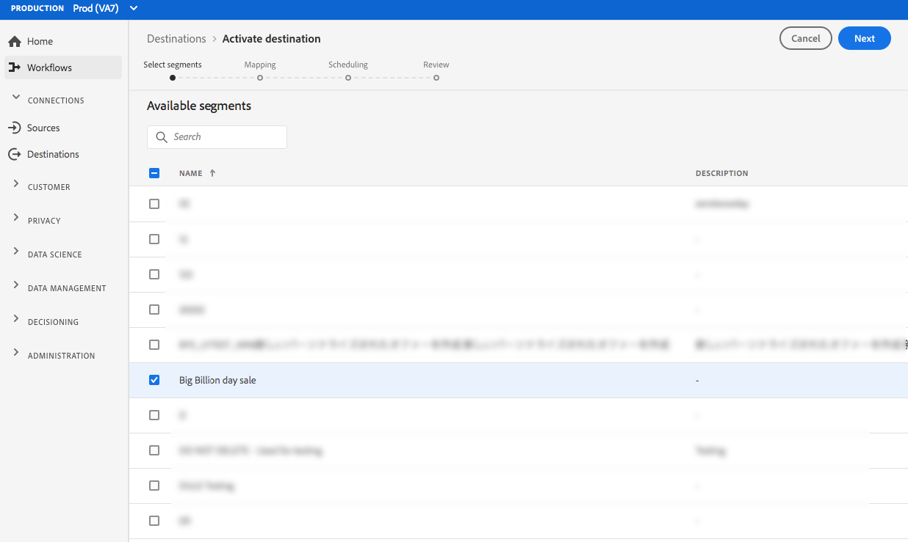

# (Beta) [!DNL Airship Tags] conexão {#airship-tags-destination}

>[!IMPORTANT]
>
>O destino [!DNL Airship Tags] no Adobe Experience Platform está atualmente em beta. A documentação e a funcionalidade estão sujeitas a alterações.

## Visão geral

[!DNL Airship] é a plataforma líder de envolvimento do cliente, ajudando você a fornecer mensagens de canal significativas e personalizadas para seus usuários em cada estágio do ciclo de vida do cliente.

Essa integração envia os dados do segmento Adobe Experience Platform para [!DNL Airship] como [Tags](https://docs.airship.com/guides/audience/tags/) para direcionamento ou acionamento.

Para saber mais sobre [!DNL Airship], consulte [Documentos do Airship](https://docs.airship.com).

>[!TIP]
>
>Esta página de documentação foi criada pela equipe [!DNL Airship]. Para obter quaisquer perguntas ou solicitações de atualização, entre em contato diretamente com elas em [support.airship.com](https://support.airship.com/).

## Pré-requisitos

Antes de enviar seus segmentos do Adobe Experience Platform para [!DNL Airship], você deve:

* Crie um grupo de tags em seu projeto [!DNL Airship].
* Gere um token do portador para autenticação.

>[!TIP]
> 
>Crie uma conta [!DNL Airship] por meio de [este link de inscrição](https://go.airship.eu/accounts/register/plan/starter/), caso ainda não o tenha feito.

### Grupos de tags

O conceito de segmentos na plataforma Adobe Experience é semelhante a [Tags](https://docs.airship.com/guides/audience/tags/) no Airship, com pequenas diferenças na implementação. Essa integração mapeia o status da associação [do usuário em um segmento Experience Platform](https://experienceleague.adobe.com/docs/experience-platform/xdm/mixins/profile/segmentation.html?lang=en#mixins) para a presença ou não de uma tag [!DNL Airship]. Por exemplo, em um segmento Plataforma em que `xdm:status` muda para `realized`, a tag é adicionada ao canal [!DNL Airship] ou ao usuário nomeado para o qual esse perfil é mapeado. Se `xdm:status` mudar para `exited`, a tag será removida.

Para habilitar essa integração, crie um *grupo de tags* em [!DNL Airship] chamado `adobe-segments`.

>[!IMPORTANT]
>
>Ao criar seu novo grupo de tags **Não marque** o botão de opção que diz &quot;[!DNL Allow these tags to be set only from your server]&quot;. Isso fará com que a integração de tags Adobe falhe.

Consulte [Gerenciar grupos de tags](https://docs.airship.com/tutorials/manage-project/messaging/tag-groups) para obter instruções sobre como criar o grupo de tags.

### Token do portador

Vá para **[!UICONTROL Settings]**&quot; **[!UICONTROL APIs &amp; Integrations]** no [painel Airship](https://go.airship.com) e selecione **[!UICONTROL Tokens]** no menu à esquerda.

Clique em **[!UICONTROL Criar token]**.

Forneça um nome fácil de usar para o seu token, por exemplo, &quot;Destino de tags de Adobe&quot; e selecione &quot;Todo acesso&quot; para a função.

Clique em **[!UICONTROL Criar token]** e salve os detalhes como confidenciais.

## Casos de uso

Para ajudá-lo a entender melhor como e quando você deve usar o destino [!DNL Airship Tags], veja a seguir exemplos de casos de uso que os clientes da Adobe Experience Platform podem resolver usando esse destino.

### Caso de uso nº 1

Os varejistas ou plataformas de entretenimento podem criar perfis de usuários em seus clientes de fidelidade e passar esses segmentos para [!DNL Airship] para direcionamento de mensagens em campanhas móveis.

### Caso de uso nº 2

Acione mensagens de um para um em tempo real quando os usuários caírem em ou saírem de segmentos específicos no Adobe Experience Platform.

Por exemplo, um varejista configura um segmento específico da marca jeans na Plataforma. Esse varejista agora pode disparar uma mensagem móvel assim que alguém define sua preferência por jeans para uma marca específica.

## Conectar-se a [!DNL Airship Tags] {#connect-airship-tags}

Em **[!UICONTROL Destinos]** > **[!UICONTROL Catálogo]**, role até a categoria **[!UICONTROL Mobile Engagement]**. Selecione **[!DNL Airship Tags]** e selecione **[!UICONTROL Configurar]**.

>[!NOTE]
>
>Se já existir uma conexão com esse destino, você poderá ver um botão **[!UICONTROL Ativar]** no cartão de destino. Para obter mais informações sobre a diferença entre **[!UICONTROL Ativate]** e **[!UICONTROL Configure]**, consulte a seção [Catalog](../../ui/destinations-workspace.md#catalog) da documentação da área de trabalho de destino.

Na etapa **Account**, se você já tiver configurado uma conexão com o destino [!DNL Airship Tags], selecione **[!UICONTROL Conta existente]** e selecione a conexão existente. Ou você pode selecionar **[!UICONTROL Nova conta]** para configurar uma nova conexão com [!DNL Airship Tags]. Selecione **[!UICONTROL Ligar ao destino]** para ligar o Adobe Experience Platform ao seu projeto [!DNL Airship] utilizando o token portador que gerou a partir do painel [!DNL Airship].

>[!NOTE]
>
>A Adobe Experience Platform oferece suporte à validação de credenciais no processo de autenticação e exibe uma mensagem de erro se você inserir credenciais incorretas na conta [!DNL Airship]. Isso garante que você não conclua o fluxo de trabalho com credenciais incorretas.

Depois que suas credenciais forem confirmadas e a Adobe Experience Platform estiver conectada ao projeto [!DNL Airship], você poderá selecionar **[!UICONTROL Próximo]** para prosseguir para a etapa **[!UICONTROL Configuração]**.

Na etapa **[!UICONTROL Authentication]**, digite um **[!UICONTROL Name]** e um **[!UICONTROL Description]** para o fluxo de ativação.

Também nesta etapa, você pode selecionar data center dos EUA ou da UE, dependendo de qual data center [!DNL Airship] se aplica a esse destino. Por fim, selecione um ou mais casos de uso de marketing para os quais os dados serão exportados para o destino. Você pode selecionar entre casos de uso de marketing definidos pelo Adobe ou criar os seus próprios. Para obter mais informações sobre casos de uso de marketing, consulte [Visão geral das políticas de uso de dados](../../../data-governance/policies/overview.md).

Selecione **[!UICONTROL Criar destino]** depois de preencher os campos acima.

Seu destino agora é criado. Você pode selecionar **[!UICONTROL Salvar e Sair]** se quiser ativar segmentos posteriormente ou selecionar **[!UICONTROL Próximo]** para continuar o fluxo de trabalho e selecionar segmentos para ativação. Em ambos os casos, consulte a próxima seção, [Ativar segmentos](#activate-segments), para o restante do fluxo de trabalho.

## Ativar segmentos {#activate-segments}

Para ativar segmentos em [!DNL Airship Tags], siga as etapas abaixo:

Em **[!UICONTROL Destinos > Procurar]**, selecione o destino [!DNL Airship Tags] onde deseja ativar seus segmentos.

Clique no nome do destino. Isso leva você ao fluxo Ativar.

Observe que se já existir um fluxo de ativação para um destino, você poderá ver os segmentos que estão sendo enviados para o destino. Selecione **[!UICONTROL Editar ativação]** no painel direito e siga as etapas abaixo para modificar os detalhes da ativação.

Selecione **[!UICONTROL Ativar]**. No fluxo de trabalho **[!UICONTROL Ativar destino]**, na página **[!UICONTROL Selecionar segmentos]**, selecione quais segmentos enviar para [!DNL Airship Tags].

Na etapa **[!UICONTROL Mapeamento]**, selecione quais atributos e identidades do schema [XDM](../../../xdm/home.md) serão mapeados para o schema de destino. Selecione **[!UICONTROL Adicionar novo mapeamento]** para navegar pelo seu schema e mapeá-lo para a identidade do público alvo correspondente.

[!DNL Airship] as tags podem ser definidas em um canal, que representa a instância do dispositivo, por exemplo, iPhone ou um usuário nomeado, que mapeia todos os dispositivos de um usuário para um identificador comum, como uma ID do cliente. Se você tiver endereços de email de texto simples (sem hash) como identidade primária em seu schema, selecione o campo de email em **[!UICONTROL Atributos de origem]** e mapeie para o usuário nomeado [!DNL Airship] na coluna direita em **[!UICONTROL Identidades de Público alvo]**, conforme mostrado abaixo.

Para identificadores que devem ser mapeados para um canal, ou seja, um dispositivo, mapeie para o canal apropriado com base na fonte. As imagens a seguir mostram como mapear uma ID de anúncio do Google para um canal Android [!DNL Airship].

Na página **[!UICONTROL Agendamento do segmento]**, o agendamento está desabilitado no momento. Clique em **[!UICONTROL Avançar]** para continuar com a etapa de revisão.

Na página **[!UICONTROL Revisar]**, você pode ver um resumo de sua seleção. Selecione **[!UICONTROL Cancelar]** para interromper o fluxo, **[!UICONTROL Voltar]** para modificar as definições, ou **[!UICONTROL Concluir]** para confirmar a seleção e o start que envia dados para o destino.

>[!IMPORTANT]
>
>Nesta etapa, a Adobe Experience Platform verifica violações da política de uso de dados. Abaixo está um exemplo de violação de uma política. Não é possível concluir o fluxo de trabalho da ativação de segmentos até que você tenha resolvido a violação. Para obter informações sobre como resolver violações de política, consulte [Aplicação de política](../../../data-governance/enforcement/auto-enforcement.md) na seção de documentação de controle de dados.

Se nenhuma violação de política tiver sido detectada, selecione **[!UICONTROL Concluir]** para confirmar sua seleção e start enviando dados para o destino.

## Uso e controle de dados {#data-usage-governance}

Todos os destinos [!DNL Adobe Experience Platform] são compatíveis com as políticas de uso de dados ao manipular seus dados. Para obter informações detalhadas sobre como [!DNL Adobe Experience Platform] aplica o controle de dados, consulte [Visão geral do controle de dados](../../../data-governance/home.md).

