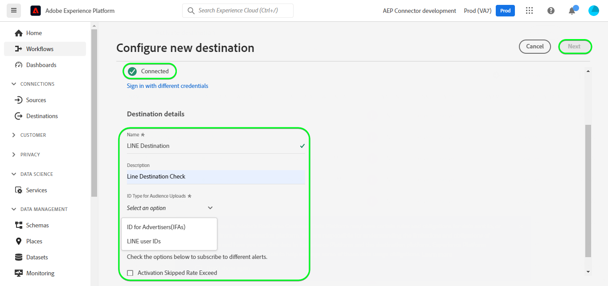

# [!DNL LINE] conexão

## Visão geral {#overview}

[[!DNL LINE]](https://line.me/en/) é uma plataforma de comunicação popular que conecta pessoas, serviços e informações e se transformou de um aplicativo de bate-papo em um centro de atividades diárias, sociais e de entretenimento.

Este [!DNL Adobe Experience Platform] [destino](/help/destinations/home.md) aproveita a [[!DNL LINE] API de Mensagens](https://developers.line.biz/en/reference/messaging-api/). Você pode ativar perfis dos públicos-alvo da Experience Platform como conexões no [!DNL LINE] para atender às suas necessidades comerciais.

[!DNL LINE] usa Tokens de Portador como mecanismo de autenticação para se comunicar com a API de Mensagens [!DNL LINE]. As instruções para autenticar na sua instância do [!DNL LINE] estão mais abaixo, na seção [Autenticar no destino](#authenticate).

## Casos de uso {#use-cases}

Como profissional de marketing, você pode direcionar usuários em um destino de engajamento móvel, com públicos-alvo integrados no [!DNL Adobe Experience Platform]. Além disso, você pode fornecer experiências personalizadas a eles, com base nos atributos de seus perfis do [!DNL Adobe Experience Platform], assim que os públicos-alvo e os perfis forem atualizados no [!DNL Adobe Experience Platform].

## Pré-requisitos {#prerequisites}

### [!DNL LINE] pré-requisitos {#prerequisites-destination}

Observe os seguintes pré-requisitos em [!DNL LINE] para exportar dados do Experience Platform para sua conta do [!DNL LINE]:

#### Você precisa ter uma conta [!DNL LINE] {#prerequisites-account}

Você precisa registrar-se e criar uma conta do [!DNL LINE], se ainda não tiver uma. Para criar uma conta:

1. Navegue até a página [!DNL LINE] [logon da conta](https://account.line.biz/login?redirectUri=https%3A%2F%2Fmanager.line.biz%2F)
2. Selecione **[!UICONTROL Create an account]**.

#### Obtenha o [!DNL LINE channel access token (long-lived)] do console do desenvolvedor [!DNL LINE] {#gather-credentials}

Para permitir que o Experience Platform acesse [!DNL LINE] recursos, você precisará do *[!DNL Channel access token (long-lived)]* do canal [!DNL LINE] *API de Mensagens* desejado.

1. Faça logon com sua conta do [!DNL LINE] no [[!DNL LINE] Console do desenvolvedor](https://developers.line.biz/console).
1. Em seguida, acesse a lista *[!DNL Providers]*, selecione a *[!DNL Provider]* de interesse e finalmente selecione o canal *API de Mensagens* para acessar suas configurações. Se você estiver acessando o console do desenvolvedor pela primeira vez, siga a [[!DNL LINE] documentação](https://developers.line.biz/en/docs/messaging-api/getting-started/) para concluir as etapas necessárias para criar um provedor.
1. Finalmente, navegue até a seção ***[!DNL Channel access token]*** e copie o valor ***[!DNL Channel access token (long-lived)]*** necessário na etapa [Autenticar para destino](#authenticate).

| Credencial | Descrição | Exemplo |
| --- | --- | --- |
| `[!DNL Channel access token (long-lived)]` | Seu [!DNL LINE Channel access token (long-lived)]. | `aaa2112XSMWqLXR7..........nyilFU=` |

Consulte a [[!DNL LINE] documentação](https://developers.line.biz/en/docs/messaging-api/getting-started/) para obter orientação sobre como criar um canal ou adicionar um canal à sua conta existente do [!DNL LINE] por meio do console de desenvolvedores do [!DNL LINE].

## Identidades suportadas {#supported-identities}

O [!DNL LINE] oferece suporte à atualização e exportação de identidades descritas na tabela abaixo. Saiba mais sobre [identidades](/help/identity-service/features/namespaces.md).

| Identidade de destino | Descrição |
|---|---|
| ID para anunciantes (IFAs) | Selecione a ID para a identidade de destino IFAs (anunciantes) quando as identidades de origem forem namespaces IFA *(Apple ID para anunciantes)* ou GAID *(Google Advertising ID). |
| IDs de usuário LINE | Selecione a identidade de destino da ID de usuário quando as identidades de origem forem IDs de usuário LINE. |

## Tipo e frequência de exportação {#export-type-frequency}

Consulte a tabela abaixo para obter informações sobre o tipo e a frequência da exportação de destino.

| Item | Tipo | Notas |
|---------|----------|---------|
| Tipo de exportação | **[!UICONTROL Profile-based]** | Você está exportando todos os membros de um público com os identificadores (nome, número de telefone ou outros) usados no destino [!DNL LINE]. |
| Frequência de exportação | **[!UICONTROL Streaming]** | Os destinos de transmissão são conexões baseadas em API &quot;sempre ativas&quot;. Assim que um perfil for atualizado no Experience Platform com base na avaliação do público-alvo, o conector enviará a atualização downstream para a plataforma de destino. Leia mais sobre [destinos de streaming](/help/destinations/destination-types.md#streaming-destinations). |

{style="table-layout:auto"}

## Conectar ao destino {#connect}

>[!IMPORTANT]
>
>Para se conectar ao destino, você precisa das **[!UICONTROL View Destinations]** e **[!UICONTROL Manage Destinations]** [permissões de controle de acesso](/help/access-control/home.md#permissions). Leia a [visão geral do controle de acesso](/help/access-control/ui/overview.md) ou contate o administrador do produto para obter as permissões necessárias.

Para se conectar a este destino, siga as etapas descritas no [tutorial de configuração de destino](../../ui/connect-destination.md). No workflow de configuração de destino, preencha os campos listados nas duas seções abaixo.

Em **[!UICONTROL Destinations]** > **[!UICONTROL Catalog]** pesquise por [!DNL LINE]. Como alternativa, você pode localizá-lo na categoria **[!UICONTROL Mobile engagement]**.

### Autenticar para o destino {#authenticate}

Para autenticar no destino, selecione **[!UICONTROL Connect to destination]**.

Preencha os campos obrigatórios abaixo.

* **[!UICONTROL Bearer token]**: Seu [!DNL LINE Channel access token (long-lived)] do console do desenvolvedor [!DNL LINE]. Consulte a seção [coletar credenciais](#gather-credentials).

Se os detalhes fornecidos forem válidos, a interface exibirá um status **[!UICONTROL Connected]** com uma marca de seleção verde. Você pode prosseguir para a próxima etapa.

### Preencher detalhes do destino {#destination-details}

Para configurar detalhes para o destino, preencha os campos obrigatórios e opcionais abaixo. Um asterisco ao lado de um campo na interface do usuário indica que o campo é obrigatório.

* **[!UICONTROL Name]**: Um nome pelo qual você reconhecerá este destino no futuro.
* **[!UICONTROL Description]**: uma descrição que ajudará você a identificar este destino no futuro.
* **[!UICONTROL Audience Type]**: selecione **[!UICONTROL ID for Advertisers(IFAs)]** se as identidades que você deseja exportar forem do tipo *ID para anunciantes(IFAs)*. Selecione **[!UICONTROL LINE user IDs]** se as identidades que você deseja exportar são do tipo *IDs de Usuário do LINE*. Consulte a seção [Identidades com suporte](#supported-identities) para obter mais informações sobre os tipos de identidade.

### Ativar alertas {#enable-alerts}

Você pode ativar os alertas para receber notificações sobre o status do fluxo de dados para o seu destino. Selecione um alerta na lista para assinar e receber notificações sobre o status do seu fluxo de dados. Para obter mais informações sobre alertas, consulte o manual sobre [assinatura de alertas de destinos usando a interface](../../ui/alerts.md).

Quando terminar de fornecer detalhes da conexão de destino, selecione **[!UICONTROL Next]**.

## Ativar públicos-alvo para esse destino {#activate}

>[!IMPORTANT]
> 
>* Para ativar dados, você precisa das **[!UICONTROL View Destinations]**, **[!UICONTROL Activate Destinations]**, **[!UICONTROL View Profiles]** e **[!UICONTROL View Segments]** [permissões de controle de acesso](/help/access-control/home.md#permissions). Leia a [visão geral do controle de acesso](/help/access-control/ui/overview.md) ou contate o administrador do produto para obter as permissões necessárias.
>* Para exportar *identidades*, você precisa da **[!UICONTROL View Identity Graph]** [permissão de controle de acesso](/help/access-control/home.md#permissions).   {width="100" zoomable="yes"}

Leia [Ativar perfis e públicos-alvo para destinos de exportação de público-alvo de streaming](/help/destinations/ui/activate-segment-streaming-destinations.md) para obter instruções sobre como ativar públicos-alvo para este destino.

### Mapear atributos e identidades {#map}

Para enviar corretamente seus dados de público-alvo do Adobe Experience Platform para o destino [!DNL LINE], é necessário passar pela etapa de mapeamento de campos. O mapeamento consiste na criação de um link entre os campos do esquema do Experience Data Model (XDM) na sua conta do Experience Platform e seus equivalentes correspondentes no destino. Para mapear corretamente os campos XDM para os campos de destino [!DNL LINE], siga estas etapas:

Dependendo da sua identidade de origem, os seguintes namespaces de identidade de destino devem ser mapeados:

| Identidade de destino | Campo de origem | Campo de público alvo |
| --- | --- | --- |
| ID para anunciantes (IFAs) | `IDFA` ou `GAID` | `LineId` |
| IDs de usuário LINE | `UserID` | `LineId` |

Se suas identidades de destino forem *IDs de usuário do LINE*, você precisará das seguintes informações:

Se sua identidade de destino for *ID para anunciantes(IFAs)*, você precisará do seguinte:

## Validar exportação de dados {#exported-data}

Após uma exportação de dados bem-sucedida fora do Experience Platform, o destino [!DNL LINE] cria um novo público-alvo dentro de [!DNL LINE] usando o nome de público-alvo selecionado.

Para validar se você configurou o destino corretamente, siga as etapas abaixo:

1. Em [!DNL LINE], faça logon no [Console do Gerenciador](https://manager.line.biz/).

1. Em seguida, navegue até **[!UICONTROL Data Controls]** > **[!UICONTROL Audiences]** e verifique o nome que corresponde ao público selecionado na coluna **[!UICONTROL Audience name]**.

1. O volume atualizado corresponderia à contagem no segmento.

1. A coluna *Tipo* mencionará **[!UICONTROL UserID]** se as identidades exportadas forem do tipo *ID do usuário*. Da mesma forma, a coluna *Tipo* mencionará **[!UICONTROL Mobile ad Id]** se as identidades exportadas forem do tipo *IDFA*.

Um exemplo de configuração dentro de [!DNL LINE] é mostrado abaixo:

## Uso e governança de dados {#data-usage-governance}

Todos os destinos do [!DNL Adobe Experience Platform] são compatíveis com as políticas de uso de dados ao manipular seus dados. Para obter informações detalhadas sobre como o [!DNL Adobe Experience Platform] impõe a governança de dados, consulte a [visão geral da Governança de Dados](/help/data-governance/home.md).
