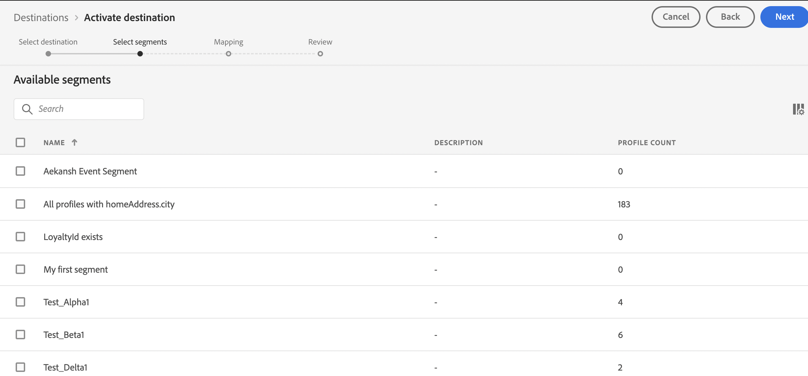

# [!DNL Moengage] conexão

## Visão geral {#overview}

Use o destino [!DNL Moengage] para conectar e mapear seus dados do Adobe (atributos de usuário, segmentos e eventos) para MoEngage em tempo real. Os clientes podem então agir com base nesses dados, fornecendo experiências personalizadas e direcionadas.

Com o Adobe, a integração é muito simples e intuitiva. Basta pegar qualquer perfil de usuário do Adobe e mapeá-lo para um atributo de usuário do MoEngage.

>[!IMPORTANT]
>
>Este conector de destino e página de documentação são criados e mantidos pela equipe do *Moengage*. Para qualquer consulta ou solicitação de atualização, contate-os diretamente em *`https://help.moengage.com/hc/en-us`.*

## Casos de uso {#use-cases}

Um profissional de marketing deseja direcionar um segmento de usuário (integrado no Adobe Experience Platform) por meio de [!DNL Moengage] campanhas. Além disso, eles querem personalizar o conteúdo da campanha com base nos atributos dos perfis do Adobe Experience Platform. Com essa integração, os usuários e atributos são atualizados no MoEngage assim que os segmentos e perfis são atualizados no Adobe Experience Platform.

## Pré-requisitos {#prerequisites}

Antes de enviar os dados do Adobe Experience Platform para [!DNL Moengage], observe os seguintes pré-requisitos:

* Para usar o destino MoEngage com o Adobe Experience Platform, os usuários devem primeiro ter acesso à sua conta [!DNL Moengage]. Visite a seguinte página para se inscrever ou fazer logon em sua conta do MoEngage: https://app.moengage.com

## Identidades suportadas {#supported-identities}

[!DNL Moengage] dá suporte à ativação das identidades descritas na tabela abaixo.

| Identidade de destino | Descrição | Considerações |
|---|------------------------------------------------------------------------------------------|----------------------------------------------------------------------------------------|
| user_id | Identificador exclusivo que identifica exclusivamente um perfil de usuário no sistema [!DNL Moengage]. | Esse identificador oferece suporte ao tipo de sequência de caracteres. É necessário um user_id ou anonymous_id |
| anonymous_id | Outro identificador para um perfil de usuário desconhecido, ou seja, um perfil que não existe no sistema. | Esse identificador oferece suporte ao tipo de sequência de caracteres. É necessário um user_id ou anonymous_id |

{style="table-layout:auto"}

## Tipo e frequência de exportação {#export-type-frequency}

Consulte a tabela abaixo para obter informações sobre o tipo e a frequência da exportação de destino.

| Item | Tipo | Notas |
|---------|----------|------------------------------------------------------------------------------------------------------------------------------------------------------------------------------------------------------------------------------------------------------------------------------------------------------------------------------------|
| Tipo de exportação | **[!UICONTROL Profile-based]** | Você está exportando todos os membros de um segmento (público-alvo) com os identificadores (user_id, anonymous_id) junto com os atributos personalizados definidos por você exportados para [!DNL Moengage]. |
| Frequência de exportação | **[!UICONTROL Streaming]** | Os destinos de transmissão são conexões baseadas em API &quot;sempre ativas&quot;. Assim que um perfil for atualizado no Experience Platform com base na avaliação do segmento, o conector enviará a atualização downstream para a plataforma de destino. Leia mais sobre [destinos de streaming](/help/destinations/destination-types.md#streaming-destinations). |

{style="table-layout:auto"}

## Conectar ao destino {#connect}

>[!IMPORTANT]
> 
>Para se conectar ao destino, você precisa das **[!UICONTROL View Destinations]** e **[!UICONTROL Manage Destinations]** [permissões de controle de acesso](/help/access-control/home.md#permissions). Leia a [visão geral do controle de acesso](/help/access-control/ui/overview.md) ou contate o administrador do produto para obter as permissões necessárias.

Para se conectar a este destino, siga as etapas descritas no [tutorial de configuração de destino](../../ui/connect-destination.md). No workflow de configuração de destino, preencha os campos listados nas duas seções abaixo.

### Autenticar para o destino {#authenticate}

Para autenticar no destino, preencha os campos obrigatórios e selecione **[!UICONTROL Connect to destination]**.

### Preencher detalhes do destino {#destination-details}

Para configurar detalhes para o destino, preencha os campos obrigatórios e opcionais abaixo. Um asterisco ao lado de um campo na interface do usuário indica que o campo é obrigatório.

* **[!UICONTROL USERNAME]**: ID DO APLICATIVO DE DADOS da página de configurações do painel [!DNL Moengage].
* **[!UICONTROL PASSWORD]**: CHAVE DE APLICATIVO DE DADOS da página de configurações do painel [!DNL Moengage].

* **[!UICONTROL Name]**: Um nome pelo qual você reconhecerá este destino no futuro.
* **[!UICONTROL Description]**: uma descrição que ajudará você a identificar este destino no futuro.
* **[!UICONTROL Region]**: Seu aplicativo *data center*.

### Ativar alertas {#enable-alerts}

Você pode ativar os alertas para receber notificações sobre o status do fluxo de dados para o seu destino. Selecione um alerta na lista para assinar e receber notificações sobre o status do seu fluxo de dados. Para obter mais informações sobre alertas, consulte o manual sobre [assinatura de alertas de destinos usando a interface](../../ui/alerts.md).

Quando terminar de fornecer detalhes da conexão de destino, selecione **[!UICONTROL Next]**.

## Ativar segmentos para este destino {#activate}

>[!IMPORTANT]
> 
>Para ativar dados, você precisa das **[!UICONTROL View Destinations]**, **[!UICONTROL Activate Destinations]**, **[!UICONTROL View Profiles]** e **[!UICONTROL View Segments]** [permissões de controle de acesso](/help/access-control/home.md#permissions). Leia a [visão geral do controle de acesso](/help/access-control/ui/overview.md) ou contate o administrador do produto para obter as permissões necessárias.

Consulte [Ativar dados de público-alvo para destinos de exportação de segmento de transmissão](../../ui/activate-segment-streaming-destinations.md) para obter instruções sobre como ativar segmentos de público-alvo para esse destino.

### Mapear atributos e identidades {#map}

Para enviar corretamente os dados de público-alvo de [!DNL Adobe Experience Platform] para o destino [!DNL Moengage], é necessário passar pela etapa de mapeamento de campos.

O mapeamento consiste na criação de um vínculo entre os campos do esquema [!DNL Experience Data Model] (XDM) na conta [!DNL Experience Platform] e seus equivalentes correspondentes no destino.

Para mapear corretamente os campos XDM para os campos de destino [!DNL Moengage], siga estas etapas:

Na etapa [!UICONTROL Mapping], selecione **[!UICONTROL Checkbox]**.

Na etapa [!UICONTROL Mapping], selecione **[!UICONTROL Add new mapping]**.

Na seção [!UICONTROL Source Field], selecione o botão de seta ao lado do campo vazio.

Na janela [!UICONTROL Select source field], você pode escolher entre duas categorias de campos XDM:

* [!UICONTROL Select attributes]: use esta opção para mapear um campo específico do esquema XDM para o atributo [!DNL Moengage].

Escolha seu campo de origem e selecione **[!UICONTROL Select]**.

Na seção [!UICONTROL Target Field], selecione o ícone de mapeamento à direita do campo.

Na janela [!UICONTROL Select target field], você pode escolher entre duas categorias de campos de destino:

* [!UICONTROL Select identity namespace]: Use esta opção para mapear [!DNL Experience Platform] namespaces de identidade para [!DNL Moengage] namespaces de identidade.
* [!UICONTROL Select custom attributes]: use esta opção para mapear atributos XDM para atributos [!DNL Moengage] personalizados que você definiu em sua conta [!DNL Moengage].   Também é possível usar essa opção para renomear atributos XDM existentes em [!DNL Moengage]. Por exemplo, mapear um atributo XDM `lastName` para um atributo personalizado `Last_Name` em [!DNL Moengage] criará o atributo `Last_Name` em [!DNL Moengage], se ele ainda não existir, e mapeará o atributo XDM `lastName` para ele.

Escolha seu campo de destino e selecione **[!UICONTROL Select]**.

Agora você deve ver o mapeamento de campos na lista.

Para adicionar mais mapeamentos, repita as etapas anteriores.

## Dados exportados / Validar exportação de dados {#exported-data}

Para verificar se os dados foram exportados com êxito para o destino [!DNL Moengage], vá para o perfil de usuário em sua conta [!DNL Moengage]. Aqui, você deve encontrar um atributo de usuário chamado `AEPSegments`, criado automaticamente e os outros atributos personalizados que foram mapeados nas etapas anteriores no Adobe Experience Platform.

`AEPSegments` é um atributo de tipo matriz em [!DNL Moengage]. Ela lista todos os nomes de público-alvo do Adobe aos quais o usuário está associado no Experience Platform.

## Uso e governança de dados {#data-usage-governance}

Todos os destinos do [!DNL Adobe Experience Platform] são compatíveis com as políticas de uso de dados ao manipular seus dados. Para obter informações detalhadas sobre como o [!DNL Adobe Experience Platform] fiscaliza a governança de dados, leia a [Visão geral da Governança de Dados](/help/data-governance/home.md).
