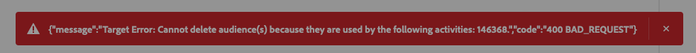

# Conexão com o Adobe Target {#adobe-target-connection}

## Log de alterações de destino {#changelog}

| Mês de lançamento | Tipo de atualização | Descrição |
|---|---|---|
| Abril de 2024 | Atualização de funcionalidade e documentação | Ao se conectar ao destino do Target e usar uma sequência de dados, agora você *não precisa* habilitar necessariamente a sequência de dados para segmentação de borda. Isso significa que o destino funcionará com públicos-alvo em lote e de transmissão, embora os casos de uso que você pode fazer sejam diferentes. Exiba a tabela na seção [parâmetros de conexão](#parameters) para obter mais informações. |
| Janeiro de 2024 | Atualização de funcionalidade e documentação | Agora é possível compartilhar públicos-alvo e atributos de perfil na conexão do Adobe Target para a sandbox de produção padrão e outras sandboxes não padrão. |
| Junho de 2023 | Atualização de funcionalidade e documentação | A partir de junho de 2023, você poderá selecionar o espaço de trabalho do Adobe Target para o qual deseja compartilhar públicos ao configurar uma nova conexão de destino do Adobe Target. Consulte a seção [parâmetros de conexão](#parameters) para obter mais informações. Além disso, consulte o tutorial sobre a [configuração de espaços de trabalho](https://experienceleague.adobe.com/docs/target-learn/tutorials/administration/set-up-workspaces.html?lang=pt-BR) no Adobe Target para obter mais informações sobre espaços de trabalho. |
| Maio de 2023 | Atualização de funcionalidade e documentação | A partir de maio de 2023, a conexão do **[!UICONTROL Adobe Target]** oferecerá suporte à [personalização baseada em atributos](../../ui/activate-edge-personalization-destinations.md#map-attributes) e estará disponível para todos os clientes. |

{style="table-layout:auto"}

## Visão geral {#overview}

O Adobe Target é um aplicativo que fornece recursos de personalização e experimentação em tempo real e alimentados por IA em todas as interações de entrada de clientes em sites, aplicativos móveis e muito mais.

O Adobe Target é uma conexão de personalização no catálogo de destinos do Adobe Experience Platform.

## Visão geral do vídeo {#video-overview}

Para obter uma breve visão geral sobre como configurar a conexão do Adobe Target no Experience Platform, assista ao vídeo abaixo.

>[!VIDEO](https://video.tv.adobe.com/v/3418799/?quality=12&learn=on)

## Casos de uso compatíveis com base no tipo de implementação {#supported-use-cases}

A tabela abaixo exibe os casos de uso com suporte para o destino do Adobe Target, com base no seu tipo de implementação, com ou sem o [Web SDK](/help/web-sdk/home.md) e com ou sem a [segmentação de borda](/help/segmentation/home.md#edge) habilitada.

| Implementação do Adobe Target *sem* Web SDK | Implementação do Adobe Target *with* Web SDK | Implementação do Adobe Target *com* a segmentação de borda do Web SDK *e* desativada |
|---|---|---|
| <ul><li>Uma sequência de dados não é necessária. O Adobe Target pode ser implantado por meio de [at.js](https://experienceleague.adobe.com/docs/target-dev/developer/client-side/at-js-implementation/overview.html), [server-side](https://experienceleague.adobe.com/docs/target-dev/developer/overview.html?lang=pt-BR#server-side-implementation) ou [híbrido](https://experienceleague.adobe.com/docs/target-dev/developer/overview.html?lang=pt-BR#hybrid-implementation) métodos de implementação.</li><li>Não há suporte para a [segmentação do Edge](../../../segmentation/methods/edge-segmentation.md).</li><li>[Não há suporte para a personalização de mesma página e próxima página](../../ui/activate-edge-personalization-destinations.md).</li><li>Você pode compartilhar públicos e atributos de perfil na conexão do Adobe Target para a *sandbox de produção padrão* e sandboxes não padrão.</li><li>Para configurar a personalização da próxima sessão sem usar uma sequência de dados, use a [at.js](https://experienceleague.adobe.com/docs/target/using/implement-target/client-side/at-js-implementation/at-js/how-atjs-works.html?lang=pt-BR).</li></ul> | <ul><li>É necessário um fluxo de dados com o Adobe Target e o Experience Platform configurados como serviços.</li><li>A segmentação do Edge funciona conforme esperado.</li><li>[Personalização de mesma página e próxima página](../../ui/activate-edge-personalization-destinations.md#use-cases) são suportadas.</li><li>O compartilhamento de públicos-alvo e atributos de perfil de outras sandboxes é compatível.</li></ul> | <ul><li>É necessário um fluxo de dados com o Adobe Target e o Experience Platform configurados como serviços.</li><li>Ao [configurar a sequência de dados](/help/destinations/ui/activate-edge-personalization-destinations.md#configure-datastream), não marque a caixa de seleção **Segmentação do Edge**.</li><li>[Personalização de próxima sessão](../../ui/activate-edge-personalization-destinations.md#next-session) com suporte.</li><li>O compartilhamento de públicos-alvo e atributos de perfil de outras sandboxes é compatível.</li></ul> |

## Pré-requisitos {#prerequisites}

### Sequência de dados {#datastream}

Ao configurar a conexão do Adobe Target para [usar uma sequência de dados](#parameters), você deve implementar o [Adobe Experience Platform Web SDK](/help/web-sdk/home.md).

Configurar a conexão do Adobe Target sem usar um fluxo de dados não requer a implementação do Web SDK.

>[!IMPORTANT]
>
>Antes de criar uma conexão [!DNL Adobe Target], leia o guia sobre como [configurar destinos de personalização para personalização de mesma página e próxima página](../../ui/activate-edge-personalization-destinations.md). Este guia aborda as etapas de configuração necessárias para casos de uso de personalização de mesma página e próxima página em vários componentes do Experience Platform. Para obter casos de uso de personalização de mesma página e próxima página, você deve usar um fluxo de dados ao configurar a conexão do Adobe Target.

### Pré-requisitos no Adobe Target {#prerequisites-in-adobe-target}

No Adobe Target, verifique se o usuário tem:

* Acesso ao [espaço de trabalho padrão](https://experienceleague.adobe.com/docs/target/using/administer/manage-users/enterprise/property-channel.html?lang=pt-BR#default-workspace);
* A **Função** de [Aprovador](https://experienceleague.adobe.com/docs/target/using/administer/manage-users/enterprise/property-channel.html?lang=pt-BR#roles-and-permissions).

Leia mais sobre a concessão de permissões para [Target Premium](https://experienceleague.adobe.com/docs/target/using/administer/manage-users/enterprise/properties-overview.html?lang=pt-BR#section_8C425E43E5DD4111BBFC734A2B7ABC80) e para [Target Standard](https://experienceleague.adobe.com/docs/target/using/administer/manage-users/users/user-management.html?lang=pt-BR#roles-permissions).

## Públicos-alvo compatíveis {#supported-audiences}

Esta seção descreve quais tipos de públicos-alvo você pode exportar para esse destino.

>[!IMPORTANT]
>
>Ao ativar *públicos-alvo de borda para casos de uso de personalização de mesma página e próxima página*, os públicos-alvo *devem* usar uma [política de mesclagem ativa na borda](../../../segmentation/ui/segment-builder.md#merge-policies). A política de mesclagem do [!DNL active-on-edge] garante que os públicos-alvo sejam avaliados constantemente [na borda](../../../segmentation/methods/edge-segmentation.md) e estejam disponíveis para casos de uso de personalização em tempo real e de próxima página.  Leia sobre [todos os casos de uso disponíveis](#parameter), com base no tipo de implementação.
>&#x200B;>Se você mapear públicos-alvo de borda que usam uma política de mesclagem diferente para destinos do Adobe Target, esses públicos-alvo não serão avaliados para casos de uso em tempo real e na próxima página.
>&#x200B;>Siga as instruções em [criando uma política de mesclagem](../../../profile/merge-policies/ui-guide.md#create-a-merge-policy) e habilite a **[!UICONTROL Política de mesclagem Ative-On-Edge]**.

| Origem do público | Suportado | Descrição |
|---------|----------|----------|
| [!DNL Segmentation Service] | ✓ | Públicos-alvo gerados pelo [Serviço de Segmentação](../../../segmentation/home.md) da Experience Platform. |
| Uploads personalizados | X | Públicos [importados](../../../segmentation/ui/audience-portal.md#import-audience) para o Experience Platform de arquivos CSV. |

{style="table-layout:auto"}

## Tipo e frequência de exportação {#export-type-frequency}

Consulte a tabela abaixo para obter informações sobre o tipo e a frequência da exportação de destino.

| Item | Tipo | Notas |
|---------|----------|---------|
| Tipo de exportação | **[!DNL Profile request]** | Você está solicitando todos os públicos mapeados no destino do Adobe Target para um único perfil. |
| Frequência de exportação | **[!UICONTROL Streaming]** | Os destinos de transmissão são conexões baseadas em API &quot;sempre ativas&quot;. Assim que um perfil for atualizado no Experience Platform com base na avaliação do público-alvo, o conector enviará a atualização downstream para a plataforma de destino. Leia mais sobre [destinos de streaming](/help/destinations/destination-types.md#streaming-destinations). |

{style="table-layout:auto"}

## Conectar ao destino {#connect}

>[!CONTEXTUALHELP]
>id="platform_destinations_target_datastream"
>title="Sobre sequências de dados"
>abstract="Essa opção determina em qual sequência de coleção de dados os públicos-alvo serão incluídos. O menu suspenso mostra apenas as sequências de dados que têm a configuração do Target habilitada Para usar a segmentação de borda, é preciso selecionar uma sequência de dados. Selecionar Nenhum desabilita todos os casos de uso que usam segmentação de borda."
>additional-url="https://experienceleague.adobe.com/docs/experience-platform/destinations/catalog/personalization/adobe-target-connection.html?lang=pt-BR#parameters" text="Saiba mais sobre a seleção de sequências de dados"

>[!IMPORTANT]
> 
>Para se conectar ao destino, você precisa de **[!UICONTROL Exibir Destinos]** e **[!UICONTROL Gerenciar Destinos]** [permissões de controle de acesso](/help/access-control/home.md#permissions). Leia a [visão geral do controle de acesso](/help/access-control/ui/overview.md) ou contate o administrador do produto para obter as permissões necessárias.

Para se conectar a este destino, siga as etapas descritas no [tutorial de configuração de destino](../../ui/connect-destination.md).

O Adobe Experience Platform se conecta automaticamente à instância Adobe Target da sua empresa. Não é necessária nenhuma autenticação.

### Parâmetros de conexão {#parameters}

>[!CONTEXTUALHELP]
>id="platform_destinations_target_workspace"
>title="Sobre o os Espaços de trabalho do Adobe Target"
>abstract="Selecione o espaço de trabalho do Adobe Target para o qual os públicos-alvo serão compartilhados. Você pode selecionar um único espaço de trabalho para cada conexão do Adobe Target. Após a ativação, os públicos-alvo são roteados para o espaço de trabalho selecionado, seguindo os rótulos de uso de dados aplicáveis da Experience Platform."
>additional-url="https://experienceleague.adobe.com/docs/target-learn/tutorials/administration/set-up-workspaces.html?lang=pt-BR" text="Saiba mais sobre os espaços de trabalho do Adobe Target"

Ao [configurar](../../ui/connect-destination.md) este destino, você deve fornecer as seguintes informações:

* **Nome**: preencha o nome preferencial para este destino.
* **Descrição**: insira uma descrição para o seu destino. Por exemplo, você pode mencionar para qual campanha está usando esse destino. Este campo é opcional.
* **Sequência de dados**: determina em qual sequência de dados de coleção os públicos-alvo serão incluídos. O menu suspenso mostra somente os fluxos de dados que têm os serviços Target e Adobe Experience Platform ativados. Consulte [configurando uma sequência de dados](../../../datastreams/configure.md#aep) para obter informações detalhadas sobre como configurar uma sequência de dados para o Adobe Experience Platform e o Adobe Target.

  >[!IMPORTANT]
  >
  >O fluxo de dados é exclusivo para cada conexão de destino do Adobe Target. Não é possível usar o mesmo fluxo de dados para várias conexões de destino do Adobe Target.
  >Se você precisar mapear os mesmos públicos-alvo para várias sequências de dados, [crie uma nova conexão de destino](../../ui/connect-destination.md) para cada sequência de dados e passe pelo [fluxo de ativação de público-alvo](#activate).

   * **[!UICONTROL Nenhum]**: selecione esta opção se precisar configurar a personalização do Adobe Target, mas não puder implementar o [Experience Platform Web SDK](/help/web-sdk/home.md). Ao usar essa opção, os públicos-alvo exportados do Experience Platform para o Target só são compatíveis com a personalização da próxima sessão e a segmentação de borda é desativada. Consulte a tabela na seção [casos de uso suportados](#supported-use-cases) para obter uma comparação dos casos de uso disponíveis por tipo de implementação.

  | Implementação do Adobe Target *sem* Web SDK | Implementação do Adobe Target *with* Web SDK | Implementação do Adobe Target *com* a segmentação de borda do Web SDK *e* desativada |
  |---|---|---|
  | <ul><li>Uma sequência de dados não é necessária. O Adobe Target pode ser implantado por meio de [at.js](https://experienceleague.adobe.com/docs/target-dev/developer/client-side/at-js-implementation/overview.html), [server-side](https://experienceleague.adobe.com/docs/target-dev/developer/overview.html?lang=pt-BR#server-side-implementation) ou [híbrido](https://experienceleague.adobe.com/docs/target-dev/developer/overview.html?lang=pt-BR#hybrid-implementation) métodos de implementação.</li><li>Não há suporte para a [segmentação do Edge](../../../segmentation/methods/edge-segmentation.md).</li><li>[Não há suporte para a personalização de mesma página e próxima página](../../ui/activate-edge-personalization-destinations.md).</li><li>Você pode compartilhar públicos e atributos de perfil na conexão do Adobe Target para a *sandbox de produção padrão* e sandboxes não padrão.</li><li>Para configurar a personalização da próxima sessão sem usar uma sequência de dados, use a [at.js](https://experienceleague.adobe.com/docs/target/using/implement-target/client-side/at-js-implementation/at-js/how-atjs-works.html?lang=pt-BR).</li></ul> | <ul><li>É necessário um fluxo de dados com o Adobe Target e o Experience Platform configurados como serviços.</li><li>A segmentação do Edge funciona conforme esperado.</li><li>[Personalização de mesma página e próxima página](../../ui/activate-edge-personalization-destinations.md#use-cases) são suportadas.</li><li>O compartilhamento de públicos-alvo e atributos de perfil de outras sandboxes é compatível.</li></ul> | <ul><li>É necessário um fluxo de dados com o Adobe Target e o Experience Platform configurados como serviços.</li><li>Ao [configurar a sequência de dados](/help/destinations/ui/activate-edge-personalization-destinations.md#configure-datastream), não marque a caixa de seleção **Segmentação do Edge**.</li><li>[Personalização de próxima sessão](../../ui/activate-edge-personalization-destinations.md#next-session) com suporte.</li><li>O compartilhamento de públicos-alvo e atributos de perfil de outras sandboxes é compatível.</li></ul> |

* **Workspace**: selecione o [espaço de trabalho](https://experienceleague.adobe.com/docs/target-learn/tutorials/administration/set-up-workspaces.html?lang=pt-BR) do Adobe Target para o qual os públicos-alvo serão compartilhados. Você pode selecionar um único espaço de trabalho para cada conexão do Adobe Target. Após a ativação, os públicos-alvo são roteados para o espaço de trabalho selecionado enquanto seguem os [rótulos de uso de dados do Experience Platform](../../../data-governance/labels/overview.md) aplicáveis.

>[!NOTE]
>
>Ao usar um espaço de trabalho de Destino personalizado para [personalização de mesma página e próxima página com atributos](../../ui/activate-edge-personalization-destinations.md), somente os [públicos selecionados](../../ui/activate-edge-personalization-destinations.md#select-audiences) serão enviados para o espaço de trabalho de Destino selecionado. Os [atributos mapeados](../../ui/activate-edge-personalization-destinations.md#mapping) são enviados para o espaço de trabalho de Destino padrão.
>&#x200B;> 
>&#x200B;>Esse comportamento será alterado em uma atualização futura.

### Ativar alertas {#enable-alerts}

Você pode ativar os alertas para receber notificações sobre o status do fluxo de dados para o seu destino. Selecione um alerta na lista para assinar e receber notificações sobre o status do seu fluxo de dados. Para obter mais informações sobre alertas, consulte o manual sobre [assinatura de alertas de destinos usando a interface](../../ui/alerts.md).

Quando terminar de fornecer detalhes da conexão de destino, selecione **[!UICONTROL Avançar]**.

## Ativar públicos-alvo para esse destino {#activate}

>[!IMPORTANT]
> 
>Para ativar dados, você precisa de **[!UICONTROL Exibir Destinos]**, **[!UICONTROL Ativar Destinos]**, **[!UICONTROL Exibir Perfis]** e **[!UICONTROL Exibir Segmentos]** [permissões de controle de acesso](/help/access-control/home.md#permissions). Leia a [visão geral do controle de acesso](/help/access-control/ui/overview.md) ou contate o administrador do produto para obter as permissões necessárias.

Leia [Ativar públicos-alvo para destinos de personalização de borda](../../ui/activate-edge-personalization-destinations.md) para obter instruções sobre como ativar públicos-alvo para este destino.

## Remover públicos-alvo de um destino do Target {#remove}

São necessárias etapas adicionais para remover um público-alvo de uma conexão existente do Adobe Target quando esse público-alvo já estiver sendo usado em uma [atividade](https://experienceleague.adobe.com/pt-br/docs/target/using/activities/activities) do Adobe Target. Tentar remover um público-alvo de uma conexão do Adobe Target resultará em erro se o público-alvo for usado por uma atividade do Adobe Target.

Para remover um público-alvo de um destino do Target quando o público-alvo está sendo usado em uma atividade, primeiro você deve remover o público-alvo da atividade do Target que o está usando ou excluir a atividade completamente. Em seguida, você pode remover o público-alvo da conexão do Target.

Se o público-alvo não estiver sendo usado em uma atividade, vá para **[!UICONTROL Destinos]** > **[!UICONTROL Procurar]** > **[!UICONTROL Selecionar fluxo de dados de destino]** > **[!UICONTROL Dados de ativação]**, selecione os públicos que deseja remover e selecione **[!UICONTROL Remover públicos-alvo]**.

## Dados exportados {#exported-data}

O Adobe Target *lê* dados de perfil do Adobe Experience Platform Edge Network, portanto, nenhum dado é exportado.

## Uso e governança de dados {#data-usage-governance}

Todos os destinos do [!DNL Adobe Experience Platform] são compatíveis com as políticas de uso de dados ao manipular seus dados. Para obter informações detalhadas sobre como o [!DNL Adobe Experience Platform] fiscaliza a governança de dados, leia a [Visão geral da Governança de Dados](https://experienceleague.adobe.com/docs/experience-platform/data-governance/home.html?lang=pt-BR).
