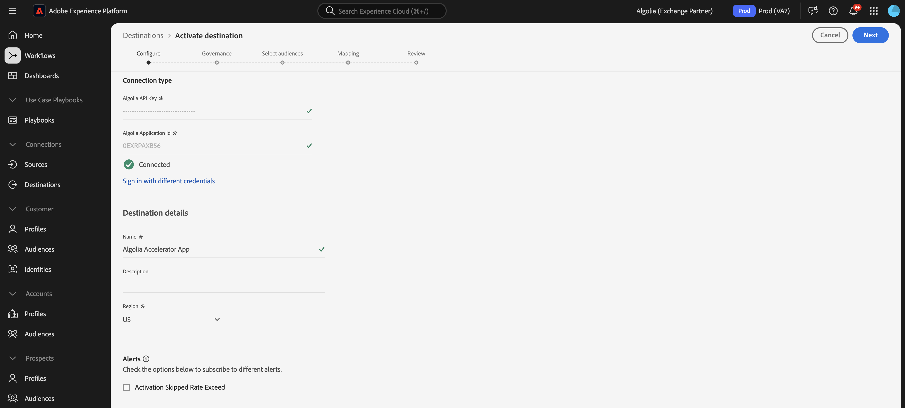
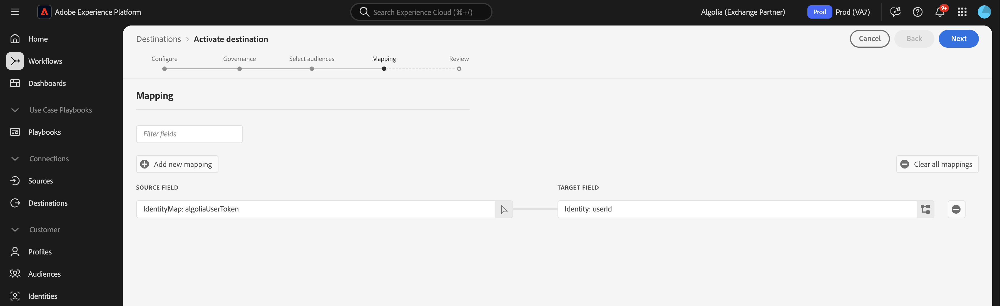

# [!DNL Algolia] conexão

## Visão geral {#overview}

>[!IMPORTANT]
>
>O conector de destino [!DNL Algolia] e a página de documentação são criados e mantidos pela equipe do Algolia Integration Services. Para consultas ou solicitações de atualização, contate-os em [adobe-algolia-solutions@algolia.com](mailto:adobe-algolia-solutions@algolia.com).

Use a conexão de destino [!DNL Algolia] para enviar públicos-alvo da Adobe Experience Platform para a Algólia para pesquisa e recomendações personalizadas. Antes de usar o conector de destino [!DNL Algolia], você deve primeiro configurar o conector de origem [[!DNL Algolia User Profiles]](/help/sources/connectors/data-partners/algolia-user-profiles.md). Durante o tutorial de configuração do conector de origem, você criará a identidade do token de usuário da Algolia. Essa identidade é necessária para mapeamento ao configurar o conector de destino.

Este tutorial fornece etapas para criar uma conexão de destino e um fluxo de dados do [!DNL Algolia] usando a interface do usuário do Adobe Experience Platform.

## Casos de uso {#use-cases}

Para ajudá-lo a entender melhor como e quando você deve usar o destino [!DNL Algolia], veja a seguir exemplos de casos de uso que os clientes da Adobe Experience Platform podem resolver usando esse destino.

### Consistência do Personalization {#personalization-consistency}

Use esse conector de destino para fornecer uma personalização consistente em todo o site, desde a home page até a pesquisa.

Por exemplo, como profissional de marketing, você pode querer criar públicos-alvo avançados no Adobe Experience Platform a partir de várias fontes de dados de usuários, incluindo a Algolia. Você pode usar o conector de destino [!DNL Algolia] para compartilhar os públicos para estratégias de direcionamento, resultando em um aumento na personalização e conversão da campanha.

Para implementar esse caso de uso, você deve usar os conectores de origem [[!DNL Algolia User Profiles]](/help/sources/connectors/data-partners/algolia-user-profiles.md) e de destino [!DNL Algolia].

Você começaria importando seus perfis de usuário existentes do [!DNL Algolia] para o Adobe Experience Platform Real-Time CDP e outras fontes para começar a criar públicos avançados com o conector de origem. Os profissionais de marketing criariam públicos-alvo usando os dados de perfil que podem ser enviados para a Algolia para personalização de pesquisa e recomendação.

Em seguida, use o conector de origem [[!DNL Algolia User Profiles]](/help/sources/connectors/data-partners/algolia-user-profiles.md) correspondente para assimilar e aumentar os perfis do cliente de volta na Real-Time CDP.

## Pré-requisitos {#prerequisites}

>[!IMPORTANT]
>
>* Para se conectar ao destino, você precisa de **[!UICONTROL Exibir Destinos]** e **[!UICONTROL Gerenciar Destinos]**, **[!UICONTROL Ativar Destinos]**, **[!UICONTROL Exibir Perfis]** e **[!UICONTROL Exibir Segmentos]** [permissões de controle de acesso](/help/access-control/home.md#permissions). Leia a [visão geral do controle de acesso](/help/access-control/ui/overview.md) ou contate o administrador do produto para obter as permissões necessárias.
>* Para exportar *identidades*, você precisa da **[!UICONTROL permissão Exibir Gráfico de Identidade]** [controle de acesso](/help/access-control/home.md#permissions).   {width="100" zoomable="yes"}

## Identidades suportadas {#supported-identities}

[!DNL Algolia] dá suporte à ativação das identidades descritas na tabela abaixo. Saiba mais sobre [identidades](https://experienceleague.adobe.com/pt-br/docs/experience-platform/identity/features/namespaces).

| Identidade de destino | Descrição | Considerações |
|---------|---------|----------|
| userId | [!DNL Algolia] token de usuário | Selecione esta identidade de destino para mapear a identidade de origem `AlgoliaUserToken` para `userToken` na plataforma [!DNL Algolia]. |

{style="table-layout:auto"}

## Públicos-alvo compatíveis {#supported-audiences}

Esta seção descreve que tipo de público-alvo você pode exportar para esse destino.

| Origem do público | Suportado | Descrição |
|---------|---------|----------|
| [!DNL Segmentation Service] | ✓ | Públicos-alvo gerados pelo [Serviço de Segmentação](../../../segmentation/home.md) da Experience Platform. |
| Uploads personalizados | ✓ | Públicos [importados](../../../segmentation/ui/audience-portal.md#import-audience) para o Experience Platform de arquivos CSV. |

{style="table-layout:auto"}

## Tipo e frequência de exportação {#export-type-frequency}

Consulte a tabela abaixo para obter informações sobre o tipo e a frequência da exportação de destino.

| Item | Tipo | Notas |
|---------|----------|---------|
| Tipo de exportação | **[!DNL Audience export]** | Você está exportando todos os membros de um público com os identificadores (nome, número de telefone ou outros) usados no destino [!DNL Algolia]. |
| Frequência de exportação | **[!UICONTROL Streaming]** | Os destinos de transmissão são conexões baseadas em API &quot;sempre ativas&quot;. Assim que um perfil for atualizado no Experience Platform com base na avaliação do público-alvo, o conector enviará a atualização downstream para a plataforma de destino. Leia mais sobre [destinos de streaming](/help/destinations/destination-types.md#streaming-destinations). |

{style="table-layout:auto"}

## Conectar ao destino {#connect}

>[!IMPORTANT]
>
>Para se conectar ao destino, você precisa de **[!UICONTROL Exibir Destinos]** e **[!UICONTROL Gerenciar e Ativar Destinos de Conjuntos de Dados]** [permissões de controle de acesso](/help/access-control/home.md#permissions). Leia a [visão geral do controle de acesso](/help/access-control/ui/overview.md) ou contate o administrador do produto para obter as permissões necessárias.

Para se conectar a este destino, siga as etapas descritas no [tutorial de configuração de destino](../../ui/connect-destination.md). No workflow da configuração de destino, preencha os campos listados nas duas seções abaixo.

### Autenticar para o destino {#authenticate}

Para autenticar no destino, preencha os campos obrigatórios e selecione **[!UICONTROL Conectar ao destino]**.

* **[!UICONTROL ID do Aplicativo]**: a ID do aplicativo [!DNL Algolia] é um identificador exclusivo atribuído à sua conta do [!DNL Algolia].
* **[!UICONTROL Chave de API]**: a Chave de API [!DNL Algolia] é uma credencial usada para autenticar e autorizar solicitações de API para os serviços de pesquisa e indexação de [!DNL Algolia].

Para obter mais informações sobre essas credenciais, consulte a [!DNL Algolia] [documentação de autenticação](https://www.algolia.com/doc/tools/cli/get-started/authentication/).

### Preencher detalhes do destino

Para configurar detalhes para o destino, preencha os campos obrigatórios e opcionais abaixo. Um asterisco ao lado de um campo na interface do usuário indica que o campo é obrigatório.

* **[!UICONTROL Nome]**: preencha o nome preferencial para este destino.
* **[!UICONTROL Descrição]**: breve explicação da finalidade do destino.
* **[!UICONTROL Região]**: as opções são **US** ou **EU**. Selecione a região onde os dados do cliente estão armazenados.

### Ativar alertas {#enable-alerts}

Você pode ativar os alertas para receber notificações sobre o status do fluxo de dados para o seu destino. Selecione um alerta na lista para assinar e receber notificações sobre o status do seu fluxo de dados. Para obter mais informações sobre alertas, consulte o manual sobre [assinatura de alertas de destinos usando a interface](../../ui/alerts.md).

Quando terminar de fornecer detalhes da conexão de destino, selecione **[!UICONTROL Avançar]**.

## Ativar públicos-alvo para esse destino {#activate}

>[!IMPORTANT]
> 
>* Para ativar dados, você precisa de **[!UICONTROL Exibir Destinos]**, **[!UICONTROL Ativar Destinos]**, **[!UICONTROL Exibir Perfis]** e **[!UICONTROL Exibir Segmentos]** [permissões de controle de acesso](/help/access-control/home.md#permissions). Leia a [visão geral do controle de acesso](/help/access-control/ui/overview.md) ou contate o administrador do produto para obter as permissões necessárias.
>* Para exportar identidades, você precisa da [permissão de controle de acesso](https://experienceleague.adobe.com/pt-br/docs/experience-platform/access-control/home#permissions) para Exibir Gráfico de Identidade.

Leia [Ativar perfis e públicos-alvo para destinos de exportação de público-alvo de streaming](https://experienceleague.adobe.com/pt-br/docs/experience-platform/destinations/ui/activate/activate-segment-streaming-destinations) para obter instruções sobre como ativar públicos-alvo para este destino.

### Mapear atributos e identidades {#mapping-attributes-identities}

Durante a [!UICONTROL etapa de Mapeamento], você deve mapear a identidade de origem AlgoliaUserToken para a identidade de destino userId.

## Validar exportação de dados {#exported-data}

Para verificar se os públicos-alvo foram exportados com êxito para os perfis de usuário, verifique o painel do [!DNL Algolia], navegue até o **[!UICONTROL Advanced Personalization]** e clique em **[!UICONTROL Inspetor de Usuário]**. Encontre um perfil de usuário associado ao público-alvo exportado do Adobe Experience Platform e procure-o no Inspetor de usuários. Você verá a ID de público-alvo na seção de segmentos.

## Uso e governança de dados {#data-usage-governance}

Todos os destinos do [!DNL Adobe Experience Platform] são compatíveis com as políticas de uso de dados ao manipular seus dados. Para obter informações detalhadas sobre como o [!DNL Adobe Experience Platform] fiscaliza a governança de dados, leia a [Visão geral da Governança de Dados](https://experienceleague.adobe.com/docs/experience-platform/data-governance/home.html?lang=pt-BR).

## Recursos adicionais {#additional-resources}

Consulte a documentação do [!DNL Algolia] a seguir para obter mais informações:

* [O que é o Personalization Avançado?](https://www.algolia.com/doc/guides/personalization/advanced-personalization/what-is-advanced-personalization/)
* [Perfis de usuário](https://www.algolia.com/doc/guides/personalization/advanced-personalization/what-is-advanced-personalization/concepts/user-profiles/)
* [Segmentar usuários com contextos de regra](https://www.algolia.com/doc/guides/personalization/advanced-personalization/implement/guides/segment-users-with-rule-contexts/#assign-a-segment-context-at-query-time)

## Próximas etapas {#next-steps}

Ao seguir este tutorial, você criou com êxito um fluxo de dados para exportar públicos do Experience Platform para o aplicativo [!DNL Algolia]. Para obter mais informações sobre a plataforma [!DNL Algolia], consulte a [documentação sobre a Algolia](https://www.algolia.com/doc/).