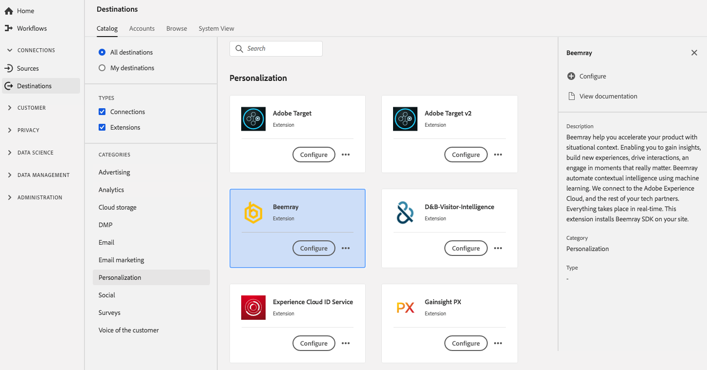

# [!DNL Beemray] extensão {#beemray-extension}

[!DNL Beemray] O ajuda a acelerar seu produto com contexto de situação. Permitindo que você obtenha insights, crie novas experiências, impulsione interações e envolva-se em momentos que realmente importam. A Beemray automatiza a inteligência contextual usando o aprendizado de máquina. O Beemray se conecta à Adobe Experience Cloud e ao resto de seus parceiros técnicos. Tudo acontece em tempo real. Esta extensão instala o [!DNL Beemray] SDK no site.

O Beemray é uma extensão de personalização na Adobe Experience Platform. Para obter mais informações sobre a funcionalidade de extensão, consulte a página de extensão em [Adobe Exchange](https://exchange.adobe.com/experiencecloud.details.101063.beemray-human-context.html).

Este destino é uma extensão [!DNL Adobe Experience Platform Launch]. Para obter mais informações sobre como as extensões [!DNL Platform Launch] funcionam no Platform, consulte [Visão geral das extensões do Experience Platform Launch](../launch-extensions/overview.md).

## Pré-requisitos {#prerequisites}

Essa extensão está disponível no catálogo [!DNL Destinations] para todos os clientes que compraram a Platform.

Para usar essa extensão, você precisa acessar [!DNL Adobe Experience Platform Launch]. [!DNL Platform Launch] O é oferecido aos clientes da Adobe Experience Cloud como um recurso incluso com valor agregado. Entre em contato com o administrador da organização para obter acesso a [!DNL Platform Launch] e solicitar que ele conceda a permissão **[!UICONTROL manage_properties]** para que você possa instalar extensões.

## Instalar extensão {#install-extension}

Para instalar a extensão [!DNL Beemray]:

Na [Interface da plataforma](http://platform.adobe.com/), vá para **[!UICONTROL Destinos]** > **[!UICONTROL Catálogo]**.

Selecione a extensão do catálogo ou use a barra de pesquisa.

Clique no destino para realçá-lo e selecione **[!UICONTROL Configurar]** no painel direito. Se o controle **[!UICONTROL Configurar]** estiver esmaecido, você não terá a permissão **[!UICONTROL manage_properties]**. Consulte [Pré-requisitos](#prerequisites).

Na janela **[!UICONTROL Select available Platform Launch property]**, selecione a propriedade [!DNL Platform Launch] na qual deseja instalar a extensão. Você também tem a opção de criar uma nova propriedade em [!DNL Platform Launch]. Uma propriedade é uma coleção de regras, elementos de dados, extensões configuradas, ambientes e bibliotecas. Saiba mais sobre as propriedades na seção [Propriedades da página](https://experienceleague.adobe.com/docs/launch/using/reference/admin/companies-and-properties.html#properties-page) da documentação [!DNL Launch].

O fluxo de trabalho leva você até [!DNL Platform Launch] para concluir a instalação.

Para obter informações sobre as opções de configuração de extensão e o suporte de instalação, consulte a página [Beemray no Adobe Exchange](https://exchange.adobe.com/experiencecloud.details.101063.beemray-human-context.html).

Você também pode instalar a extensão diretamente na [interface do Adobe Experience Platform Launch](https://launch.adobe.com/). Consulte [Adicionar uma nova extensão](https://experienceleague.adobe.com/docs/launch/using/reference/manage-resources/extensions/overview.html?lang=en#add-a-new-extension) na documentação [!DNL Platform Launch].

## Como usar a extensão {#how-to-use}

Depois de instalar a extensão, você pode iniciar a configuração das regras diretamente em [!DNL Platform Launch].

Em [!DNL Platform Launch], você pode configurar regras para as extensões instaladas para enviar dados de evento para o destino da extensão somente em determinadas situações. Para obter mais informações sobre como configurar regras para suas extensões, consulte a [Documentação de regras](https://experienceleague.adobe.com/docs/launch/using/reference/manage-resources/rules.html).

## Configurar, atualizar e excluir a extensão {#configure-upgrade-delete}

Você pode configurar, atualizar e excluir extensões na interface [!DNL Platform Launch].

>[!TIP]
>
>Se a extensão já estiver instalada em uma de suas propriedades, a interface do usuário da plataforma ainda exibirá **[!UICONTROL Instalar]** para a extensão. Desative o fluxo de trabalho de instalação conforme descrito em [Instalar extensão](#install-extension) para chegar a [!DNL Platform Launch] e configure ou exclua sua extensão.

Para atualizar sua extensão, consulte [Atualização de extensão](https://experienceleague.adobe.com/docs/launch/using/reference/manage-resources/extensions/extension-upgrade.html) na documentação [!DNL Platform Launch].

