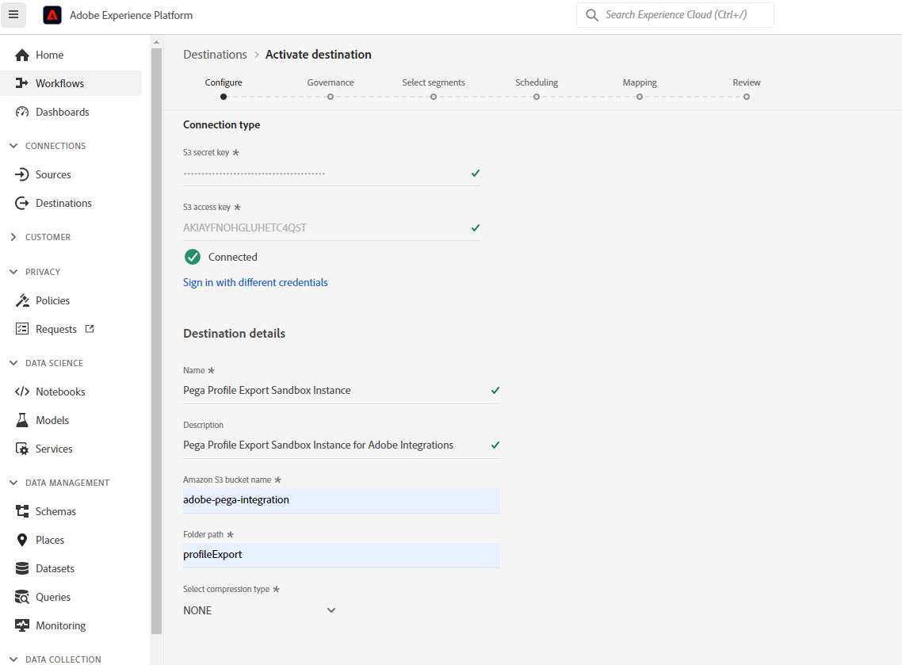

# Conector do perfil Pega

## Visão geral {#overview}

Use o [!DNL Pega Profile Connector] no [!DNL Adobe Experience Platform] para criar uma conexão de saída ativa com seu armazenamento S3 do [!DNL Amazon Web Services] (AWS) para exportar periodicamente dados de perfil para arquivos CSV do [!DNL Adobe Experience Platform] em seus próprios buckets do S3. No [!DNL Pega Customer Decision Hub], você pode agendar processos para importar esses dados de perfil do armazenamento S3 para atualizar o perfil do [!DNL Pega Customer Decision Hub].

Este conector ajuda a configurar a exportação inicial de dados de perfil e também ajuda a sincronizar novos perfis periodicamente no [!DNL Pega Customer Decision Hub].  Ter dados atualizados no Hub de decisão do cliente fornece uma visualização melhor e atualizada da base de clientes para a tomada de decisões de próxima ação.

>[!IMPORTANT]
>
>Esse conector de destino e a página de documentação são criados e mantidos pela Pegasystems. Para qualquer consulta ou solicitação de atualização, contate Pega diretamente [aqui](mailto:support@pega.com).

## Casos de uso {#use-cases}

Para ajudá-lo a entender melhor como e quando você deve usar o destino [!DNL Pega Profile Connector], veja a seguir exemplos de casos de uso que os clientes do [!DNL Adobe Experience Platform] podem resolver usando esse destino.

### Caso de uso 1 {#use-case-1}

Um profissional de marketing deseja configurar inicialmente o [!DNL Pega Customer Decision Hub] com dados de perfil carregados do [!DNL Adobe Experience Platform]. Essa é uma carga total inicial seguida por cargas delta programadas.

### Caso de uso 2 {#use-case-2}

Um profissional de marketing deseja dados de perfil atualizados do [!DNL Adobe Experience Platform] disponíveis no [!DNL Pega Customer Decision Hub], o que melhora os insights de Pega sobre perfis de clientes de forma contínua.

## Pré-requisitos {#prerequisites}

Antes de usar este destino para exportar dados do [!DNL Adobe Experience Platform] e importar perfis para o [!DNL Pega Customer Decision Hub], verifique se você concluiu os seguintes pré-requisitos:

* Configure o bucket [!DNL Amazon S3] e o caminho de pasta a ser usado para a exportação e importação de arquivos de dados.
* Configure a chave de acesso [!DNL Amazon S3] e a chave secreta [!DNL Amazon S3]: em [!DNL Amazon S3], gere um par `access key - secret access key` para conceder ao Experience Platform acesso à sua conta [!DNL Amazon S3].
* Para conectar e exportar dados com êxito para o local de armazenamento do [!DNL Amazon S3], crie um usuário do Identity and Access Management (IAM) para [!DNL Experience Platform] no [!DNL Amazon S3] e atribua permissões como `s3:DeleteObject`, `s3:GetBucketLocation`, `s3:GetObject`, `s3:ListBucket`, `s3:PutObject`, `s3:ListMultipartUploadParts`
* Verifique se a instância do [!DNL Pega Customer Decision Hub] foi atualizada para a versão 8.8 ou superior.

## Identidades suportadas {#supported-identities}

O [!DNL Pega Customer Decision Hub] dá suporte à ativação das IDs de usuário personalizadas descritas na tabela abaixo. Para obter mais detalhes, consulte [identidades](/help/identity-service/features/namespaces.md).

| Identidade de destino | Descrição |
|---|---|
| *IDdoCliente* | Identificador de Usuário Comum que identifica exclusivamente um perfil em [!DNL Pega Customer Decision Hub] e [!DNL Adobe Experience Platform] |

{style="table-layout:auto"}

## Públicos-alvo compatíveis {#supported-audiences}

Esta seção descreve quais tipos de públicos-alvo você pode exportar para esse destino.

| Origem do público | Suportado | Descrição |
|---------|----------|----------|
| [!DNL Segmentation Service] | Sim | Públicos-alvo gerados pelo [Serviço de Segmentação](../../../segmentation/home.md) da Experience Platform. |
| Todas as outras origens de público-alvo | Não | Esta categoria inclui todas as origens de público-alvo fora dos públicos-alvo gerados pelo [!DNL Segmentation Service]. Leia sobre as [várias origens do público-alvo](/help/segmentation/ui/audience-portal.md#customize). Alguns exemplos incluem: <ul><li> carregar audiências personalizadas [importadas](../../../segmentation/ui/audience-portal.md#import-audience) para o Experience Platform de arquivos CSV,</li><li> públicos-alvo semelhantes, </li><li> públicos federados, </li><li> públicos-alvo gerados em outros aplicativos Experience Platform, como [!DNL Adobe Journey Optimizer], </li><li> e muito mais. </li></ul> |

{style="table-layout:auto"}

Públicos-alvo compatíveis por tipo de dados de público-alvo:

| Tipo de dados de público | Suportado | Descrição | Casos de uso |
|--------------------|-----------|-------------|-----------|
| [Públicos-alvo](/help/segmentation/types/people-audiences.md) | Sim | Com base nos perfis de clientes, permitindo direcionar grupos específicos de pessoas para campanhas de marketing. | Compradores frequentes, abandonadores de carrinho |
| [Públicos-alvo da conta](/help/segmentation/types/account-audiences.md) | Não | Direcione indivíduos em organizações específicas para estratégias de marketing baseadas em conta. | Marketing B2B |
| [Públicos-alvo potenciais](/help/segmentation/types/prospect-audiences.md) | Não | Direcione indivíduos que ainda não são clientes, mas compartilham características com seu público-alvo. | Prospecção com dados de terceiros |
| [Exportações do conjunto de dados](/help/catalog/datasets/overview.md) | Não | Coleções de dados estruturados armazenados no Data Lake [!DNL Adobe Experience Platform]. | Relatórios, fluxos de trabalho de ciência de dados |

{style="table-layout:auto"}

## Tipo e frequência de exportação {#export-type-frequency}

Consulte a tabela abaixo para obter informações sobre o tipo e a frequência da exportação de destino.

| Item | Tipo | Notas |
|---------|----------|---------|
| Tipo de exportação | **[!UICONTROL Profile-based]** | Você está exportando todos os membros de um segmento, juntamente com os campos de esquema desejados (por exemplo: endereço de email, número de telefone, sobrenome), conforme escolhido na tela selecionar atributos de perfil do [fluxo de trabalho de ativação de destino](../../ui/activate-batch-profile-destinations.md#select-attributes). |
| Frequência de exportação | **[!UICONTROL Batch]** | Os destinos em lote exportam arquivos para plataformas downstream em incrementos de três, seis, oito, doze ou vinte e quatro horas. Leia mais sobre [destinos com base em arquivo de lote](/help/destinations/destination-types.md#file-based). |

{style="table-layout:auto"}

## Conectar ao destino {#connect}

>[!IMPORTANT]
>
>Para se conectar ao destino, você precisa das **[!UICONTROL View Destinations]** e **[!UICONTROL Manage Destinations]** [permissões de controle de acesso](/help/access-control/home.md#permissions). Leia a [visão geral do controle de acesso](/help/access-control/ui/overview.md) ou contate o administrador do produto para obter as permissões necessárias.

Para se conectar a este destino, siga as etapas descritas no [tutorial de configuração de destino](../../ui/connect-destination.md). No workflow da configuração de destino, preencha os campos listados nas duas seções abaixo.

### Autenticar para o destino {#authenticate}

Para autenticar no destino, preencha os campos obrigatórios e selecione **[!UICONTROL Connect to destination]**.

* **[!DNL Amazon S3]chave de acesso** e **[!DNL Amazon S3]chave secreta**: em [!DNL Amazon S3], gere um par `access key - secret access key` para conceder acesso [!DNL Adobe Experience Platform] à sua conta [!DNL Amazon S3]. Saiba mais na [documentação do Amazon Web Services](https://docs.aws.amazon.com/IAM/latest/UserGuide/id_credentials_access-keys.html).

### Preencher detalhes do destino {#destination-details}

Depois de estabelecer a conexão de autenticação com [!DNL Amazon S3], forneça as seguintes informações para o destino:

Para configurar detalhes para o destino, preencha os campos obrigatórios e selecione **[!UICONTROL Next]**. Um asterisco ao lado de um campo na interface do usuário indica que o campo é obrigatório.

* **[!UICONTROL Name]**: digite um nome que o ajudará a identificar este destino.
* **[!UICONTROL Description]**: digite uma descrição deste destino.
* **[!UICONTROL Bucket name]**: digite o nome do bucket [!DNL Amazon S3] a ser usado por este destino.
* **[!UICONTROL Folder path]**: digite o caminho para a pasta de destino que hospedará os arquivos exportados.
* **[!UICONTROL Compression Type]**: Selecione o tipo de compactação como GZIP ou NONE.

>[!TIP]
>
>No workflow de destino de conexão, é possível criar uma pasta personalizada no armazenamento Amazon S3 por arquivo de público exportado. Leia [Usar macros para criar uma pasta no local de armazenamento](/help/destinations/catalog/cloud-storage/overview.md#use-macros) para obter instruções.

### Ativar alertas {#enable-alerts}

Você pode ativar os alertas para receber notificações sobre o status do fluxo de dados para o seu destino. Selecione um alerta na lista para assinar e receber notificações sobre o status do seu fluxo de dados. Para obter mais informações sobre alertas, consulte o manual sobre [assinatura de alertas de destinos usando a interface](../../ui/alerts.md).

Quando terminar de fornecer detalhes da conexão de destino, selecione **[!UICONTROL Next]**.

## Ativar públicos-alvo para esse destino {#activate}

>[!IMPORTANT]
>
>* Para ativar dados, você precisa das **[!UICONTROL View Destinations]**, **[!UICONTROL Activate Destinations]**, **[!UICONTROL View Profiles]** e **[!UICONTROL View Segments]** [permissões de controle de acesso](/help/access-control/home.md#permissions). Leia a [visão geral do controle de acesso](/help/access-control/ui/overview.md) ou contate o administrador do produto para obter as permissões necessárias.
>* Para exportar *identidades*, você precisa da **[!UICONTROL View Identity Graph]** [permissão de controle de acesso](/help/access-control/home.md#permissions).   {width="100" zoomable="yes"}

Consulte [Ativar dados do público-alvo para destinos de exportação de perfil em lote](../../ui/activate-batch-profile-destinations.md) para obter instruções sobre como ativar públicos-alvo para esse destino.

### Mapear atributos e identidades {#map}

Na etapa **[!UICONTROL Mapping]**, você pode selecionar quais campos de atributo e identidade serão exportados para seus perfis. Você também pode optar por alterar os cabeçalhos no arquivo exportado para qualquer nome amigável. Para obter mais informações, exiba a [etapa de mapeamento](/help/destinations/ui/activate-batch-profile-destinations.md#mapping) no tutorial de ativação da interface de destinos em lote.

## Validar exportação de dados {#exported-data}

Para destinos [!DNL Pega Profile Connector], o [!DNL Experience Platform] cria um arquivo `.csv` no local de armazenamento Amazon S3 fornecido por você. Para obter mais informações sobre os arquivos, consulte [Ativar dados do público-alvo para destinos de exportação de perfil em lote](../../ui/activate-batch-profile-destinations.md) no tutorial de ativação de público-alvo.

Uma importação bem-sucedida de dados de perfil do S3 insere dados no armazenamento de dados de perfil [!DNL Pega Customer]. Os dados importados do perfil do cliente podem ser validados em [!DNL Pega Customer Profile Designer], conforme mostrado na figura a seguir.

No [!DNL Pega Customer Decision Hub], os administradores de dados podem configurar trabalhos de dados no [!DNL Customer Profile Designer] para importar dados de perfil periodicamente do S3, conforme mostrado na figura a seguir. Consulte os [recursos adicionais](#additional-resources) para obter mais informações sobre como configurar trabalhos de dados para importar dados de perfil de [!DNL Amazon S3].

## Recursos adicionais {#additional-resources}

Consulte [Importar trabalhos de dados](https://academy.pega.com/topic/import-data-jobs/v1) em [!DNL Pega Customer Decision Hub].

## Uso e governança de dados {#data-usage-governance}

Todos os destinos do [!DNL Adobe Experience Platform] são compatíveis com as políticas de uso de dados ao manipular seus dados. Para obter informações detalhadas sobre como o [!DNL Adobe Experience Platform] impõe a governança de dados, consulte a [visão geral da Governança de Dados](/help/data-governance/home.md).
