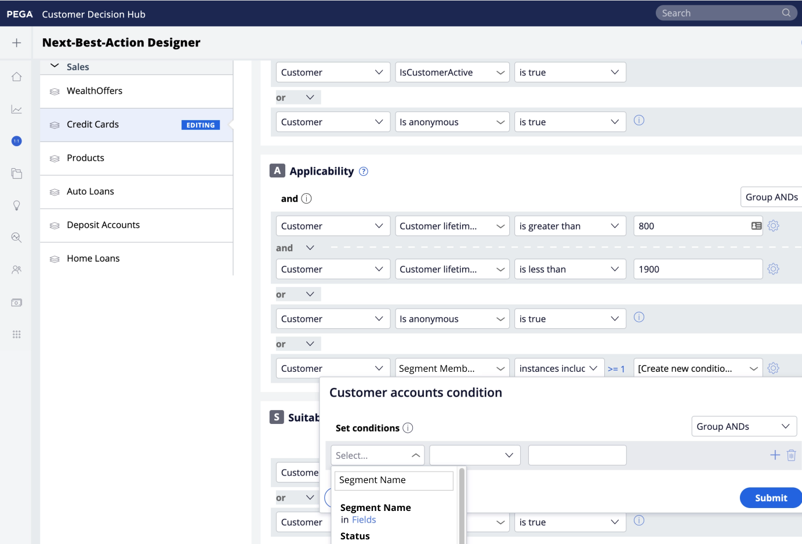

# Pega CDH Conexão de público-alvo em tempo real

>[!IMPORTANT]
>
>Essa versão do destino de público-alvo em tempo real do Pega Customer Decision Hub é compatível com apenas um aplicativo Pega Customer Decision. Se você tiver vários aplicativos do Pega Customer Decision Hub configurados, será necessário usar o [(V2) conector de destino do Pega CDH Realtime Audience](./pega-v2.md).

## Visão geral {#overview}

Use o destino do Público-alvo em tempo real [!DNL Pega Customer Decision Hub] no Adobe Experience Platform para enviar os atributos do perfil e os dados de associação do público-alvo para [!DNL Pega Customer Decision Hub] para a próxima melhor ação de decisão.

A associação de público-alvo de perfil do Adobe Experience Platform, quando carregada no [!DNL Pega Customer Decision Hub], pode ser usada como um preditor em modelos adaptáveis e ajuda a fornecer os dados contextuais e comportamentais corretos para fins de decisão da próxima melhor ação.

>[!IMPORTANT]
>
>Esse conector de destino e a página de documentação são criados e mantidos pela Pegasystems. Para quaisquer consultas ou pedidos de atualização, contate Pega diretamente [aqui](mailto:support@pega.com).

## Casos de uso

Para ajudá-lo a entender melhor como e quando você deve usar o destino [!DNL Customer Decision Hub], veja a seguir exemplos de casos de uso que os clientes da Adobe Experience Platform podem resolver usando esse destino.

### Telecomunicações

Um profissional de marketing deseja aproveitar os insights da próxima melhor ação baseada em modelo de ciência de dados conforme fornecidos por [!DNL Pega Customer Decision Hub] para o envolvimento do cliente. [!DNL Pega Customer Decision Hub] é altamente dependente da intenção do cliente, por exemplo &quot;Interested_In_5G&quot;, &quot;Interested_in_Unlimited_Dataplan&quot; ou &quot;Interest_in_iPhone_Accessations&quot;.

### Serviços financeiros

Um profissional de marketing deseja otimizar as ofertas para clientes que assinaram ou cancelaram a assinatura dos boletins informativos de Plano de aposentadoria ou Plano de aposentadoria. As empresas de serviços financeiros podem assimilar várias CustomerIDs de seus próprios CRMs na Adobe Experience Platform, criar públicos-alvo a partir de seus próprios dados offline e enviar perfis que estão entrando e saindo dos públicos-alvo para [!DNL Pega Customer Decision Hub] para que a decisão da próxima melhor ação (NBA) seja tomada nos canais de saída.

## Pré-requisitos {#prerequisites}

Antes de usar este destino para exportar dados do Adobe Experience Platform, verifique se você concluiu os seguintes pré-requisitos em [!DNL Pega Customer Decision Hub]:

* Configure o [Componente de integração de Perfil e Associação de Público-Alvo do Adobe Experience Platform](https://docs.pega.com/bundle/components/page/customer-decision-hub/components/adobe-membership-component.html) na sua instância [!DNL Pega Customer Decision Hub].
* Configure o Registro de Cliente do OAuth 2.0 [usando o tipo de concessão Credenciais de Cliente](https://docs.pega.com/bundle/platform/page/platform/security/configure-oauth-2-client-registration.html) na instância [!DNL Pega Customer Decision Hub].
* Configure o [fluxo de dados de execução em tempo real](https://docs.pega.com/bundle/platform/page/platform/decision-management/data-flow-run-real-time-create.html) para o fluxo de dados de Associação de Público-Alvo da Adobe na sua instância [!DNL Pega Customer Decision Hub].

## Identidades suportadas {#supported-identities}

O [!DNL Pega Customer Decision Hub] dá suporte à ativação das IDs de usuário personalizadas descritas na tabela abaixo. Para obter mais detalhes, consulte [identidades](/help/identity-service/features/namespaces.md).

| Identidade de destino | Descrição |
|---|---|
| *IDdoCliente* | Identificador de Usuário Comum que identifica exclusivamente um perfil no [!DNL Pega Customer Decision Hub] e no Adobe Experience Platform |

{style="table-layout:auto"}

## Tipo e frequência de exportação {#export-type-frequency}

Consulte a tabela abaixo para obter informações sobre o tipo e a frequência da exportação de destino.

| Item | Tipo | Notas |
|---------|----------|---------|
| Tipo de exportação | **[!UICONTROL Profile-based]** | Exportar todos os membros de um público-alvo com o identificador (*CustomerID*), atributos (sobrenome, nome, local etc.) e dados de associação de público-alvo. |
| Frequência de exportação | **[!UICONTROL Streaming]** | Os destinos de transmissão são conexões sempre ativas baseadas em API. Assim que um perfil for atualizado no Experience Platform, com base na avaliação do público-alvo, o conector enviará a atualização downstream para a plataforma de destino. Para obter mais informações, consulte [destinos de streaming](/help/destinations/destination-types.md#streaming-destinations). |

{style="table-layout:auto"}

## Conectar ao destino {#connect}

Para se conectar a este destino, siga as etapas descritas no [tutorial de configuração de destino](../../ui/connect-destination.md). No workflow de configuração de destino, preencha os campos listados nas duas seções abaixo.

### Autenticar para o destino {#authenticate}

#### Autenticação de credenciais do cliente OAuth 2 {#oauth-2-client-credentials-authentication}

Preencha os campos abaixo e selecione **[!UICONTROL Connect to destination]**:

* **[!UICONTROL Access Token URL]**: a URL do token de acesso OAuth 2 na sua instância [!DNL Pega Customer Decision Hub].
* **[!UICONTROL Client ID]**: O OAuth 2 [!DNL client ID] que você gerou em sua instância [!DNL Pega Customer Decision Hub].
* **[!UICONTROL Client Secret]**: O OAuth 2 [!DNL client secret] que você gerou em sua instância [!DNL Pega Customer Decision Hub].

### Preencher detalhes do destino {#destination-details}

Depois de estabelecer a conexão de autenticação com o [!DNL Pega Customer Decision Hub], forneça as seguintes informações para o destino:

Para configurar detalhes para o destino, preencha os campos obrigatórios e selecione **[!UICONTROL Next]**.

* **[!UICONTROL Name]**: Um nome pelo qual você reconhecerá este destino no futuro.
* **[!UICONTROL Description]**: uma descrição que ajudará você a identificar este destino no futuro.
* **[!UICONTROL Pega CDH Host Name]**: o nome de host do Pega Customer Decision Hub para o qual o perfil é exportado como dados JSON.

## Ativar públicos-alvo para esse destino {#activate}

>[!IMPORTANT]
> 
>* Para ativar dados, você precisa das **[!UICONTROL View Destinations]**, **[!UICONTROL Activate Destinations]**, **[!UICONTROL View Profiles]** e **[!UICONTROL View Segments]** [permissões de controle de acesso](/help/access-control/home.md#permissions). Leia a [visão geral do controle de acesso](/help/access-control/ui/overview.md) ou contate o administrador do produto para obter as permissões necessárias.
>* Para exportar *identidades*, você precisa da **[!UICONTROL View Identity Graph]** [permissão de controle de acesso](/help/access-control/home.md#permissions).   {width="100" zoomable="yes"}

Consulte [Ativar dados de público-alvo para destinos de exportação de perfil de streaming](../../ui/activate-streaming-profile-destinations.md) para obter instruções sobre como ativar públicos-alvo para este destino.

### Atributos de destino {#attributes}

Na etapa [[!UICONTROL Select attributes]](../../ui/activate-streaming-profile-destinations.md#select-attributes), a Adobe recomenda selecionar um identificador exclusivo do seu [esquema de união](../../../profile/home.md#profile-fragments-and-union-schemas). Selecione o identificador exclusivo e quaisquer outros campos XDM que você deseja exportar para o destino.

### Exemplo de mapeamento: ativando atualizações de perfil em [!DNL Pega Customer Decision Hub] {#mapping-example}

Veja abaixo um exemplo de mapeamento de identidade correto ao exportar perfis para [!DNL Pega Customer Decision Hub].

Selecionar campos de origem:

* Selecione um identificador (por exemplo: CustomerID) como identidade de origem que identifica exclusivamente um perfil no Adobe Experience Platform e [!DNL Pega Customer Decision Hub].
* Selecione as alterações de atributo do perfil de origem XDM que precisam ser exportadas e atualizadas em [!DNL Pega Customer Decision Hub].

Selecionar campos de destino:

* Selecione o namespace `CustomerID` como identidade de destino.
* Selecione nomes de atributo de perfil de destino que precisam ser mapeados para atributos de perfil de origem XDM correspondentes.

## Dados exportados / Validar exportação de dados {#exported-data}

Uma atualização bem-sucedida da associação de público-alvo de um perfil inseriria o identificador de público-alvo, o nome e os status no armazenamento de dados de associação de público de marketing da Pega. Os dados de associação estão associados a um cliente que usa o Designer de Perfil de Cliente no [!DNL Pega Customer Decision Hub], conforme mostrado abaixo.

Os dados de associação de público-alvo são usados nas políticas de envolvimento da Designer de próxima ação da Pega para a tomada de decisões de próxima ação, conforme mostrado abaixo.

Os campos de dados de associação de público-alvo do cliente são adicionados como preditores em modelos adaptáveis, conforme mostrado abaixo.

## Recursos adicionais {#additional-resources}

Consulte os seguintes recursos de documentação do [!DNL Pega] para obter mais informações:

* [Configurando um registro de cliente OAuth 2.0](https://docs.pega.com/bundle/platform/page/platform/security/configure-oauth-2-client-registration.html)
* [Criando uma execução em tempo real para fluxos de dados](https://docs.pega.com/bundle/platform/page/platform/decision-management/data-flow-run-real-time-create.html)
* [Gerenciar registros de clientes no Designer de Perfil do Cliente](https://docs.pega.com/bundle/customer-decision-hub/page/customer-decision-hub/implement/profile-designer-data-management.html)

## Uso e governança de dados {#data-usage-governance}

Todos os destinos do [!DNL Adobe Experience Platform] são compatíveis com as políticas de uso de dados ao manipular seus dados. Para obter informações detalhadas sobre como o [!DNL Adobe Experience Platform] impõe a governança de dados, consulte a [visão geral da Governança de Dados](/help/data-governance/home.md).
