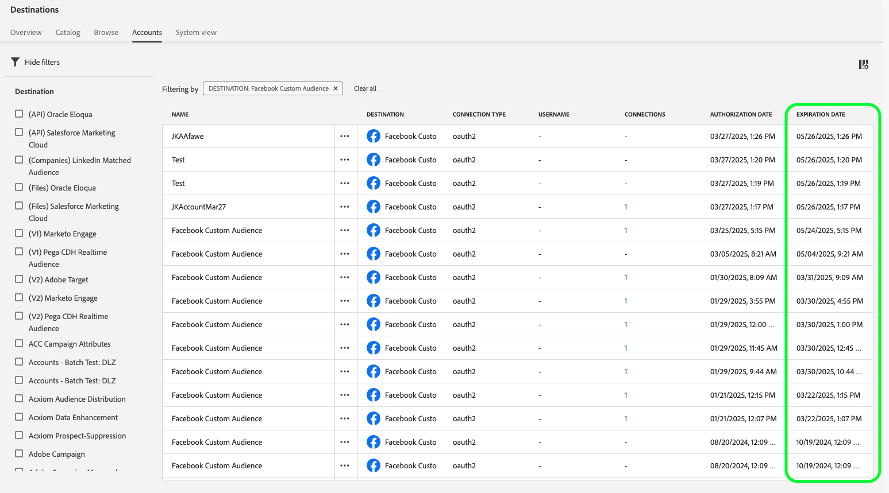

# [!DNL Facebook] conexão

## Visão geral {#overview}

Ative perfis para suas campanhas do [!DNL Facebook] para direcionamento de público, personalização e supressão com base em emails com hash.

Você pode usar este destino para direcionamento de público em toda a família de aplicativos [!DNL Facebook's] com suporte no [!DNL Custom Audiences], incluindo [!DNL Facebook], [!DNL Instagram], [!DNL Audience Network] e [!DNL Messenger]. A seleção do aplicativo no qual você deseja executar a campanha é indicada no nível de posicionamento em [!DNL Facebook Ads Manager].

## Casos de uso

Para ajudá-lo a entender melhor como e quando usar o destino [!DNL Facebook], veja dois casos de uso de exemplo que os clientes da Adobe Experience Platform podem resolver usando esse recurso.

### Caso de uso #1

Uma retailer online deseja alcançar os clientes existentes por meio de plataformas sociais e mostrar ofertas personalizadas com base em seus pedidos anteriores. A retailer online pode assimilar endereços de email de seu próprio CRM para o Adobe Experience Platform, criar públicos a partir de seus próprios dados offline e enviar esses públicos para a plataforma social [!DNL Facebook], otimizando seus gastos com publicidade.

### Caso de uso #2

Uma companhia aérea tem diferentes níveis de clientes (Bronze, Prata e Ouro) e deseja fornecer ofertas personalizadas a cada um dos níveis por meio de plataformas sociais. No entanto, nem todos os clientes usam o aplicativo móvel da companhia aérea e alguns deles não fizeram logon no site da empresa. Os únicos identificadores que a empresa tem sobre esses clientes são IDs de associação e endereços de email.

Para direcioná-los nas redes sociais, eles podem integrar os dados do cliente do CRM no Adobe Experience Platform, usando os endereços de email como identificadores.

Em seguida, eles podem usar seus dados offline, incluindo IDs de associação associadas e camadas de clientes, para criar novos públicos que eles podem direcionar por meio do destino [!DNL Facebook].

## Identidades suportadas {#supported-identities}

[!DNL Facebook Custom Audiences] dá suporte à ativação das identidades descritas na tabela abaixo. Saiba mais sobre [identidades](/help/identity-service/features/namespaces.md).

| Identidade de destino | Descrição | Considerações |
|---|---|---|
| `GAID` | GOOGLE ADVERTISING ID | Selecione a identidade de destino GAID quando a identidade de origem for um namespace GAID. |
| `IDFA` | Apple ID para anunciantes | Selecione a identidade de destino do IDFA quando a identidade de origem for um namespace do IDFA. |
| `phone_sha256` | Números de telefone com hash com o algoritmo SHA256 | Os números de telefone com hash SHA256 e texto sem formatação são compatíveis com o Adobe Experience Platform. Siga as instruções na seção [Requisitos de correspondência de ID](#id-matching-requirements-id-matching-requirements) e use os namespaces apropriados para texto sem formatação e números de telefone com hash, respectivamente. Quando o campo de origem contiver atributos sem hash, marque a opção **[!UICONTROL Apply transformation]** para que o [!DNL Experience Platform] coloque os dados em hash automaticamente durante a ativação. |
| `email_lc_sha256` | Endereços de email com hash com o algoritmo SHA256 | O Adobe Experience Platform oferece suporte tanto para texto simples quanto para endereços de email com hash SHA256. Siga as instruções na seção [Requisitos de correspondência de ID](#id-matching-requirements-id-matching-requirements) e use os namespaces apropriados para texto sem formatação e endereços de email com hash, respectivamente. Quando o campo de origem contiver atributos sem hash, marque a opção **[!UICONTROL Apply transformation]** para que o [!DNL Experience Platform] coloque os dados em hash automaticamente durante a ativação. |
| `extern_id` | IDs de usuário personalizadas | Selecione esta identidade de destino quando sua identidade de origem for um namespace personalizado. |
| `gender` | Gênero | Valores aceitos: <ul><li>`m` para masculino</li><li>`f` para feminino</li></ul> O Experience Platform **coloca automaticamente hash** nesse valor antes de enviá-lo para o Facebook. Esse hash automático é necessário para atender aos requisitos de segurança e privacidade do Facebook. **não** forneça valores com hash para este campo, pois isso causará falha no processo correspondente. |
| `date_of_birth` | Data de nascimento | Formato aceito: `yyyy-MM-DD`.  O Experience Platform **aplica hash automaticamente** a esse valor antes de enviá-lo para o Facebook. Esse hash automático é necessário para atender aos requisitos de segurança e privacidade do Facebook. **não** forneça valores com hash para este campo, pois isso causará falha no processo correspondente. |
| `last_name` | Sobrenome | Formato aceito: Minúsculas, somente `a-z` caracteres, sem pontuação. Use a codificação UTF-8 para caracteres especiais.   O Experience Platform **aplica hash automaticamente** a esse valor antes de enviá-lo para o Facebook. Esse hash automático é necessário para atender aos requisitos de segurança e privacidade do Facebook. **não** forneça valores com hash para este campo, pois isso causará falha no processo correspondente. |
| `first_name` | Nome | Formato aceito: Minúsculas, somente `a-z` caracteres, sem pontuação, sem espaços. Use a codificação UTF-8 para caracteres especiais.   O Experience Platform **aplica hash automaticamente** a esse valor antes de enviá-lo para o Facebook. Esse hash automático é necessário para atender aos requisitos de segurança e privacidade do Facebook. **não** forneça valores com hash para este campo, pois isso causará falha no processo correspondente. |
| `first_name_initial` | Inicial do nome | Formato aceito: Minúsculas, somente `a-z` caracteres. Use a codificação UTF-8 para caracteres especiais.   O Experience Platform **aplica hash automaticamente** a esse valor antes de enviá-lo para o Facebook. Esse hash automático é necessário para atender aos requisitos de segurança e privacidade do Facebook. **não** forneça valores com hash para este campo, pois isso causará falha no processo correspondente. |
| `state` | Estado | Use o código de abreviação ANSI de [2 caracteres](https://en.wikipedia.org/wiki/Federal_Information_Processing_Standard_state_code) em minúsculas. Para estados que não sejam dos EUA, use caracteres em minúsculas, sem pontuação, sem caracteres especiais e sem espaços.   O Experience Platform **aplica hash automaticamente** a esse valor antes de enviá-lo para o Facebook. Esse hash automático é necessário para atender aos requisitos de segurança e privacidade do Facebook. **não** forneça valores com hash para este campo, pois isso causará falha no processo correspondente. |
| `city` | Cidade | Formato aceito: Minúsculas, somente `a-z` caracteres, sem pontuação, sem caracteres especiais, sem espaços.   O Experience Platform **aplica hash automaticamente** a esse valor antes de enviá-lo para o Facebook. Esse hash automático é necessário para atender aos requisitos de segurança e privacidade do Facebook. **não** forneça valores com hash para este campo, pois isso causará falha no processo correspondente. |
| `zip` | Código postal | Formato aceito: Minúsculas, sem espaços. Para códigos postais dos EUA, use apenas os primeiros 5 dígitos. Para o Reino Unido, use o formato `Area/District/Sector`.   O Experience Platform **aplica hash automaticamente** a esse valor antes de enviá-lo para o Facebook. Esse hash automático é necessário para atender aos requisitos de segurança e privacidade do Facebook. **não** forneça valores com hash para este campo, pois isso causará falha no processo correspondente. |
| `country` | País | Formato aceito: Códigos de país de duas letras em minúsculas no formato [ISO 3166-1 alpha-2](https://en.wikipedia.org/wiki/ISO_3166-1_alpha-2).   O Experience Platform **aplica hash automaticamente** a esse valor antes de enviá-lo para o Facebook. Esse hash automático é necessário para atender aos requisitos de segurança e privacidade do Facebook. **não** forneça valores com hash para este campo, pois isso causará falha no processo correspondente. |

## Públicos-alvo compatíveis {#supported-audiences}

Esta seção descreve quais tipos de públicos-alvo você pode exportar para esse destino.

| Origem do público | Suportado | Descrição |
|---------|----------|----------|
| [!DNL Segmentation Service] | ✓ | Públicos-alvo gerados pelo [Serviço de Segmentação](../../../segmentation/home.md) da Experience Platform. |
| Uploads personalizados | ✓ | Públicos [importados](../../../segmentation/ui/audience-portal.md#import-audience) para o Experience Platform de arquivos CSV. |

{style="table-layout:auto"}

## Tipo e frequência de exportação {#export-type-frequency}

Consulte a tabela abaixo para obter informações sobre o tipo e a frequência da exportação de destino.

| Item | Tipo | Notas |
|---------|----------|---------|
| Tipo de exportação | **[!UICONTROL Audience export]** | Você está exportando todos os membros de um público-alvo com os identificadores (nome, número de telefone ou outros) usados no destino do Facebook. |
| Frequência de exportação | **[!UICONTROL Streaming]** | Os destinos de transmissão são conexões baseadas em API &quot;sempre ativas&quot;. Assim que um perfil for atualizado no Experience Platform com base na avaliação do público-alvo, o conector enviará a atualização downstream para a plataforma de destino. Leia mais sobre [destinos de streaming](/help/destinations/destination-types.md#streaming-destinations). |

{style="table-layout:auto"}

## Pré-requisitos da conta do Facebook {#facebook-account-prerequisites}

Antes de enviar seus públicos-alvo para o [!DNL Facebook], verifique se você atende aos seguintes requisitos:

* Sua conta de usuário do [!DNL Facebook] deve ter acesso total ao [!DNL Facebook Business Account], proprietário da conta de Anúncio que você está usando.
* A permissão [!DNL Facebook] da conta de usuário **[!DNL Manage campaigns]** deve estar habilitada para a conta de Anúncio que você pretende usar.
* A conta comercial **Adobe Experience Cloud** deve ser adicionada como um parceiro de publicidade em seu [!DNL Facebook Ad Account]. Usar `business ID=206617933627973`. Consulte [Adicionar parceiros ao seu gerente de negócios](https://www.facebook.com/business/help/1717412048538897) na documentação do Facebook para obter detalhes.

  >[!IMPORTANT]
  >
  > Ao configurar as permissões para o Adobe Experience Cloud, você deve habilitar a permissão **Gerenciar campanhas**. A permissão é necessária para a integração [!DNL Adobe Experience Platform].

* Leia e assine os Termos de Serviço do [!DNL Facebook Custom Audiences]. Para fazer isso, vá para `https://business.facebook.com/ads/manage/customaudiences/tos/?act=[accountID]&business_id=206617933627973`, onde `accountID` é seu [!DNL Facebook Ad Account ID]. Verifique se a seção `business_id=206617933627973` está presente na URL quando você assinar os Termos de Serviço.

  >[!IMPORTANT]
  >
  >Ao assinar os Termos de Serviço do [!DNL Facebook Custom Audiences], use a mesma conta de usuário usada para autenticação na API do Facebook.

## Requisitos de correspondência de ID {#id-matching-requirements}

[!DNL Facebook] exige que nenhuma informação pessoal identificável (PII) seja enviada em branco. Portanto, os públicos ativados para [!DNL Facebook] podem ser digitados de *identificadores com hash*, como endereços de email ou números de telefone.

Dependendo do tipo de IDs que você assimila no Adobe Experience Platform, é necessário seguir os requisitos correspondentes.

## Maximizar as taxas de correspondência do público-alvo {#match-rates}

Para atingir as taxas de correspondência de público-alvo mais altas em [!DNL Facebook], é altamente recomendável usar as identidades de destino `phone_sha256` e `email_lc_sha256`.

Esses identificadores são os principais usados por [!DNL Facebook] para corresponder públicos-alvo em suas plataformas. Verifique se os dados de origem estão mapeados corretamente para essas identidades de destino e se seguem os requisitos de hash do [!DNL Facebook's].

## Requisitos de hash de número de telefone {#phone-number-hashing-requirements}

Há dois métodos para ativar números de telefone em [!DNL Facebook]:

* **Assimilando números de telefone brutos**: você pode assimilar números de telefone brutos no formato [!DNL E.164] em [!DNL Experience Platform]. Eles são atribuídos a hash automaticamente após a ativação. Se você escolher essa opção, sempre assimile seus números de telefone brutos no namespace `Phone_E.164`.
* **Números de telefone com hash de assimilação**: você pode colocar seus números de telefone em hash antes de assimilar em [!DNL Experience Platform]. Se você escolher essa opção, sempre assimile seus números de telefone com hash no namespace `Phone_SHA256`.

>[!NOTE]
>
>Os números de telefone assimilados no namespace `Phone` não podem ser ativados em [!DNL Facebook].

## Requisitos de hash de email {#email-hashing-requirements}

Você pode aplicar hash a endereços de email antes de assimilá-los no Adobe Experience Platform, ou usar endereços de email em limpar no Experience Platform, e aplicar hash a [!DNL Experience Platform] neles na ativação.

Para saber mais sobre a assimilação de endereços de email no Experience Platform, consulte a [visão geral da assimilação em lote](/help/ingestion/batch-ingestion/overview.md) e a [visão geral da assimilação de streaming](/help/ingestion/streaming-ingestion/overview.md).

Se você optar por criar o hash dos endereços de email, não se esqueça de atender aos seguintes requisitos:

* Cortar todos os espaços à esquerda e à direita da cadeia de caracteres de email; exemplo: `johndoe@example.com`, não `<space>johndoe@example.com<space>`;
* Ao aplicar hash às cadeias de caracteres de email, certifique-se de aplicar hash à cadeia de caracteres em minúsculas;
   * Exemplo: `example@email.com`, não `EXAMPLE@EMAIL.COM`;
* Verifique se a cadeia de caracteres com hash está em minúsculas
   * Exemplo: `55e79200c1635b37ad31a378c39feb12f120f116625093a19bc32fff15041149`, não `55E79200C1635B37AD31A378C39FEB12F120F116625093A19bC32FFF15041149`;
* Não salve a corda.

>[!NOTE]
>
>O hash automático de dados de namespaces sem hash é criado por [!DNL Experience Platform] após a ativação.
>> Os dados de origem do atributo não são automaticamente transformados em hash. Quando o campo de origem contiver atributos sem hash, marque a opção **[!UICONTROL Apply transformation]** para que o [!DNL Experience Platform] coloque os dados em hash automaticamente durante a ativação.
>> A opção **[!UICONTROL Apply transformation]** é exibida somente quando você seleciona atributos como campos de origem. Ela não é exibida ao escolher namespaces.

## Uso de namespaces personalizados {#custom-namespaces}

Antes de usar o namespace `Extern_ID` para enviar dados para [!DNL Facebook], sincronize seus próprios identificadores usando [!DNL Facebook Pixel]. Consulte a [documentação oficial do Facebook](https://developers.facebook.com/docs/marketing-api/audiences/guides/custom-audiences/#external_identifiers) para obter informações detalhadas.

## Conectar ao destino {#connect}

>[!IMPORTANT]
> 
>Para se conectar ao destino, você precisa das **[!UICONTROL View Destinations]** e **[!UICONTROL Manage Destinations]** [permissões de controle de acesso](/help/access-control/home.md#permissions). Leia a [visão geral do controle de acesso](/help/access-control/ui/overview.md) ou contate o administrador do produto para obter as permissões necessárias.

Para se conectar a este destino, siga as etapas descritas no [tutorial de configuração de destino](../../ui/connect-destination.md). No workflow de configuração de destino, preencha os campos listados nas duas seções abaixo.

O vídeo abaixo também demonstra as etapas para configurar um destino do [!DNL Facebook] e ativar públicos-alvo.

>[!VIDEO](https://video.tv.adobe.com/v/332599/?quality=12&learn=on&captions=eng)

>[!NOTE]
>
>A interface do usuário do Experience Platform é atualizada com frequência e pode ter sido alterada desde a gravação deste vídeo. Para obter as informações mais atualizadas, consulte o [tutorial de configuração de destino](../../ui/connect-destination.md).

### Autenticar para o destino {#authenticate}

1. Localize o destino do Facebook no catálogo de destino e selecione **[!UICONTROL Set Up]**.
2. Selecione **[!UICONTROL Connect to destination]**.
   
3. Insira suas credenciais do Facebook e selecione **Fazer logon**.

### Atualizar credenciais de autenticação {#refresh-authentication-credentials}

Os tokens de autenticação do Facebook expiram a cada 60 dias. Quando o token expira, as exportações de dados para o destino param de funcionar.

É possível monitorar as datas de expiração do token na coluna **[!UICONTROL Account expiration date]** nas guias **[[!UICONTROL Accounts]](../../ui/destinations-workspace.md#accounts)** ou **[[!UICONTROL Browse]](../../ui/destinations-workspace.md#browse)**.

Para evitar que a expiração do token cause interrupções em seus fluxos de dados de ativação, reautentique executando as seguintes etapas:

1. Navegue até **[!UICONTROL Destinations]** > **[!UICONTROL Accounts]**
2. (Opcional) Use os filtros disponíveis na página para exibir somente contas do Facebook.
   
3. Selecione a conta que deseja atualizar, selecione as reticências e selecione **[!UICONTROL Edit details]**.
   
4. Na janela modal, selecione **[!UICONTROL Reconnect OAuth]** e autentique novamente com suas credenciais do Facebook.
   

>[!SUCCESS]
> 
>Suas credenciais de autenticação são atualizadas e o tempo de expiração é redefinido para 60 dias.

### Preencher detalhes do destino {#destination-details}

>[!CONTEXTUALHELP]
>id="platform_destinations_connect_facebook_accountid"
>title="ID da Conta"
>abstract="Sua ID de conta do anúncio do Facebook. Você pode encontrar essa ID na conta do Facebook Ads Manager. Ao inserir essa ID, sempre utilize o prefixo `act_`."

Para configurar detalhes para o destino, preencha os campos obrigatórios e opcionais abaixo. Um asterisco ao lado de um campo na interface do usuário indica que o campo é obrigatório.

* **[!UICONTROL Name]**: Um nome pelo qual você reconhecerá este destino no futuro.
* **[!UICONTROL Description]**: uma descrição que ajudará você a identificar este destino no futuro.
* **[!UICONTROL Account ID]**: Seu [!DNL Facebook Ad Account ID]. Você pode encontrar essa ID na sua conta do [!DNL Facebook Ads Manager]. Ao inserir essa ID, sempre utilize o prefixo `act_`.

### Ativar alertas {#enable-alerts}

Você pode ativar os alertas para receber notificações sobre o status do fluxo de dados para o seu destino. Selecione um alerta na lista para assinar e receber notificações sobre o status do seu fluxo de dados. Para obter mais informações sobre alertas, consulte o manual sobre [assinatura de alertas de destinos usando a interface](../../ui/alerts.md).

Quando terminar de fornecer detalhes da conexão de destino, selecione **[!UICONTROL Next]**.

## Ativar públicos-alvo para esse destino {#activate}

>[!CONTEXTUALHELP]
>id="platform_destinations_activate_facebook_originofaudience"
>title="Origem do público-alvo"
>abstract="Escolha como os dados do cliente no público-alvo foram coletados originalmente. Os dados serão exibidos no Facebook quando um usuário for direcionado pelo segmento"

>[!CONTEXTUALHELP]
>id="platform_destinations_activate_facebook_originofaudience_customers"
>title="Origem do público-alvo"
>abstract="Os anunciantes coletaram dados diretamente dos clientes."

>[!CONTEXTUALHELP]
>id="platform_destinations_activate_facebook_originofaudience_partners"
>title="Origem do público-alvo"
>abstract="Os anunciantes coletaram dados diretamente de seus parceiros."

>[!CONTEXTUALHELP]
>id="platform_destinations_activate_facebook_originofaudience_customersandpartners"
>title="Origem do público-alvo"
>abstract="Os anunciantes coletaram dados diretamente de seus clientes e parceiros."

>[!IMPORTANT]
> 
>* Para ativar dados, você precisa das **[!UICONTROL View Destinations]**, **[!UICONTROL Activate Destinations]**, **[!UICONTROL View Profiles]** e **[!UICONTROL View Segments]** [permissões de controle de acesso](/help/access-control/home.md#permissions). Leia a [visão geral do controle de acesso](/help/access-control/ui/overview.md) ou contate o administrador do produto para obter as permissões necessárias.
>* Para exportar *identidades*, você precisa da **[!UICONTROL View Identity Graph]** [permissão de controle de acesso](/help/access-control/home.md#permissions).   {width="100" zoomable="yes"}

Consulte [Ativar dados de público-alvo para streaming de destinos de exportação de público](../../ui/activate-segment-streaming-destinations.md) para obter instruções sobre como ativar públicos-alvo para este destino.

Na etapa **[!UICONTROL Segment schedule]**, você deve fornecer [!UICONTROL Origin of audience] ao enviar públicos-alvo para [!DNL Facebook Custom Audiences].

### Exemplo de mapeamento: ativação de dados de público-alvo em [!DNL Facebook Custom Audience] {#example-facebook}

Veja abaixo um exemplo de mapeamento de identidade correto ao ativar dados de público-alvo em [!DNL Facebook Custom Audience].

Selecionar campos de origem:

* Selecione o namespace `Email` como identidade de origem se os endereços de email que você está usando não tiverem hash.
* Selecione o namespace `Email_LC_SHA256` como identidade de origem se você tiver hash dos endereços de email do cliente na assimilação de dados no [!DNL Experience Platform], de acordo com os [!DNL Facebook] [requisitos de hash de email](#email-hashing-requirements).
* Selecione o namespace `PHONE_E.164` como identidade de origem se seus dados consistirem em números de telefone sem hash. [!DNL Experience Platform] aplicará hash aos números de telefone para atender aos requisitos de [!DNL Facebook].
* Selecione o namespace `Phone_SHA256` como identidade de origem se você tiver hash de números de telefone na assimilação de dados em [!DNL Experience Platform], de acordo com [!DNL Facebook] [requisitos de hash de número de telefone](#phone-number-hashing-requirements).
* Selecione o namespace `IDFA` como identidade de origem se seus dados consistirem de [!DNL Apple] IDs de dispositivo.
* Selecione o namespace `GAID` como identidade de origem se seus dados consistirem de [!DNL Android] IDs de dispositivo.
* Selecione o namespace `Custom` como identidade de origem se os dados consistirem de outro tipo de identificadores.

Selecionar campos de destino:

* Selecione o namespace `Email_LC_SHA256` como identidade de destino quando os namespaces de origem forem `Email` ou `Email_LC_SHA256`.
* Selecione o namespace `Phone_SHA256` como identidade de destino quando os namespaces de origem forem `PHONE_E.164` ou `Phone_SHA256`.
* Selecione os namespaces `IDFA` ou `GAID` como identidade de destino quando os namespaces de origem forem `IDFA` ou `GAID`.
* Selecione o namespace `Extern_ID` como identidade de destino quando o namespace de origem for personalizado.

>[!IMPORTANT]
>
>O hash automático de dados de namespaces sem hash é criado por [!DNL Experience Platform] após a ativação.
> 
>Os dados de origem do atributo não são automaticamente transformados em hash. Quando o campo de origem contiver atributos sem hash, marque a opção **[!UICONTROL Apply transformation]** para que o [!DNL Experience Platform] coloque os dados em hash automaticamente durante a ativação.

## Dados exportados {#exported-data}

Para [!DNL Facebook], uma ativação bem-sucedida significa que um público-alvo personalizado de [!DNL Facebook] seria criado programaticamente em [[!DNL Facebook Ads Manager]](https://www.facebook.com/adsmanager/manage/). A associação de público-alvo seria adicionada e removida à medida que os usuários fossem qualificados ou desqualificados para os públicos ativados.

>[!TIP]
>
>A integração entre o Adobe Experience Platform e o [!DNL Facebook] oferece suporte a preenchimentos retroativos de público-alvo histórico. Todas as qualificações históricas de público são enviadas para [!DNL Facebook] quando você ativa os públicos para o destino.

## Resolução de problemas {#troubleshooting}

### 400 Mensagem de erro de solicitação incorreta {#bad-request}

Ao configurar esse destino, você pode receber o seguinte erro:

`{"message":"Facebook Error: Permission error","code":"400 BAD_REQUEST"}`

Este erro ocorre quando clientes estão usando contas recém-criadas e as permissões do [!DNL Facebook] ainda não estão ativas.

>[!IMPORTANT]
>
>Aceite o [!DNL Facebook Custom Audience Terms of Service] em `business ID 206617933627973`, conforme mostrado no modelo de URL na seção [pré-requisitos de conta](#facebook-account-prerequisites).

Se você receber a mensagem de erro `400 Bad Request` depois de seguir as etapas nos [pré-requisitos da conta do Facebook](#facebook-account-prerequisites), aguarde alguns dias para que as permissões [!DNL Facebook] entrem em vigor.

