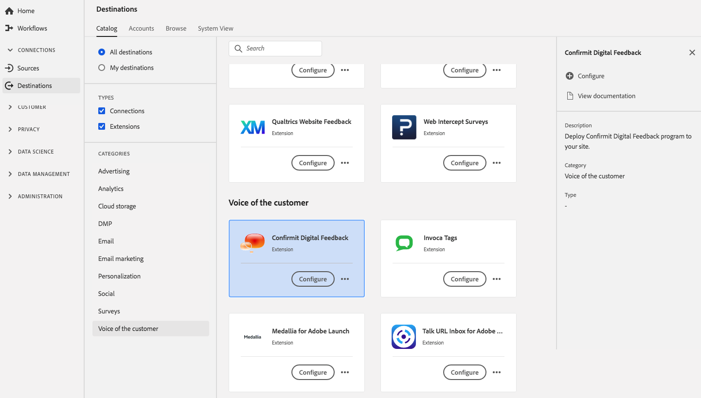

# [!DNL Confirmit Digital Feedback] extensão

## Visão geral {#overview}

[!DNL Confirmit Digital Feedback] ajuda você a transformar o tráfego do site em insights em tempo real. Com [!DNL Confirmit], pesquisas discretas e altamente direcionadas podem ser exibidas de acordo com suas necessidades, incentivando os visitantes a fornecer feedback, como:

* Feedback do site
* Satisfação da transação
* Motivo da intenção de saída
* Informações sobre o abandono do carrinho
* Satisfação geral do cliente
* E muito mais

[!DNL Confirmit] O Feedback digital é uma voz da extensão do cliente no Adobe Experience Platform. Para obter mais informações sobre a funcionalidade de extensão, consulte a página de extensão em [Adobe Exchange](https://exchange.adobe.com/experiencecloud.details.103247.confirmit-digital-feedback-for-adobe-launch.html).

Esse destino é uma extensão do Adobe Experience Platform Launch. Para obter mais informações sobre como as extensões do Platform launch funcionam na plataforma, consulte [Visão geral das extensões do Adobe Experience Platform Launch](../launch-extensions/overview.md).

## Pré-requisitos {#prerequisites}

Essa extensão está disponível no catálogo [!DNL Destinations] para todos os clientes que compraram a Platform.

Para usar essa extensão, você precisa acessar o Adobe Experience Platform Launch. O Platform launch é oferecido aos clientes da Adobe Experience Cloud como um recurso incluso com valor agregado. Entre em contato com o administrador da organização para obter acesso ao Platform launch e solicitar que ele conceda a permissão **[!UICONTROL manage_properties]** para que você possa instalar extensões.

## Instalar extensão {#install-extension}

Para instalar a extensão [!DNL Confirmit] de Feedback Digital:

Na [Interface da plataforma](http://platform.adobe.com/), vá para **[!UICONTROL Destinos]** > **[!UICONTROL Catálogo]**.

Selecione a extensão do catálogo ou use a barra de pesquisa.

Clique no destino para realçá-lo e selecione **[!UICONTROL Configurar]** no painel direito. Se o controle **[!UICONTROL Configurar]** estiver esmaecido, você não terá a permissão **[!UICONTROL manage_properties]**. Consulte [Pré-requisitos](#prerequisites).

Na janela **[!UICONTROL Select available Platform launch property]**, selecione a propriedade do Platform launch na qual deseja instalar a extensão. Você também tem a opção de criar uma nova propriedade no Platform launch. Uma propriedade é uma coleção de regras, elementos de dados, extensões configuradas, ambientes e bibliotecas. Saiba mais sobre as propriedades na seção [Propriedades da página](../../../tags/ui/administration/companies-and-properties.md#properties-page) da documentação do Platform launch.

O fluxo de trabalho leva você ao Platform launch para concluir a instalação.

Para obter informações sobre as opções de configuração de extensão e o suporte de instalação, consulte a página [Confirmar comentários digitais no Adobe Exchange](https://exchange.adobe.com/experiencecloud.details.103247.confirmit-digital-feedback-for-adobe-launch.html).

Você também pode instalar a extensão diretamente na [interface do Adobe Experience Platform Launch](https://launch.adobe.com/). Consulte [Adicionar uma nova extensão](../../../tags/ui/managing-resources/extensions/overview.md#add-a-new-extension) na documentação do Platform launch.

## Como usar a extensão {#how-to-use}

Depois de instalar a extensão, você pode iniciar a configuração das regras diretamente no Platform launch.

No Platform launch, você pode configurar regras para suas extensões instaladas para enviar dados de evento para o destino da extensão somente em determinadas situações. Para obter mais informações sobre como configurar regras para suas extensões, consulte a [Documentação de regras](../../../tags/ui/managing-resources/rules.md).

## Configurar, atualizar e excluir extensão {#configure-upgrade-delete}

Você pode configurar, atualizar e excluir extensões na interface do Platform launch.

>[!TIP]
>
>Se a extensão já estiver instalada em uma de suas propriedades, a interface do usuário da plataforma ainda exibirá **[!UICONTROL Instalar]** para a extensão. Desative o fluxo de trabalho de instalação conforme descrito em [Instalar extensão](#install-extension) para chegar ao Platform launch e configure ou exclua sua extensão.

Para atualizar sua extensão, consulte [Atualização de extensão](../../../tags/ui/managing-resources/extensions/extension-upgrade.md) na documentação do Platform launch.
