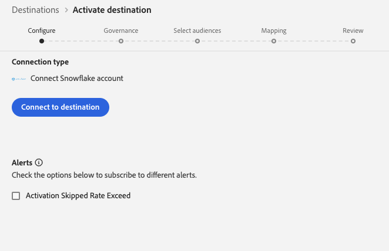
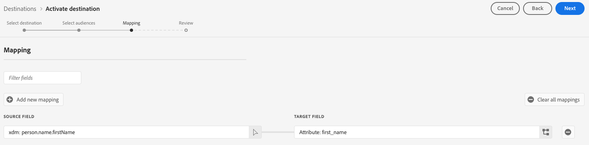

# Conexão de transmissão do Snowflake {#snowflake-destination}

>[!AVAILABILITY]
>
>Este conector de destino está em disponibilidade limitada e só está disponível para clientes do Real-Time CDP Ultimate provisionados na [região VA7](/help/landing/multi-cloud.md#azure-regions).

## Visão geral {#overview}

Use o conector de destino do Snowflake para exportar dados para a instância do Snowflake do Adobe, que o Adobe compartilha com sua instância por meio de [listagens privadas](https://other-docs.snowflake.com/en/collaboration/collaboration-listings-about).

Leia as seções a seguir para entender como o destino do Snowflake funciona e como os dados são transferidos entre o Adobe e o Snowflake.

### Como funciona o compartilhamento de dados do Snowflake {#data-sharing}

Esse destino usa um compartilhamento de dados do [!DNL Snowflake], o que significa que nenhum dado é fisicamente exportado ou transferido para sua própria instância do Snowflake. Em vez disso, o Adobe concede acesso somente leitura a uma tabela ativa hospedada no ambiente Snowflake do Adobe. Você pode consultar essa tabela compartilhada diretamente da sua conta da Snowflake, mas não é o proprietário da tabela e não pode modificá-la ou mantê-la além do período de retenção especificado. O Adobe gerencia totalmente o ciclo de vida e a estrutura da tabela compartilhada.

Na primeira vez que compartilhar dados da instância Snowflake do Adobe com a sua, você será solicitado a aceitar a lista privada do Adobe.

### Retenção de dados e TTL (Time-to-Live) {#ttl}

Todos os dados compartilhados por meio dessa integração têm um TTL (Time-to-Live) fixo de sete dias. Sete dias após a última exportação, a tabela compartilhada expira automaticamente e se torna inacessível, independentemente de o fluxo de dados ainda estar ativo. Se você precisar reter os dados por mais de sete dias, copie o conteúdo em uma tabela de sua propriedade na própria instância do Snowflake antes que o TTL expire.

### Comportamento de atualização do público {#audience-update-behavior}

Se o público-alvo for avaliado no [modo de lote](../../../segmentation/methods/batch-segmentation.md), os dados na tabela compartilhada serão atualizados a cada 24 horas. Isso significa que pode haver um atraso de até 24 horas entre as alterações na associação de público-alvo e quando essas alterações são refletidas na tabela compartilhada.

### Lógica de exportação incremental {#incremental-export}

Quando um fluxo de dados é executado para um público-alvo pela primeira vez, ele executa um preenchimento retroativo e compartilha todos os perfis qualificados no momento. Após esse preenchimento retroativo inicial, somente as atualizações incrementais serão refletidas na tabela compartilhada. Isso significa que os perfis são adicionados ou removidos do público-alvo. Essa abordagem garante atualizações eficientes e mantém a tabela compartilhada atualizada.

## Compartilhamento de dados em lote versus transmissão {#batch-vs-streaming}

A Experience Platform fornece dois tipos de destinos do Snowflake: [Streaming do Snowflake](snowflake.md) e [Lote do Snowflake](snowflake-batch.md).

A tabela abaixo ajudará você a decidir qual destino usar, descrevendo os cenários em que cada método de compartilhamento de dados é mais apropriado.

|  | Escolha o [Lote do Snowflake](snowflake-batch.md) quando precisar | Escolha [Streaming do Snowflake](snowflake.md) quando precisar |
|--------|-------------------|----------------------|
| **Frequência de atualização** | Instantâneos periódicos | Atualizações contínuas em tempo real |
| **Apresentação de dados** | Instantâneo completo do público-alvo que substitui os dados anteriores | Atualizações incrementais com base em alterações de perfil |
| **Foco no caso de uso** | Cargas de trabalho analíticas/de ML onde a latência não é crítica | Cenários de ação imediata que exigem atualizações em tempo real |
| **Gerenciamento de dados** | Sempre ver instantâneo concluído mais recente | Atualizações incrementais com base em alterações de associação de público |
| **Exemplos de cenários** | Relatórios de negócios, análise de dados, treinamento de modelo de ML | Supressão da campanha de marketing, personalização em tempo real |

Para obter mais informações sobre o compartilhamento de dados em lote, consulte a documentação da [Conexão em lote do Snowflake](snowflake-batch.md).

## Casos de uso {#use-cases}

O compartilhamento de dados de transmissão é ideal para cenários em que você precisa de atualizações imediatas quando um perfil altera sua associação ou outros atributos. Isso é fundamental para casos de uso que exigem capacidade de resposta em tempo real, como:

* **Supressão da campanha de marketing**: suprime imediatamente campanhas de marketing para usuários que realizaram ações específicas, como se inscrever em um serviço ou fazer uma compra
* **Personalização em tempo real**: atualize as experiências do usuário instantaneamente quando os atributos do perfil forem alterados, como quando um usuário visita um site, visualiza uma página de produto ou adiciona itens a um carrinho de compras
* **Cenários de ação imediata**: execute supressão e redirecionamento rápidos com base em dados em tempo real para reduzir atrasos e garantir que as campanhas de marketing sejam mais relevantes e oportunas
* **Eficiência e nuance**: permita maior eficiência e nuance nos esforços de marketing, permitindo uma resposta rápida às alterações de comportamento do usuário
* **Otimização da jornada do cliente em tempo real**: atualize as experiências do cliente imediatamente quando a associação do segmento ou os atributos do perfil forem alterados

O compartilhamento de dados de transmissão fornece atualizações contínuas com base em alterações de segmento, alterações no mapa de identidade ou alterações de atributo, tornando-o adequado para cenários em que a latência é crítica e são necessárias atualizações imediatas.

## Pré-requisitos {#prerequisites}

Antes de configurar a conexão do Snowflake, verifique se os seguintes pré-requisitos estão sendo atendidos:

* Você tem acesso a uma conta [!DNL Snowflake].
* Sua conta do Snowflake tem inscrições em listas privadas. Você ou alguém em sua empresa que tenha privilégios de administrador de conta no Snowflake pode configurar isso.

Leia a [[!DNL Snowflake] documentação](https://docs.snowflake.com/en/collaboration/consumer-listings-access#access-a-private-listing) para obter mais informações sobre as permissões necessárias.

## Públicos-alvo compatíveis {#supported-audiences}

Esta seção descreve quais tipos de públicos-alvo você pode exportar para esse destino. As duas tabelas abaixo indicam a quais públicos este conector dá suporte, por _origem do público-alvo_ e _tipos de perfil incluídos no público-alvo_:

| Origem do público | Suportado | Descrição |
|---------|----------|----------|
| [!DNL Segmentation Service] | ✓ | Públicos-alvo gerados pelo [Serviço de Segmentação](../../../segmentation/home.md) da Experience Platform. |
| Todas as outras origens de público-alvo | ✓ | Esta categoria inclui todas as origens de público-alvo fora dos públicos-alvo gerados pelo [!DNL Segmentation Service]. Leia sobre as [várias origens do público-alvo](/help/segmentation/ui/audience-portal.md#customize). Alguns exemplos incluem: <ul><li> carregar audiências personalizadas [importadas](../../../segmentation/ui/audience-portal.md#import-audience) para o Experience Platform de arquivos CSV,</li><li> públicos-alvo semelhantes, </li><li> públicos federados, </li><li> públicos-alvo gerados em outros aplicativos da Experience Platform, como o Adobe Journey Optimizer, </li><li> e muito mais. </li></ul> |

{style="table-layout:auto"}

## Tipo e frequência de exportação {#export-type-frequency}

Consulte a tabela abaixo para obter informações sobre o tipo e a frequência da exportação de destino.

| Item | Tipo | Notas |
|---------|----------|---------|
| Tipo de exportação | **[!UICONTROL Audience export]** | Você está exportando todos os membros de um público com os identificadores (nome, número de telefone ou outros) usados no destino [!DNL Snowflake]. |
| Frequência de exportação | **[!UICONTROL Streaming]** | Os destinos de transmissão são conexões baseadas em API &quot;sempre ativas&quot;. Assim que um perfil for atualizado no Experience Platform com base na avaliação do público-alvo, o conector enviará a atualização downstream para a plataforma de destino. Leia mais sobre [destinos de streaming](/help/destinations/destination-types.md#streaming-destinations). |

{style="table-layout:auto"}

## Conectar ao destino {#connect}

>[!IMPORTANT]
> 
>Para se conectar ao destino, você precisa das **[!UICONTROL View Destinations]** e **[!UICONTROL Manage Destinations]** [permissões de controle de acesso](/help/access-control/home.md#permissions). Leia a [visão geral do controle de acesso](/help/access-control/ui/overview.md) ou contate o administrador do produto para obter as permissões necessárias.

Para se conectar a este destino, siga as etapas descritas no [tutorial de configuração de destino](../../ui/connect-destination.md). No workflow de configuração de destino, preencha os campos listados nas duas seções abaixo.

### Autenticar para o destino {#authenticate}

Para autenticar no destino, selecione **[!UICONTROL Connect to destination]**.

### Preencher detalhes do destino {#destination-details}

>[!CONTEXTUALHELP]
>id="platform_destinations_snowflake_accountID"
>title="Insira sua ID da conta do Snowflake"
>abstract="Se sua conta estiver vinculada a uma organização, use este formato: `OrganizationName.AccountName`   Se sua conta não estiver vinculada a uma organização, use este formato:`AccountName`"

Para configurar detalhes para o destino, preencha os campos obrigatórios e opcionais abaixo. Um asterisco ao lado de um campo na interface do usuário indica que o campo é obrigatório.

* **[!UICONTROL Name]**: Um nome pelo qual você reconhecerá este destino no futuro.
* **[!UICONTROL Description]**: uma descrição que ajudará você a identificar este destino no futuro.
* **[!UICONTROL Snowflake Account ID]**: sua ID de conta da Snowflake. Use o seguinte formato de ID de conta, dependendo se sua conta está vinculada a uma organização:
   * Se sua conta estiver vinculada a uma organização:`OrganizationName.AccountName`.
   * Se sua conta não estiver vinculada a uma organização:`AccountName`.
* **[!UICONTROL Account acknowledgment]**: Ative a confirmação da ID de conta da Snowflake para confirmar se a ID de conta está correta e se pertence a você.

>[!IMPORTANT]
>
> Caracteres especiais usados no nome de destino e no nome da sandbox do Experience Platform são convertidos automaticamente em sublinhados (`_`) no Snowflake. Para evitar confusão, não use caracteres especiais no destino e no nome da sandbox.

### Ativar alertas {#enable-alerts}

Você pode ativar os alertas para receber notificações sobre o status do fluxo de dados para o seu destino. Selecione um alerta na lista para assinar e receber notificações sobre o status do seu fluxo de dados. Para obter mais informações sobre alertas, leia o manual sobre [assinatura de alertas de destinos usando a interface](../../ui/alerts.md).

Quando terminar de fornecer detalhes da conexão de destino, selecione **[!UICONTROL Next]**.

## Ativar públicos-alvo para esse destino {#activate}

>[!IMPORTANT]
> 
>* Para ativar dados, você precisa das **[!UICONTROL View Destinations]**, **[!UICONTROL Activate Destinations]**, **[!UICONTROL View Profiles]** e **[!UICONTROL View Segments]** [permissões de controle de acesso](/help/access-control/home.md#permissions). Leia a [visão geral do controle de acesso](/help/access-control/ui/overview.md) ou contate o administrador do produto para obter as permissões necessárias.
>* Para exportar *identidades*, você precisa da **[!UICONTROL View Identity Graph]** [permissão de controle de acesso](/help/access-control/home.md#permissions).   {width="100" zoomable="yes"}

Leia [Ativar perfis e públicos-alvo para destinos de exportação de público-alvo de streaming](/help/destinations/ui/activate-segment-streaming-destinations.md) para obter instruções sobre como ativar públicos-alvo para este destino.

### Mapear atributos {#map}

O destino do Snowflake oferece suporte ao mapeamento de atributos de perfil para atributos personalizados.

Os atributos de destino são criados automaticamente no Snowflake usando o nome do atributo fornecido no campo **[!UICONTROL Attribute name]**.

## Dados exportados / Validar exportação de dados {#exported-data}

Verifique sua conta do Snowflake para verificar se os dados foram exportados corretamente.

## Limitações conhecidas {#known-limitations}

### Restrição de política de mesclagem padrão {#default-merge-policy-restriction}

Atualmente, somente os públicos-alvo mapeados para a política de mesclagem padrão podem ser exportados.

### Disponibilidade regional {#regional-availability}

O destino de transmissão [!DNL Snowflake] está disponível no momento apenas para clientes do Real-Time CDP provisionados na região do Experience Platform VA7.

## Uso e governança de dados {#data-usage-governance}

Todos os destinos do [!DNL Adobe Experience Platform] são compatíveis com as políticas de uso de dados ao manipular seus dados. Para obter informações detalhadas sobre como o [!DNL Adobe Experience Platform] fiscaliza a governança de dados, leia a [Visão geral da Governança de Dados](/help/data-governance/home.md).
