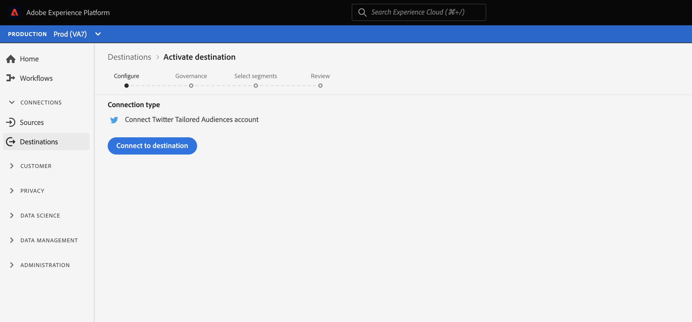

# Configuração de destino {#destination-configuration}

## Visão geral {#overview}

Essa configuração permite indicar informações básicas, como nome de destino, categoria, descrição, logotipo e muito mais. As configurações nessa configuração também determinam como os usuários do Experience Platform se autenticam para o seu destino, como ele aparece na interface do usuário do Experience Platform e as identidades que podem ser exportadas para o seu destino.

Você pode configurar a funcionalidade descrita neste documento usando o ponto de extremidade da API `/authoring/destinations`. Leia [Operações de ponto de extremidade da API de Destinos](./destination-configuration-api.md) para obter uma lista completa de operações que podem ser executadas no ponto de extremidade.

## Exemplo de configuração {#example-configuration}

Abaixo está um exemplo de configuração para um destino ficcional, Moviestar, que tem endpoints em quatro locais no mundo. O destino pertence à categoria destinos móveis . As seções a seguir detalham como essa configuração é construída.

```json
{
   "name":"Moviestar",
   "description":"Moviestar is a fictional destination, used for this example.",
   "status":"TEST",
   "customerAuthenticationConfigurations":[
      {
         "authType":"BEARER"
      }
   ],
   "customerDataFields":[
      {
         "name":"endpointsInstance",
         "type":"string",
         "title":"Select Endpoint",
         "description":"Moviestar manages several instances across the globe for REST endpoints that our customers are provisioned for. Select your endpoint in the dropdown list.",
         "isRequired":true,
         "enum":[
            "US",
            "EU",
            "APAC",
            "NZ"
         ]
      },
      {
         "name":"customerID",
         "type":"string",
         "title":"Moviestar Customer ID",
         "description":"Your customer ID in the Moviestar destination (e.g. abcdef).",
         "isRequired":true,
         "pattern":"^[A-Za-z]+$"
      }
   ],
   "uiAttributes":{
      "documentationLink":"http://www.adobe.com/go/destinations-moviestar-en",
      "category":"mobile",
      "connectionType":"Server-to-server",
      "frequency":"Streaming"
   },
   "identityNamespaces":{
      "external_id":{
         "acceptsAttributes":true,
         "acceptsCustomNamespaces":true,
         "acceptedGlobalNamespaces":{
            "Email":{
               
            }
         }
      },
      "another_id":{
         "acceptsAttributes":true,
         "acceptsCustomNamespaces":true
      }
   },
   "schemaConfig":{
      "profileRequired":false,
      "segmentRequired":true,
      "identityRequired":true
   },
   "destinationDelivery":[
      {
         "authenticationRule":"CUSTOMER_AUTHENTICATION",
         "destinationServerId":"9c77000a-4559-40ae-9119-a04324a3ecd4"
      }
   ],
   "segmentMappingConfig":{
      "mapExperiencePlatformSegmentName":false,
      "mapExperiencePlatformSegmentId":false,
      "mapUserInput":false,
      "audienceTemplateId":"cbf90a70-96b4-437b-86be-522fbdaabe9c"
   },
   "inputSchemaId":"cc8621770a9243b98aba4df79898b1ed",
   "aggregation":{
      "aggregationType":"CONFIGURABLE_AGGREGATION",
      "configurableAggregation":{
         "splitUserById":true,
         "maxBatchAgeInSecs":0,
         "maxNumEventsInBatch":0,
         "aggregationKey":{
            "includeSegmentId":true,
            "includeSegmentStatus":true,
            "includeIdentity":true,
            "oneIdentityPerGroup":false,
            "groups":[
               {
                  "namespaces":[
                     "IDFA",
                     "GAID"
                  ]
               },
               {
                  "namespaces":[
                     "EMAIL"
                  ]
               }
            ]
         }
      }
   }
}
```

| Parâmetro | Tipo | Descrição |
|---------|----------|------|
| `name` | String | Indica o título do destino no catálogo de Experience Platform. |
| `description` | String | Forneça uma descrição que o Adobe usará no catálogo de destinos do Experience Platform para o cartão de destino. Mire por não mais do que 4 a 5 frases. |
| `status` | String | Indica o status do ciclo de vida do cartão de destino. Os valores aceitos são `TEST`, `PUBLISHED` e `DELETED`. Use `TEST` ao configurar o destino pela primeira vez. |

{style=&quot;table-layout:auto&quot;}

## Configurações de autenticação do cliente {#customer-authentication-configurations}

Esta seção gera a página da conta na interface do usuário do Experience Platform, onde os usuários se conectam Experience Platform às contas que têm com seu destino. Dependendo de qual opção de autenticação você indicar no campo `authType`, a página Experience Platform será gerada para os usuários da seguinte maneira:

**Autenticação do portador**

Os usuários devem inserir o token portador que obtêm do seu destino.


**Autenticação OAuth 2**

Os usuários selecionam **[!UICONTROL Conectar ao destino]** para acionar o fluxo de autenticação do OAuth 2 para o seu destino.




| Parâmetro | Tipo | Descrição |
|---------|----------|------|
| `customerAuthenticationConfigurations` | String | Indica a configuração usada para autenticar clientes do Experience Platform para o servidor. Consulte `authType` abaixo para obter os valores aceitos. |
| `authType` | String | Os valores aceitos são `OAUTH2, BEARER`. <br><ul><li> Se o destino oferecer suporte à autenticação OAuth 2, selecione o valor `OAUTH2` e adicione os campos obrigatórios para OAuth 2, conforme mostrado na página de autenticação OAuth 2 do SDK de destino. Além disso, você deve selecionar `authenticationRule=CUSTOMER_AUTHENTICATION` na seção [delivery de destino](./destination-configuration.md). </li><li>Para autenticação do portador, selecione `BEARER` e selecione `authenticationRule=CUSTOMER_AUTHENTICATION` na seção [entrega de destino](./destination-configuration.md).</li></ul> |

{style=&quot;table-layout:auto&quot;}

## Campos de dados do cliente {#customer-data-fields}

Esta seção permite que os parceiros introduzam campos personalizados. No exemplo de configuração acima, `customerDataFields` requer que os usuários selecionem um terminal no fluxo de autenticação e indiquem a ID do cliente com o destino. A configuração é refletida no fluxo de autenticação, como mostrado abaixo:


| Parâmetro | Tipo | Descrição |
|---------|----------|------|
| `name` | String | Forneça um nome para o campo personalizado que está sendo introduzido. |
| `type` | String | Indica o tipo de campo personalizado que está sendo introduzido. Os valores aceitos são `string`, `object`, `integer`. |
| `title` | String | Indica o nome do campo, como é visto pelos clientes na interface do usuário do Experience Platform. |
| `description` | String | Forneça uma descrição para o campo personalizado. |
| `isRequired` | Booleano | Indica se esse campo é necessário no fluxo de trabalho de configuração de destino. |
| `enum` | String | Renderiza o campo personalizado como um menu suspenso e lista as opções disponíveis para o usuário. |
| `pattern` | String | Impõe um padrão para o campo personalizado, se necessário. Use expressões regulares para impor um padrão. Por exemplo, se as IDs do cliente não incluírem números ou sublinhados, digite `^[A-Za-z]+$` neste campo. |

{style=&quot;table-layout:auto&quot;}

## Atributos da interface do usuário {#ui-attributes}

Esta seção se refere aos elementos da interface do usuário na configuração acima que o Adobe deve usar para seu destino na interface do usuário do Adobe Experience Platform. Consulte abaixo:

| Parâmetro | Tipo | Descrição |
|---------|----------|------|
| `documentationLink` | String | Refere-se à página de documentação no [Catálogo de destinos](https://experienceleague.adobe.com/docs/experience-platform/destinations/catalog/overview.html?lang=en#catalog) para seu destino. Use `http://www.adobe.com/go/destinations-YOURDESTINATION-en`, onde `YOURDESTINATION` é o nome do seu destino. Para um destino chamado Moviestar, você usaria `http://www.adobe.com/go/destinations-moviestar-en` |
| `category` | String | Refere-se à categoria atribuída ao seu destino no Adobe Experience Platform. Para obter mais informações, leia [Categorias de destino](https://experienceleague.adobe.com/docs/experience-platform/destinations/destination-types.html). Use um dos seguintes valores: `adobeSolutions, advertising, analytics, cdp, cloudStorage, crm, customerSuccess, database, dmp, ecommerce, email, emailMarketing, enrichment, livechat, marketingAutomation, mobile, personalization, protocols, social, streaming, subscriptions, surveys, tagManagers, voc, warehouses, payments`. |
| `connectionType` | String | `Server-to-server` no momento, é a única opção disponível. |
| `frequency` | String | `Streaming` no momento, é a única opção disponível. |

{style=&quot;table-layout:auto&quot;}

## Configuração de esquema na etapa de mapeamento {#schema-configuration}


Use os parâmetros em `schemaConfig` para habilitar a etapa de mapeamento do workflow de ativação de destino. Ao usar os parâmetros descritos abaixo, você pode determinar se os usuários do Experience Platform podem mapear atributos e/ou identidades de perfil para o esquema desejado no lado do destino.

| Parâmetro | Tipo | Descrição |
|---------|----------|------|
| `profileFields` | Matriz | *Não mostrado no exemplo de configuração acima.* Ao adicionar atributos predefinidos  `profileFields`, os usuários terão a opção de mapear atributos de Experience Platform para os atributos predefinidos no lado do destino. |
| `profileRequired` | Booleano | Use `true` se os usuários forem capazes de mapear atributos de perfil do Experience Platform para atributos personalizados no lado do seu destino, como mostrado na configuração de exemplo acima. |
| `segmentRequired` | Booleano | Sempre use `segmentRequired:true`. |
| `identityRequired` | Booleano | Use `true` se os usuários puderem mapear os namespaces de identidade do Experience Platform para o esquema desejado. |

{style=&quot;table-layout:auto&quot;}

## Identidades e atributos {#identities-and-attributes}

Os parâmetros nesta seção determinam como as identidades e atributos de destino são preenchidos na etapa de mapeamento da interface do usuário do Experience Platform, onde os usuários mapeiam seus esquemas XDM para o esquema no seu destino.

O Adobe precisa saber quais [!DNL Platform] identidades os clientes poderão exportar para seu destino. Alguns exemplos são [!DNL Experience Cloud ID], email com hash, ID do dispositivo ([!DNL IDFA], [!DNL GAID]). Esses valores são [!DNL Platform] namespaces de identidade que os clientes podem mapear para namespaces de identidade a partir do seu destino.

Os namespaces de identidade não exigem uma correspondência de 1 para 1 entre [!DNL Platform] e seu destino.
Por exemplo, os clientes podem mapear um namespace [!DNL Platform] [!DNL IDFA] para um namespace [!DNL IDFA] do destino, ou podem mapear o mesmo namespace [!DNL Platform] [!DNL IDFA] para um namespace [!DNL Customer ID] no destino.

Leia mais na [Visão geral do Namespace de identidade](https://experienceleague.adobe.com/docs/experience-platform/identity/namespaces.html?lang=pt-BR).


| Parâmetro | Tipo | Descrição |
|---------|----------|------|
| `acceptsAttributes` | Booleano | Indica se o destino aceita atributos de perfil padrão. Normalmente, esses atributos são destacados na documentação de nossos parceiros. |
| `acceptsCustomNamespaces` | Booleano | Indica se os clientes podem configurar namespaces personalizados no seu destino. |
| `allowedAttributesTransformation` | String | *Não mostrado na configuração* de exemplo. Usado, por exemplo, quando o cliente [!DNL Platform] tem endereços de email simples como um atributo e sua plataforma aceita apenas emails com hash. É aqui que você fornece a transformação que precisa ser aplicada (por exemplo, transformar o email em minúsculas e, em seguida, em hash). |
| `acceptedGlobalNamespaces` | - | Usado para casos em que sua plataforma aceita [namespaces de identidade padrão](https://experienceleague.adobe.com/docs/experience-platform/identity/namespaces.html?lang=en#standard-namespaces) (por exemplo, IDFA), para que você possa restringir os usuários da plataforma a selecionar apenas esses namespaces de identidade. |

{style=&quot;table-layout:auto&quot;}

## Delivery de destino {#destination-delivery}

| Parâmetro | Tipo | Descrição |
|---------|----------|------|
| `authenticationRule` | String | Indica como os clientes [!DNL Platform] se conectam ao seu destino. Os valores aceitos são `CUSTOMER_AUTHENTICATION`, `PLATFORM_AUTHENTICATION`, `NONE`. <br> <ul><li>Use `CUSTOMER_AUTHENTICATION` se os clientes da Platform fizerem logon em seu sistema por meio de um nome de usuário e senha, um token portador ou outro método de autenticação. Por exemplo, você selecionaria essa opção se também selecionasse `authType: OAUTH2` ou `authType:BEARER` em `customerAuthenticationConfigurations`. </li><li> Use `PLATFORM_AUTHENTICATION` se houver um sistema de autenticação global entre o Adobe e seu destino e o cliente [!DNL Platform] não precisar fornecer credenciais de autenticação para se conectar ao seu destino. Nesse caso, você deve criar um objeto de credenciais usando a configuração [Credentials](./credentials-configuration.md). </li><li>Use `NONE` se nenhuma autenticação for necessária para enviar dados para a plataforma de destino. </li></ul> |
| `destinationServerId` | String | O `instanceId` da [configuração do servidor de destino](./destination-server-api.md) usada para este destino. |
| `backfillHistoricalProfileData` | Booleano | Controla se os dados históricos do perfil são exportados quando os segmentos são ativados para o destino. <br> <ul><li> `true`:  [!DNL Platform] envia os perfis de usuário históricos que se qualificaram para o segmento antes que ele seja ativado. </li><li> `false`:  [!DNL Platform] inclui somente perfis de usuário qualificados para o segmento após ele ser ativado. </li></ul> |

{style=&quot;table-layout:auto&quot;}

## Configuração do mapeamento de segmento {#segment-mapping}


Esta seção da configuração de destino está relacionada a como os metadados do segmento, como nomes de segmento ou IDs, devem ser compartilhados entre o Experience Platform e seu destino.

Por meio do `audienceTemplateId`, esta seção também vincula essa configuração à [configuração de metadados de público-alvo](./audience-metadata-management.md).

Os parâmetros mostrados na configuração acima são descritos na [referência da API do ponto de extremidade de destinos](./destination-configuration-api.md).

## Política de agregação {#aggregation}


Esta seção permite definir as políticas de agregação que o Experience Platform usará ao exportar dados para seu destino.

Uma política de agregação determina como os perfis exportados são combinados nas exportações de dados. As opções disponíveis são:
* Melhor agregação de esforço
* Agregação configurável (mostrada na configuração acima)

Leia a seção em [usando o modelo](./message-format.md#using-templating) e os [exemplos de chaves de agregação](./message-format.md#template-aggregation-key) para entender como incluir a política de agregação no modelo de transformação de mensagem com base em sua política de agregação selecionada.

### Melhor agregação de esforço {#best-effort-aggregation}

>[!TIP]
>
>Use essa opção se o terminal da API aceitar menos de 100 perfis por chamada de API.

Essa opção funciona melhor para destinos que preferem menos perfis por solicitação e preferem receber mais solicitações com menos dados do que menos solicitações com mais dados.

Use o parâmetro `maxUsersPerRequest` para especificar o número máximo de perfis que seu destino pode receber em uma solicitação.

### Agregação configurável {#configurable-aggregation}

Essa opção funciona melhor se você preferir obter grandes lotes, com milhares de perfis na mesma chamada. Essa opção também permite agregar os perfis exportados com base em regras de agregação complexas.

Essa opção permite:
* Defina o tempo máximo e o número de perfis a serem agregados antes que uma chamada de API seja feita no seu destino.
* Agregue os perfis exportados mapeados para o destino com base em:
   * ID do segmento
   * status do segmento
   * identidade ou grupos de identidades

Para obter explicações detalhadas dos parâmetros de agregação, consulte a página de referência [Destinations API endpoint operations](./destination-configuration-api.md) , onde cada parâmetro é descrito.

<!--

commenting out the `backfillHistoricalProfileData` parameter, which will only be used after an April release

|`backfillHistoricalProfileData` | Boolean | Controls whether historical profile data is exported when segments are activated to the destination. <br> <ul><li> `true`: [!DNL Platform] sends the historical user profiles that qualified for the segment before the segment is activated. </li><li> `false`: [!DNL Platform] only includes user profiles that qualify for the segment after the segment is activated. </li></ul> |

-->
