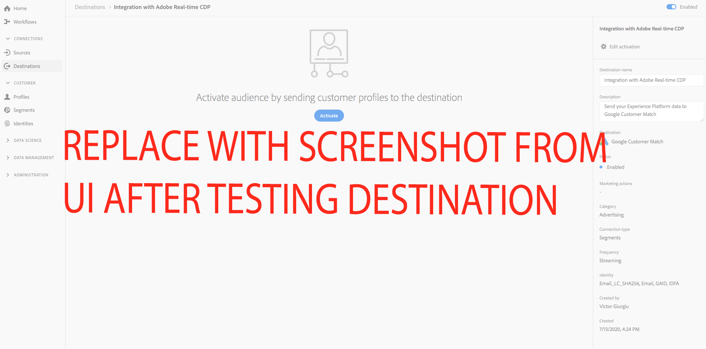

# SEU DESTINO {#your-destination}

*Conforme você passa por esse modelo, substitua ou exclua todos os parágrafos em itálico (começando por este).*

*Comece atualizando os metadados (título e descrição) na parte superior da página. Ignore todas as instâncias do UICONTROL nesta página. Esta é uma tag que ajuda nossos processos de tradução automática a traduzir a página corretamente para os vários idiomas suportados. Adicionaremos tags à sua documentação após enviá-la.*

## Visão geral {#overview}

*Forneça uma breve visão geral para sua empresa, incluindo o valor que ela oferece aos clientes. Inclua um link para a página inicial da documentação do produto para mais leitura.*

>[!IMPORTANT]
>
>Esta página de documentação foi criada pela *SEU DESTINO* equipe. Para quaisquer consultas ou pedidos de atualização, contacte-os diretamente em *Inserir link ou endereço de email onde você pode acessar para obter atualizações*

## Pré-requisitos {#prerequisites}

*Adicione informações nesta seção sobre qualquer coisa que os clientes precisam saber antes de começar a configurar o destino na interface do usuário do Adobe Experience Platform. Isso pode ser sobre:*

* *precisar ser adicionado a uma lista de permissões*
* *requisitos para hash de email*
* *qualquer conta específica do seu lado*
* *como obter uma chave de API para se conectar à sua plataforma*

*Você pode vincular à sua documentação relevante se isso for útil para os clientes.*

## Identidades suportadas {#supported-identities}

*Adicione informações nesta seção sobre as identidades suportadas pelo seu destino. Preenchemos previamente a tabela com alguns valores padrão. Exclua os valores que não se aplicam ao seu destino e quaisquer valores que não são pré-preenchidos.*

*SEU DESTINO* O suporta a ativação de identidades descritas na tabela abaixo. Saiba mais sobre [identidades](https://experienceleague.adobe.com/docs/experience-platform/identity/namespaces.html?lang=en#getting-started).

| Identidade do Target | Descrição | Considerações |
|---|---|---|
| GAID | Google Advertising ID | Selecione a identidade de destino GAID quando a identidade de origem for um namespace GAID. |
| IDFA | Apple ID para anunciantes | Selecione a identidade de destino do IDFA quando sua identidade de origem for um namespace do IDFA. |
| ECID | Experience Cloud ID | Um namespace que representa ECID. Esse namespace também pode ser mencionado pelos seguintes aliases: &quot;Adobe Marketing Cloud ID&quot;, &quot;Adobe Experience Cloud ID&quot;, &quot;Adobe Experience Platform ID&quot;. Consulte o seguinte documento em [ECID](https://experienceleague.adobe.com/docs/experience-platform/identity/ecid.html) para obter mais informações. |
| phone_sha256 | Números de telefone com hash com o algoritmo SHA256 | O Adobe Experience Platform oferece suporte para texto sem formatação e números de telefone com hash SHA256. Quando o campo de origem contém atributos com hash, verifique a **[!UICONTROL Aplicar transformação]** , para ter [!DNL Platform] fazer o hash automático dos dados na ativação. |
| email_lc_sha256 | Endereços de email com hash com o algoritmo SHA256 | O Adobe Experience Platform oferece suporte para texto sem formatação e endereços de email com hash SHA256. Quando o campo de origem contém atributos com hash, verifique a **[!UICONTROL Aplicar transformação]** , para ter [!DNL Platform] fazer o hash automático dos dados na ativação. |
| external_id | IDs de usuário personalizadas | Selecione essa identidade de destino quando sua identidade de origem for um namespace personalizado. |

{style=&quot;table-layout:auto&quot;}

## Tipo e frequência de exportação {#export-type-frequency}

*Na tabela , mantenha somente as linhas que correspondem ao seu destino. Você deve ter uma linha para o tipo Export e uma linha para a frequência Export . Exclua os valores que não se aplicam ao seu destino.*

Consulte a tabela abaixo para obter informações sobre o tipo e a frequência da exportação de destino.

| Item | Tipo | Notas |
---------|----------|---------|
| Tipo de exportação | **[!UICONTROL Exportar segmento]** | Você está exportando todos os membros de um segmento (público-alvo) com os identificadores (nome, número de telefone ou outros) usados na *SEU DESTINO* destino. |
| Tipo de exportação | **[!UICONTROL Baseado em perfil]** | Você está exportando todos os membros de um segmento, junto com os campos de esquema desejados (por exemplo: endereço de email, número de telefone, sobrenome), conforme escolhido na tela selecionar atributos de perfil do [fluxo de trabalho de ativação de destino](/help/destinations/ui/activate-batch-profile-destinations.md#select-attributes). |
| Frequência de exportação | **[!UICONTROL Streaming]** | Os destinos de transmissão são conexões &quot;sempre ativas&quot; baseadas em API. Assim que um perfil é atualizado no Experience Platform com base na avaliação do segmento, o conector envia a atualização downstream para a plataforma de destino. Leia mais sobre [destinos de transmissão](/help/destinations/destination-types.md#streaming-destinations). |
| Frequência de exportação | **[!UICONTROL Em lote]** | Destinos em lote exportam arquivos para plataformas downstream em incrementos de três, seis, oito, doze ou vinte e quatro horas. Leia mais sobre [destinos com base em arquivo em lote](/help/destinations/destination-types.md#file-based). |

{style=&quot;table-layout:auto&quot;}

## Casos de uso {#use-cases}

Para ajudá-lo a entender melhor como e quando você deve usar a variável *SEU DESTINO* destino, aqui estão casos de uso de exemplo que os clientes do Adobe Experience Platform podem resolver usando esse destino.

### Caso de uso nº 1

*Para plataformas de mensagens móveis:*

*Uma plataforma residencial de aluguel e vendas deseja enviar notificações móveis para os dispositivos Android e iOS dos clientes para que saibam que há 100 listas atualizadas na área em que eles buscaram anteriormente um aluguel.*

### Caso de uso nº 2

*Para plataformas de rede social:*

*Uma marca de vestuário atlético quer alcançar clientes existentes por meio de suas contas de mídia social. A marca de vestuário pode assimilar endereços de email do próprio CRM para o Adobe Experience Platform, criar segmentos a partir de seus próprios dados offline e enviar esses segmentos para O SEU DESTINO, para exibir anúncios nos feeds de mídia social de seus clientes.*

## Conecte-se ao destino {#connect}

Para se conectar a esse destino, siga as etapas descritas na [tutorial de configuração de destino](https://experienceleague.adobe.com/docs/experience-platform/destinations/ui/connect-destination.html).

### Parâmetros de conexão {#parameters}

Ao [configuração](https://experienceleague.adobe.com/docs/experience-platform/destinations/ui/connect-destination.html) nesse destino, você deve fornecer as seguintes informações:

*Adicione os campos que os clientes devem preencher ao configurar um novo destino. Esses campos são específicos do destino e dependem da sua configuração no Destination SDK. Os campos do seu destino podem não ser os mesmos listados abaixo.*

* **[!UICONTROL Nome]**: Um nome pelo qual você reconhecerá esse destino no futuro.
* **[!UICONTROL Descrição]**: Uma descrição que ajudará a identificar esse destino no futuro.
* **[!UICONTROL ID da conta]**: Seu *SEU DESTINO* ID da conta.


<!--

*Replace YOURDESTINATION with your destination name and TOBEFILLEDIN with the category that your destination belongs to.*

1. In **[!UICONTROL Destinations]** > **[!UICONTROL Catalog]**, scroll to the ***TOBEFILLEDIN*** category. Select ***YOURDESTINATION***, then select **[!UICONTROL Configure]**.


    >[!NOTE]
    >
    >If a connection with this destination already exists, you can see an **[!UICONTROL Activate]** button on the destination card. For more information about the difference between **[!UICONTROL Activate]** and **[!UICONTROL Configure]**, refer to the [Catalog](https://experienceleague.adobe.com/docs/experience-platform/destinations/ui/destinations-workspace.html#catalog) section of the destination workspace documentation.  

    

2. In the **Account** step, if you had previously set up a connection to your *YOURDESTINATION* destination, select **[!UICONTROL Existing Account]** and select your existing connection. Or, you can select **[!UICONTROL New Account]** to set up a new connection to *YOURDESTINATION*. Select **[!UICONTROL Connect to destination]** to log in and connect Adobe Experience Cloud to your *YOURDESTINATION* account.

    >[!NOTE]
    >
    >Adobe Experience Platform supports credentials validation in the authentication process and displays an error message if you input incorrect credentials to your ***YOURDESTINATION*** account. This ensures that you don't complete the workflow with incorrect credentials.

3. Once your credentials are confirmed and Adobe Experience Cloud is connected to your ***YOURDESTINATION*** account, you can select **[!UICONTROL Next]** to proceed to the **[!UICONTROL Setup]** step.

4. In the **[!UICONTROL Authentication]** step, enter a **[!UICONTROL Name]** and a **[!UICONTROL Description]** for your activation flow and fill your account ID. <br> Also in this step, you can select any marketing action that should apply to this destination. Marketing actions indicate the intent for which data will be exported to the destination. You can select from Adobe-defined marketing actions or you can create your own marketing action. For more information about marketing actions, see the [Data usage policies overview](https://experienceleague.adobe.com/docs/experience-platform/data-governance/policies/overview.html).

    

5. Your destination is now created. You can select **[!UICONTROL Save & Exit]** if you want to activate segments later on or you can select **[!UICONTROL Next]** to continue the workflow and select segments to activate. In either case, see the next section, [Activate segments](#activate-segments), for the rest of the workflow.

-->

## Ativar segmentos para este destino {#activate}

Ler [Ativar perfis e segmentos para destinos de exportação de segmentos de fluxo](https://experienceleague.adobe.com/docs/experience-platform/destinations/ui/activate/activate-segment-streaming-destinations.html?lang=en) para obter instruções sobre como ativar segmentos de público-alvo para este destino.

<!--

To activate segments to *YOURDESTINATION*, follow the steps below: 

1. In **[!UICONTROL Destinations > Browse]**, select the *YOURDESTINATION* destination where you want to activate your segments.

2. Click the name of the destination. This takes you to the Activate flow.
    
    Note that if an activation flow already exists for a destination, you can see the segments that are currently being sent to the destination. Select **[!UICONTROL Edit activation]** in the right rail and follow the steps below to modify the activation details.
3. Select **[!UICONTROL Activate]**;
4. In the **[!UICONTROL Activate destination]** workflow, on the **[!UICONTROL Select Segments]** page, select which segments to send to *YOURDESTINATION*.
    
5.  In the **[!UICONTROL Mapping]** step, select which attributes and identities from the source XDM schema to map to the target schema. Select **[!UICONTROL Add new mapping]** and browse your schema, select identity namespaces and map them to the corresponding target identity.  
 <br>&nbsp;
   *Plain text email address as primary identity*: If you have plain text (unhashed) email addresses as primary identity in your schema, select the email field in your **[!UICONTROL Source Attributes]** and map to the Email field in the right column under **[!UICONTROL Target Identities]**, as shown below. Set up a mapping between any other attributes you plan to use.
    <br>&nbsp;
6. On the **[!UICONTROL Segment schedule]** page, you can set the start date for sending data to the destination.
7. On the **[!UICONTROL Review]** page, you can see a summary of your selection. Select **[!UICONTROL Cancel]** to break up the flow, **[!UICONTROL Back]** to modify your settings, or **[!UICONTROL Finish]** to confirm your selection and start sending data to the destination.

>[!IMPORTANT]
>
>In this step, Adobe Experience Platform checks for data usage policy violations. Shown below is an example where a policy is violated. You cannot complete the segment activation workflow until you have resolved the violation. For information on how to resolve policy violations, see [Policy enforcement](https://experienceleague.adobe.com/docs/experience-platform/data-governance/enforcement/auto-enforcement.html#enforcement) in the data governance documentation section.
 


If no policy violations have been detected, select **[!UICONTROL Finish]** to confirm your selection and start sending data to the destination.


-->

## Dados exportados {#exported-data}

*Adicione uma observação sobre como os dados são exportados para o seu destino. Isso ajudaria o cliente a garantir que ele tenha integrado corretamente com seu destino. Por exemplo, você pode fornecer um JSON de amostra como o abaixo.*

```
{
  "person": {
    "email": "yourstruly@adobe.com"
  },
  "segmentMembership": {
    "ups": {
      "7841ba61-23c1-4bb3-a495-00d3g5fe1e93": {
        "lastQualificationTime": "2020-05-25T21:24:39Z",
        "status": "exited"
      },
      "59bd2fkd-3c48-4b18-bf56-4f5c5e6967ae": {
        "lastQualificationTime": "2020-05-25T23:37:33Z",
        "status": "existing"
      }
    }
  },
  "identityMap": {
    "ecid": [
      {
        "id": "14575006536349286404619648085736425115"
      },
      {
        "id": "66478888669296734530114754794777368480"
      }
    ],
    "email_lc_sha256": [
      {
        "id": "655332b5fa2aea4498bf7a290cff017cb4"
      },
      {
        "id": "66baf76ef9de8b42df8903f00e0e3dc0b7"
      }
    ]
  }
}
```

## Uso e governança de dados {#data-usage-governance}

Todos [!DNL Adobe Experience Platform] Os destinos são compatíveis com as políticas de uso de dados ao manipular os dados. Para obter informações detalhadas sobre como [!DNL Adobe Experience Platform] aplica o controle de dados, leia a [Visão geral da governança de dados](https://experienceleague.adobe.com/docs/experience-platform/data-governance/home.html).

## Recursos adicionais {#additional-resources}

*Você pode fornecer outros links para a documentação do seu produto ou quaisquer outros recursos que considere importantes para o sucesso do cliente.*
