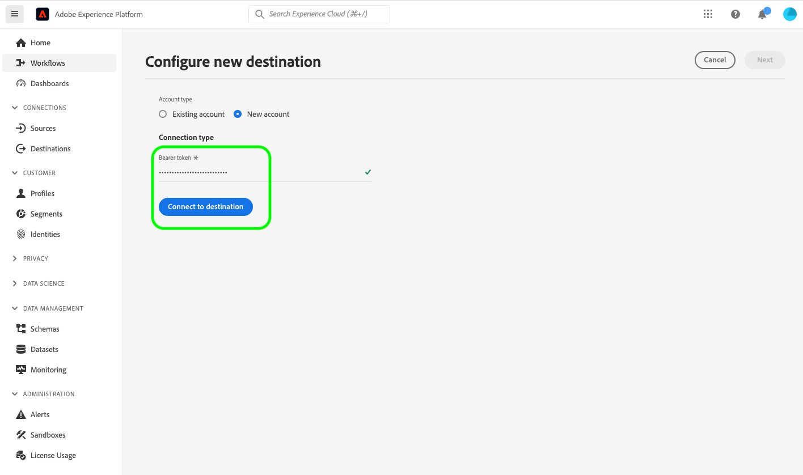

# Sua conexão de destino {#your-destination}

*Conforme você passar por este modelo, substitua ou exclua todos os parágrafos em itálico (começando por este).*

*Comece atualizando os metadados (título e descrição) na parte superior da página. Ignore todas as instâncias de UICONTROL nesta página. Essa é uma tag que ajuda nossos processos de tradução automática a traduzir corretamente a página para os vários idiomas compatíveis. Adicionaremos marcas à sua documentação após você enviá-la.*

>[!IMPORTANT]
>
>* Preencha todas as seções neste modelo, na ordem em que estão descritas no modelo.
>* Esse modelo é atualizado com pouca frequência, com base no feedback do parceiro. Antes de começar a criar a documentação para o seu destino, baixe a [última versão do modelo](../assets/docs-framework/yourdestination-template.zip).

## Visão geral {#overview}

*Forneça uma breve visão geral da sua empresa, incluindo o valor que ela oferece aos clientes. Inclua um link para a página inicial da documentação do produto para leitura adicional.*

>[!IMPORTANT]
>
>Este conector de destino e a página de documentação são criados e mantidos pela equipe do *YourDestination*. Para qualquer consulta ou solicitação de atualização, contate-os diretamente em *Inserir link ou endereço de email onde você pode ser contatado para obter atualizações, por exemplo `support@YourDestination.com`.*

## Casos de uso {#use-cases}

Para ajudá-lo a entender melhor como e quando você deve usar o destino *YourDestination*, veja a seguir exemplos de casos de uso que os clientes da Adobe Experience Platform podem resolver usando esse destino.

### Caso de uso #1 {#use-case-1}

*Para plataformas de mensagens móveis:*

*Uma plataforma de vendas e aluguel de residências deseja enviar notificações móveis para os dispositivos Android e iOS dos clientes para que eles saibam que há 100 listas atualizadas na área em que eles pesquisaram anteriormente por um aluguel.*

### Caso de uso #2 {#use-case-2}

*Para plataformas de rede social:*

*Uma marca de vestuário esportivo deseja alcançar clientes existentes por meio de suas contas de redes sociais. A marca de vestuário pode assimilar endereços de email de seu próprio CRM para o Adobe Experience Platform, criar públicos a partir de seus próprios dados offline e enviar esses públicos para o Seu Destino, para exibir anúncios nos feeds de redes sociais de seus clientes.*

## Pré-requisitos {#prerequisites}

*Adicione nesta seção informações sobre qualquer item que os clientes precisem saber antes de começar a configurar o destino na interface do Adobe Experience Platform. Isso pode ser sobre:*

* *que precisa ser adicionado a uma lista de permissões*
* *requisitos para hash de email*
* *qualquer especificação de conta da sua parte*
* *como obter uma chave de API para se conectar à sua plataforma*

*Você pode vincular à sua documentação relevante, se isso for útil aos clientes.*

## Identidades suportadas {#supported-identities}

*Adicione informações nesta seção sobre as identidades suportadas pelo seu destino. Preenchemos previamente a tabela com alguns valores padrão. Exclua os valores que não se aplicam ao seu destino e/ou adicione quaisquer valores que não estejam pré-preenchidos.*

*YourDestination* oferece suporte à ativação das identidades descritas na tabela abaixo. Saiba mais sobre [identidades](/help/identity-service/features/namespaces.md).

| Identidade de destino | Descrição | Considerações |
|---|---|---|
| GAID | GOOGLE ADVERTISING ID | Selecione a identidade de destino GAID quando a identidade de origem for um namespace GAID. |
| IDFA | Apple ID para anunciantes | Selecione a identidade de destino do IDFA quando a identidade de origem for um namespace do IDFA. |
| ECID | Experience Cloud ID | Um namespace que representa a ECID. Esse namespace também pode ser referenciado pelos seguintes aliases: &quot;Adobe Marketing Cloud ID&quot;, &quot;Adobe Experience Cloud ID&quot;, &quot;Adobe Experience Platform ID&quot;. Leia o seguinte documento na [ECID](/help/identity-service/features/ecid.md) para obter mais informações. |
| phone_sha256 | Números de telefone com hash com o algoritmo SHA256 | Os números de telefone com hash SHA256 e texto sem formatação são compatíveis com o Adobe Experience Platform. Quando o campo de origem contiver atributos sem hash, marque a opção **[!UICONTROL Apply transformation]** para que o [!DNL Experience Platform] coloque os dados em hash automaticamente durante a ativação. |
| email_lc_sha256 | Endereços de email com hash com o algoritmo SHA256 | O Adobe Experience Platform oferece suporte tanto para texto simples quanto para endereços de email com hash SHA256. Quando o campo de origem contiver atributos sem hash, marque a opção **[!UICONTROL Apply transformation]** para que o [!DNL Experience Platform] coloque os dados em hash automaticamente durante a ativação. |
| extern_id | IDs de usuário personalizadas | Selecione esta identidade de destino quando sua identidade de origem for um namespace personalizado. |

{style="table-layout:auto"}

## Públicos-alvo compatíveis {#supported-audiences}

*Adicione informações nesta seção sobre os públicos-alvo com suporte do seu destino. Preenchemos previamente a tabela com alguns valores padrão. Use os caracteres `✓` e `X` para marcar se o tipo de público-alvo é suportado por este destino.*

Esta seção descreve quais tipos de públicos-alvo você pode exportar para esse destino.

| Origem do público | Suportado | Descrição |
|---------|----------|----------|
| [!DNL Segmentation Service] | ✓ | Públicos-alvo gerados pelo [Serviço de Segmentação](../../../segmentation/home.md) da Experience Platform. |
| Uploads personalizados | X | Públicos [importados](../../../segmentation/ui/audience-portal.md#import-audience) para o Experience Platform de arquivos CSV. |

{style="table-layout:auto"}

## Tipo e frequência de exportação {#export-type-frequency}

*Na tabela, mantenha somente as linhas que correspondem ao seu destino. Você deve ter uma linha para o Tipo de exportação e uma linha para a Frequência de exportação. Exclua os valores que não se aplicam ao seu destino.*

Consulte a tabela abaixo para obter informações sobre o tipo e a frequência da exportação de destino.

| Item | Tipo | Notas |
|---------|----------|---------|
| Tipo de exportação | **[!UICONTROL Audience export]** | Você está exportando todos os membros de um público com os identificadores (nome, número de telefone ou outros) usados no destino *YourDestination*. |
| Tipo de exportação | **[!UICONTROL Profile-based]** | Você está exportando todos os membros de um público-alvo, juntamente com os campos de esquema desejados (por exemplo: endereço de email, número de telefone, sobrenome), conforme escolhido na tela selecionar atributos de perfil do [fluxo de trabalho de ativação de destino](/help/destinations/ui/activate-batch-profile-destinations.md#select-attributes). |
| Tipo de exportação | **[!UICONTROL Dataset export]** | Você está exportando conjuntos de dados brutos, que não são agrupados ou estruturados por interesses ou qualificações de público-alvo. |
| Frequência de exportação | **[!UICONTROL Streaming]** | Os destinos de transmissão são conexões baseadas em API &quot;sempre ativas&quot;. Assim que um perfil for atualizado no Experience Platform com base na avaliação do público-alvo, o conector enviará a atualização downstream para a plataforma de destino. Leia mais sobre [destinos de streaming](/help/destinations/destination-types.md#streaming-destinations). |
| Frequência de exportação | **[!UICONTROL Batch]** | Os destinos em lote exportam arquivos para plataformas downstream em incrementos de três, seis, oito, doze ou vinte e quatro horas. Leia mais sobre [destinos com base em arquivo de lote](/help/destinations/destination-types.md#file-based). |

{style="table-layout:auto"}

## Conectar ao destino {#connect}

>[!IMPORTANT]
> 
>Para se conectar ao destino, você precisa das **[!UICONTROL View Destinations]** e **[!UICONTROL Manage Destinations]** [permissões de controle de acesso](/help/access-control/home.md#permissions). Leia a [visão geral do controle de acesso](/help/access-control/ui/overview.md) ou contate o administrador do produto para obter as permissões necessárias.

Para se conectar a este destino, siga as etapas descritas no [tutorial de configuração de destino](../../ui/connect-destination.md). No workflow de configuração de destino, preencha os campos listados nas duas seções abaixo.

### Autenticar para o destino {#authenticate}

*Adicione os campos que os clientes devem preencher ao autenticar no seu destino. Esses campos são específicos do destino e dependem da configuração no Destination SDK. Os campos de destino podem não ser os mesmos listados abaixo. Inclua também uma captura de tela semelhante à captura de tela de exemplo mostrada abaixo.*

Para autenticar no destino, preencha os campos obrigatórios e selecione **[!UICONTROL Connect to destination]**.



* **[!UICONTROL Bearer token]**: Preencha o token do portador para autenticar no destino.

### Preencher detalhes do destino {#destination-details}

*Adicione os campos que os clientes devem preencher ao configurar um novo destino. Esses campos são específicos do destino e dependem da configuração no Destination SDK. Os campos de destino podem não ser os mesmos listados abaixo. Inclua também uma captura de tela semelhante à captura de tela de exemplo mostrada abaixo.*

Para configurar detalhes para o destino, preencha os campos obrigatórios e opcionais abaixo. Um asterisco ao lado de um campo na interface do usuário indica que o campo é obrigatório.


* **[!UICONTROL Name]**: Um nome pelo qual você reconhecerá este destino no futuro.
* **[!UICONTROL Description]**: uma descrição que ajudará você a identificar este destino no futuro.
* **[!UICONTROL Account ID]**: Seu *SeuDestino* ID da conta.

### Ativar alertas {#enable-alerts}

Você pode ativar os alertas para receber notificações sobre o status do fluxo de dados para o seu destino. Selecione um alerta na lista para assinar e receber notificações sobre o status do seu fluxo de dados. Para obter mais informações sobre alertas, leia o manual sobre [assinatura de alertas de destinos usando a interface](../../ui/alerts.md).

Quando terminar de fornecer detalhes da conexão de destino, selecione **[!UICONTROL Next]**.

## Ativar públicos-alvo para esse destino {#activate}

>[!IMPORTANT]
> 
>* Para ativar dados, você precisa das **[!UICONTROL View Destinations]**, **[!UICONTROL Activate Destinations]**, **[!UICONTROL View Profiles]** e **[!UICONTROL View Segments]** [permissões de controle de acesso](/help/access-control/home.md#permissions). Leia a [visão geral do controle de acesso](/help/access-control/ui/overview.md) ou contate o administrador do produto para obter as permissões necessárias.
>* Para exportar *identidades*, você precisa da **[!UICONTROL View Identity Graph]** [permissão de controle de acesso](/help/access-control/home.md#permissions). <br> {width="100" zoomable="yes"}

*Exclua conforme apropriado - Se estiver documentando um novo destino de streaming, mantenha o primeiro parágrafo abaixo. Se estiver documentando um novo destino baseado em arquivo, mantenha o segundo parágrafo. Se você estiver documentando um destino que exporta conjuntos de dados, mantenha o terceiro parágrafo.*

Leia [Ativar perfis e públicos-alvo para destinos de exportação de público-alvo de streaming](/help/destinations/ui/activate-segment-streaming-destinations.md) para obter instruções sobre como ativar públicos-alvo para este destino.

Leia [Ativar dados de público-alvo para destinos de exportação de perfil em lote](/help/destinations/ui/activate-batch-profile-destinations.md) para obter instruções sobre como ativar públicos-alvo para esse destino.

Leia [(Beta) Exportar conjuntos de dados](/help/destinations/ui/export-datasets.md) para obter instruções detalhadas sobre como exportar conjuntos de dados para este destino.

### Mapear atributos e identidades {#map}

*Adicione informações sobre mapeamentos compatíveis entre campos de origem e destino na etapa Mapeamento do fluxo de trabalho de ativação. O destino pode oferecer suporte à exportação de atributos de perfil, namespaces de identidade ou ambos. Alguns campos podem ser obrigatórios. Os atributos do Target podem ser predefinidos ou personalizados. Enfatize os avisos importantes e use exemplos, preferencialmente com capturas de tela. Dois exemplos de páginas de destino que você pode usar como referência são:*

* *[Pega](/help/destinations/catalog/personalization/pega.md#mapping-example)*
* *[Medália](/help/destinations/catalog/voice/medallia-connector.md#map)*

## Dados exportados / Validar exportação de dados {#exported-data}

*Adicione um parágrafo sobre como os dados são exportados para o seu destino. Isso ajudaria o cliente a garantir que ele se integrou corretamente ao seu destino. Por exemplo, você pode fornecer uma amostra de JSON como a abaixo. Ou você pode fornecer capturas de tela e informações da interface do destino que mostram como os clientes devem esperar que os públicos-alvo sejam preenchidos na plataforma de destino.*

```
{
  "person": {
    "email": "yourstruly@adobe.com"
  },
  "segmentMembership": {
    "ups": {
      "7841ba61-23c1-4bb3-a495-00d3g5fe1e93": {
        "lastQualificationTime": "2020-05-25T21:24:39Z",
        "status": "exited"
      },
      "59bd2fkd-3c48-4b18-bf56-4f5c5e6967ae": {
        "lastQualificationTime": "2020-05-25T23:37:33Z",
        "status": "realized"
      }
    }
  },
  "identityMap": {
    "ecid": [
      {
        "id": "14575006536349286404619648085736425115"
      },
      {
        "id": "66478888669296734530114754794777368480"
      }
    ],
    "email_lc_sha256": [
      {
        "id": "655332b5fa2aea4498bf7a290cff017cb4"
      },
      {
        "id": "66baf76ef9de8b42df8903f00e0e3dc0b7"
      }
    ]
  }
}
```

## Uso e governança de dados {#data-usage-governance}

Todos os destinos do [!DNL Adobe Experience Platform] são compatíveis com as políticas de uso de dados ao manipular seus dados. Para obter informações detalhadas sobre como o [!DNL Adobe Experience Platform] fiscaliza a governança de dados, leia a [Visão geral da Governança de Dados](/help/data-governance/home.md).

## Recursos adicionais {#additional-resources}

*Você pode fornecer mais links para a documentação do produto ou qualquer outro recurso que considere importante para o sucesso do cliente.*
