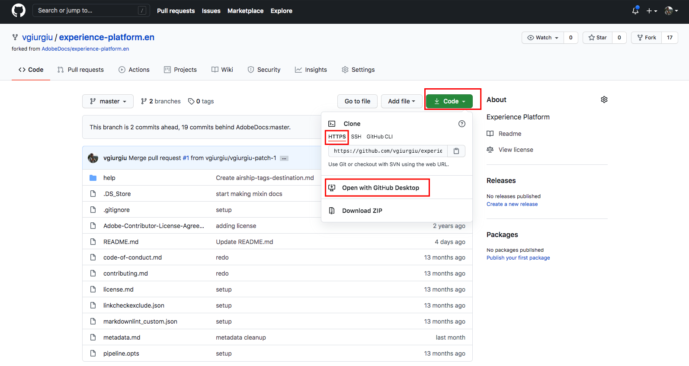

# Use um editor de texto em seu ambiente local para criar uma página de documentação de destino {#local-authoring}

As instruções nesta página mostram como usar um editor de texto para trabalhar em seu ambiente local, criar documentação e enviar uma solicitação de pull (PR). Antes de seguir as etapas indicadas aqui, leia [Documentar seu destino nos Destinos do Adobe Experience Platform](./documentation-instructions.md).

>[!TIP]
>
>Consulte também a documentação de suporte no guia do colaborador do Adobe:
>
>* [Instalar as ferramentas de criação do Git e do Markdown](https://experienceleague.adobe.com/docs/contributor/contributor-guide/setup/install-tools.html)
>* [Configurar o repositório Git localmente para a documentação](https://experienceleague.adobe.com/docs/contributor/contributor-guide/setup/local-repo.html)
>* [Fluxo de trabalho de contribuição do GitHub para grandes alterações](https://experienceleague.adobe.com/docs/contributor/contributor-guide/setup/full-workflow.html).

## Conectar-se ao GitHub e configurar o ambiente de criação local {#set-up-environment}

1. Em seu navegador, navegue até `https://github.com/AdobeDocs/experience-platform.en`
2. Para [bifurcar](https://experienceleague.adobe.com/docs/contributor/contributor-guide/setup/local-repo.html#fork-the-repository) o repositório, clique em **Bifurcar** conforme mostrado abaixo. Isso cria uma cópia do repositório do Experience Platform em sua própria conta GitHub.

   

3. Clonar o repositório no computador local. Selecione **Código > HTTPS > Abrir com o GitHub Desktop**, conforme mostrado abaixo. Verifique se você tem o [GitHub Desktop](https://desktop.github.com/) instalado. Para mais referências, leia [Criar um clone local do repositório](https://experienceleague.adobe.com/docs/contributor/contributor-guide/setup/local-repo.html#create-a-local-clone-of-the-repository) no guia do colaborador do Adobe.

   

4. Na estrutura do arquivo local, navegue até `experience-platform.en/help/destinations/catalog/[...]`, onde `[...]` é a categoria desejada para o seu destino. Por exemplo, se estiver adicionando um destino de personalização ao Experience Platform, selecione a pasta `personalization`.

## Crie a página de documentação do seu destino {#author-documentation}

1. Sua página de documentação é baseada no [modelo de destino de autoatendimento](../docs-framework/self-service-template.md). Baixe o [modelo de destino](../assets/docs-framework/yourdestination-template.zip). Descompacte e extraia o arquivo `yourdestination-template.md` no diretório mencionado na etapa 4 acima.  Renomeie o arquivo `YOURDESTINATION.md`, onde YOURDESTINATION é o nome do seu destino no Adobe Experience Platform. Por exemplo, se sua empresa se chama Moviestar, você chamaria seu arquivo de `moviestar.md`.
2. Abra o novo arquivo em seu [editor de texto preferido](https://experienceleague.adobe.com/docs/contributor/contributor-guide/setup/install-tools.html#understand-markdown-editors). A Adobe recomenda o uso do [Visual Studio Code](https://code.visualstudio.com/) e a instalação da extensão de Criação do Adobe Markdown. Para instalar a extensão, abra o Visual Studio Code, selecione a guia **[!DNL Extensions]** à esquerda da tela e procure por `adobe markdown authoring`. Selecione a extensão e clique em **[!DNL Install]**.
   
3. Edite o template com informações relevantes para o seu destino. Siga as instruções no modelo.
4. Para capturas de tela ou imagens que você planeja adicionar à documentação, vá para `GitHub/experience-platform.en/help/destinations/assets/catalog/[...]`, onde `[...]` é a categoria desejada para o seu destino. Por exemplo, se estiver adicionando um destino de personalização ao Experience Platform, selecione a pasta `personalization`. Crie uma nova pasta para o destino e salve as imagens aqui. Você deve vinculá-los a partir da página que está criando. Consulte [instruções sobre como vincular a imagens](https://experienceleague.adobe.com/docs/contributor/contributor-guide/writing-essentials/linking.html#link-to-images).
5. Quando estiver pronto, salve o arquivo em que está trabalhando.

## Envie sua documentação para revisão {#submit-review}

>[!TIP]
>
>Observe que não há nada que você possa quebrar aqui. Seguindo as instruções nesta seção, você está simplesmente sugerindo uma atualização da documentação. A atualização sugerida será aprovada ou editada pela equipe de documentação da Adobe Experience Platform.

1. No GitHub Desktop, crie uma ramificação de trabalho para suas atualizações e selecione **Publicar ramificação** para publicar a ramificação no GitHub.

1. No GitHub Desktop, [confirme](https://docs.github.com/en/free-pro-team@latest/github/getting-started-with-github/github-glossary#commit) seu trabalho, conforme mostrado abaixo.

   

1. No GitHub Desktop, [envie por push](https://docs.github.com/en/free-pro-team@latest/github/getting-started-with-github/github-glossary#push) seu trabalho para a ramificação [remota](https://docs.github.com/en/free-pro-team@latest/github/getting-started-with-github/github-glossary#remote), conforme mostrado abaixo.

   

1. Na interface da Web do GitHub, abra uma solicitação de pull (PR) para mesclar a ramificação de trabalho à ramificação mestre do repositório de documentação do Adobe. Verifique se a ramificação em que você trabalhou está selecionada e selecione **Contribute > Abrir solicitação de pull**.

   

1. Verifique se as ramificações base e de comparação estão corretas. Adicione uma observação à PR, descrevendo sua atualização, e selecione **Criar solicitação de pull**. Isso abre uma PR para mesclar a ramificação de trabalho da sua bifurcação com a ramificação mestre do repositório do Adobe.

   >[!TIP]
   >
   >Deixe marcada a caixa de seleção **Permitir edições pelos mantenedores** para que a equipe de documentação do Adobe possa fazer edições na PR.

   

1. Nesse momento, é exibida uma notificação solicitando que você assine o Contrato de licença de colaborador (CLA) da Adobe. Essa é uma etapa obrigatória. Depois de assinar o CLA, atualize a página da PR e envie a solicitação de pull.

1. É possível confirmar se a solicitação de pull foi enviada ao inspecionar a guia **Solicitações de pull** em `https://github.com/AdobeDocs/experience-platform.en`.

1. Obrigado! A equipe de documentação do Adobe entrará em contato com a PR, caso seja necessário fazer alguma edição, e para informar quando a documentação será publicada.

>[!TIP]
>
>Para adicionar imagens e links à sua documentação e a qualquer outra pergunta sobre o Markdown, leia [Usando o Markdown](https://experienceleague.adobe.com/docs/contributor/contributor-guide/writing-essentials/markdown.html) no guia de escrita colaborativa da Adobe.
