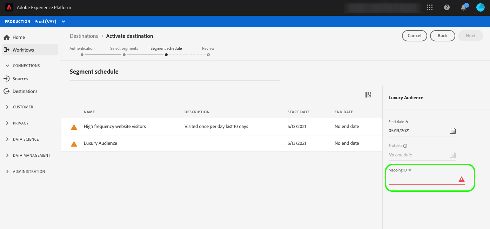

# Gerenciamento de metadados de público

Use modelos de metadados de público-alvo para criar, atualizar ou excluir públicos-alvo no destino de forma programática. O Adobe fornece um modelo de metadados de público-alvo extensível, que pode ser configurado com base nas especificações da API de marketing. Depois de definir, testar e enviar a configuração, ela será usada pelo Adobe para estruturar as chamadas de API para o seu destino.

Você pode configurar a funcionalidade descrita neste documento usando o ponto de extremidade de API `/authoring/audience-templates`. Leia [criar um modelo de metadados](../metadata-api/create-audience-template.md) para obter uma lista completa de operações que você pode executar no ponto de extremidade.

## Quando usar o endpoint de gerenciamento de metadados de público-alvo {#when-to-use}

Dependendo da configuração da API, pode ser ou não necessário usar o endpoint de gerenciamento de metadados de público-alvo ao configurar o destino no Experience Platform. Use o diagrama de árvore decisória abaixo para entender quando usar o endpoint de metadados de público-alvo e como configurar um template de metadados de público-alvo para seu destino.


## Casos de uso compatíveis com o gerenciamento de metadados de público-alvo {#use-cases}

Com o suporte aos metadados de público no Destination SDK, ao configurar o destino do Experience Platform, você pode fornecer aos usuários do Experience Platform uma das várias opções ao mapearem e ativarem públicos para o seu destino. Você pode controlar as opções disponíveis para o usuário por meio dos parâmetros na seção [Configuração de metadados de público-alvo](../functionality/destination-configuration/audience-metadata-configuration.md) da configuração de destino.

### Caso de uso 1 - Você tem uma API de terceiros e os usuários não precisam inserir IDs de mapeamento

Se você tiver um endpoint de API para criar/atualizar/excluir públicos ou públicos, poderá usar modelos de metadados de público para configurar o Destination SDK de forma que corresponda às especificações do endpoint de criação/atualização/exclusão de público. O Experience Platform pode criar/atualizar/excluir públicos de maneira programática e sincronizar metadados com o Experience Platform.

Ao ativar públicos-alvo para o seu destino na interface do usuário (UI) do Experience Platform, os usuários não precisam preencher manualmente um campo de ID de mapeamento de público-alvo no fluxo de trabalho de ativação.

### Caso de uso 2 - Os usuários precisam criar um público-alvo em seu destino primeiro e são solicitados a inserir manualmente a ID do mapeamento

Se os públicos-alvo e outros metadados precisarem ser criados manualmente por parceiros ou usuários no destino, os usuários deverão preencher manualmente o campo de ID de mapeamento de público no fluxo de trabalho de ativação para sincronizar os metadados do público-alvo entre o destino e a Experience Platform.



### Caso de uso 3: seu destino aceita a ID de público-alvo da Experience Platform, os usuários não precisam inserir a ID de mapeamento manualmente

Se o sistema de destino aceitar a ID de público-alvo da Experience Platform, você poderá configurá-la no modelo de metadados de público-alvo. Os usuários não precisam preencher uma ID de mapeamento de público-alvo ao ativar um segmento.

## Modelo de público-alvo genérico e extensível {#generic-and-extensible}

Para dar suporte aos casos de uso listados acima, a Adobe fornece um modelo genérico que pode ser personalizado para se ajustar às especificações da API.

Você pode usar o modelo genérico para [criar um novo modelo de público-alvo](../metadata-api/create-audience-template.md) se sua API permitir:

* Os métodos HTTP: POST, GET, PUT, DELETE, PATCH
* Os tipos de autenticação: OAuth 1, OAuth 2 com token de atualização, OAuth 2 com token de portador
* As funções: criar um público, atualizar um público, obter um público, excluir um público, validar credenciais

A equipe de engenharia do Adobe pode trabalhar com você para expandir o modelo genérico com campos personalizados, se os casos de uso exigirem.


## Eventos de modelo compatíveis {#supported-events}

A tabela abaixo descreve os eventos compatíveis com modelos de metadados de público-alvo.

| Seção Modelo | Descrição |
|--- |--- |
| `create` | Inclui todos os componentes necessários (URL, método HTTP, cabeçalhos, corpo da solicitação e resposta) para fazer uma chamada HTTP para a API, criar segmentos/públicos-alvo de forma programática na plataforma e sincronizar as informações de volta para o Adobe Experience Platform. |
| `update` | Inclui todos os componentes necessários (URL, método HTTP, cabeçalhos, corpo da solicitação e resposta) para fazer uma chamada HTTP para a sua API, atualizar programaticamente segmentos/públicos-alvo na sua plataforma e sincronizar as informações de volta para o Adobe Experience Platform. |
| `delete` | Inclui todos os componentes necessários (URL, método HTTP, cabeçalhos, corpo da solicitação e resposta) para fazer uma chamada HTTP na API e excluir segmentos/públicos de forma programática na plataforma. |
| `validate` | Executa validações para qualquer campo na configuração do modelo antes de chamar a API do parceiro. Por exemplo, você pode validar se a ID da conta do usuário foi inserida corretamente. |
| `notify` | Aplica-se somente a destinos baseados em arquivo. Inclui todos os componentes necessários (URL, método HTTP, cabeçalhos, corpo da solicitação e resposta) para fazer uma chamada HTTP para sua API e notificá-lo de exportações de arquivos bem-sucedidas. |
| `createDestination` | Inclui todos os componentes necessários (URL, método HTTP, cabeçalhos, corpo da solicitação e resposta) para fazer uma chamada HTTP para sua API, criar programaticamente um fluxo de dados em sua plataforma e sincronizar as informações de volta para o Adobe Experience Platform. |
| `updateDestination` | Inclui todos os componentes necessários (URL, método HTTP, cabeçalhos, corpo da solicitação e resposta) para fazer uma chamada HTTP para sua API, atualizar programaticamente um fluxo de dados em sua plataforma e sincronizar as informações de volta para o Adobe Experience Platform. |
| `deleteDestination` | Inclui todos os componentes necessários (URL, método HTTP, cabeçalhos, corpo da solicitação e resposta) para fazer uma chamada HTTP para sua API e excluir programaticamente um fluxo de dados de sua plataforma. |

{style="table-layout:auto"}

## Exemplos de configuração {#configuration-examples}

Esta seção inclui exemplos de configurações de metadados de público-alvo genéricos, para sua referência.

Observe como o URL, os cabeçalhos e os corpos de solicitação diferem entre as três configurações de exemplo. Isso se deve às diferentes especificações da API de marketing das três plataformas de amostra.

Observe que em alguns exemplos, campos de macro como `{{authData.accessToken}}` ou `{{segment.name}}` são usados na URL e em outros exemplos eles são usados nos cabeçalhos ou no corpo da solicitação. O uso depende das especificações da API de marketing.

+++Exemplo de transmissão 1

```json
{
   "instanceId":"34ab9cc2-2536-44a5-9dc5-b2fea60b3bd6",
   "createdDate":"2021-07-26T19:30:52.012490Z",
   "lastModifiedDate":"2021-07-27T21:25:42.763478Z",
   "metadataTemplate":{
      "create":{
         "url":"https://adsapi.moviestar.com/v1/adaccounts/{{customerData.accountId}}/segments",
         "httpMethod":"POST",
         "headers":[
            {
               "value":"application/json",
               "header":"Content-Type"
            },
            {
               "value":"Bearer {{oauth2ServiceAccessToken}}",
               "header":"Authorization"
            }
         ],
         "requestBody":{
            "json":{
               "segments":[
                  {
                     "name":"{{segment.name}}",
                     "description":"{{segment.description}}",
                     "source_type":"FIRST_PARTY",
                     "ad_account_id":"{{customerData.accountId}}",
                     "retention_in_days":180
                  }
               ]
            }
         },
         "responseFields":[
            {
               "value":"{{body.segments[0].segment.id}}",
               "name":"externalAudienceId"
            }
         ],
         "responseErrorFields":[
            {
               "value":"{{root}}",
               "name":"message"
            }
         ]
      },
      "update":{
         "url":"https://adsapi.moviestar.com/v1/adaccounts/{{customerData.accountId}}/segments/{{segment.alias}}",
         "httpMethod":"PUT",
         "headers":[
            {
               "value":"application/json",
               "header":"Content-Type"
            },
            {
               "value":"Bearer {{oauth2ServiceAccessToken}}",
               "header":"Authorization"
            }
         ],
         "requestBody":{
            "json":{
               "segments":[
                  {
                     "id":"{{segment.alias}}",
                     "name":"{{segment.name}}",
                     "description":"{{segment.description}}"
                  }
               ]
            }
         },
         "responseFields":[
            {
               "value":"{{body.segments[0].segment.id}}",
               "name":"externalAudienceId"
            }
         ],
         "responseErrorFields":[
            {
               "value":"{{root}}",
               "name":"message"
            }
         ]
      },
      "delete":{
         "url":"https://adsapi.moviestar.com/v1/adaccounts/{{customerData.accountId}}/segments/{{segment.alias}}",
         "httpMethod":"DELETE",
         "headers":[
            {
               "value":"application/json",
               "header":"Content-Type"
            },
            {
               "value":"Bearer {{oauth2ServiceAccessToken}}",
               "header":"Authorization"
            }
         ],
         "responseErrorFields":[
            {
               "value":"{{root}}",
               "name":"message"
            }
         ]
      },
      "name":"Moviestar destination audience template - Example 1"
   }
}
```

+++

+++Exemplo de transmissão 2

```json
{
   "instanceId":"12c78017-5af3-4d4e-8f9c-d330c547c482",
   "createdDate":"2021-07-20T13:27:37.029490Z",
   "lastModifiedDate":"2021-07-20T18:53:03.622306Z",
   "metadataTemplate":{
      "create":{
         "url":"https://api.moviestar.com/v1.0/{{customerData.accountId}}/customaudiences?fields=name,description,account_id&subtype=CUSTOM&name={{segment.name}}&customer_file_source={{segment.metadata.customer_file_source}}&access_token={{authData.accessToken}}",
         "httpMethod":"POST",
         "headers":[
            {
               "value":"application/x-www-form-urlencoded",
               "header":"Content-Type"
            }
         ],
         "responseFields":[
            {
               "value":"{{response.id}}",
               "name":"externalAudienceId"
            }
         ],
         "responseErrorFields":[
            {
               "value":"{{error.message}}",
               "name":"message"
            }
         ]
      },
      "update":{
         "url":"https://api.moviestar.com/v1.0/{{segment.alias}}?field=name,description,account_id&access_token={{authData.accessToken}}&customerAudienceId={{segment.alias}}&&name={{segment.name}}&description={{segment.description}}&customer_file_source={{segment.metadata.customer_file_source}}",
         "httpMethod":"POST",
         "headers":[
            {
               "value":"application/x-www-form-urlencoded",
               "header":"Content-Type"
            }
         ],
         "responseFields":[
            {
               "value":"{{response.id}}",
               "name":"externalAudienceId"
            }
         ],
         "responseErrorFields":[
            {
               "value":"{{error.message}}",
               "name":"message"
            }
         ]
      },
      "delete":{
         "url":"https://api.moviestar.com/v1.0/{{segment.alias}}?fields=name,description,account_id&access_token={{authData.accessToken}}&customerAudienceId={{segment.alias}}",
         "httpMethod":"DELETE",
         "headers":[
            {
               "value":"application/x-www-form-urlencoded",
               "header":"Content-Type"
            }
         ],
         "responseErrorFields":[
            {
               "value":"{{error.message}}",
               "name":"message"
            }
         ]
      },
      "validate":{
         "url":"https://api.moviestar.com/v1.0/permissions?access_token={{authData.accessToken}}",
         "httpMethod":"GET",
         "headers":[
            {
               "value":"application/x-www-form-urlencoded",
               "header":"Content-Type"
            }
         ],
         "responseFields":[
            {
               "value":"{{response.data[0].permission}}",
               "name":"Id"
            }
         ],
         "responseErrorFields":[
            {
               "value":"{{error.message}}",
               "name":"message"
            }
         ]
      }
   }
}
```

+++

+++Exemplo de transmissão 3

```json
{
   "instanceId":"12a3238f-b509-4a40-b8fb-0a5006e7901d",
   "createdDate":"2021-07-20T13:30:30.843054Z",
   "lastModifiedDate":"2021-07-21T16:33:05.787472Z",
   "metadataTemplate":{
      "create":{
         "url":"https://api.moviestar.com/v2/dmpSegments",
         "httpMethod":"POST",
         "headers":[
            {
               "value":"application/json",
               "header":"Content-Type"
            },
            {
               "value":"Bearer {{authData.accessToken}}",
               "header":"Authorization"
            }
         ],
         "requestBody":{
            "json":{
               "name":"{{segment.name}}",
               "type":"USER",
               "account":"{{customerData.accountId}}",
               "accessPolicy":"PRIVATE",
               "destinations":[
                  {
                     "destination":"MOVIESTAR"
                  }
               ],
               "sourcePlatform":"ADOBE"
            }
         },
         "responseFields":[
            {
               "value":"{{headers.x-moviestar-id}}",
               "name":"externalAudienceId"
            }
         ],
         "responseErrorFields":[
            {
               "value":"{{message}}",
               "name":"message"
            }
         ]
      },
      "update":{
         "url":"https://api.moviestar.com/v2/dmpSegments/{{segment.alias}}",
         "httpMethod":"POST",
         "headers":[
            {
               "value":"application/json",
               "header":"Content-Type"
            },
            {
               "value":"Bearer {{authData.accessToken}}",
               "header":"Authorization"
            }
         ],
         "requestBody":{
            "json":{
               "patch":{
                  "$set":{
                     "name":"{{segment.name}}"
                  }
               }
            }
         },
         "responseErrorFields":[
            {
               "value":"{{message}}",
               "name":"message"
            }
         ]
      },
      "delete":{
         "url":"https://api.moviestar.com/v2/dmpSegments/{{segment.alias}}",
         "httpMethod":"DELETE",
         "headers":[
            {
               "value":"application/json",
               "header":"Content-Type"
            },
            {
               "value":"Bearer {{authData.accessToken}}",
               "header":"Authorization"
            }
         ],
         "responseErrorFields":[
            {
               "value":"{{message}}",
               "name":"message"
            }
         ]
      },
      "name":"Moviestar audience template - Third example"
   }
}
```

+++

+++Exemplo baseado em arquivo

```json
{
   "instanceId":"34ab9cc2-2536-44a5-9dc5-b2fea60b3bd6",
   "createdDate":"2021-07-26T19:30:52.012490Z",
   "lastModifiedDate":"2021-07-27T21:25:42.763478Z",
   "metadataTemplate":{
      "create":{
         "url":"https://adsapi.moviestar.com/v1/adaccounts/{{customerData.accountId}}/segments",
         "httpMethod":"POST",
         "headers":[
            {
               "value":"application/json",
               "header":"Content-Type"
            },
            {
               "value":"Bearer {{oauth2ServiceAccessToken}}",
               "header":"Authorization"
            }
         ],
         "requestBody":{
            "json":{
               "segments":[
                  {
                     "name":"{{segment.name}}",
                     "description":"{{segment.description}}",
                     "source_type":"FIRST_PARTY",
                     "ad_account_id":"{{customerData.accountId}}",
                     "retention_in_days":180
                  }
               ]
            }
         },
         "responseFields":[
            {
               "value":"{{body.segments[0].segment.id}}",
               "name":"externalAudienceId"
            }
         ],
         "responseErrorFields":[
            {
               "value":"{{root}}",
               "name":"message"
            }
         ]
      },
      "update":{
         "url":"https://adsapi.moviestar.com/v1/adaccounts/{{customerData.accountId}}/segments/{{segment.alias}}",
         "httpMethod":"PUT",
         "headers":[
            {
               "value":"application/json",
               "header":"Content-Type"
            },
            {
               "value":"Bearer {{oauth2ServiceAccessToken}}",
               "header":"Authorization"
            }
         ],
         "requestBody":{
            "json":{
               "segments":[
                  {
                     "id":"{{segment.alias}}",
                     "name":"{{segment.name}}",
                     "description":"{{segment.description}}"
                  }
               ]
            }
         },
         "responseFields":[
            {
               "value":"{{body.segments[0].segment.id}}",
               "name":"externalAudienceId"
            }
         ],
         "responseErrorFields":[
            {
               "value":"{{root}}",
               "name":"message"
            }
         ]
      },
      "notify":{
         "url":"https://adsapi.moviestar.com/v1/adaccounts/{{customerData.accountId}}/segments/{{segment.alias}}",
         "httpMethod":"PUT",
         "headers":[
            {
               "value":"application/json",
               "header":"Content-Type"
            },
            {
               "value":"Bearer {{oauth2ServiceAccessToken}}",
               "header":"Authorization"
            }
         ],
         "requestBody":{
            "json":{
               "segments":[
                  {
                     "id":"{{segment.alias}}",
                     "name":"{{segment.name}}",
                     "description":"{{segment.description}}"
                  }
               ]
            }
         },
         "responseFields":[
            {
               "value":"{{body.segments[0].segment.id}}",
               "name":"externalAudienceId"
            }
         ],
         "responseErrorFields":[
            {
               "value":"{{root}}",
               "name":"message"
            }
         ]
      },
      "delete":{
         "url":"https://adsapi.moviestar.com/v1/adaccounts/{{customerData.accountId}}/segments/{{segment.alias}}",
         "httpMethod":"DELETE",
         "headers":[
            {
               "value":"application/json",
               "header":"Content-Type"
            },
            {
               "value":"Bearer {{oauth2ServiceAccessToken}}",
               "header":"Authorization"
            }
         ],
         "responseErrorFields":[
            {
               "value":"{{root}}",
               "name":"message"
            }
         ]
      },
      "name":"Moviestar destination audience template - Example 1"
   }
}
```

+++

Encontre descrições de todos os parâmetros no modelo na referência da API [Criar um modelo de público-alvo](../metadata-api/create-audience-template.md).

## Macros usadas em modelos de metadados de público {#macros}

Para transmitir informações como IDs de público-alvo, tokens de acesso, mensagens de erro e muito mais entre o Experience Platform e a API, os modelos de público-alvo incluem macros que você pode usar. Leia abaixo uma descrição das macros usadas nos três exemplos de configuração desta página:

| Macro | Descrição |
|--- |--- |
| `{{segment.alias}}` | Permite acessar o alias do público-alvo no Experience Platform. |
| `{{segment.name}}` | Permite acessar o nome do público no Experience Platform. |
| `{{segment.id}}` | Permite acessar a ID de público-alvo no Experience Platform. |
| `{{customerData.accountId}}` | Permite acessar o campo de ID da conta que você configurou na configuração de destino. |
| `{{oauth2ServiceAccessToken}}` | Permite gerar dinamicamente um token de acesso com base na configuração do OAuth 2. |
| `{{authData.accessToken}}` | Permite passar o token de acesso para o endpoint da API. Use `{{authData.accessToken}}` se a Experience Platform precisar usar tokens sem expiração para se conectar ao seu destino, caso contrário, use `{{oauth2ServiceAccessToken}}` para gerar um token de acesso. |
| `{{body.segments[0].segment.id}}` | Retorna o identificador exclusivo do público criado, como o valor da chave `externalAudienceId`. |
| `{{error.message}}` | Retorna uma mensagem de erro que será exibida aos usuários na interface do usuário do Experience Platform. |
| `{{{segmentEnrichmentAttributes}}}` | Permite acessar todos os atributos de enriquecimento para um público-alvo específico.  Esta macro tem suporte nos eventos `create`, `update` e `delete`. Os atributos de enriquecimento estão disponíveis somente para [públicos-alvo de carregamento personalizado](destination-configuration/schema-configuration.md#external-audiences). Consulte o [guia de ativação de público-alvo em lote](../../ui/activate-batch-profile-destinations.md#select-enrichment-attributes) para ver como funciona a seleção do atributo de enriquecimento. |
| `{{destination.name}}` | Retorna o nome do seu destino. |
| `{{destination.sandboxName}}` | Retorna o nome da sandbox da Experience Platform em que o destino está configurado. |
| `{{destination.id}}` | Retorna a ID da configuração de destino. |
| `{{destination.imsOrgId}}` | Retorna a ID de organização IMS em que o destino está configurado. |
| `{{destination.enrichmentAttributes}}` | Permite acessar todos os atributos de enriquecimento para todos os públicos mapeados para um destino. Esta macro tem suporte nos eventos `createDestination`, `updateDestination` e `deleteDestination`. Os atributos de enriquecimento estão disponíveis somente para [públicos-alvo de carregamento personalizado](destination-configuration/schema-configuration.md#external-audiences). Consulte o [guia de ativação de público-alvo em lote](../../ui/activate-batch-profile-destinations.md#select-enrichment-attributes) para ver como funciona a seleção do atributo de enriquecimento. |
| `{{destination.enrichmentAttributes.<namespace>.<segmentId>}}` | Permite acessar atributos de enriquecimento para públicos externos específicos mapeados para um destino. Os atributos de enriquecimento estão disponíveis somente para [públicos-alvo de carregamento personalizado](destination-configuration/schema-configuration.md#external-audiences). Consulte o [guia de ativação de público-alvo em lote](../../ui/activate-batch-profile-destinations.md#select-enrichment-attributes) para ver como funciona a seleção do atributo de enriquecimento. |

{style="table-layout:auto"}
