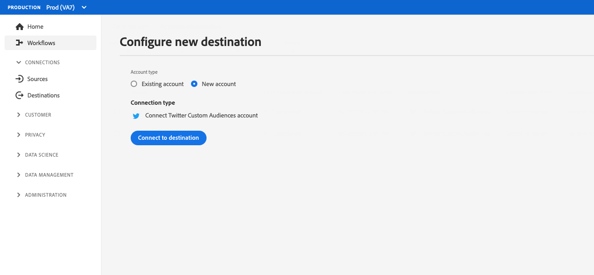

# Configuração de autenticação do cliente

O Experience Platform oferece grande flexibilidade nos protocolos de autenticação disponíveis para parceiros e clientes. Você pode configurar seu destino para suportar qualquer um dos métodos de autenticação padrão do setor, como [!DNL OAuth2], autenticação de token do portador, autenticação de senha e muito mais.

Esta página explica como configurar seu destino usando seu método de autenticação preferido. Com base na configuração de autenticação usada ao criar o destino, os clientes verão diferentes tipos de páginas de autenticação ao se conectarem ao destino na interface do Experience Platform.

Para entender onde esse componente se encaixa em uma integração criada com o Destination SDK, consulte o diagrama no [opções de configuração](../configuration-options.md) ou consulte as seguintes páginas de visão geral da configuração de destino:

* [Usar o Destination SDK para configurar um destino de transmissão](../../guides/configure-destination-instructions.md#create-destination-configuration)
* [Usar o Destination SDK para configurar um destino baseado em arquivo](../../guides/configure-file-based-destination-instructions.md#create-destination-configuration)

Antes de exportar dados da Platform para o seu destino, os clientes devem criar uma nova conexão entre o Experience Platform e o destino seguindo as etapas descritas no [conexão de destino](../../../ui/connect-destination.md) tutorial.

Quando [criação de um destino](../../authoring-api/destination-configuration/create-destination-configuration.md) por meio do Destination SDK, o `customerAuthenticationConfigurations` define o que os clientes veem na variável [tela de autenticação](../../../ui/connect-destination.md#authenticate). Dependendo do tipo de autenticação de destino, os clientes devem fornecer vários detalhes de autenticação, como:

* Para destinos que usam [autenticação básica](#basic), os usuários devem fornecer um nome de usuário e senha diretamente na página de autenticação da interface do usuário do Experience Platform.
* Para destinos que usam [autenticação do portador](#bearer), os usuários devem fornecer um token de portador.
* Para destinos que usam [Autorização OAuth2](#oauth2), os usuários são redirecionados para a página de logon do destino, na qual podem fazer logon com suas credenciais.
* Para [Amazon S3](#s3) destinos, os utilizadores devem fornecer os seus [!DNL Amazon S3] chave de acesso e chave secreta.
* Para [Azure Blob](#blob) destinos, os utilizadores devem fornecer os seus [!DNL Azure Blob] cadeia de conexão.

Você pode configurar os detalhes de autenticação do cliente por meio da `/authoring/destinations` terminal. Consulte as seguintes páginas de referência de API para obter exemplos detalhados de chamadas de API, onde é possível configurar os componentes mostrados nesta página.

* [Criar uma configuração de destino](../../authoring-api/destination-configuration/create-destination-configuration.md)
* [Atualizar uma configuração de destino](../../authoring-api/destination-configuration/update-destination-configuration.md)

Este artigo descreve todas as configurações de autenticação de cliente compatíveis que você pode usar para o seu destino e mostra o que os clientes verão na interface do usuário do Experience Platform com base no método de autenticação definido para o seu destino.

>[!IMPORTANT]
>
>A configuração de autenticação do cliente não exige a configuração de nenhum parâmetro. Você pode copiar e colar os trechos mostrados nesta página em suas chamadas de API quando [criando](../../authoring-api/destination-configuration/create-destination-configuration.md) ou [atualizando](../../authoring-api/destination-configuration/update-destination-configuration.md) Uma configuração de destino, e seus usuários verão a tela de autenticação correspondente na interface do usuário da Platform.

>[!IMPORTANT]
>
>Todos os nomes e valores de parâmetros compatíveis com o Destination SDK são **diferencia maiúsculas de minúsculas**. Para evitar erros de diferenciação entre maiúsculas e minúsculas, use os nomes e valores dos parâmetros exatamente como mostrado na documentação.

## Tipos de integração compatíveis {#supported-integration-types}

Consulte a tabela abaixo para obter detalhes sobre quais tipos de integrações suportam a funcionalidade descrita nesta página.

| Tipo de integração | Suporte à funcionalidade |
|---|---|
| Integrações em tempo real (streaming) | Sim |
| Integrações baseadas em arquivo (lote) | Sim |

## Configuração da regra de autenticação {#authentication-rule}

Ao usar qualquer uma das configurações de autenticação do cliente descritas nesta página, sempre defina o `authenticationRule` parâmetro em [entrega de destino](destination-delivery.md) para `"CUSTOMER_AUTHENTICATION"`, conforme mostrado abaixo.

```json {line-numbers="true" highlight="4"
{
   "destinationDelivery":[
      {
         "authenticationRule":"CUSTOMER_AUTHENTICATION",
         "destinationServerId":"{{destinationServerId}}"
      }
   ]
}
```

## Autenticação básica {#basic}

A autenticação básica é compatível com integrações em tempo real (transmissão) no Experience Platform.

Ao configurar o tipo de autenticação básica, os usuários devem inserir um nome de usuário e senha para se conectarem ao seu destino.


Para configurar a autenticação básica para o seu destino, configure o `customerAuthenticationConfigurations` por meio da `/destinations` como mostrado abaixo:

```json
"customerAuthenticationConfigurations":[
   {
      "authType":"BASIC"
   }
]
```

## Autenticação do portador {#bearer}

Ao configurar o tipo de autenticação de portador, os usuários precisam inserir o token de portador que obtêm do seu destino.


Para configurar a autenticação de tipo de portador para o seu destino, configure o `customerAuthenticationConfigurations` por meio da `/destinations` como mostrado abaixo:

```json
"customerAuthenticationConfigurations":[
   {
      "authType":"BEARER"
   }
]
```

## Autenticação OAuth 2 {#oauth2}

Os usuários selecionam **[!UICONTROL Conectar ao destino]** para acionar o fluxo de autenticação do OAuth 2 para o seu destino, como mostrado no exemplo abaixo para o destino de Públicos-alvo personalizados do Twitter. Para obter informações detalhadas sobre como configurar a autenticação OAuth 2 para o endpoint de destino, leia a seção dedicada [Página de autenticação OAuth 2 do Destination SDK](oauth2-authorization.md).



Para configurar [!DNL OAuth2] autenticação para seu destino, configure a variável `customerAuthenticationConfigurations` por meio da `/destinations` como mostrado abaixo:

```json
"customerAuthenticationConfigurations":[
   {
      "authType":"OAUTH2"
   }
]
```

## Autenticação Amazon S3 {#s3}

[!DNL Amazon S3] a autenticação é compatível com destinos baseados em arquivo no Experience Platform.

Ao configurar o tipo de autenticação do Amazon S3, os usuários precisam inserir suas credenciais S3.


Para configurar [!DNL Amazon S3] autenticação para seu destino, configure a variável `customerAuthenticationConfigurations` por meio da `/destinations` como mostrado abaixo:

```json
"customerAuthenticationConfigurations":[
   {
      "authType":"S3"
   }
]
```

## Autenticação do Azure Blob  {#blob}

[!DNL Azure Blob Storage] a autenticação é compatível com destinos baseados em arquivo no Experience Platform.

Ao configurar o tipo de autenticação Blob do Azure, os usuários são solicitados a inserir a cadeia de conexão.


Para configurar [!DNL Azure Blob] autenticação para seu destino, configure a variável `customerAuthenticationConfigurations` parâmetro no `/destinations` como mostrado abaixo:

```json
"customerAuthenticationConfigurations":[
   {
      "authType":"AZURE_CONNECTION_STRING"
   }
]
```

## [!DNL Azure Data Lake Storage] autenticação {#adls}

[!DNL Azure Data Lake Storage] a autenticação é compatível com destinos baseados em arquivo no Experience Platform.

Ao configurar o [!DNL Azure Data Lake Storage] tipo de autenticação, os usuários devem inserir as credenciais da Entidade de Serviço do Azure e suas informações de locatário.

![Renderização da interface com [!DNL Azure Data Lake Storage] autenticação](../../assets/functionality/destination-configuration/adls-authentication-ui.png)

Para configurar [!DNL Azure Data Lake Storage] (ADLS) para seu destino, configure a variável `customerAuthenticationConfigurations` parâmetro no `/destinations` como mostrado abaixo:

```json
"customerAuthenticationConfigurations":[
   {
      "authType":"AZURE_SERVICE_PRINCIPAL"
   }
]
```

## SFTP com autenticação de senha

[!DNL SFTP] a autenticação com senha é compatível com destinos baseados em arquivo no Experience Platform.

Ao configurar o SFTP com tipo de autenticação de senha, os usuários devem inserir o nome de usuário e a senha do SFTP, bem como o domínio e a porta SFTP (a porta padrão é 22).


Para configurar a autenticação SFTP com senha para o seu destino, configure o `customerAuthenticationConfigurations` parâmetro no `/destinations` como mostrado abaixo:

```json
"customerAuthenticationConfigurations":[
   {
      "authType":"SFTP_WITH_PASSWORD"
   }
]
```

## SFTP com autenticação de chave SSH

[!DNL SFTP] autenticação com [!DNL SSH] A chave é compatível com destinos baseados em arquivo no Experience Platform.

Ao configurar o SFTP com tipo de autenticação de chave SSH, os usuários precisam inserir o nome de usuário SFTP e a chave SSH, bem como o domínio e a porta SFTP (a porta padrão é 22).


Para configurar a autenticação SFTP com chave SSH para o seu destino, configure o `customerAuthenticationConfigurations` parâmetro no `/destinations` como mostrado abaixo:

```json
"customerAuthenticationConfigurations":[
   {
      "authType":"SFTP_WITH_SSH_KEY"
   }
]
```

## [!DNL Google Cloud Storage] autenticação {#gcs}

[!DNL Google Cloud Storage] a autenticação é compatível com destinos baseados em arquivo no Experience Platform.

Ao configurar o [!DNL Google Cloud Storage] tipo de autenticação, os usuários devem inserir seus [!DNL Google Cloud Storage] [!UICONTROL ID da chave de acesso] e [!UICONTROL chave de acesso secreta].


Para configurar [!DNL Google Cloud Storage] autenticação para seu destino, configure a variável `customerAuthenticationConfigurations` parâmetro no `/destinations` como mostrado abaixo:

```json
"customerAuthenticationConfigurations":[
   {
      "authType":"GOOGLE_CLOUD_STORAGE"
   }
]
```

## Próximas etapas {#next-steps}

Depois de ler este artigo, você terá uma melhor compreensão de como configurar a autenticação de usuário na sua plataforma de destino.

Para saber mais sobre os outros componentes de destino, consulte os seguintes artigos:

* [Autorização OAuth2](oauth2-authorization.md)
* [Campos de dados do cliente](customer-data-fields.md)
* [Atributos da interface](ui-attributes.md)
* [Configuração do esquema](schema-configuration.md)
* [Configuração do namespace de identidade](identity-namespace-configuration.md)
* [Configurações de mapeamento compatíveis](supported-mapping-configurations.md)
* [Entrega de destino](destination-delivery.md)
* [Configuração de metadados de público](audience-metadata-configuration.md)
* [Política de agregação](aggregation-policy.md)
* [Configuração em lote](batch-configuration.md)
* [Qualificações do perfil histórico](historical-profile-qualifications.md)
