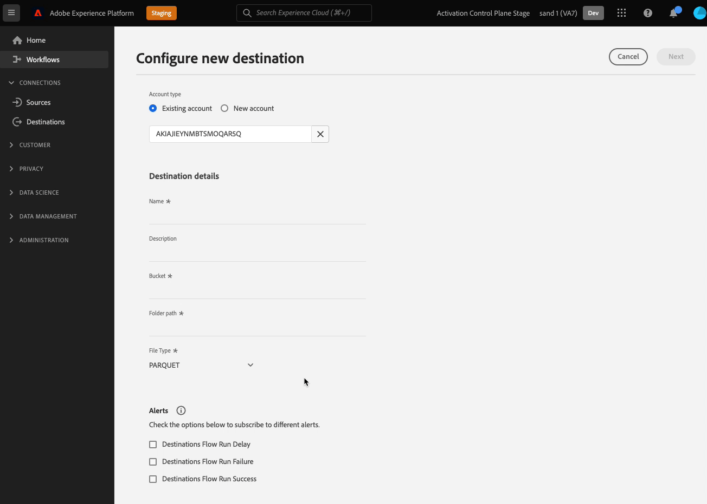

# Configurar a entrada do usuário por meio de campos de dados do cliente

Ao se conectar ao seu destino na interface do usuário do Experience Platform, talvez você precise que seus usuários forneçam detalhes de configuração específicos ou selecionem opções específicas que você disponibiliza para eles. No Destination SDK, essas opções são chamadas de campos de dados do cliente.

Para entender onde esse componente se encaixa em uma integração criada com o Destination SDK, consulte o diagrama no [opções de configuração](../configuration-options.md) ou consulte as seguintes páginas de visão geral da configuração de destino:

* [Usar o Destination SDK para configurar um destino de transmissão](../../guides/configure-destination-instructions.md#create-destination-configuration)
* [Usar o Destination SDK para configurar um destino baseado em arquivo](../../guides/configure-file-based-destination-instructions.md#create-destination-configuration)

## Casos de uso para campos de dados do cliente {#use-cases}

Use os campos de dados do cliente para uma variedade de casos de uso em que você precisa que os usuários insiram dados na interface do Experience Platform. Por exemplo, use campos de dados do cliente quando os usuários precisarem fornecer:

* Nomes e caminhos do bucket de armazenamento na nuvem, para destinos baseados em arquivos.
* O formato aceito pelos campos de dados do cliente.
* Tipos de compactação de arquivo disponíveis que os usuários podem selecionar.
* Listas de endpoints disponíveis para integrações em tempo real (transmissão).

É possível configurar campos de dados do cliente por meio da `/authoring/destinations` terminal. Consulte as seguintes páginas de referência de API para obter exemplos detalhados de chamadas de API, onde é possível configurar os componentes mostrados nesta página.

* [Criar uma configuração de destino](../../authoring-api/destination-configuration/create-destination-configuration.md)
* [Atualizar uma configuração de destino](../../authoring-api/destination-configuration/update-destination-configuration.md)

Este artigo descreve todos os tipos de configuração de campos de dados do cliente compatíveis que você pode usar para o seu destino e mostra o que os clientes verão na interface do usuário do Experience Platform.

>[!IMPORTANT]
>
>Todos os nomes e valores de parâmetros compatíveis com o Destination SDK são **diferencia maiúsculas de minúsculas**. Para evitar erros de diferenciação entre maiúsculas e minúsculas, use os nomes e valores dos parâmetros exatamente como mostrado na documentação.

## Tipos de integração compatíveis {#supported-integration-types}

Consulte a tabela abaixo para obter detalhes sobre quais tipos de integrações suportam a funcionalidade descrita nesta página.

| Tipo de integração | Suporte à funcionalidade |
|---|---|
| Integrações em tempo real (streaming) | Sim |
| Integrações baseadas em arquivo (lote) | Sim |

## Parâmetros compatíveis {#supported-parameters}

Ao criar seus próprios campos de dados do cliente, você pode usar os parâmetros descritos na tabela abaixo para configurar seu comportamento.

| Parâmetro | Tipo | Obrigatório / Opcional | Descrição |
|---------|----------|------|---|
| `name` | String | Obrigatório | Forneça um nome para o campo personalizado que você está introduzindo. Esse nome não está visível na interface do usuário da Platform, a menos que `title` está vazio ou ausente. |
| `type` | String | Obrigatório | Indica o tipo do campo personalizado que você está introduzindo. Valores aceitos: <ul><li>`string`</li><li>`object`</li><li>`integer`</li></ul> |
| `title` | String | Opcional | Indica o nome do campo, como é visto pelos clientes na interface do usuário da Platform. Se esse campo estiver vazio ou ausente, a interface herdará o nome do campo da `name` valor. |
| `description` | String | Opcional | Forneça uma descrição para o campo personalizado. Esta descrição não está visível na interface do usuário da Platform. |
| `isRequired` | Booleano | Opcional | Indica se os usuários devem fornecer um valor para esse campo no fluxo de trabalho de configuração de destino. |
| `pattern` | String | Opcional | Impõe um padrão para o campo personalizado, se necessário. Use expressões regulares para aplicar um padrão. Por exemplo, se as IDs do cliente não incluírem números ou sublinhados, insira `^[A-Za-z]+$` neste campo. |
| `enum` | String | Opcional | Renderiza o campo personalizado como um menu suspenso e lista as opções disponíveis para o usuário. |
| `default` | String | Opcional | Define o valor padrão a partir de um `enum` lista. |
| `hidden` | Booleano | Opcional | Indica se o campo de dados do cliente é mostrado na interface do usuário ou não. |
| `unique` | Booleano | Opcional | use esse parâmetro quando precisar criar um campo de dados do cliente cujo valor deve ser exclusivo em todos os fluxos de dados de destino configurados pela organização de um usuário. Por exemplo, o campo **[!UICONTROL Alias de integração]** no destino [Personalização individual](../../../catalog/personalization/custom-personalization.md) deve ser exclusivo, o que significa que dois fluxos de dados separados para esse destino não podem ter o mesmo valor nesse campo. |
| `readOnly` | Booleano | Opcional | Indica se o cliente pode ou não alterar o valor do campo. |

{style="table-layout:auto"}

No exemplo abaixo, a variável `customerDataFields` define dois campos que os usuários devem inserir na interface do Platform ao se conectarem ao destino:

* `Account ID`: uma ID de conta de usuário para a plataforma de destino.
* `Endpoint region`: o endpoint regional da API à qual eles se conectarão. A variável `enum` cria um menu suspenso com os valores definidos em disponíveis para os usuários selecionarem.

```json
"customerDataFields":[
   {
      "name":"accountID",
      "title":"User account ID",
      "description":"User account ID for the destination platform.",
      "type":"string",
      "isRequired":true
   },
   {
      "name":"region",
      "title":"API endpoint region",
      "description":"The API endpoint region that the user should connect to.",
      "type":"string",
      "isRequired":true,
      "enum":[
         "EU"
         "US",
      ],
      "readOnly":false,
      "hidden":false
   }
]
```

A experiência de interface do usuário resultante é mostrada na imagem abaixo.


## Nomes e descrições da conexão de destino {#names-description}

Ao criar um novo destino, o Destination SDK adiciona automaticamente **[!UICONTROL Nome]** e **[!UICONTROL Descrição]** à tela de conexão de destino na interface do usuário da Platform. Como você pode ver no exemplo acima, a variável **[!UICONTROL Nome]** e **[!UICONTROL Descrição]** os campos são renderizados na interface do usuário sem serem incluídos na configuração dos campos de dados do cliente.

>[!IMPORTANT]
>
>Se você adicionar **[!UICONTROL Nome]** e **[!UICONTROL Descrição]** na configuração dos campos de dados do cliente, os usuários os verão duplicados na interface do.

## Solicitar campos de dados do cliente {#ordering}

A ordem em que você adiciona os campos de dados do cliente na configuração de destino é refletida na interface do usuário da Platform.

Por exemplo, a configuração abaixo é refletida de acordo na interface do usuário, com as opções exibidas na ordem **[!UICONTROL Nome]**, **[!UICONTROL Descrição]**, **[!UICONTROL Nome do bloco]**, **[!UICONTROL Caminho da pasta]**, **[!UICONTROL Tipo de arquivo]**, **[!UICONTROL Formato de compactação]**.

```json
"customerDataFields":[
{
   "name":"bucketName",
   "title":"Bucket name",
   "description":"Amazon S3 bucket name",
   "type":"string",
   "isRequired":true,
   "pattern":"(?=^.{3,63}$)(?!^(\\d+\\.)+\\d+$)(^(([a-z0-9]|[a-z0-9][a-z0-9\\-]*[a-z0-9])\\.)*([a-z0-9]|[a-z0-9][a-z0-9\\-]*[a-z0-9])$)",
   "readOnly":false,
   "hidden":false
},
{
   "name":"path",
   "title":"Folder path",
   "description":"Enter the path to your S3 bucket folder",
   "type":"string",
   "isRequired":true,
   "pattern":"^[0-9a-zA-Z\\/\\!\\-_\\.\\*\\''\\(\\)]*((\\%SEGMENT_(NAME|ID)\\%)?\\/?)+$",
   "readOnly":false,
   "hidden":false
},
{
   "name":"fileType",
   "title":"File Type",
   "description":"Select the exported file type.",
   "type":"string",
   "isRequired":true,
   "readOnly":false,
   "hidden":false,
   "enum":[
      "csv",
      "json",
      "parquet"
   ],
   "default":"csv"
},
{
   "name":"compression",
   "title":"Compression format",
   "description":"Select the desired file compression format.",
   "type":"string",
   "isRequired":true,
   "readOnly":false,
   "enum":[
      "SNAPPY",
      "GZIP",
      "DEFLATE",
      "NONE"
   ]
}
]
```


## Agrupar campos de dados do cliente {#grouping}

Você pode agrupar vários campos de dados do cliente em uma seção. Ao configurar a conexão com o destino na interface do usuário do, os usuários podem ver e se beneficiar de um agrupamento visual de campos semelhantes.

Para fazer isso, use `"type": "object"` para criar o grupo e coletar os campos de dados do cliente desejados em um `properties` conforme mostrado na imagem abaixo, onde o agrupamento **[!UICONTROL Opções de CSV]** é realçado.

```json {line-numbers="true" highlight="6-28"}
"customerDataFields":[
   {
      "name":"csvOptions",
      "title":"CSV Options",
      "description":"Select your CSV options",
      "type":"object",
      "properties":[
         {
            "name":"delimiter",
            "title":"Delimiter",
            "description":"Select your Delimiter",
            "type":"string",
            "isRequired":false,
            "default":",",
            "namedEnum":[
               {
                  "name":"Comma (,)",
                  "value":","
               },
               {
                  "name":"Tab (\\t)",
                  "value":"\t"
               }
            ],
            "readOnly":false,
            "hidden":false
         }
      ]
   }
]
```


## Criar seletores suspensos para campos de dados do cliente {#dropdown-selectors}

Para situações em que você deseja permitir que os usuários selecionem entre várias opções, por exemplo, qual caractere deve ser usado para delimitar os campos em arquivos CSV, é possível adicionar campos suspensos à interface do usuário.

Para fazer isso, use o `namedEnum` conforme mostrado abaixo e configure um `default` para as opções que o usuário pode selecionar.

```json {line-numbers="true" highlight="15-24"}
"customerDataFields":[
   {
      "name":"csvOptions",
      "title":"CSV Options",
      "description":"Select your CSV options",
      "type":"object",
      "properties":[
         {
            "name":"delimiter",
            "title":"Delimiter",
            "description":"Select your Delimiter",
            "type":"string",
            "isRequired":false,
            "default":",",
            "namedEnum":[
               {
                  "name":"Comma (,)",
                  "value":","
               },
               {
                  "name":"Tab (\\t)",
                  "value":"\t"
               }
            ],
            "readOnly":false,
            "hidden":false
         }
      ]
   }
]
```


## Criar seletores suspensos dinâmicos para campos de dados do cliente {#dynamic-dropdown-selectors}

Para situações em que você deseja chamar dinamicamente uma API e usar a resposta para preencher dinamicamente as opções em um menu suspenso, é possível usar um seletor suspenso dinâmico.

Os seletores da lista suspensa dinâmica são idênticos aos [seletores de lista suspensa regular](#dropdown-selectors) na interface. A única diferença são os valores recuperados dinamicamente de uma API.

Para criar um seletor suspenso dinâmico, você deve configurar dois componentes:

**Etapa 1.** [Criar um servidor de destino](../../authoring-api/destination-server/create-destination-server.md#dynamic-dropdown-servers) com um `responseFields` para a chamada de API dinâmica, conforme mostrado abaixo.

```json
{
   "name":"Server for dynamic dropdown",
   "destinationServerType":"URL_BASED",
   "urlBasedDestination":{
      "url":{
         "templatingStrategy":"PEBBLE_V1",
         "value":" <--YOUR-API-ENDPOINT-PATH--> "
      }
   },
   "httpTemplate":{
      "httpMethod":"GET",
      "headers":[
         {
            "header":"Authorization",
            "value":{
               "templatingStrategy":"PEBBLE_V1",
               "value":"My Bearer Token"
            }
         },
         {
            "header":"x-integration",
            "value":{
               "templatingStrategy":"PEBBLE_V1",
               "value":"{{customerData.integrationId}}"
            }
         },
         {
            "header":"Accept",
            "value":{
               "templatingStrategy":"NONE",
               "value":"application/json"
            }
         }
      ]
   },
   "responseFields":[
      {
         "templatingStrategy":"PEBBLE_V1",
         "value":"   {{ {'list': list} | toJson | raw }}",
         "name":"list"
      }
   ]
}
```

**Etapa 2.** Use o `dynamicEnum` conforme mostrado abaixo. No exemplo abaixo, a variável `User` a lista suspensa é recuperada usando o servidor dinâmico.


```json {line-numbers="true" highlight="13-21"}
"customerDataFields": [
  {
    "name": "integrationId",
    "title": "Integration ID",
    "type": "string",
    "isRequired": true
  },
  {
    "name": "userId",
    "title": "User",
    "type": "string",
    "isRequired": true,
    "dynamicEnum": {
      "queryParams": [
        "integrationId"
      ],
      "destinationServerId": "<~dynamic-field-server-id~>",
      "authenticationRule": "CUSTOMER_AUTHENTICATION",
      "value": "$.list",
      "responseFormat": "NAME_VALUE"
    }
  }
]
```

Defina o `destinationServerId` parâmetro para a ID do servidor de destino criado na etapa 1. Você pode ver a ID do servidor de destino na resposta do [recuperar uma configuração do servidor de destino](../../authoring-api/destination-server/retrieve-destination-server.md) chamada à API.

## Criar campos condicionais de dados do cliente {#conditional-options}

É possível criar campos condicionais de dados do cliente, que são exibidos no fluxo de trabalho de ativação somente quando os usuários selecionam uma determinada opção.

Por exemplo, você pode criar opções condicionais de formatação de arquivo para serem exibidas somente quando os usuários selecionarem um tipo específico de exportação de arquivo.

A configuração abaixo cria um agrupamento condicional para opções de formatação de arquivo CSV. As opções do arquivo CSV são exibidas somente quando o usuário seleciona CSV como o tipo de arquivo desejado para exportação.

Para definir um campo como condicional, use o `conditional` conforme mostrado abaixo:

```json
"conditional": {
   "field": "fileType",
   "operator": "EQUALS",
   "value": "CSV"
}
```

Em um contexto mais amplo, você pode ver `conditional` que está sendo usado na configuração de destino abaixo, junto com o campo `fileType` e a variável `csvOptions` objeto no qual é definido.

```json {line-numbers="true" highlight="3-15, 21-25"}
"customerDataFields":[
   {
      "name":"fileType",
      "title":"File Type",
      "description":"Select your file type",
      "type":"string",
      "isRequired":true,
      "enum":[
         "PARQUET",
         "CSV",
         "JSON"
      ],
      "readOnly":false,
      "hidden":false
   },
   {
      "name":"csvOptions",
      "title":"CSV Options",
      "description":"Select your CSV options",
      "type":"object",
      "conditional":{
         "field":"fileType",
         "operator":"EQUALS",
         "value":"CSV"
      },
      "properties":[
         {
            "name":"delimiter",
            "title":"Delimiter",
            "description":"Select your Delimiter",
            "type":"string",
            "isRequired":false,
            "default":",",
            "namedEnum":[
               {
                  "name":"Comma (,)",
                  "value":","
               },
               {
                  "name":"Tab (\\t)",
                  "value":"\t"
               }
            ],
            "readOnly":false,
            "hidden":false
         },
         {
            "name":"quote",
            "title":"Quote Character",
            "description":"Select your Quote character",
            "type":"string",
            "isRequired":false,
            "default":"",
            "namedEnum":[
               {
                  "name":"Double Quotes (\")",
                  "value":"\""
               },
               {
                  "name":"Null Character (\u0000)",
                  "value":"\u0000"
               }
            ],
            "readOnly":false,
            "hidden":false
         },
         {
            "name":"escape",
            "title":"Escape Character",
            "description":"Select your Escape character",
            "type":"string",
            "isRequired":false,
            "default":"\\",
            "namedEnum":[
               {
                  "name":"Back Slash (\\)",
                  "value":"\\"
               },
               {
                  "name":"Single Quote (')",
                  "value":"'"
               }
            ],
            "readOnly":false,
            "hidden":false
         },
         {
            "name":"emptyValue",
            "title":"Empty Value",
            "description":"Select the output value of blank fields",
            "type":"string",
            "isRequired":false,
            "default":"",
            "namedEnum":[
               {
                  "name":"Empty String",
                  "value":""
               },
               {
                  "name":"\"\"",
                  "value":"\"\""
               },
               {
                  "name":"null",
                  "value":"null"
               }
            ],
            "readOnly":false,
            "hidden":false
         },
         {
            "name":"nullValue",
            "title":"Null Value",
            "description":"Select the output value of 'null' fields",
            "type":"string",
            "isRequired":false,
            "default":"null",
            "namedEnum":[
               {
                  "name":"Empty String",
                  "value":""
               },
               {
                  "name":"\"\"",
                  "value":"\"\""
               },
               {
                  "name":"null",
                  "value":"null"
               }
            ],
            "readOnly":false,
            "hidden":false
         }
      ],
      "isRequired":false,
      "readOnly":false,
      "hidden":false
   }
]
```

Abaixo, você pode ver a tela resultante da interface do usuário, com base na configuração acima. Quando o usuário seleciona o tipo de arquivo CSV, opções adicionais de formatação de arquivo referentes ao tipo de arquivo CSV são exibidas na interface.



## Acesso a campos de dados de clientes modelados {#accessing-templatized-fields}

Quando seu destino requer entrada do usuário, você deve fornecer uma seleção de campos de dados do cliente aos usuários, que eles podem preencher por meio da interface do usuário da Platform. Em seguida, você deve configurar o servidor de destino para ler corretamente a entrada do usuário nos campos de dados do cliente. Isso é feito por meio de campos de modelo.

Campos modelados usam o formato `{{customerData.fieldName}}`, onde `fieldName` é o nome do campo de dados do cliente do qual você está lendo informações. Todos os campos de dados de clientes modelados são precedidos por `customerData.` e entre chaves duplas `{{ }}`.

Por exemplo, considere a seguinte configuração de destino do Amazon S3:

```json
"customerDataFields":[
   {
      "name":"bucketName",
      "title":"Enter the name of your Amazon S3 bucket",
      "description":"Amazon S3 bucket name",
      "type":"string",
      "isRequired":true,
      "pattern":"(?=^.{3,63}$)(?!^(\\d+\\.)+\\d+$)(^(([a-z0-9]|[a-z0-9][a-z0-9\\-]*[a-z0-9])\\.)*([a-z0-9]|[a-z0-9][a-z0-9\\-]*[a-z0-9])$)",
      "readOnly":false,
      "hidden":false
   },
   {
      "name":"path",
      "title":"Enter the path to your S3 bucket folder",
      "description":"Enter the path to your S3 bucket folder",
      "type":"string",
      "isRequired":true,
      "pattern":"^[0-9a-zA-Z\\/\\!\\-_\\.\\*\\''\\(\\)]*((\\%SEGMENT_(NAME|ID)\\%)?\\/?)+$",
      "readOnly":false,
      "hidden":false
   }
]
```

Essa configuração solicita que os usuários insiram seus [!DNL Amazon S3] nome do bucket e caminho da pasta nos respectivos campos de dados do cliente.

Para que o Experience Platform se conecte corretamente a [!DNL Amazon S3], seu servidor de destino deve ser configurado para ler os valores desses dois campos de dados do cliente, conforme mostrado abaixo:

```json
 "fileBasedS3Destination":{
      "bucketName":{
         "templatingStrategy":"PEBBLE_V1",
         "value":"{{customerData.bucketName}}"
      },
      "path":{
         "templatingStrategy":"PEBBLE_V1",
         "value":"{{customerData.path}}"
      }
   }
```

Os valores de modelo `{{customerData.bucketName}}` e `{{customerData.path}}` leia os valores fornecidos pelo usuário para que o Experience Platform possa se conectar com êxito à plataforma de destino.

Para obter mais informações sobre como configurar o servidor de destino para ler campos de modelo, consulte a documentação em [campos embutidos em código versus campos de modelo](../destination-server/server-specs.md#templatized-fields).

## Próximas etapas {#next-steps}

Depois de ler este artigo, você deve entender melhor como permitir que os usuários insiram informações na interface do usuário do Experience Platform por meio de campos de dados do cliente. Agora você também sabe como selecionar o campo de dados correto do cliente para seu caso de uso e configurar, solicitar e agrupar campos de dados do cliente na interface do usuário da plataforma.

Para saber mais sobre os outros componentes de destino, consulte os seguintes artigos:

* [Autenticação do cliente](customer-authentication.md)
* [Autenticação OAuth2](oauth2-authorization.md)
* [Atributos da interface](ui-attributes.md)
* [Configuração do esquema](schema-configuration.md)
* [Configuração do namespace de identidade](identity-namespace-configuration.md)
* [Configurações de mapeamento compatíveis](supported-mapping-configurations.md)
* [Entrega de destino](destination-delivery.md)
* [Configuração de metadados de público](audience-metadata-configuration.md)
* [Política de agregação](aggregation-policy.md)
* [Configuração em lote](batch-configuration.md)
* [Qualificações do perfil histórico](historical-profile-qualifications.md)
