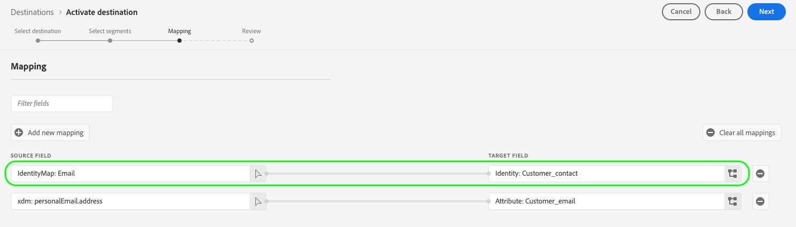

# Configurações de mapeamento compatíveis

Os destinos criados com Destination SDK suportam configurações específicas de mapeamento de atributo e namespace de identidade, com base no tipo de destino.

Este artigo descreve todas as configurações de mapeamento compatíveis que você pode usar ao configurar seu destino.

>[!WARNING]
>
>Qualquer configuração de mapeamento não descrita neste artigo não é suportada pelo Destination SDK.

Ao criar seu destino, configure seu esquema e namespace de identidade de acordo com uma das configurações de mapeamento descritas nesta página.

>[!IMPORTANT]
>
>Todos os nomes e valores de parâmetros compatíveis com o Destination SDK são **diferencia maiúsculas de minúsculas**. Para evitar erros de diferenciação entre maiúsculas e minúsculas, use os nomes e valores dos parâmetros exatamente como mostrado na documentação.

## Mapeamentos compatíveis para destinos de streaming {#streaming-mappings}

Os destinos em tempo real (transmissão) criados com o Destination SDK são compatíveis com as configurações de mapeamento descritas na tabela abaixo.

| Campo de origem | Campo de destino |
| --- | --- |
| Atributo XDM | Atributo personalizado |
| Namespace de identidade | Namespace de identidade |

O exemplo de configuração abaixo permite que os clientes usem ambos os mapeamentos na tabela acima.

```json
"schemaConfig":{
   "profileRequired":true,
   "segmentRequired":true,
   "identityRequired":true
},
"identityNamespaces":{
   "Customer_contact":{
      "acceptsAttributes":false,
      "acceptsCustomNamespaces":true,
      "acceptedGlobalNamespaces":{
         "Email":{
            
         },
         "Phone":{
            
         }
      }
   }
},
```

### Mapear atributos XDM para atributos personalizados {#streaming-xdm-to-custom}

Os usuários podem mapear atributos de seu perfil XDM de origem para atributos personalizados no lado do destino.

Os usuários devem inserir manualmente o nome do atributo personalizado de destino ao selecionar o mapeamento do campo de destino.


A experiência de interface do usuário resultante é mostrada na imagem abaixo.


### Mapear namespaces de identidade para namespaces de identidade de parceiro {#streaming-identity-to-identity}

Os usuários podem mapear namespaces de identidade personalizados ou globais da Platform para namespaces de identidade definidos por você.

A experiência de interface do usuário resultante é mostrada na imagem abaixo.



## Mapeamentos compatíveis com destinos baseados em arquivo {#batch-mappings}

Os destinos baseados em arquivo criados com o Destination SDK são compatíveis com as configurações de mapeamento descritas na tabela abaixo. Consulte as próximas seções para obter exemplos de mapeamento detalhado.

| Campo de origem | Campo de destino |
| --- | --- |
| Atributo XDM | Atributo / Atributo personalizado |
| Namespace de identidade | Atributo / Atributo personalizado |
| Namespace de identidade | Namespace de identidade |

O exemplo de configuração abaixo permite que os clientes usem todos os mapeamentos da tabela acima.

```json
"schemaConfig":{
   "profileRequired":true,
   "segmentRequired":true,
   "identityRequired":true
},
"identityNamespaces":{
   "Customer_contact":{
      "acceptsAttributes":false,
      "acceptsCustomNamespaces":true,
      "acceptedGlobalNamespaces":{
         "Email":{
         },
         "Phone":{
         }
      }
   }
},
```

### Mapear atributos XDM para atributos personalizados {#batch-xdm-to-custom}

Os usuários podem mapear atributos de seu perfil XDM de origem para atributos personalizados no lado do destino.

Para destinos baseados em arquivo, o campo de destino é preenchido automaticamente com um atributo padrão de mesmo nome do campo de origem.

A experiência de interface do usuário resultante é mostrada na imagem abaixo.


Os usuários podem deixar o nome padrão definido ou inserir um nome de atributo personalizado na tela de seleção de campo de destino.


### Mapear namespaces de identidade para atributos personalizados {#batch-identity-to-custom}

Os usuários podem mapear namespaces de identidade personalizados ou globais da Platform para atributos personalizados no lado do destino.

Ao selecionar um namespace de identidade como um campo de origem, o campo de destino é preenchido automaticamente com um namespace de identidade equivalente. Para substituir o campo de destino por um atributo personalizado, os usuários devem inserir um nome de atributo personalizado na tela de seleção de campo de destino.


A experiência de interface do usuário resultante é mostrada na imagem abaixo.


### Mapear namespaces de identidade para namespaces de identidade de parceiro {#batch-identity-to-identity}

Os usuários podem mapear namespaces de identidade personalizados ou globais da Platform para namespaces de identidade equivalentes.

Ao selecionar um namespace de identidade como um campo de origem, o campo de destino é preenchido automaticamente com um namespace de identidade equivalente.

A experiência de interface do usuário resultante é mostrada na imagem abaixo.


## Próximas etapas {#next-steps}

Depois de ler este artigo, você deverá entender melhor quais mapeamentos são compatíveis com os destinos criados com o Destination SDK.

Para saber mais sobre os outros componentes de destino, consulte os seguintes artigos:

* [Autenticação do cliente](customer-authentication.md)
* [Autenticação OAuth2](oauth2-authentication.md)
* [Campos de dados do cliente](customer-data-fields.md)
* [Atributos da interface](ui-attributes.md)
* [Configuração do esquema](schema-configuration.md)
* [Configuração do namespace de identidade](identity-namespace-configuration.md)
* [Entrega de destino](destination-delivery.md)
* [Configuração de metadados de público](audience-metadata-configuration.md)
* [Política de agregação](aggregation-policy.md)
* [Configuração em lote](batch-configuration.md)
* [Qualificações do perfil histórico](historical-profile-qualifications.md)
