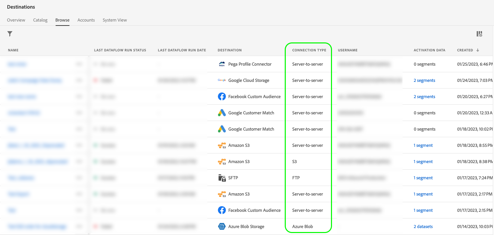

# Atributos da interface

Os atributos da interface definem os elementos visuais que o Adobe deve exibir para o cartão de destino na interface do usuário do Adobe Experience Platform, como o logotipo da plataforma de destino, um link para a página de documentação, uma descrição do destino e sua categoria e tipo.

Para entender onde esse componente se encaixa em uma integração criada com o Destination SDK, consulte o diagrama no [opções de configuração](../configuration-options.md) ou consulte as seguintes páginas de visão geral da configuração de destino:

* [Usar o Destination SDK para configurar um destino de transmissão](../../guides/configure-destination-instructions.md#create-destination-configuration)
* [Usar o Destination SDK para configurar um destino baseado em arquivo](../../guides/configure-file-based-destination-instructions.md#create-destination-configuration)

Quando [criação de um destino](../../authoring-api/destination-configuration/create-destination-configuration.md) por meio do Destination SDK, o `uiAttributes` define as seguintes propriedades visuais do cartão de destino:

* O URL da página de documentação de destino no [catálogo de destino](../../../catalog/overview.md).
* O URL no qual você hospedou o ícone a ser exibido no cartão do catálogo de destinos.
* A categoria em que o destino estará visível na interface do usuário da Platform.
* A frequência de exportação de dados para seu destino.
* O tipo de conexão de destino, como Amazon S3, Azure Blob etc.

É possível configurar atributos de interface do usuário por meio da `/authoring/destinations` terminal. Consulte as seguintes páginas de referência de API para obter exemplos detalhados de chamadas de API, onde é possível configurar os componentes mostrados nesta página.

* [Criar uma configuração de destino](../../authoring-api/destination-configuration/create-destination-configuration.md)
* [Atualizar uma configuração de destino](../../authoring-api/destination-configuration/update-destination-configuration.md)

Este artigo descreve todos os atributos de interface do usuário compatíveis que você pode usar para o seu destino e mostra o que os clientes verão na interface do usuário do Experience Platform.


>[!IMPORTANT]
>
>Todos os nomes e valores de parâmetros compatíveis com o Destination SDK são **diferencia maiúsculas de minúsculas**. Para evitar erros de diferenciação entre maiúsculas e minúsculas, use os nomes e valores dos parâmetros exatamente como mostrado na documentação.

## Tipos de integração compatíveis {#supported-integration-types}

Consulte a tabela abaixo para obter detalhes sobre quais tipos de integrações suportam a funcionalidade descrita nesta página.

| Tipo de integração | Suporte à funcionalidade |
|---|---|
| Integrações em tempo real (streaming) | Sim |
| Integrações baseadas em arquivo (lote) | Sim |

## Parâmetros compatíveis {#supported-parameters}

```json
"uiAttributes":{
      "documentationLink":"http://www.adobe.com/go/YOURDESTINATION-en",
      "category":"cloudStorage",
      "connectionType":"S3",
      "frequency":"batch",
      "isBeta":"true"
   }
```

### `documentationLink` {#documentation-link}

`documentationLink` é um parâmetro de string que se refere à página da documentação no [Catálogo de destinos](../../../catalog/overview.md) para o seu destino. Cada destino do produto no Adobe Experience Platform deve ter uma página de documentação correspondente. [Saiba como criar uma página de documentação de destino](../../docs-framework/documentation-instructions.md) para o seu destino. Observe que isso não é necessário para destinos privados/personalizados.

Usar o seguinte formato: `http://www.adobe.com/go/destinations-YOURDESTINATION-en`, onde `YOURDESTINATION` é o nome do seu destino. Para um destino chamado Moviestar, você usaria `http://www.adobe.com/go/destinations-moviestar-en`.

Os usuários podem ver e visitar o link da documentação na página do catálogo de destinos na interface do. Eles precisam navegar até o cartão de destino e selecionar **[!UICONTROL Mais ações]** e depois **[!UICONTROL Exibir documentação]**, conforme mostrado na imagem abaixo.


>[!NOTE]
>
>Esse link funciona somente depois que o Adobe definir seu destino como ativo e a documentação for publicada.

### `category` {#category}

`category` é um parâmetro de string que se refere à categoria atribuída ao destino no Adobe Experience Platform. Para obter mais informações, leia [Categorias de destino](../../../destination-types.md). Use um dos seguintes valores: `adobeSolutions, advertising, analytics, cdp, cloudStorage, crm, customerSuccess, database, dmp, ecommerce, email, emailMarketing, enrichment, livechat, marketingAutomation, mobile, personalization, protocols, social, streaming, subscriptions, surveys, tagManagers, voc, warehouses, payments`.

Os usuários podem ver a lista de categorias de destino no lado esquerdo da tela no catálogo de destino, como mostrado na imagem abaixo.


<!-- ### `iconUrl` {#icon-url}

`iconUrl` is a string parameter that refers to the URL where you hosted the icon to be displayed in the destinations catalog card. For private custom integrations, this is not required. For productized configurations, you need to share an icon with the Adobe team when you [submit the destination for review](../../guides/submit-destination.md#logo).

Users can see the icon on your destination card, as shown in the image below.

 -->

### `connectionType` {#connection-type}

`connectionType` é um parâmetro de string que se refere ao tipo de conexão, dependendo do destino. Valores compatíveis: <ul><li>`Server-to-server`</li><li>`Cloud storage`</li><li>`Azure Blob`</li><li>`Azure Data Lake Storage`</li><li>`S3`</li><li>`SFTP`</li><li>`DLZ`</li></ul>

Os usuários podem ver o tipo de conexão de destino no [Procurar](../../../ui/destinations-workspace.md#browse) do espaço de trabalho de destinos.



### `frequency` {#frequency}

`frequency` é um parâmetro de string que se refere ao tipo de exportação de dados aceito pelo seu destino. Defina como `Streaming` para integrações baseadas em API, ou `Batch` ao exportar arquivos para seus destinos.

Os usuários podem ver o tipo de frequência no **[!UICONTROL O fluxo de dados é executado]** de cada conexão de destino.


### `isBeta` {#isbeta}

Se o destino que você está criando com o Destination SDK estiver disponível para um número limitado de clientes, talvez você queira marcar o cartão de destino do catálogo de destino como beta.

Para fazer isso, você pode usar o `isBeta: "true"` na seção Atributos da interface da configuração de destino para marcar o cartão de destino adequadamente.


## Próximas etapas {#next-steps}

Depois de ler este artigo, você deve entender melhor quais atributos de interface do usuário você pode configurar para seu destino e onde os usuários os verão na interface do usuário da Platform.

Para saber mais sobre os outros componentes de destino, consulte os seguintes artigos:

* [Autenticação do cliente](customer-authentication.md)
* [Autorização OAuth2](oauth2-authorization.md)
* [Campos de dados do cliente](customer-data-fields.md)
* [Configuração do esquema](schema-configuration.md)
* [Configuração do namespace de identidade](identity-namespace-configuration.md)
* [Entrega de destino](destination-delivery.md)
* [Configuração de metadados de público](audience-metadata-configuration.md)
* [Política de agregação](aggregation-policy.md)
* [Configuração em lote](batch-configuration.md)
* [Qualificações do perfil histórico](historical-profile-qualifications.md)
