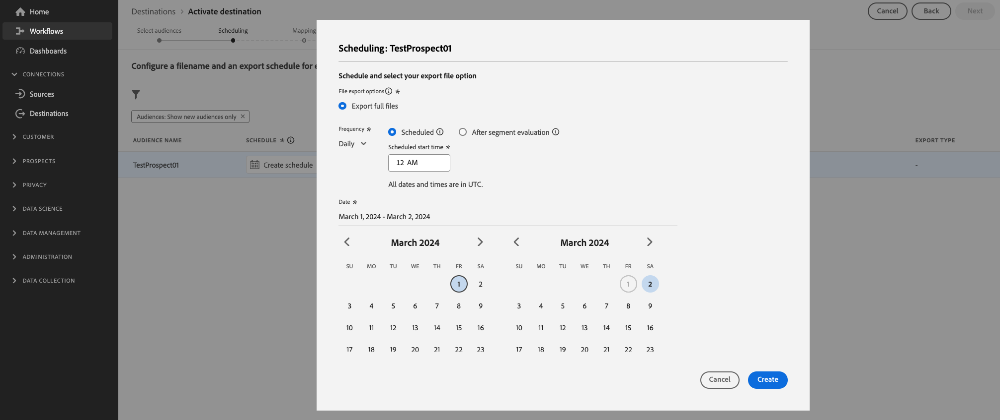

# Configurar um destino baseado em arquivo para exportar públicos-alvo potenciais para um local de armazenamento

## Visão geral {#overview}

Esta página descreve como usar o Destination SDK para configurar um destino baseado em arquivo com [opções de formatação de arquivo](configure-file-formatting-options.md) personalizadas e uma [configuração de nome de arquivo](../../functionality/destination-configuration/batch-configuration.md#file-name-configuration) personalizada para exportar [públicos-alvo em potencial](/help/destinations/ui/activate-prospect-audiences.md). Os exemplos neste guia descrevem como exportar públicos-alvo de perfis de prospecto para um local do Amazon S3.

Você também pode configurar o STFP ou outros locais de armazenamento para exportar públicos-alvo em potencial. A parte importante a ser lembrada é adicionar o trecho abaixo à configuração de destino em [etapa 2](#create-destination-configuration) para habilitar o fluxo de trabalho [para exportar públicos-alvo em potencial](/help/destinations/ui/activate-prospect-audiences.md) para o destino.

```json
  "sources": [
    "UNIFIED_PROFILE_PROSPECTS"
  ],
```

Para obter descrições detalhadas dos parâmetros usados abaixo, consulte [opções de configuração no SDK de Destinos](../../functionality/configuration-options.md).

## Pré-requisitos {#prerequisites}

Antes de seguir para as etapas descritas abaixo, leia a página [introdução](../../getting-started.md) do Destination SDK para obter informações sobre como obter as credenciais de autenticação necessárias e outros pré-requisitos para trabalhar com as APIs do Destination SDK.

## Etapa 1: criar uma configuração de servidor e arquivo {#create-server-file-configuration}

Comece usando o ponto de extremidade `/destination-server` para [criar uma configuração de servidor e arquivo](../../authoring-api/destination-server/create-destination-server.md).

**Formato da API**

```http
POST platform.adobe.io/data/core/activation/authoring/destination-servers
```

**Solicitação**

A solicitação a seguir cria uma nova configuração do servidor de destino, configurada pelos parâmetros fornecidos na carga.
A carga abaixo inclui uma configuração genérica do Amazon S3, com parâmetros de configuração personalizados [formatação de arquivo CSV](../../functionality/destination-server/file-formatting.md) que os usuários podem definir na interface do Experience Platform.

```shell
curl -X POST https://platform.adobe.io/data/core/activation/authoring/destination-server \
 -H 'Authorization: Bearer {ACCESS_TOKEN}' \
 -H 'Content-Type: application/json' \
 -H 'x-gw-ims-org-id: {ORG_ID}' \
 -H 'x-api-key: {API_KEY}' \
 -H 'x-sandbox-name: {SANDBOX_NAME}' \
 -d ' {
   "name":"Amazon S3 destination server with custom file formatting options",
   "destinationServerType":"FILE_BASED_S3",
   "fileBasedS3Destination":{
      "bucket":{
         "templatingStrategy":"PEBBLE_V1",
         "value":"{{customerData.bucketName}}"
      },
      "path":{
         "templatingStrategy":"PEBBLE_V1",
         "value":"{{customerData.path}}"
      }
   },
   "fileConfigurations":{
      "compression":{
         "templatingStrategy":"PEBBLE_V1",
         "value":"{{customerData.compression}}"
      },
      "fileType":{
         "templatingStrategy":"PEBBLE_V1",
         "value":"{{customerData.fileType}}"
      },
      "csvOptions":{
         "sep":{
            "templatingStrategy":"PEBBLE_V1",
            "value":"{{customerData.sep}}"
         },
         "encoding":{
            "templatingStrategy":"PEBBLE_V1",
            "value":"{{customerData.encoding}}"
         },
         "quote":{
            "templatingStrategy":"PEBBLE_V1",
            "value":"{{customerData.quote}}"
         },
         "quoteAll":{
            "templatingStrategy":"PEBBLE_V1",
            "value":"{{customerData.quoteAll}}"
         },
         "escape":{
            "templatingStrategy":"PEBBLE_V1",
            "value":"{{customerData.escape}}"
         },
         "escapeQuotes":{
            "templatingStrategy":"PEBBLE_V1",
            "value":"{{customerData.escapeQuotes}}"
         },
         "header":{
            "templatingStrategy":"PEBBLE_V1",
            "value":"{{customerData.header}}"
         },
         "ignoreLeadingWhiteSpace":{
            "templatingStrategy":"PEBBLE_V1",
            "value":"{{customerData.ignoreLeadingWhiteSpace}}"
         },
         "nullValue":{
            "templatingStrategy":"PEBBLE_V1",
            "value":"{{customerData.nullValue}}"
         },
         "dateFormat":{
            "templatingStrategy":"PEBBLE_V1",
            "value":"{{customerData.dateFormat}}"
         },
         "charToEscapeQuoteEscaping":{
            "templatingStrategy":"PEBBLE_V1",
            "value":"{{customerData.charToEscapeQuoteEscaping}}"
         },
         "emptyValue":{
            "templatingStrategy":"PEBBLE_V1",
            "value":"{{customerData.dateFormat}}"
         }
      }
   }
}'
```

Uma resposta bem-sucedida retorna a nova configuração do servidor de destino, incluindo o identificador exclusivo (`instanceId`) da configuração. Armazene esse valor conforme necessário na próxima etapa.

## Etapa 2: Criar configuração de destino {#create-destination-configuration}

Depois de criar o servidor de destino e a configuração de formatação de arquivo na etapa anterior, você pode usar o ponto de extremidade da API `/destinations` para criar uma configuração de destino.

Para conectar a configuração do servidor na [etapa 1](#create-server-file-configuration) a esta configuração de destino, substitua o valor `destinationServerId` na solicitação de API abaixo pelo valor obtido ao criar o servidor de destino na [etapa 1](#create-server-file-configuration).

**Formato da API**

```http
POST platform.adobe.io/data/core/activation/authoring/destinations
```

**Solicitação**

```shell
curl -X POST https://platform.adobe.io/data/core/activation/authoring/destinations \
 -H 'Authorization: Bearer {ACCESS_TOKEN}' \
 -H 'Content-Type: application/json' \
 -H 'x-gw-ims-org-id: {ORG_ID}' \
 -H 'x-api-key: {API_KEY}' \
 -H 'x-sandbox-name: {SANDBOX_NAME}' \
 -d '
{
   "name":"Amazon S3 destination to export prospect audiences",
   "description":"Amazon S3 destination to export prospect audiences",
   "status":"TEST",
   "sources": [
    "UNIFIED_PROFILE_PROSPECTS"
   ],
   "customerAuthenticationConfigurations":[
      {
         "authType":"S3"
      }
   ],
   "customerEncryptionConfigurations":[
      
   ],
   "customerDataFields":[
      {
         "name":"bucketName",
         "title":"Enter the name of your Amazon S3 bucket",
         "description":"Amazon S3 bucket name",
         "type":"string",
         "isRequired":true,
         "pattern": "(?=^.{3,63}$)(?!^(\\d+\\.)+\\d+$)(^(([a-z0-9]|[a-z0-9][a-z0-9\\-]*[a-z0-9])\\.)*([a-z0-9]|[a-z0-9][a-z0-9\\-]*[a-z0-9])$)",
         "readOnly":false,
         "hidden":false
      },
      {
         "name":"path",
         "title":"Enter the path to your S3 bucket folder",
         "description":"Enter the path to your S3 bucket folder",
         "type":"string",
         "isRequired":true,
         "pattern": "^[0-9a-zA-Z\\/\\!\\-_\\.\\*\\''\\(\\)]*((\\%SEGMENT_(NAME|ID)\\%)?\\/?)+$",
         "readOnly":false,
         "hidden":false
      },
      {
         "name":"sep",
         "title":"Enter your desired separator for each field and value",
         "description":"Enter your desired separator for each field and value",
         "type":"string",
         "isRequired":false,
         "readOnly":false,
         "hidden":false
      },
      {
         "name":"encoding",
         "title":"Select the desired CSV file encoding",
         "description":"Select the desired CSV file encoding",
         "type":"string",
         "enum":[
            "UTF-8",
            "UTF-16"
         ],
         "isRequired":false,
         "readOnly":false,
         "hidden":false
      },
      {
         "name":"quote",
         "title":"Quoted values escape character",
         "description":"Enter the desired character to be used for escaping quoted values.",
         "type":"string",
         "isRequired":false,
         "readOnly":false,
         "hidden":false
      },
      {
         "name":"quoteAll",
         "title":"Escape all quoted values",
         "description":"Select whether to escape all quoted values.",
         "type":"string",
         "enum":[
            "true",
            "false"
         ],
         "default":"true",
         "isRequired":true,
         "readOnly":false,
         "hidden":false
      },
      {
         "name":"escape",
         "title":"Quote escaping character",
         "description":"Enter the desired character to be used for escaping quotes inside an already quoted value.",
         "type":"string",
         "isRequired":false,
         "readOnly":false,
         "hidden":false
      },
      {
         "name":"escapeQuotes",
         "title":"Enclose quoted values within quotes",
         "description":"Select whether values containing quotes should always be enclosed in quotes.",
         "type":"string",
         "enum":[
            "true",
            "false"
         ],
         "isRequired":false,
         "default":"true",
         "readOnly":false,
         "hidden":false
      },
      {
         "name":"header",
         "title":"Generate file header.",
         "description":"Select whether to write the names of columns as the first line of the exported files.",
         "type":"string",
         "isRequired":false,
         "enum":[
            "true",
            "false"
         ],
         "readOnly":false,
         "default":"true",
         "hidden":false
      },
      {
         "name":"ignoreLeadingWhiteSpace",
         "title":"Ignore leading white space",
         "description":"Select whether leading whitespaces should be trimmed from exported values.",
         "type":"string",
         "isRequired":false,
         "enum":[
            "true",
            "false"
         ],
         "readOnly":false,
         "default":"true",
         "hidden":false
      },
      {
         "name":"nullValue",
         "title":"NULL value string format",
         "description":"Enter the string representation of a NULL value. ",
         "type":"string",
         "isRequired":false,
         "readOnly":false,
         "hidden":false
      },
      {
         "name":"dateFormat",
         "title":"Date format",
         "description":"Enter the desired date format. ",
         "type":"string",
         "default":"yyyy-MM-dd",
         "isRequired":false,
         "readOnly":false,
         "hidden":false
      },
      {
         "name":"charToEscapeQuoteEscaping",
         "title":"Quote escaping escape character",
         "description":"Enter the desired character to be used for escaping the escaping of a quote character.",
         "type":"string",
         "isRequired":false,
         "readOnly":false,
         "hidden":false
      },
      {
         "name":"emptyValue",
         "title":"Empty value string format",
         "description":"Enter the string representation of an empty value.",
         "type":"string",
         "isRequired":false,
         "readOnly":false,
         "default":"",
         "hidden":false
      },
      {
         "name":"compression",
         "title":"Compression format",
         "description":"Select the desired file compression format.",
         "type":"string",
         "isRequired":true,
         "readOnly":false,
         "enum":[
            "SNAPPY",
            "GZIP",
            "DEFLATE",
            "NONE"
         ]
      },
      {
         "name":"fileType",
         "title":"File type",
         "description":"Select the exported file type.",
         "type":"string",
         "isRequired":true,
         "readOnly":false,
         "hidden":false,
         "enum":[
            "csv",
            "json",
            "parquet"
         ],
         "default":"csv"
      }
   ],
   "uiAttributes":{
      "documentationLink":"https://www.adobe.com/go/destinations-amazon-s3-en",
      "category":"cloudStorage",
      "connectionType":"S3",
      "flowRunsSupported":true,
      "monitoringSupported":true,
      "frequency":"Batch"
   },
   "destinationDelivery":[
      {
         "deliveryMatchers":[
            {
               "type":"SOURCE",
               "value":[
                  "batch"
               ]
            }
         ],
         "authenticationRule":"CUSTOMER_AUTHENTICATION",
         "destinationServerId":"{{destinationServerId}}"
      }
   ],
   "schemaConfig":{
      "profileRequired":true,
      "segmentRequired":true,
      "identityRequired":true
   },
   "batchConfig":{
      "allowMandatoryFieldSelection":true,
      "allowDedupeKeyFieldSelection":true,
      "defaultExportMode":"DAILY_FULL_EXPORT",
      "allowedExportMode":[
         "DAILY_FULL_EXPORT"
      ],
      "allowedScheduleFrequency":[
         "DAILY",
         "ONCE"
      ],
      "defaultFrequency":"DAILY",
      "defaultStartTime":"00:00",
      "filenameConfig":{
         "allowedFilenameAppendOptions":[
            "SEGMENT_NAME",
            "DESTINATION_INSTANCE_ID",
            "DESTINATION_INSTANCE_NAME",
            "ORGANIZATION_NAME",
            "SANDBOX_NAME",
            "DATETIME",
            "CUSTOM_TEXT"
         ],
         "defaultFilenameAppendOptions":[
            "DATETIME"
         ],
         "defaultFilename":"%DESTINATION%_%SEGMENT_ID%"
      },
      "backfillHistoricalProfileData":true
   }
}'
```

Uma resposta bem-sucedida retorna a nova configuração de destino, incluindo o identificador exclusivo (`instanceId`) da configuração. Armazene esse valor como ele é necessário se você precisar fazer mais solicitações HTTP para atualizar sua configuração de destino.

## Etapa 3: verificar a interface do usuário do Experience Platform {#verify-ui}

Com base nas configurações acima, o catálogo de Experience Platform agora exibirá um novo cartão de destino privado para você usar.


Nas imagens e gravações abaixo, observe como as opções no [fluxo de trabalho de ativação para destinos baseados em arquivo](../../../ui/activate-batch-profile-destinations.md) correspondem às opções selecionadas na configuração de destino.

Ao preencher detalhes sobre o destino, observe como os campos exibidos são os campos de dados personalizados configurados na configuração do.

>[!TIP]
>
>A ordem em que você adiciona os campos de dados personalizados à configuração de destino não é refletida na interface do usuário do. Os campos de dados personalizados são sempre exibidos na ordem exibida na gravação de tela abaixo.


Ao agendar intervalos de exportação, observe como os campos exibidos são os campos configurados na configuração `batchConfig`.


Ao exibir as opções de configuração de nome de arquivo, observe como os campos exibidos representam as `filenameConfig` opções que você configurou na configuração.


Se quiser ajustar qualquer um dos campos mencionados acima, repita as [etapas um](#create-server-file-configuration) e [dois](#create-destination-configuration) para modificar as configurações de acordo com suas necessidades.

## Etapa 4: (opcional) Publish seu destino {#publish-destination}

>[!NOTE]
>
>Esta etapa não é necessária se você estiver criando um destino privado para uso próprio e não estiver procurando publicá-lo no catálogo de destinos para que outros clientes usem.

Após configurar seu destino, use a [API de publicação de destino](../../publishing-api/create-publishing-request.md) para enviar sua configuração ao Adobe para revisão.

## Etapa 5: (opcional) documentar seu destino {#document-destination}

>[!NOTE]
>
>Esta etapa não é necessária se você estiver criando um destino privado para uso próprio e não estiver procurando publicá-lo no catálogo de destinos para que outros clientes usem.

Se você for um ISV (Fornecedor Independente de Software) ou um SI (Integrador de Sistemas) criando uma [integração de produtos](../../overview.md#productized-custom-integrations), use o [processo de documentação de autoatendimento](../../docs-framework/documentation-instructions.md) para criar uma página de documentação de produto para seu destino no [catálogo de destinos do Experience Platform](../../../catalog/overview.md).

## Próximas etapas {#next-steps}

Ao ler este artigo, agora você sabe como usar o Destination SDK para criar um destino [!DNL Amazon S3] personalizado para exportar públicos-alvo em potencial.
