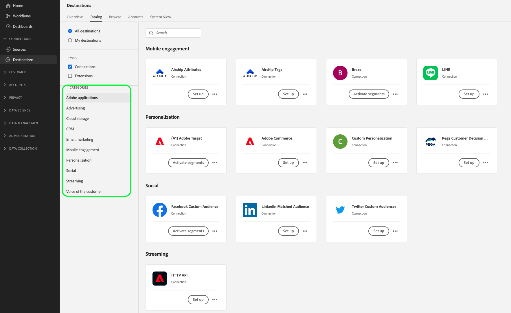

# Tipos e categorias de destino

Leia esta página para entender os diferentes tipos e categorias de destinos do Adobe Experience Platform.

## Tipos de destino

No Adobe Experience Platform, distinguimos entre dois tipos de destino: conexões e extensões. Há dois tipos de destinos de conexão, Destinos de exportação de perfil e Destinos de exportação de segmento.

## Conexões {#connections}

**[!UICONTROL Exportação de perfil]** e **[!UICONTROL Exportação de segmento de transmissão]** destinos no Adobe Experience Platform capturam dados de evento, combinam-nos com outras fontes de dados para formar a variável [Perfil do cliente em tempo real](../profile/home.md), aplicar a segmentação e exportar segmentos e perfis qualificados para destinos.

## Destinos de exportação de perfil

Os destinos de exportação de perfil recebem dados brutos, geralmente com o endereço de email como a chave primária. Atualmente, o Experience Platform suporta dois tipos de destinos de exportação de perfil:

* [Destinos de exportação de perfil de transmissão](#streaming-profile-export)
* [Destinos em lote (com base em arquivo)](#file-based)

### Destinos de exportação de perfil de transmissão {#streaming-profile-export}

Os destinos de exportação de perfil de fluxo recebem dados de segmento e perfil como fluxos de dados de Experience Platform. [Amazon Kinesis](catalog/cloud-storage/amazon-kinesis.md) e [Hubs de Eventos do Azure](catalog/cloud-storage/azure-event-hubs.md) são exemplos desses destinos.

### Destinos em lote (com base em arquivo) {#file-based}

Destinos baseados em arquivo recebem `.csv` arquivos contendo perfis e/ou atributos. [Amazon S3](catalog/cloud-storage/amazon-s3.md) é um exemplo de destino onde é possível exportar arquivos contendo exportações de perfil.

## Destinos de exportação de segmento de fluxo {#streaming-destinations}

Os destinos de exportação de segmento recebem dados de Experience Platform segment. Esses destinos usam IDs de segmento ou IDs de usuário. [[!DNL Google Display & Video 360]](catalog/advertising/google-dv360.md), [[!DNL Google Ads]](catalog/advertising/google-ads-destination.md)e são exemplos desses destinos.

## Exportar perfis e exportar segmentos - visão geral do vídeo {#video}

O vídeo abaixo mostra as particularidades dos dois tipos de destinos:

>[!VIDEO](https://video.tv.adobe.com/v/29707?quality=12)

## Extensões {#extensions}

A Platform aproveita o poder e a flexibilidade do gerenciamento de tags, permitindo configurar extensões de tags na interface do usuário da coleta de dados.

>[!TIP]
>
>Para obter informações detalhadas sobre extensões de tags, incluindo casos de uso e como encontrá-las na interface, consulte o [visão geral das extensões de tag](./catalog/launch-extensions/overview.md).

As extensões de tag encaminham os dados brutos do evento para vários tipos de destinos. Considere as extensões como uma **Encaminhamento de evento** tipo de destino. Esse é um tipo mais simples de integração com plataformas de destino, que só encaminha dados brutos do evento. Os exemplos são o [Extensão de personalização de Gainsight](./catalog/personalization/gainsight.md) ou [Confirmar voz da extensão do cliente](./catalog/voice/confirmit-digital-feedback.md).

## Quando usar conexões e extensões {#when-to-use}

Como profissional de marketing, você pode usar uma combinação de conexões e extensões para tratar de seus casos de uso.

As conexões são úteis quando é necessário aproveitar um perfil de cliente centralizado completo ou um segmento de cliente para ativação. Por exemplo, use conexões se estiver unindo dados comportamentais de um sistema analítico com dados de CRM carregados para qualificar um usuário para um determinado segmento antes de fornecer uma mensagem personalizada a esse usuário.

As extensões são úteis quando os dados do evento são usados para acionar uma ação ou para realizar a segmentação em um ambiente externo. Por exemplo, se dados comportamentais precisarem ser encaminhados a um sistema externo sem serem unidos a outras fontes de dados no arquivo para um determinado usuário.

## Categorias de destino {#categories}

As conexões e extensões no [catálogo de destinos](https://platform.adobe.com/destination/catalog) são agrupadas por categoria de destino (**Publicidade**, **armazenamento na nuvem**, **Plataformas de pesquisa**, **Marketing por email**, etc.), dependendo da ação de marketing que ajudam a atingir. Para obter mais informações sobre cada categoria, bem como os destinos incluídos em cada categoria, consulte o [Documentação do catálogo de destinos](./catalog/overview.md).

