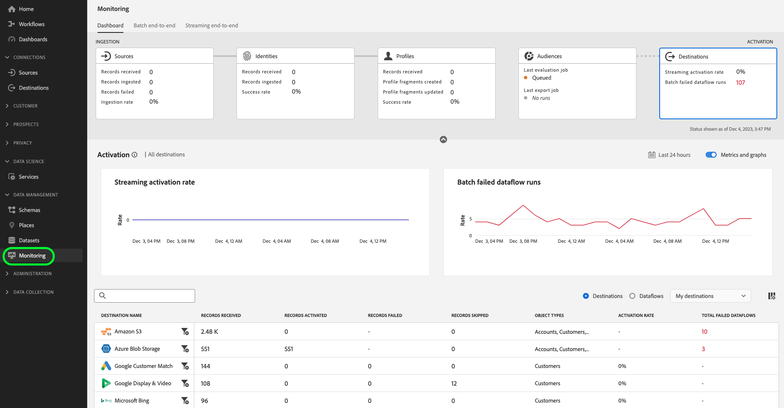

# Visão geral do [!DNL Destinations] {#overview}

**[!DNL Destinations]** são integrações pré-construídas com plataformas de destino que permitem a ativação perfeita de dados da Adobe Experience Platform. É possível usar destinos para ativar seus dados conhecidos e desconhecidos para campanhas de marketing entre canais, campanhas de email, publicidade direcionada e muitos outros casos de uso.

## Destinos e origens {#destinations-and-sources}

Uma das funcionalidades principais do Experience Platform é assimilar seus dados primários e ativá-los para atender às suas necessidades comerciais. Use [fontes](../sources/home.md) para assimilar dados na Experience Platform e destinos para exportar dados da Experience Platform.

## Etapas de destinos {#steps}

* Escolha em um [catálogo de autoatendimento](./catalog/overview.md) de todos os destinos disponíveis no Experience Platform.
* Use destinos para enviar públicos ou conjuntos de dados para plataformas de automação de marketing, plataformas de publicidade digital e muito mais.
* Agende exportações de dados para seus destinos preferidos regularmente.

## Controles {#controls}

Os controles no [espaço de trabalho de destinos](./ui/destinations-workspace.md) permitem:

* Navegue pelo catálogo de plataformas de destino onde você pode ativar seus dados;
* Criar, editar, ativar e desativar fluxos de dados para os destinos no catálogo;
* Criar uma conta em um local de armazenamento ou vincular o Experience Platform à conta na plataforma de destino;
* Selecione quais públicos ou conjuntos de dados devem ser ativados para destinos;
* Selecione quais [campos do Experience Data Model (XDM)](../xdm/home.md) serão exportados quando os públicos-alvo forem ativados para determinados destinos, como destinos de marketing por email, plataformas CRM, locais de armazenamento na nuvem e muito mais.
* Ative diferentes tipos de perfis e públicos para destinos - pessoas, contas e clientes potenciais.

## Tipos e categorias de destino {#types-and-categories}

Com o Experience Platform, você pode ativar dados para vários tipos de destinos para atender aos casos de uso de ativação. Os destinos variam de integrações baseadas em API a integrações com sistemas de recepção de arquivos, destinos de pesquisa de perfil e muito mais. Para obter informações detalhadas sobre todos os destinos disponíveis, leia a [visão geral sobre tipos e categorias de destino](./destination-types.md).

## Destinos criados pela Adobe e por parceiros {#adobe-and-partner-built-destinations}

Alguns dos conectores no catálogo de destinos do Experience Platform são criados e mantidos pela Adobe, enquanto outros são criados e mantidos por empresas parceiras usando o [Destination SDK](/help/destinations/destination-sdk/overview.md). Uma observação na parte superior da página de documentação para cada conector criado pelo parceiro chama se um destino é criado e mantido pelo parceiro. Por exemplo, o [conector Amazon S3](/help/destinations/catalog/cloud-storage/amazon-s3.md) é criado pela Adobe, enquanto o [conector TikTok](/help/destinations/catalog/social/tiktok.md) é criado e mantido pela equipe do TikTok.

Para conectores criados e mantidos pelo parceiro, isso significa que os problemas com o conector podem precisar ser resolvidos pela equipe do parceiro (método de contato fornecido na observação na página de documentação). No caso de problemas com conectores criados e mantidos pela Adobe, entre em contato com o representante da Adobe ou com o Atendimento ao cliente.

## Destinos e controles de acesso {#access-controls}

A funcionalidade de destinos no Experience Platform funciona com permissões de controle de acesso do Adobe Experience Platform. Dependendo do nível de permissão do seu usuário, você pode visualizar, gerenciar e ativar destinos. Para obter informações sobre as permissões individuais, vá para [controle de acesso no Adobe Experience Platform](../access-control/home.md) e role para baixo até a tabela na parte inferior da página.

A tabela a seguir descreve as permissões e as combinações de permissões necessárias para executar determinadas ações nos destinos.

| Nível de permissão | Descrição |
| ---- | ---- |
| **[!UICONTROL View Destinations]** | Para acessar a guia de destinos na interface do Experience Platform, você precisa da **[!UICONTROL View Destinations]** [permissão de controle de acesso](/help/access-control/home.md#permissions). |
| **[!UICONTROL View Destinations]**, **[!UICONTROL Manage Destinations]** | Para se conectar a destinos, você precisa das **[!UICONTROL View Destinations]** e **[!UICONTROL Manage Destinations]** [permissões de controle de acesso](/help/access-control/home.md#permissions). |
| **[!UICONTROL View Destinations]**, **[!UICONTROL Activate Destinations]**, **[!UICONTROL View Profiles]** e **[!UICONTROL View Segments]** | Para ativar públicos para destinos e habilitar a [etapa de mapeamento](ui/activate-batch-profile-destinations.md#mapping) do fluxo de trabalho, você precisa das **[!UICONTROL View Destinations]**, **[!UICONTROL Activate Destinations]**, **[!UICONTROL View Profiles]** e **[!UICONTROL View Segments]** [permissões de controle de acesso](/help/access-control/home.md#permissions). |
| **[!UICONTROL View Destinations]**, **[!UICONTROL Activate Segments without Mapping]**, **[!UICONTROL View Profiles]** e **[!UICONTROL View Segments]** | Para adicionar ou remover públicos de fluxos de dados existentes sem ter acesso à [etapa de mapeamento](ui/activate-batch-profile-destinations.md#mapping) do fluxo de trabalho, você precisa das **[!UICONTROL View Destinations]**, **[!UICONTROL Activate Segments without Mapping]**, **[!UICONTROL View Profiles]** e **[!UICONTROL View Segments]** [permissões de controle de acesso](/help/access-control/home.md#permissions). |
| **[!UICONTROL View Destinations]**, **[!UICONTROL Manage and Activate Dataset Destinations]** | Para exportar conjuntos de dados para destinos, você precisa das **[!UICONTROL View Destinations]** e **[!UICONTROL Manage and Activate Dataset Destinations]** [permissões de controle de acesso](/help/access-control/home.md#permissions). |
| **[!UICONTROL View Identity Graph]** | Para exportar *identidades* para destinos, você precisa da **[!UICONTROL View Identity Graph]** [permissão de controle de acesso](/help/access-control/home.md#permissions).   {width="100" zoomable="yes"} |

{style="table-layout:auto"}

O diagrama abaixo exibe visualmente quais permissões são necessárias, dependendo das operações que você deseja executar nos destinos.

Para obter mais informações sobre controles de acesso, consulte o [Guia do usuário de controle de acesso](../access-control/ui/overview.md).

### Controle de acesso baseado em atributos para destinos {#attribute-based-access}

O controle de acesso baseado em atributos no Adobe Experience Platform permite que os administradores controlem o acesso a objetos e/ou recursos específicos com base em atributos.

Com o controle de acesso baseado em atributos, é possível aplicar configurações de mapeamento a campos aos quais você tem permissões. Além disso, não é possível exportar dados para um destino se você não tiver acesso a todos os campos no conjunto de dados.

Para obter mais informações sobre como os destinos funcionam com os controles de acesso baseados em atributos, leia a [visão geral do controle de acesso baseado em atributos](../access-control/abac/overview.md#destinations).

## Remoção de perfil dos destinos {#profile-removal}

Quando um perfil é removido de um público-alvo ativado para um destino, esse perfil também é removido do público-alvo correspondente na plataforma de destino. Por exemplo, se um perfil for removido de um público que foi ativado anteriormente para o LinkedIn, esse perfil será removido do [!UICONTROL LinkedIn Matched Audience] associado.

A remoção de perfis de destinos — também conhecida como não segmentação — ocorre na mesma cadência que a segmentação. Assim que um perfil é removido de um público-alvo no Experience Platform, o próximo fluxo de dados agendado para o destino reflete essa alteração e remove o perfil do público-alvo de destino.

A velocidade real na qual a remoção de perfil tem efeito na plataforma de destino pode variar com base no comportamento de assimilação e processamento do destino.

## Monitoramento de destinos {#destinations-monitoring}

Depois de estabelecer uma conexão com um destino e concluir o fluxo de trabalho de ativação, é possível monitorar as exportações de dados para o sistema de recebimento. Leia o [guia sobre monitoramento de fluxos de dados para destinos na interface](/help/dataflows/ui/monitor-destinations.md) para obter mais informações.

Você também pode validar se os dados estão chegando com êxito ao seu destino. A maioria das páginas de documentação de destino no catálogo tem uma *seção Validar exportação de dados*, que indica como você pode verificar na plataforma de destino se os dados estão sendo trazidos com êxito do Experience Platform. Veja um exemplo desta seção para o [destino do Amazon Ads](/help/destinations/catalog/advertising/amazon-ads.md#exported-data).

## Restrições de governança de dados na ativação de dados para destinos {#data-governance}

A governança de dados é imposta para destinos do Experience Platform por meio de:

* *Ações de marketing* que você pode selecionar no fluxo de trabalho criar destinos;
* *Políticas de uso de dados* que restringem a ativação de dados contendo determinados rótulos de uso para destinos com determinadas ações de marketing.

Consulte a documentação de Governança de dados no Experience Platform para obter mais informações sobre [ações de marketing](../data-governance/policies/overview.md) e [resolução de violações de política de dados](../data-governance/enforcement/auto-enforcement.md).

Para obter mais informações sobre como selecionar ações de marketing no fluxo de trabalho de criação de destino, consulte as seguintes páginas para os diferentes tipos de destino no Experience Platform:

* [Destinos do Advertising - Google Ad Manager](./catalog/advertising/google-ad-manager.md)
* [Destinos do Advertising - Google Ads](./catalog/advertising/google-ads-destination.md)
* [Destinos do Advertising - Google Display &amp; Video 360](./catalog/advertising/google-dv360.md)
* [Destinos de armazenamento na nuvem](./catalog/cloud-storage/overview.md)
* [Destinos de marketing por email](./catalog/email-marketing/overview.md)
* [Destinos sociais](./catalog/social/overview.md)

Para obter mais informações sobre violações de política de dados no fluxo de trabalho de ativação de público, consulte a etapa **[!UICONTROL Review]** dos guias a seguir:

* [Ativar dados do público-alvo para streaming de públicos-alvo exportar destinos](./ui/activate-segment-streaming-destinations.md#review)
* [Ativar dados do público-alvo para destinos de exportação de perfil de transmissão](./ui/activate-streaming-profile-destinations.md#review)
* [Ativar dados do público-alvo para destinos de exportação de perfil em lote](./ui/activate-batch-profile-destinations.md#review)

## Termos e condições {#terms-and-conditions}

Ao usar qualquer um dos Destinos rotulados como beta (&quot;Beta&quot;), você reconhece que a Beta é fornecida ***&quot;no estado em que se encontra&quot; sem garantias de qualquer tipo***.

A Adobe não tem nenhuma obrigação de manter, corrigir, atualizar, alterar, modificar ou oferecer suporte à Beta. Você é aconselhado a usar materiais informativos e não se basear, de forma alguma, no funcionamento ou no desempenho corretos desses Beta e/ou dos materiais que os acompanham. O Beta é considerado Informações confidenciais da Adobe.

Qualquer &quot;Feedback&quot; (informação sobre o Beta incluindo, mas não se limitando a, problemas ou defeitos encontrados durante o uso do Beta, sugestões, melhorias e recomendações) fornecido por Você ao Adobe é atribuído ao Adobe, incluindo todos os direitos, cargos e interesses no e no Feedback.

Envie Feedback Aberto ou crie um Tíquete de Suporte para compartilhar suas sugestões ou relatar um erro, buscar um aprimoramento de recurso.