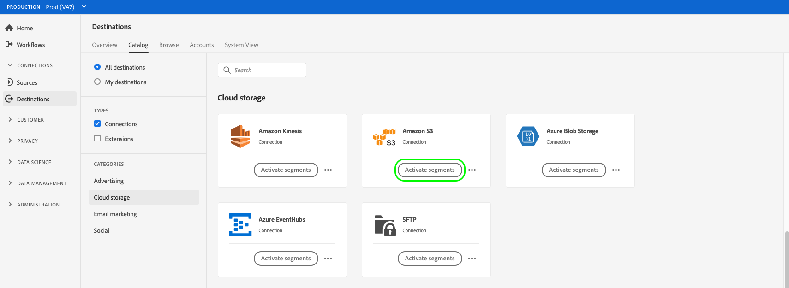
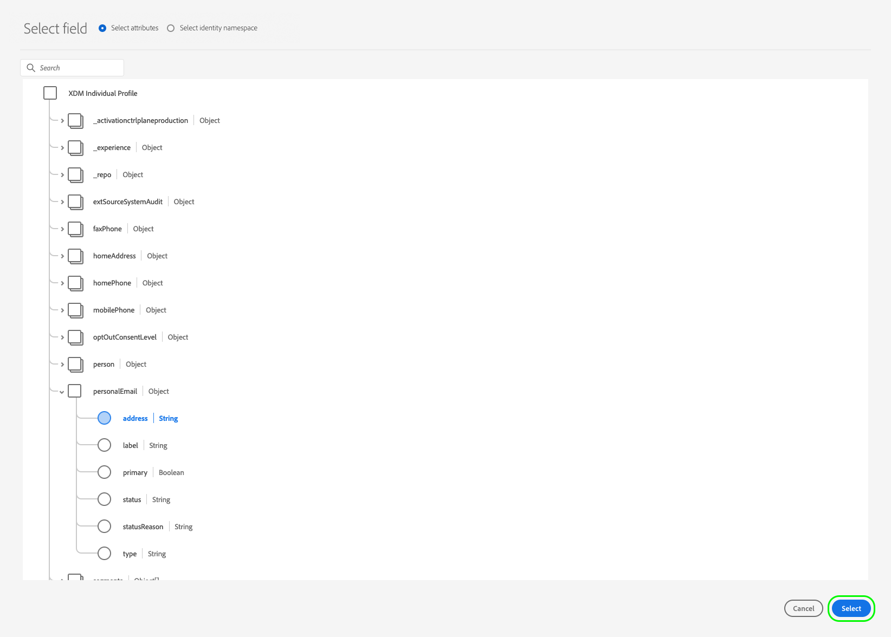

# Ativar dados do público-alvo para destinos de exportação de perfil em lote

## Visão geral {#overview}

Este artigo explica o workflow necessário para ativar dados de público-alvo em destinos com base em perfis em lote do Adobe Experience Platform, como armazenamento em nuvem e destinos de marketing por email.

## Pré-requisitos {#prerequisites}

Para ativar dados em destinos, você deve ter [conectado a um destino](./connect-destination.md). Se ainda não o fez, acesse o [catálogo de destinos](../catalog/overview.md), navegue pelos destinos compatíveis e configure o destino que deseja usar.

## Selecione o destino {#select-destination}

1. Ir para **[!UICONTROL Conexões > Destinos]** e selecione o **[!UICONTROL Catálogo]** guia .

   

1. Selecionar **[!UICONTROL Ativar segmentos]** no cartão correspondente ao destino onde você deseja ativar seus segmentos, conforme mostrado na imagem abaixo.

   

1. Selecione a conexão de destino que deseja usar para ativar seus segmentos e selecione **[!UICONTROL Próximo]**.

   

1. Mova para a próxima seção para [selecione seus segmentos](#select-segments).

## Selecione seus segmentos {#select-segments}

Use as caixas de seleção à esquerda dos nomes de segmentos para selecionar os segmentos que deseja ativar para o destino e, em seguida, selecione **[!UICONTROL Próximo]**.


## Agendar exportação de segmentos {#scheduling}

>[!CONTEXTUALHELP]
>id="platform_destinations_activate_schedule"
>title="Agendar"
>abstract="Set the file export type (full files or incremental files) and the export frequency."
>additional-url="https://www.adobe.com/go/destinations-profile-batch-en" text="Saiba mais na documentação"

[!DNL Adobe Experience Platform] exporta dados para marketing por email e destinos de armazenamento em nuvem na forma de [!DNL CSV] arquivos. No **[!UICONTROL Agendamento]** você pode configurar o agendamento e os nomes de arquivo para cada segmento que está exportando. A configuração do agendamento é obrigatória, mas a configuração do nome do arquivo é opcional.

>[!IMPORTANT]
> 
>[!DNL Adobe Experience Platform] automatically splits the export files at 5 million records (rows) per file. Cada linha representa um perfil.
>
>Nomes de arquivos divididos são anexados com um número que indica que o arquivo faz parte de uma exportação maior, desta forma: `filename.csv`, `filename_2.csv`, `filename_3.csv`.

Selecione o **[!UICONTROL Criar programação]** botão correspondente ao segmento que você deseja enviar para o destino.


### Exportar arquivos completos {#export-full-files}

>[!CONTEXTUALHELP]
>id="platform_destinations_activate_exportoptions"
>title="Opções de exportação de arquivo"
>abstract="Selecionar **Exportar arquivos completos** para exportar um instantâneo completo de todos os perfis qualificados para o segmento. Selecionar **Exportar arquivos incrementais** para exportar apenas os perfis que se qualificaram para o segmento desde a última exportação. <br> A primeira exportação de arquivo incremental inclui todos os perfis qualificados para o segmento, atuando como um preenchimento retroativo. Os arquivos incrementais futuros incluem apenas os perfis que se qualificaram para o segmento desde a primeira exportação de arquivos incrementais."
>additional-url="https://experienceleague.adobe.com/docs/experience-platform/destinations/ui/activate/activate-batch-profile-destinations.html?lang=en#export-incremental-files" text="Exportar arquivos incrementais"

Selecionar **[!UICONTROL Exportar arquivos completos]** para acionar a exportação de um arquivo contendo um instantâneo completo de todas as qualificações de perfil para o segmento selecionado.


1. Use o **[!UICONTROL Frequência]** seletor para selecionar a frequência de exportação:

   * **[!UICONTROL Uma vez]**: agendar uma exportação de arquivo completo sob demanda única.
   * **[!UICONTROL Diariamente]**: agendar exportações completas de arquivos uma vez por dia, todos os dias, no momento especificado.

1. Use o **[!UICONTROL Hora]** seletor para escolher a hora do dia, em [!DNL UTC] , quando a exportação deve ocorrer.

   >[!IMPORTANT]
   >
   >Devido à forma como os processos internos do Experience Platform são configurados, a primeira exportação de arquivo incremental ou completo pode não conter todos os dados de preenchimento retroativo. <br> <br> Para garantir uma exportação de dados de preenchimento retroativo completa e mais atualizada para arquivos completos e incrementais, o Adobe recomenda definir o primeiro tempo de exportação de arquivo após as 12 PM GMT do dia seguinte. Essa limitação será solucionada em versões futuras.

1. Use o **[!UICONTROL Data]** seletor para escolher o dia ou o intervalo em que a exportação deve ocorrer. Para exportações diárias, a prática recomendada é definir sua data de início e término para estar alinhada à duração de suas campanhas em suas plataformas de downstream.

   >[!IMPORTANT]
   >
   > Ao selecionar um intervalo de exportação, o último dia do intervalo não é incluído nas exportações. Por exemplo, se você selecionar um intervalo de 4 a 11 de janeiro, a última exportação de arquivo ocorrerá em 10 de janeiro.

1. Selecionar **[!UICONTROL Criar]** para salvar o cronograma.


### Exportar arquivos incrementais {#export-incremental-files}

Selecionar **[!UICONTROL Exportar arquivos incrementais]** para acionar uma exportação em que o primeiro arquivo é um instantâneo completo de todas as qualificações de perfil para o segmento selecionado e os arquivos subsequentes são qualificações de perfil incrementais desde a exportação anterior.

>[!IMPORTANT]
>
>O primeiro arquivo incremental exportado inclui todos os perfis qualificados para um segmento, que funcionam como um preenchimento retroativo.


1. Use o **[!UICONTROL Frequência]** seletor para selecionar a frequência de exportação:

   * **[!UICONTROL Diariamente]**: agendar exportações de arquivos incrementais uma vez por dia, todos os dias, no momento especificado.
   * **[!UICONTROL Por hora]**: agendar exportações de arquivos incrementais a cada 3, 6, 8 ou 12 horas.

1. Use o **[!UICONTROL Hora]** seletor para escolher a hora do dia, em [!DNL UTC] , quando a exportação deve ocorrer.

   >[!IMPORTANT]
   >
   >Devido à forma como os processos internos do Experience Platform são configurados, a primeira exportação de arquivo incremental ou completo pode não conter todos os dados de preenchimento retroativo. <br> <br> Para garantir uma exportação de dados de preenchimento retroativo completa e mais atualizada para arquivos completos e incrementais, o Adobe recomenda definir o primeiro tempo de exportação de arquivo após as 12 PM GMT do dia seguinte. Essa limitação será solucionada em versões futuras.

1. Use o **[!UICONTROL Data]** seletor para escolher o intervalo em que a exportação deve ocorrer. A prática recomendada é definir sua data de início e término para alinhar-se à duração de suas campanhas em suas plataformas de downstream.

   >[!IMPORTANT]
   >
   >O último dia do intervalo não está incluído nas exportações. Por exemplo, se você selecionar um intervalo de 4 a 11 de janeiro, a última exportação de arquivo ocorrerá em 10 de janeiro.

1. Selecionar **[!UICONTROL Criar]** para salvar o cronograma.

### Configurar nomes de arquivo {#file-names}

>[!CONTEXTUALHELP]
>id="platform_destinations_activate_filename"
>title="Configurar nome de arquivo"
>abstract="Para destinos com base em arquivo, um nome de arquivo exclusivo é gerado por segmento. Use o editor de nome de arquivo para criar e editar um nome de arquivo exclusivo ou manter o nome padrão."
>additional-url="https://experienceleague.adobe.com/docs/experience-platform/destinations/ui/activate/activate-batch-profile-destinations.html?lang=en#file-names" text="Saiba mais na documentação"

Os nomes de arquivo padrão consistem em nome de destino, ID de segmento e um indicador de data e hora. Por exemplo, você pode editar os nomes de arquivo exportados para distinguir entre campanhas diferentes ou para ter o tempo de exportação de dados anexado aos arquivos.

Selecione o ícone de lápis para abrir uma janela modal e editar os nomes dos arquivos. Os nomes de arquivo são limitados a 255 caracteres.


No editor de nome de arquivo, é possível selecionar componentes diferentes para adicionar ao nome do arquivo.


O nome de destino e a ID de segmento não podem ser removidos dos nomes de arquivo. Além disso, você pode adicionar o seguinte:

* **[!UICONTROL Nome do segmento]**: Você pode anexar o nome do segmento ao nome do arquivo.
* **[!UICONTROL Data e hora]**: Selecione entre adicionar um `MMDDYYYY_HHMMSS` ou um carimbo de data e hora Unix de 10 dígitos da hora em que os arquivos são gerados. Escolha uma dessas opções se desejar que seus arquivos tenham um nome de arquivo dinâmico gerado com cada exportação incremental.
* **[!UICONTROL Texto personalizado]**: Adicione texto personalizado aos nomes dos arquivos.

Selecionar **[!UICONTROL Aplicar alterações]** para confirmar a seleção.

>[!IMPORTANT]
> 
>Se você não selecionar a variável **[!UICONTROL Data e hora]** , os nomes de arquivo serão estáticos e o novo arquivo exportado substituirá o arquivo anterior no local de armazenamento com cada exportação. Ao executar um trabalho de importação recorrente de um local de armazenamento em uma plataforma de marketing por email, essa é a opção recomendada.

Once you have finished configuring all your segments, select **[!UICONTROL Next]** to continue.

## Selecionar atributos de perfil {#select-attributes}

Para destinos com base em perfil, você deve selecionar os atributos de perfil que deseja enviar para o destino do target.


1. No **[!UICONTROL Selecionar atributos]** página, selecione **[!UICONTROL Adicionar novo campo]**.

   

1. Selecione a seta à direita da **[!UICONTROL Campo Esquema]** entrada.

   

1. No **[!UICONTROL Selecionar campo]** selecione os atributos XDM que deseja enviar para o destino e escolha **[!UICONTROL Selecionar]**.

   

1. Para adicionar mais mapeamentos, repita as etapas de 1 a 3.

>[!NOTE]
>
> O Adobe Experience Platform preenche sua seleção com quatro atributos recomendados e comumente usados do esquema: `person.name.firstName`, `person.name.lastName`, `personalEmail.address`, `segmentMembership.status`.

As exportações de arquivo variam das seguintes maneiras, dependendo se `segmentMembership.status` está selecionada:
* Se a variável `segmentMembership.status` for selecionado, os arquivos exportados incluirão **[!UICONTROL Ativo]** membros no instantâneo completo inicial e **[!UICONTROL Ativo]** e **[!UICONTROL Expirado]** membros em exportações incrementais subsequentes.
* Se a variável `segmentMembership.status` não estiver selecionado, os arquivos exportados incluem somente **[!UICONTROL Ativo]** membros no instantâneo completo inicial e nas exportações incrementais subsequentes.


### Atributos obrigatórios {#mandatory-attributes}

>[!CONTEXTUALHELP]
>id="platform_destinations_activate_mandatorykey"
>title="Sobre atributos obrigatórios"
>abstract="Selecione os atributos de esquema XDM que todos os perfis exportados devem incluir. Os perfis sem a chave obrigatória não são exportados para o destino. A não seleção de uma chave obrigatória exporta todos os perfis qualificados, independentemente de seus atributos."
>additional-url="http://www.adobe.com/go/destinations-mandatory-attributes-en" text="Saiba mais na documentação"

Um atributo obrigatório é uma caixa de seleção ativada pelo usuário que garante que todos os registros de perfil contenham o atributo selecionado. Por exemplo: todos os perfis exportados contêm um endereço de email. &#x200B;

Você pode marcar atributos como obrigatórios para garantir que [!DNL Platform] exporta apenas os perfis que incluem o atributo específico. Como resultado, ele pode ser usado como uma forma adicional de filtragem. Marcar um atributo como obrigatório é **not** obrigatório.

A não seleção de um atributo obrigatório exporta todos os perfis qualificados, independentemente de seus atributos.

Recomenda-se que um dos atributos seja um [identificador exclusivo](../../destinations/catalog/email-marketing/overview.md#identity) do esquema. Para obter mais informações sobre atributos obrigatórios, consulte a seção identidade na [Destinos de marketing por email](../../destinations/catalog/email-marketing/overview.md#identity) documentação.

### Chaves de desduplicação {#deduplication-keys}

>[!CONTEXTUALHELP]
>id="platform_destinations_activate_deduplicationkey"
>title="Sobre chaves de desduplicação"
>abstract="Elimine vários registros do mesmo perfil nos arquivos de exportação selecionando uma chave de desduplicação. Selecione um namespace único ou até dois atributos de esquema XDM como uma chave de desduplicação. Não selecionar uma chave de desduplicação pode levar a entradas de perfil duplicadas nos arquivos de exportação."
>additional-url="http://www.adobe.com/go/destinations-deduplication-keys-en" text="Saiba mais na documentação"

Uma chave de desduplicação é uma chave primária definida pelo usuário que determina a identidade pela qual os usuários desejam que seus perfis sejam desduplicados. &#x200B;

Chaves de desduplicação eliminam a possibilidade de ter vários registros do mesmo perfil em um arquivo de exportação.

Há três maneiras de usar as chaves de desduplicação no [!DNL Platform]:

* Uso de um único namespace de identidade como um [!UICONTROL chave de desduplicação]
* Usar um único atributo de perfil de um [!DNL XDM] como um [!UICONTROL chave de desduplicação]
* Uso de uma combinação de dois atributos de perfil de uma [!DNL XDM] como uma chave composta

>[!IMPORTANT]
>
> Você pode exportar um único namespace de identidade para um destino, e o namespace é automaticamente definido como chave de desduplicação. Não há suporte para o envio de vários namespaces para um destino.
> 
> Não é possível usar uma combinação de namespaces de identidade e atributos de perfil como chaves de desduplicação.

### Exemplo de desduplicação {#deduplication-example}

Este exemplo ilustra como a desduplicação funciona, dependendo das chaves de desduplicação selecionadas.

Vamos considerar os dois perfis a seguir.

**Perfil A**

```json
{
  "identityMap": {
    "Email": [
      {
        "id": "johndoe_1@example.com"
      },
      {
        "id": "johndoe_2@example.com"
      }
    ]
  },
  "segmentMembership": {
    "ups": {
      "fa5c4622-6847-4199-8dd4-8b7c7c7ed1d6": {
        "status": "existing",
        "lastQualificationTime": "2021-03-10 10:03:08"
      }
    }
  },
  "person": {
    "name": {
      "lastName": "Doe",
      "firstName": "John"
    }
  },
  "personalEmail": {
    "address": "johndoe@example.com"
  }
}
```

**Perfil B**

```json
{
  "identityMap": {
    "Email": [
      {
        "id": "johndoe_1@example.com"
      },
      {
        "id": "johndoe_2@example.com"
      }
    ]
  },
  "segmentMembership": {
    "ups": {
      "fa5c4622-6847-4199-8dd4-8b7c7c7ed1d6": {
        "status": "existing",
        "lastQualificationTime": "2021-04-10 11:33:28"
      }
    }
  },
  "person": {
    "name": {
      "lastName": "D",
      "firstName": "John"
    }
  },
  "personalEmail": {
    "address": "johndoe@example.com"
  }
}
```

### Caso de uso de desduplicação 1: sem desduplicação {#deduplication-use-case-1}

Sem desduplicação, o arquivo de exportação conteria as seguintes entradas.

| emailpessoal | firstName | lastName |
|---|---|---|
| johndoe@example.com | John | Doe |
| johndoe@example.com | John | D |


### Caso de uso de desduplicação 2: desduplicação com base no namespace de identidade {#deduplication-use-case-2}

Considerando a desduplicação pelo [!DNL Email] namespace, o arquivo de exportação conteria as seguintes entradas. O Perfil B é o mais recente que se qualificou para o segmento, por isso é o único que está sendo exportado.

| Email* | personalEmail | firstName | lastName |
|---|---|---|---|
| johndoe_1@example.com | johndoe@example.com | John | D |
| johndoe_2@example.com | johndoe@example.com | John | D |

### Caso de uso de desduplicação 3: desduplicação com base em um único atributo de perfil {#deduplication-use-case-3}

Considerando a desduplicação pelo `personal Email` , o arquivo de exportação conteria a seguinte entrada. O Perfil B é o mais recente que se qualificou para o segmento, por isso é o único que está sendo exportado.

| emailpessoal* | firstName | lastName |
|---|---|---|
| johndoe@example.com | John | D |


### Caso de uso de desduplicação 4: desduplicação com base em dois atributos de perfil {#deduplication-use-case-4}

Assumindo desduplicação pela chave composta `personalEmail + lastName`, o arquivo de exportação conteria as seguintes entradas.

| emailpessoal* | lastName* | firstName |
|---|---|---|
| johndoe@example.com | D | John |
| johndoe@example.com | Doe | John |


O Adobe recomenda selecionar um namespace de identidade, como um [!DNL CRM ID] ou endereço de email como uma chave de desduplicação, para garantir que todos os registros de perfil sejam identificados exclusivamente.

>[!NOTE]
> 
>Se algum rótulo de uso de dados tiver sido aplicado a determinados campos em um conjunto de dados (em vez do conjunto de dados inteiro), a imposição desses rótulos em nível de campo na ativação ocorrerá sob as seguintes condições:
>
>* Os campos são usados na definição do segmento.
>* Os campos são configurados como atributos projetados para o destino.
>
> Por exemplo, se o campo `person.name.firstName` Se tiver determinados rótulos de uso de dados que entram em conflito com a ação de marketing do destino, você verá uma violação da política de uso de dados na etapa de revisão. Para obter mais informações, consulte [Governança de dados no Adobe Experience Platform](../../rtcdp/privacy/data-governance-overview.md#destinations).

## Revisão {#review}

No **[!UICONTROL Revisão]** você pode ver um resumo da sua seleção. Selecionar **[!UICONTROL Cancelar]** para quebrar o fluxo, **[!UICONTROL Voltar]** para modificar suas configurações, ou **[!UICONTROL Concluir]** para confirmar a seleção e começar a enviar dados para o destino.

>[!IMPORTANT]
>
>Nesta etapa, o Adobe Experience Platform verifica violações da política de uso de dados. Veja abaixo um exemplo de violação de uma política. Não é possível concluir o fluxo de trabalho de ativação de segmento até que você tenha resolvido a violação. Para obter informações sobre como resolver violações de política, consulte [Aplicação da política](../../rtcdp/privacy/data-governance-overview.md#enforcement) na seção de documentação de governança de dados .


Se nenhuma violação de política tiver sido detectada, selecione **[!UICONTROL Concluir]** para confirmar a seleção e começar a enviar dados para o destino.


## Verificar ativação de segmento {#verify}


Para destinos de marketing por email e destinos de armazenamento em nuvem, o Adobe Experience Platform cria um `.csv` no local de armazenamento fornecido. Espera que um novo arquivo seja criado no seu local de armazenamento todos os dias. O formato de arquivo padrão é:
`<destinationName>_segment<segmentID>_<timestamp-yyyymmddhhmmss>.csv`

Os arquivos que você receberia em três dias consecutivos podem ter a seguinte aparência:

```console
Salesforce_Marketing_Cloud_segment12341e18-abcd-49c2-836d-123c88e76c39_20200408061804.csv
Salesforce_Marketing_Cloud_segment12341e18-abcd-49c2-836d-123c88e76c39_20200409052200.csv
Salesforce_Marketing_Cloud_segment12341e18-abcd-49c2-836d-123c88e76c39_20200410061130.csv
```

A presença desses arquivos no local de armazenamento é a confirmação de uma ativação bem-sucedida. Para entender como os arquivos exportados estão estruturados, você pode [baixar um arquivo .csv de amostra](../assets/common/sample_export_file_segment12341e18-abcd-49c2-836d-123c88e76c39_20200408061804.csv). Esse arquivo de amostra inclui os atributos do perfil `person.firstname`, `person.lastname`, `person.gender`, `person.birthyear`e `personalEmail.address`.
