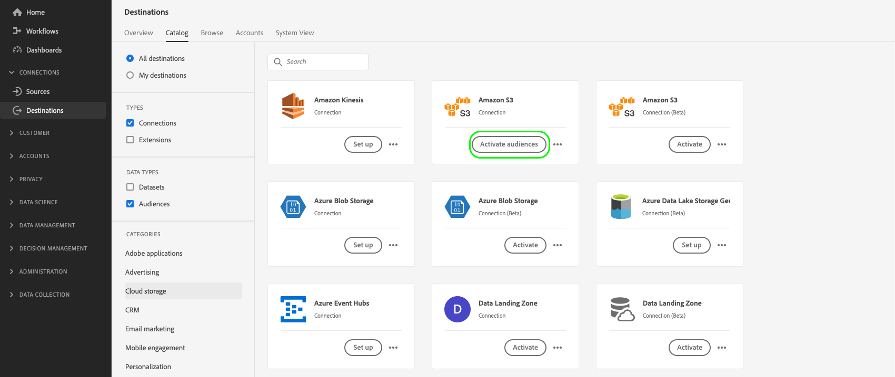

# Ativar públicos para destinos de exportação de perfil em lote

>[!IMPORTANT]
> 
> * Para ativar públicos-alvo e ativar a [etapa de mapeamento](#mapping) do fluxo de trabalho, é necessário **[!UICONTROL Gerenciar destinos]**, **[!UICONTROL Ativar destinos]**, **[!UICONTROL Exibir perfis]**, e **[!UICONTROL Exibir segmentos]** [permissões de controle de acesso](/help/access-control/home.md#permissions).
> * Para ativar públicos-alvo sem passar pela [etapa de mapeamento](#mapping) do fluxo de trabalho, é necessário **[!UICONTROL Gerenciar destinos]**, **[!UICONTROL Ativar segmento sem mapeamento]**, **[!UICONTROL Exibir perfis]**, e **[!UICONTROL Exibir segmentos]** [permissões de controle de acesso](/help/access-control/home.md#permissions).
>* Para exportar *identidades*, você precisará do **[!UICONTROL Exibir gráfico de identidade]** [permissão de controle de acesso](/help/access-control/home.md#permissions). <br> {width="100" zoomable="yes"}
> 
> Leia o [visão geral do controle de acesso](/help/access-control/ui/overview.md) ou entre em contato com o administrador do produto para obter as permissões necessárias.

## Visão geral {#overview}

Este artigo explica o fluxo de trabalho necessário para ativar públicos-alvo no Adobe Experience Platform para destinos baseados em arquivo de perfil em lote, como destinos de armazenamento em nuvem e marketing por email.

## Pré-requisitos {#prerequisites}

Para ativar públicos para destinos, você deve ter o [conectado a um destino](./connect-destination.md). Se ainda não tiver feito isso, acesse o [catálogo de destinos](../catalog/overview.md), navegue pelos destinos compatíveis e configure o destino que deseja usar.

## Formatos de arquivo compatíveis com a exportação {#supported-file-formats-export}

Os seguintes formatos de arquivo são compatíveis ao exportar públicos:

* CSV
* JSON
* Parquet

Observe que a exportação de arquivos CSV oferece maior flexibilidade em termos de como você deseja estruturar os arquivos exportados. Leia mais sobre [configuração da formatação de arquivos CSV](/help/destinations/ui/batch-destinations-file-formatting-options.md#file-configuration).

Selecione o formato de arquivo desejado para exportação quando [criação de uma conexão com o destino baseado em arquivo](/help/destinations/ui/connect-destination.md).

## Selecione seu destino {#select-destination}

1. Ir para **[!UICONTROL Conexões > Destinos]** e selecione a variável **[!UICONTROL Catálogo]** guia.

   

1. Selecionar **[!UICONTROL Ativar públicos]** no cartão correspondente ao destino em que deseja ativar os públicos-alvo, conforme mostrado na imagem abaixo.

   

1. Selecione a conexão de destino que deseja usar para ativar os públicos-alvo e selecione **[!UICONTROL Próxima]**.

   

1. Mover para a próxima seção para [selecionar seus públicos](#select-audiences).

## Selecione seus públicos-alvo {#select-audiences}

Para selecionar os públicos que deseja ativar para o destino, use as caixas de seleção à esquerda dos nomes dos públicos e selecione **[!UICONTROL Próxima]**.

Você pode selecionar entre vários tipos de públicos-alvo, dependendo de sua origem:

* **[!UICONTROL Serviço de segmentação]**: públicos-alvo gerados no Experience Platform pelo serviço de segmentação. Consulte a [documentação de segmentação](../../segmentation/ui/overview.md) para obter mais detalhes.
* **[!UICONTROL Upload personalizado]**: públicos gerados fora do Experience Platform e carregados na Platform como arquivos CSV. Para saber mais sobre públicos-alvo externos, consulte a documentação em [importação de um público](../../segmentation/ui/overview.md#import-audience).
* Outros tipos de públicos-alvo, provenientes de outras soluções de Adobe, como [!DNL Audience Manager].


>[!TIP]
>
>Seleção de públicos-alvo originados de **[!UICONTROL Uploads personalizados]** ativa automaticamente a variável [Selecionar atributos de enriquecimento](#select-enrichment-attributes) etapa.

## Programar exportação de público-alvo {#scheduling}

>[!CONTEXTUALHELP]
>id="platform_destinations_activate_schedule"
>title="Agendar"
>abstract="Use o ícone de lápis para definir o tipo de exportação de arquivo (arquivos completos ou arquivos incrementais) e a frequência de exportação."

[!DNL Adobe Experience Platform] exporta dados para destinos de marketing por email e armazenamento na nuvem conforme [tipos de arquivos diferentes](#supported-file-formats-export). No **[!UICONTROL Agendamento]** você pode configurar o agendamento e os nomes de arquivo para cada público-alvo que está exportando. A configuração do agendamento é obrigatória, mas a configuração do nome do arquivo é opcional.

>[!IMPORTANT]
>
>[!DNL Adobe Experience Platform] O divide automaticamente os arquivos de exportação em 5 milhões de registros (linhas) por arquivo. Cada linha representa um perfil.
>
>Nomes de arquivos divididos são anexados com um número que indica que o arquivo é parte de uma exportação maior, como: `filename.csv`, `filename_2.csv`, `filename_3.csv`.

Selecione o **[!UICONTROL Criar programação]** controle correspondente ao público-alvo que você deseja enviar para o seu destino.


### Exportar arquivos completos {#export-full-files}

>[!CONTEXTUALHELP]
>id="platform_destinations_activate_exportoptions"
>title="Opções de exportação de arquivo"
>abstract="Selecione **Exportar arquivos completos** para exportar um instantâneo completo de todos os perfis qualificados para o público-alvo. Selecione **Exportar arquivos incrementais** para exportar apenas os perfis que se qualificaram para o público-alvo desde a última exportação. <br> A primeira exportação de arquivo incremental inclui todos os perfis qualificados para o público-alvo, atuando como um preenchimento retroativo. Os arquivos incrementais posteriores incluirão apenas os perfis que se qualificaram para o público-alvo desde a primeira exportação de arquivos incrementais."
>additional-url="https://experienceleague.adobe.com/docs/experience-platform/destinations/ui/activate/activate-batch-profile-destinations.html#export-incremental-files" text="Exportar arquivos incrementais"

>[!CONTEXTUALHELP]
>id="platform_destinations_activationchaining_aftersegmentevaluation"
>title="Ativar após avaliação do público-alvo"
>abstract="A ativação é executada imediatamente após a conclusão do processo diário de segmentação. Isso garante que os perfis mais atualizados sejam exportados."

>[!CONTEXTUALHELP]
>id="platform_destinations_activationchaining_scheduled"
>title="Ativação agendada"
>abstract="A ativação é executada em um horário fixo do dia."

Selecionar **[!UICONTROL Exportar arquivos completos]** para acionar a exportação de um arquivo contendo um instantâneo completo de todas as qualificações de perfil para o público-alvo selecionado.


1. Use o **[!UICONTROL Frequência]** seletor para selecionar a frequência de exportação:

   * **[!UICONTROL Uma vez]**: agende uma exportação de arquivo completa sob demanda única.
   * **[!UICONTROL Diariamente]**: agende exportações completas de arquivos uma vez por dia, todos os dias, na hora especificada.

2. Use o **[!UICONTROL Hora]** alterne para selecionar se a exportação deve ocorrer imediatamente após a avaliação do público-alvo ou de forma programada, em um horário especificado. Ao selecionar a variável **[!UICONTROL Agendado]** você pode usar o seletor para escolher a hora do dia, em [!DNL UTC] formato, quando a exportação deve ocorrer.

   >[!NOTE]
   >
   >A variável **[!UICONTROL Após a avaliação do segmento]** A opção descrita abaixo está disponível somente para clientes Beta selecionados.

   Use o **[!UICONTROL Após a avaliação do segmento]** opção para que o trabalho de ativação seja executado imediatamente após a conclusão diária do trabalho de segmentação em lote do Platform. Essa opção garante que, quando o trabalho de ativação for executado, os perfis mais atualizados sejam exportados para o seu destino.

   <!-- Batch segmentation currently runs at {{insert time of day}} and lasts for an average {{x hours}}. Adobe reserves the right to modify this schedule. -->

   
Use o **[!UICONTROL Agendado]** opção para que o trabalho de ativação seja executado em um horário fixado. Essa opção garante que os dados do perfil de Experience Platform sejam exportados no mesmo horário todos os dias. No entanto, os perfis exportados podem não ser os mais atualizados, dependendo se o trabalho de segmentação em lote foi concluído antes do início do trabalho de ativação.

   

3. Use o **[!UICONTROL Data]** seletor para escolher o dia ou intervalo em que a exportação deve ocorrer. Para exportações diárias, a prática recomendada é definir a data de início e término para alinhar-se à duração das campanhas em suas plataformas downstream.

   >[!IMPORTANT]
   >
   > Ao selecionar um intervalo de exportação, o último dia do intervalo não é incluído nas exportações. Por exemplo, se você selecionar um intervalo de 4 a 11 de janeiro, a última exportação de arquivo ocorrerá em 10 de janeiro.

4. Selecionar **[!UICONTROL Criar]** para salvar o cronograma.

### Exportar arquivos incrementais {#export-incremental-files}

Selecionar **[!UICONTROL Exportar arquivos incrementais]** para acionar uma exportação em que o primeiro arquivo é um instantâneo completo de todas as qualificações de perfil do público-alvo selecionado, e os arquivos subsequentes são qualificações de perfil incrementais desde a exportação anterior.

>[!IMPORTANT]
>
>O primeiro arquivo incremental exportado inclui todos os perfis qualificados para um público-alvo, funcionando como um preenchimento retroativo.


1. Use o **[!UICONTROL Frequência]** seletor para selecionar a frequência de exportação:

   * **[!UICONTROL Diariamente]**: programe as exportações de arquivos incrementais uma vez por dia, todos os dias, no horário especificado.
   * **[!UICONTROL Por hora]**: agende exportações de arquivos incrementais a cada 3, 6, 8 ou 12 horas.

2. Use o **[!UICONTROL Hora]** seletor para escolher a hora do dia, em [!DNL UTC] formato, quando a exportação deve ocorrer.

3. Use o **[!UICONTROL Data]** seletor para escolher o intervalo em que a exportação deve ocorrer. A prática recomendada é definir as datas de início e término para que se alinhem à duração das campanhas nas plataformas downstream.

   >[!IMPORTANT]
   >
   >O último dia do intervalo não é incluído nas exportações. Por exemplo, se você selecionar um intervalo de 4 a 11 de janeiro, a última exportação de arquivo ocorrerá em 10 de janeiro.

4. Selecionar **[!UICONTROL Criar]** para salvar o cronograma.

### Configurar nomes de arquivo {#file-names}

>[!CONTEXTUALHELP]
>id="platform_destinations_activate_filename"
>title="Configurar nome de arquivo"
>abstract="Para destinos com base em arquivo, um nome de arquivo exclusivo é gerado por público-alvo. Use o editor de nome de arquivo para criar e editar um nome de arquivo exclusivo ou manter o nome padrão."

Para a maioria dos destinos, os nomes de arquivo padrão consistem no nome do destino, ID do público-alvo e um indicador de data e hora. Por exemplo, você pode editar os nomes de arquivo exportados para distinguir entre campanhas diferentes ou para anexar o tempo de exportação de dados aos arquivos. Observe que alguns desenvolvedores de destino podem optar por ter diferentes opções de anexação de nome de arquivo padrão mostradas para seus destinos.

Para abrir uma janela modal e editar os nomes dos arquivos, selecione o ícone de lápis. Os nomes de arquivo são limitados a 255 caracteres.

>[!NOTE]
>
>A imagem abaixo mostra como os nomes de arquivos podem ser editados para [!DNL Amazon S3] destinos, mas o processo é idêntico para todos os destinos em lote (por exemplo, SFTP, [!DNL Azure Blob Storage]ou [!DNL Google Cloud Storage]).


No editor de nome de arquivo, você pode selecionar diferentes componentes para adicionar ao nome do arquivo.


O nome de destino e a ID de público-alvo não podem ser removidos dos nomes de arquivo. Além dessas opções, você pode adicionar as seguintes opções:

| Opção Nome do arquivo | Descrição |
|---------|----------|
| **[!UICONTROL Nome do público]** | O nome do público exportado. |
| **[!UICONTROL Data e hora]** | Selecione entre adicionar um `MMDDYYYY_HHMMSS` formato ou um carimbo de data e hora de 10 dígitos do UNIX com a hora em que os arquivos são gerados. Escolha uma dessas opções se desejar que seus arquivos tenham um nome de arquivo dinâmico gerado com cada exportação incremental. |
| **[!UICONTROL Texto personalizado]** | Qualquer texto personalizado que você deseja adicionar aos nomes de arquivo. |
| **[!UICONTROL ID de destino]** | A ID do fluxo de dados de destino usado para exportar o público-alvo. |
| **[!UICONTROL Nome do destino]** | O nome do fluxo de dados de destino usado para exportar o público. |
| **[!UICONTROL Nome da organização]** | O nome da sua organização em Experience Platform. |
| **[!UICONTROL Nome da sandbox]** | A ID da sandbox usada para exportar o público-alvo. |

{style="table-layout:auto"}

Selecionar **[!UICONTROL Aplicar alterações]** para confirmar a seleção.

>[!IMPORTANT]
> 
>Se você não selecionar a opção **[!UICONTROL Data e hora]** , os nomes dos arquivos serão estáticos e o novo arquivo exportado substituirá o arquivo anterior no local de armazenamento a cada exportação. Ao executar um trabalho de importação recorrente de um local de armazenamento em uma plataforma de marketing por email, essa é a opção recomendada.

Depois de concluir a configuração de todos os públicos-alvo, selecione **[!UICONTROL Próxima]** para continuar.

## Mapeamento {#mapping}

Nesta etapa, você deve selecionar os atributos de perfil que deseja adicionar aos arquivos exportados para o destino. Para selecionar atributos de perfil e identidades para exportação:

1. No **[!UICONTROL Mapeamento]** selecione **[!UICONTROL Adicionar novo mapeamento]**.

   

1. Selecione a seta à direita da **[!UICONTROL Campo de origem]** entrada.

   

1. No **[!UICONTROL Selecionar campo de origem]** selecione os atributos de perfil e as identidades que deseja incluir nos arquivos exportados para o destino e, em seguida, escolha **[!UICONTROL Selecionar]**.

   >[!TIP]
   > 
   >Você pode usar o campo de pesquisa para restringir sua seleção, como mostrado na imagem abaixo.

   


1. O campo selecionado para exportação agora aparece na visualização de mapeamento. Se desejar, edite o nome do cabeçalho no arquivo exportado. Para fazer isso, selecione o ícone no campo de destino.

   

1. No **[!UICONTROL Selecionar campo de destino]** digite o nome desejado do cabeçalho no arquivo exportado e escolha **[!UICONTROL Selecionar]**.

   

1. O campo selecionado para exportação agora aparece na exibição de mapeamento e mostra o cabeçalho editado no arquivo exportado.

   

1. (Opcional) É possível selecionar seu campo exportado para ser um [chave obrigatória](#mandatory-keys) ou um [chave de desduplicação](#deduplication-keys).

   

1. Para adicionar mais campos para exportação, repita as etapas acima.

### Atributos obrigatórios {#mandatory-attributes}

>[!CONTEXTUALHELP]
>id="platform_destinations_activate_mandatorykey"
>title="Sobre atributos obrigatórios"
>abstract="Selecione os atributos de esquema XDM que todos os perfis exportados devem incluir. Os perfis sem a chave obrigatória não são exportados para o destino. Não selecionar uma chave obrigatória exportará todos os perfis qualificados, independentemente de seus atributos."

Um atributo obrigatório é uma caixa de seleção ativada pelo usuário que garante que todos os registros de perfil contenham o atributo selecionado. Por exemplo: todos os perfis exportados contêm um endereço de email.&#x200B;

É possível marcar atributos como obrigatórios para garantir que [!DNL Platform] O exporta somente os perfis que incluem o atributo específico. Como resultado, pode ser usado como uma forma adicional de filtragem. É obrigatório marcar um atributo **não** obrigatório.

Não selecionar um atributo obrigatório exporta todos os perfis qualificados, independentemente dos atributos.

Recomenda-se que um dos atributos seja um [identificador exclusivo](../../destinations/catalog/email-marketing/overview.md#identity) do esquema. Para obter mais informações sobre atributos obrigatórios, consulte a seção identidade na [Destinos de marketing por email](../../destinations/catalog/email-marketing/overview.md#identity) documentação.

### Chaves de desduplicação {#deduplication-keys}

>[!CONTEXTUALHELP]
>id="platform_destinations_activate_deduplicationkey"
>title="Sobre chaves de desduplicação"
>abstract="Elimine vários registros do mesmo perfil nos arquivos de exportação selecionando uma chave de desduplicação. Selecione um namespace único ou até dois atributos de esquema XDM como chave de desduplicação. Não selecionar uma chave de desduplicação pode gerar entradas de perfil duplicadas nos arquivos de exportação."

Uma chave de desduplicação é uma chave primária definida pelo usuário que determina a identidade pela qual os usuários desejam que seus perfis sejam desduplicados.&#x200B;

As chaves de desduplicação eliminam a possibilidade de ter vários registros do mesmo perfil em um arquivo de exportação.

Há três maneiras de usar chaves de desduplicação no [!DNL Platform]:

* Uso de um único namespace de identidade como [!UICONTROL chave de desduplicação]
* Usar um único atributo de perfil de um [!DNL XDM] perfil as a [!UICONTROL chave de desduplicação]
* Usar uma combinação de dois atributos de perfil de um [!DNL XDM] criar perfil como uma chave composta

>[!IMPORTANT]
>
> É possível exportar um único namespace de identidade para um destino, e o namespace é automaticamente definido como chave de desduplicação. Não há suporte para enviar vários namespaces para um destino.
> 
> Não é possível usar uma combinação de namespaces de identidade e atributos de perfil como chaves de desduplicação.

### Exemplo de desduplicação {#deduplication-example}

Este exemplo ilustra como a desduplicação funciona, dependendo das chaves de desduplicação selecionadas.

Vamos considerar os dois perfis a seguir.

**Perfil A**

```json
{
  "identityMap": {
    "Email": [
      {
        "id": "johndoe_1@example.com"
      },
      {
        "id": "johndoe_2@example.com"
      }
    ]
  },
  "segmentMembership": {
    "ups": {
      "fa5c4622-6847-4199-8dd4-8b7c7c7ed1d6": {
        "status": "realized",
        "lastQualificationTime": "2021-03-10 10:03:08"
      }
    }
  },
  "person": {
    "name": {
      "lastName": "Doe",
      "firstName": "John"
    }
  },
  "personalEmail": {
    "address": "johndoe@example.com"
  }
}
```

**Perfil B**

```json
{
  "identityMap": {
    "Email": [
      {
        "id": "johndoe_1@example.com"
      },
      {
        "id": "johndoe_2@example.com"
      }
    ]
  },
  "segmentMembership": {
    "ups": {
      "fa5c4622-6847-4199-8dd4-8b7c7c7ed1d6": {
        "status": "realized",
        "lastQualificationTime": "2021-04-10 11:33:28"
      }
    }
  },
  "person": {
    "name": {
      "lastName": "D",
      "firstName": "John"
    }
  },
  "personalEmail": {
    "address": "johndoe@example.com"
  }
}
```

### Caso de uso de desduplicação 1: sem desduplicação {#deduplication-use-case-1}

Sem a desduplicação, o arquivo de exportação conteria as seguintes entradas.

| personalEmail | firstName | lastName |
|---|---|---|
| johndoe@example.com | John | Doe |
| johndoe@example.com | John | D |


### Caso de uso de desduplicação 2: desduplicação com base no namespace de identidade {#deduplication-use-case-2}

Presumindo a desduplicação pelo [!DNL Email] , o arquivo de exportação conteria as entradas a seguir. O Perfil B é o mais recente qualificado para o público-alvo, portanto, é o único que está sendo exportado.

| E-mail* | personalEmail | firstName | lastName |
|---|---|---|---|
| johndoe_1@example.com | johndoe@example.com | John | D |
| johndoe_2@example.com | johndoe@example.com | John | D |

### Caso de uso de desduplicação 3: desduplicação com base em um único atributo de perfil {#deduplication-use-case-3}

Presumindo a desduplicação pelo `personal Email` , o arquivo de exportação conteria a seguinte entrada. O Perfil B é o mais recente qualificado para o público-alvo, portanto, é o único que está sendo exportado.

| personalEmail* | firstName | lastName |
|---|---|---|
| johndoe@example.com | John | D |


### Caso de uso de desduplicação 4: desduplicação com base em dois atributos de perfil {#deduplication-use-case-4}

Presumindo desduplicação pela chave composta `personalEmail + lastName`, o arquivo de exportação conteria as entradas a seguir.

| personalEmail* | lastName* | firstName |
|---|---|---|
| johndoe@example.com | D | John |
| johndoe@example.com | Doe | John |

O Adobe recomenda selecionar um namespace de identidade, como um [!DNL CRM ID] ou endereço de e-mail como uma chave de desduplicação, para garantir que todos os registros de perfil sejam identificados exclusivamente.

>[!NOTE]
> 
>Se algum rótulo de uso de dados tiver sido aplicado a determinados campos em um conjunto de dados (em vez do conjunto de dados inteiro), a aplicação desses rótulos de nível de campo na ativação ocorrerá nas seguintes condições:
>
>* Os campos são usados na definição de público-alvo.
>* Os campos são configurados como atributos projetados para o destino.
>
> Por exemplo, se o `person.name.firstName` tiver determinados rótulos de uso de dados que entrem em conflito com a ação de marketing do destino, você verá uma violação de política do uso de dados na etapa de revisão. Para obter mais informações, consulte [Governança de dados no Adobe Experience Platform](../../rtcdp/privacy/data-governance-overview.md#destinations).

### [!BADGE Beta]{type=Informative} Exportar matrizes por meio de campos calculados {#export-arrays-calculated-fields}

Os clientes beta selecionados podem exportar objetos de matriz do Experience Platform para destinos de armazenamento na nuvem. Leia mais sobre [exportação de matrizes e campos calculados](/help/destinations/ui/export-arrays-calculated-fields.md) e entre em contato com o representante da Adobe para obter acesso à funcionalidade.

### Limitações conhecidas {#known-limitations}

O novo **[!UICONTROL Mapeamento]** A página tem as seguintes limitações conhecidas:

#### O atributo de associação de público não pode ser selecionado por meio do fluxo de trabalho de mapeamento

Devido a uma limitação conhecida, não é possível usar o **[!UICONTROL Selecionar campo]** janela para adicionar `segmentMembership.status` para suas exportações de arquivo. Em vez disso, você precisa colar manualmente o valor `xdm: segmentMembership.status` no campo schema, conforme mostrado abaixo.


As exportações de arquivos variam das seguintes maneiras, dependendo se `segmentMembership.status` está selecionado:
* Se a variável `segmentMembership.status` for selecionado, os arquivos exportados serão **[!UICONTROL Ativo]** membros no instantâneo completo inicial e em eventos **[!UICONTROL Ativo]** e **[!UICONTROL Expirado]** membros em exportações incrementais subsequentes.
* Se a variável `segmentMembership.status` não estiver selecionado, os arquivos exportados incluirão apenas **[!UICONTROL Ativo]** membros no instantâneo completo inicial e em exportações incrementais subsequentes.

Leia mais sobre [comportamento de exportação de perfil para destinos baseados em arquivo](/help/destinations/how-destinations-work/profile-export-behavior.md#file-based-destinations).

#### Os namespaces de identidade não podem ser selecionados atualmente para exportações

No momento, não há suporte para a seleção de namespaces de identidade para exportação, como mostrado na imagem abaixo. Selecionar qualquer namespace de identidade para exportação resultará em um erro na variável **[!UICONTROL Revisão]** etapa.


Como solução temporária, se você precisar adicionar namespaces de identidade aos arquivos exportados durante a versão beta, será possível:
* Use os destinos de armazenamento na nuvem herdados para os fluxos de dados em que deseja incluir namespaces de identidade nas exportações
* Faça upload de identidades como atributos no Experience Platform para, em seguida, exportá-las para seus destinos de armazenamento na nuvem.

## Selecionar atributos de perfil {#select-attributes}

>[!IMPORTANT]
> 
Todos os destinos de armazenamento em nuvem no catálogo podem visualizar uma [[!UICONTROL Mapeamento] etapa](#mapping) que substitui a **[!UICONTROL Selecionar atributos]** etapa descrita nesta seção.
>
Este **[!UICONTROL Selecionar atributos]** A etapa ainda é exibida para os destinos de marketing por email do Marketing Cloud do Adobe Campaign, Oracle Responsys, Oracle Eloqua e Salesforce.

Para destinos baseados em perfil, você deve selecionar os atributos de perfil que deseja enviar ao destino.

1. No **[!UICONTROL Selecionar atributos]** selecione **[!UICONTROL Adicionar novo campo]**.

   

2. Selecione a seta à direita da **[!UICONTROL Campo de esquema]** entrada.

   

3. No **[!UICONTROL Selecionar campo]** selecione os atributos XDM ou os namespaces de identidade que deseja enviar ao destino e escolha **[!UICONTROL Selecionar]**.

   

4. Para adicionar mais mapeamentos, repita as etapas de um a três.

>[!NOTE]
>
O Adobe Experience Platform preenche sua seleção com quatro atributos recomendados, usados com frequência a partir do esquema: `person.name.firstName`, `person.name.lastName`, `personalEmail.address`, `segmentMembership.status`.


>[!IMPORTANT]
>
Devido a uma limitação conhecida, não é possível usar o **[!UICONTROL Selecionar campo]** janela para adicionar `segmentMembership.status` para suas exportações de arquivo. Em vez disso, cole manualmente o valor `xdm: segmentMembership.status` no campo schema, conforme mostrado abaixo.
>


As exportações de arquivos variam das seguintes maneiras, dependendo se `segmentMembership.status` está selecionado:
* Se a variável `segmentMembership.status` for selecionado, os arquivos exportados serão **[!UICONTROL Ativo]** membros no instantâneo completo inicial e **[!UICONTROL Ativo]** e **[!UICONTROL Expirado]** membros em exportações incrementais subsequentes.
* Se a variável `segmentMembership.status` não estiver selecionado, os arquivos exportados incluirão apenas **[!UICONTROL Ativo]** membros no instantâneo completo inicial e em exportações incrementais subsequentes.

## Selecionar atributos de enriquecimento {#select-enrichment-attributes}

[!CONTEXTUALHELP]
id="platform_destinations_activate_exclude_enrichment_attributes"
title="Excluir atributos de enriquecimento"
abstract="Habilite essa opção para exportar os perfis dos públicos-alvo personalizados enviados que foram selecionados para o seu destino, enquanto exclui todos os atributos deles."
additional-url="https://experienceleague.adobe.com/docs/experience-platform/destinations/ui/activate/activate-batch-profile-destinations.html?lang=pt-BR#select-enrichment-attributes" text="Saiba mais na documentação"

>[!IMPORTANT]
>
Esta etapa só será exibida se você tiver selecionado **[!UICONTROL Upload personalizado]** públicos-alvo durante o [seleção de público](#select-audiences) etapa.

Os atributos de enriquecimento correspondem aos públicos-alvo carregados personalizados assimilados no Experience Platform como **[!UICONTROL Uploads personalizados]**. Nesta etapa, você pode selecionar quais atributos deseja exportar para o seu destino, para cada público externo selecionado.


Siga as etapas abaixo para selecionar atributos de enriquecimento para cada público externo:

1. No **[!UICONTROL Atributos de enriquecimento]** selecione a variável  Botão (Editar).
2. Selecionar **[!UICONTROL Adicionar atributo de enriquecimento]**. Um novo campo de esquema vazio é mostrado.
   
3. Selecione o botão à direita do campo vazio para abrir a tela de seleção de campo.
4. Selecione os atributos que deseja exportar para o público-alvo.
   
5. Após adicionar todos os atributos que deseja exportar, selecione **[!UICONTROL Salvar e fechar]**.
6. Repita essas etapas para cada público-alvo externo.

Se quiser ativar públicos externos para seus destinos sem exportar nenhum atributo, habilite a opção **[!UICONTROL Excluir atributos de enriquecimento]** alternar. Essa opção exporta os perfis dos públicos externos, mas nenhum dos atributos correspondentes é enviado para o seu destino.


Selecionar **[!UICONTROL Próxima]** para ir para a [Revisão](#review) etapa.

## Revisão {#review}

No **[!UICONTROL Revisão]** você poderá ver um resumo da sua seleção. Selecionar **[!UICONTROL Cancelar]** para interromper o fluxo, **[!UICONTROL Voltar]** para modificar suas configurações ou **[!UICONTROL Concluir]** para confirmar a seleção e começar a enviar dados para o destino.


### Avaliação da política de consentimento {#consent-policy-evaluation}

[!CONTEXTUALHELP]
id="platform_governance_policies_viewApplicableConsentPolicies"
title="Exibir políticas de consentimento aplicáveis"
abstract="Se sua organização adquiriu o **Adobe Healthcare Shield** ou o **Adobe Privacy &amp; Security Shield**, selecione **[!UICONTROL Exibir políticas de consentimento aplicáveis]** para ver quais políticas de consentimento são aplicadas e quantos perfis são incluídos na ativação como resultado delas. Esse controle será desabilitado se a empresa não tiver acesso às SKUs mencionadas acima."

Se sua organização adquiriu o **Adobe Healthcare Shield** ou o **Adobe Privacy &amp; Security Shield**, selecione **[!UICONTROL Exibir políticas de consentimento aplicáveis]** para ver quais políticas de consentimento são aplicadas e quantos perfis são incluídos na ativação como resultado delas. Ler sobre [avaliação da política de consentimento](/help/data-governance/enforcement/auto-enforcement.md#consent-policy-evaluation) para obter mais informações.

### Verificações de política de uso de dados {#data-usage-policy-checks}

No **[!UICONTROL Revisão]** etapa, o Experience Platform também verifica se há violações de política de uso de dados. Veja abaixo um exemplo de violação de uma política. Não é possível concluir o fluxo de trabalho de ativação de público-alvo até que a violação seja resolvida. Para obter informações sobre como resolver violações de política, leia sobre [violações de política de uso de dados](/help/data-governance/enforcement/auto-enforcement.md#data-usage-violation) na seção documentação de governança de dados.


### Filtrar públicos {#filter-audiences}

Também nesta etapa é possível usar os filtros disponíveis na página para exibir somente os públicos-alvo cujo agendamento ou mapeamento foi atualizado como parte desse fluxo de trabalho. Você também pode alternar quais colunas da tabela deseja visualizar.


Se estiver satisfeito com a sua seleção e nenhuma violação de política tiver sido detectada, selecione **[!UICONTROL Concluir]** para confirmar a seleção e começar a enviar dados para o destino.

## Verificar ativação de público {#verify}

Ao exportar públicos para destinos de armazenamento na nuvem, o Adobe Experience Platform cria uma `.csv`, `.json`ou `.parquet` no local de armazenamento fornecido. Espere que um novo arquivo seja criado no local de armazenamento de acordo com o agendamento definido no fluxo de trabalho. O formato de arquivo padrão é mostrado abaixo, mas você pode [editar os componentes do nome do arquivo](#file-names):
`<destinationName>_segment<segmentID>_<timestamp-yyyymmddhhmmss>.csv`

Por exemplo, se você selecionasse uma frequência de exportação diária, os arquivos que você receberia em três dias consecutivos seriam assim:

```console
Salesforce_Marketing_Cloud_segment12341e18-abcd-49c2-836d-123c88e76c39_20200408061804.csv
Salesforce_Marketing_Cloud_segment12341e18-abcd-49c2-836d-123c88e76c39_20200409052200.csv
Salesforce_Marketing_Cloud_segment12341e18-abcd-49c2-836d-123c88e76c39_20200410061130.csv
```

A presença desses arquivos no local de armazenamento é uma confirmação de ativação bem-sucedida. Para entender como os arquivos exportados são estruturados, é possível [baixar um arquivo .csv de amostra](../assets/common/sample_export_file_segment12341e18-abcd-49c2-836d-123c88e76c39_20200408061804.csv). Este arquivo de amostra inclui os atributos do perfil `person.firstname`, `person.lastname`, `person.gender`, `person.birthyear`, e `personalEmail.address`.
