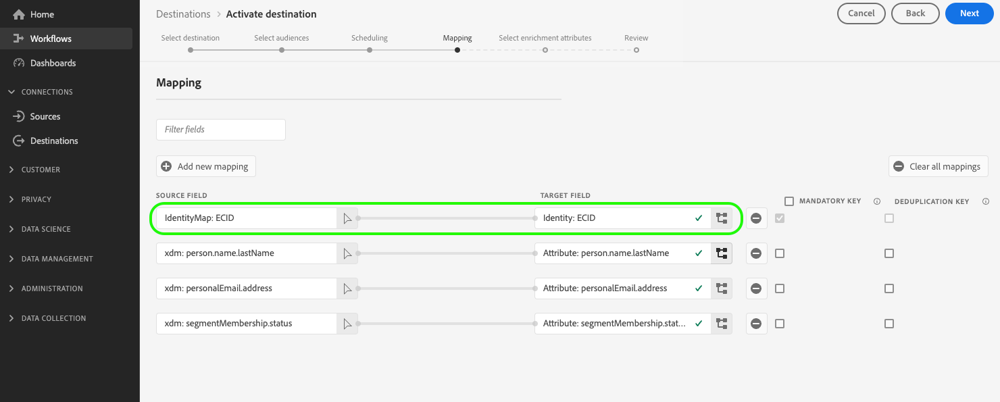

# Ativar públicos para destinos de exportação de perfil em lote

>[!IMPORTANT]
> 
> * Para ativar públicos e habilitar a [etapa de mapeamento](#mapping) do fluxo de trabalho, você precisa das **[!UICONTROL Exibir Destinos]**, **[!UICONTROL Ativar Destinos]**, **[!UICONTROL Exibir Perfis]** e **[!UICONTROL Exibir Segmentos]** [permissões de controle de acesso](/help/access-control/home.md#permissions).
> * Para ativar os públicos-alvo sem passar pela [etapa de mapeamento](#mapping) do fluxo de trabalho, você precisa das **[!UICONTROL Exibir Destinos]**, **[!UICONTROL Ativar Segmento sem Mapeamento]**, **[!UICONTROL Exibir Perfis]** e **[!UICONTROL Exibir Segmentos]** [permissões de controle de acesso](/help/access-control/home.md#permissions).
>* Para exportar *identidades*, você precisa da **[!UICONTROL permissão Exibir Gráfico de Identidade]** [controle de acesso](/help/access-control/home.md#permissions). <br> {width="100" zoomable="yes"}
> 
> Leia a [visão geral do controle de acesso](/help/access-control/ui/overview.md) ou contate o administrador do produto para obter as permissões necessárias.

## Visão geral {#overview}

Este artigo explica o fluxo de trabalho necessário para ativar públicos-alvo no Adobe Experience Platform para destinos baseados em arquivo de perfil em lote, como destinos de armazenamento em nuvem e marketing por email.

## Pré-requisitos {#prerequisites}

Para ativar públicos para destinos, você deve ter [se conectado com êxito a um destino](./connect-destination.md). Se ainda não tiver feito isso, vá para o [catálogo de destinos](../catalog/overview.md), navegue pelos destinos compatíveis e configure o destino que deseja usar.

## Formatos de arquivo compatíveis para exportação {#supported-file-formats-export}

Os seguintes formatos de arquivo são compatíveis ao exportar públicos:

* CSV
* JSON
* Parquet

Observe que a exportação de arquivos CSV oferece maior flexibilidade em termos de como você deseja estruturar os arquivos exportados. Leia mais sobre [configuração de formatação de arquivo para arquivos CSV](/help/destinations/ui/batch-destinations-file-formatting-options.md#file-configuration).

Selecione o formato de arquivo desejado para exportação ao [criar uma conexão com o destino baseado em arquivo](/help/destinations/ui/connect-destination.md).

## Selecione seu destino {#select-destination}

1. Vá para **[!UICONTROL Conexões > Destinos]** e selecione a guia **[!UICONTROL Catálogo]**.

   

1. Selecione **[!UICONTROL Ativar públicos-alvo]** no cartão correspondente ao destino em que você deseja ativar os públicos-alvo, conforme mostrado na imagem abaixo.

   

1. Selecione a conexão de destino que você deseja usar para ativar seus públicos e selecione **[!UICONTROL Avançar]**.

   

1. Mova para a próxima seção para [selecionar seus públicos-alvo](#select-audiences).

## Selecione seus públicos-alvo {#select-audiences}

Para selecionar os públicos que você deseja ativar para o destino, use as caixas de seleção à esquerda dos nomes de público e selecione **[!UICONTROL Avançar]**.

Você pode selecionar entre vários tipos de públicos-alvo, dependendo de sua origem:

* **[!UICONTROL Serviço de segmentação]**: públicos-alvo gerados no Experience Platform pelo serviço de segmentação. Consulte a [documentação de segmentação](../../segmentation/ui/overview.md) para obter mais detalhes.
* **[!UICONTROL Upload personalizado]**: públicos-alvo gerados fora do Experience Platform e carregados no Experience Platform como arquivos CSV. Para saber mais sobre públicos-alvo externos, consulte a documentação sobre [importação de um público-alvo](../../segmentation/ui/audience-portal.md#import-audience). A seleção de públicos originados de **[!UICONTROL Uploads personalizados]** habilita automaticamente a etapa [Selecionar atributos de enriquecimento](#select-enrichment-attributes).
* Outros tipos de públicos-alvo, originados de outras soluções da Adobe, como o [!DNL Audience Manager].

>[!IMPORTANT]
>
>Ao ativar públicos-alvo de upload personalizados para destinos baseados em arquivo em lote, há um limite de 10 desses públicos-alvo que você pode ativar em um fluxo de dados.


>[!TIP]
>
>Para remover públicos dos fluxos de ativação existentes, use a página **[!UICONTROL Dados de ativação]**. Leia a seção sobre como [remover vários públicos-alvo dos fluxos de ativação](../ui/destination-details-page.md#bulk-remove) para obter detalhes.

## Programar exportação de público-alvo {#scheduling}

>[!CONTEXTUALHELP]
>id="platform_destinations_activate_schedule"
>title="Agendar"
>abstract="Use o ícone de lápis para definir o tipo de exportação de arquivo (arquivos completos ou arquivos incrementais) e a frequência de exportação."

>[!CONTEXTUALHELP]
>id="platform_destinations_activate_schedule_weekly_messaging"
>title="Exportações semanais"
>abstract="<sup>*</sup> Selecione a data inicial e as exportações subsequentes ocorrerão nesse dia da semana até a data final selecionada."

>[!CONTEXTUALHELP]
>id="platform_destinations_activate_schedule_monthly_messaging"
>title="Exportações mensais"
>abstract="<sup>*</sup> Selecione a data inicial e as exportações subsequentes ocorrerão nessa data do mês até a data final selecionada. Para meses com menos de 30 ou 31 dias, a exportação ocorre no último dia do mês."

[!DNL Adobe Experience Platform] exporta dados para destinos de marketing por email e armazenamento na nuvem como [tipos de arquivos diferentes](#supported-file-formats-export). Na página **[!UICONTROL Agendamento]**, você pode configurar o agendamento e os nomes de arquivo para cada público-alvo que está exportando.

O Experience Platform define automaticamente um agendamento padrão para cada exportação de arquivo. Você pode modificar o agendamento padrão de acordo com suas necessidades, selecionando o ícone de lápis ao lado de cada agendamento e definindo um agendamento personalizado.


Para editar vários agendamentos ao mesmo tempo, marque os públicos usando as caixas de seleção no lado esquerdo da tela e selecione **[!UICONTROL Editar agendamento]**. O agendamento configurado será aplicado a todos os arquivos exportados para os públicos selecionados.


>[!TIP]
>
>Você pode editar os agendamentos de ativação de público para os fluxos de ativação existentes na página **[!UICONTROL Dados de ativação]**. Consulte a documentação em [agendamentos de ativação de edição em massa](../ui/destination-details-page.md#bulk-edit-schedule) para obter detalhes.

>[!IMPORTANT]
>
>O [!DNL Adobe Experience Platform] divide automaticamente os arquivos de exportação em 5 milhões de registros (linhas) por arquivo. Cada linha representa um perfil.
>
>Nomes de arquivos divididos são anexados com um número que indica que o arquivo é parte de uma exportação maior, como: `filename.csv`, `filename_2.csv`, `filename_3.csv`.

### Exportar arquivos completos {#export-full-files}

>[!CONTEXTUALHELP]
>id="platform_destinations_activate_exportoptions"
>title="Opções de exportação de arquivo"
>abstract="Selecione **Exportar arquivos completos** para exportar um instantâneo completo de todos os perfis qualificados para o público-alvo. Selecione **Exportar arquivos incrementais** para exportar apenas os perfis que se qualificaram para o público-alvo desde a última exportação. <br> A primeira exportação de arquivo incremental inclui todos os perfis qualificados para o público-alvo, atuando como um preenchimento retroativo. Os arquivos incrementais posteriores incluirão apenas os perfis que se qualificaram para o público-alvo desde a primeira exportação de arquivos incrementais."
>additional-url="https://experienceleague.adobe.com/docs/experience-platform/destinations/ui/activate/activate-batch-profile-destinations.html?lang=pt-BR#export-incremental-files" text="Exportar arquivos incrementais"

>[!CONTEXTUALHELP]
>id="platform_destinations_activationchaining_aftersegmentevaluation"
>title="Ativar após avaliação do público-alvo"
>abstract="<p>A ativação é executada imediatamente após a conclusão do processo diário de segmentação. Isso garante que os perfis mais atualizados sejam exportados.</p><p>A opção de exportar perfis após a avaliação do público-alvo <i>não</i> está disponível para as frequências de exportação semanal e mensal.</p>"

>[!CONTEXTUALHELP]
>id="platform_destinations_activationchaining_scheduled"
>title="Ativação agendada"
>abstract="A ativação é executada em um horário fixo do dia."

Selecione **[!UICONTROL Exportar arquivos completos]** para acionar a exportação de um arquivo que contém um instantâneo completo de todas as qualificações de perfil para o público selecionado.


1. Use o seletor de **[!UICONTROL Frequência]** para selecionar a frequência de exportação:

   * **[!UICONTROL Uma vez]**: agendar uma exportação de arquivo completa sob demanda única.
   * **[!UICONTROL Diariamente]**: agendar exportações completas de arquivo uma vez por dia, todos os dias, na hora que você especificar.
   * **[!UICONTROL Semanalmente]**: selecione a data de início e as exportações subsequentes ocorrerão nesse dia da semana até a data de término selecionada.
   * **[!UICONTROL Monthly]**: selecione a data de início e as exportações subsequentes ocorrerão nessa data do mês até a data de término selecionada. Para meses com menos de 30 ou 31 dias, a exportação ocorre no último dia do mês.

   >[!NOTE]
   >
   > Atualmente, só há suporte para opções de agendamento semanais e mensais para os seguintes destinos de armazenamento na nuvem baseado em arquivo, e apenas ao ativar [públicos-alvo de pessoas](../../segmentation/types/overview.md#people-audience) e [públicos-alvo de clientes potenciais](../../segmentation/types/overview.md#prospect-audience).
   > 
   > * [Amazon S3](../catalog/cloud-storage/amazon-s3.md)
   > * [Armazenamento Azure Blob](../catalog/cloud-storage/azure-blob.md)
   > * [Zona de Aterrissagem de Dados](../catalog/cloud-storage/data-landing-zone.md)
   > * [Armazenamento na nuvem do Google](../catalog/cloud-storage/google-cloud-storage.md)
   > * [SFTP](../catalog/cloud-storage/sftp.md)
   > 
   > As opções de agendamento semanal e mensal não estão disponíveis para outros tipos de destino.

2. Use o **[!UICONTROL Time]** para selecionar se a exportação deve ocorrer imediatamente após a avaliação do público-alvo ou de acordo com um agendamento, em um horário especificado. Ao selecionar a opção **[!UICONTROL Agendado]**, você pode usar o seletor para escolher a hora do dia, no formato [!DNL UTC], em que a exportação deve ocorrer.

   Use a opção **[!UICONTROL Após avaliação de segmento]** para que o trabalho de ativação seja executado imediatamente após a conclusão diária do trabalho de segmentação em lote do Experience Platform. Essa opção garante que, quando o trabalho de ativação for executado, os perfis mais atualizados sejam exportados para o seu destino. Isso pode resultar na exportação de um público-alvo várias vezes por dia, com base em suas ações.

   >[!IMPORTANT]
   >
   >Se você executar a [avaliação flexível do público-alvo](../../segmentation/ui/audience-portal.md#flexible-audience-evaluation) em públicos que já estão definidos para serem ativados após a avaliação do segmento, os públicos-alvo serão ativados assim que o trabalho de avaliação flexível do público-alvo for concluído, independentemente de quaisquer trabalhos de ativação diários anteriores. Isso pode resultar na exportação de públicos-alvo várias vezes por dia, com base em suas ações.

   <!-- Batch segmentation currently runs at {{insert time of day}} and lasts for an average {{x hours}}. Adobe reserves the right to modify this schedule. -->

   
Use a opção **[!UICONTROL Agendado]** para que o trabalho de ativação seja executado em um horário fixo. Essa opção garante que os dados de perfil do Experience Platform sejam exportados ao mesmo tempo todos os dias. No entanto, os perfis exportados podem não ser os mais atualizados, dependendo se o trabalho de segmentação em lote foi concluído antes do início do trabalho de ativação.

   

   >[!IMPORTANT]
   >
   >Ao mapear um público criado nas últimas 24 horas e avaliado por meio de [segmentação em lote](../../segmentation/methods/batch-segmentation.md), defina o agendamento de exportação diário para iniciar o dia seguinte com a maior brevidade. Isso garante que o trabalho de avaliação diária em lote seja executado primeiro e que você esteja exportando os dados completos do público-alvo.

3. Use o seletor **[!UICONTROL Data]** para escolher o dia ou intervalo em que a exportação deve ocorrer. Para exportações diárias, a prática recomendada é definir a data de início e término para alinhar-se à duração das campanhas em suas plataformas downstream.

   >[!IMPORTANT]
   >
   > Ao selecionar um intervalo de exportação, o último dia do intervalo não é incluído nas exportações. Por exemplo, se você selecionar um intervalo de 4 a 11 de janeiro, a última exportação de arquivo ocorrerá em 10 de janeiro.

4. Selecione **[!UICONTROL Criar]** para salvar o agendamento.

### Exportar arquivos incrementais

>[!CONTEXTUALHELP]
>id="platform_destinations_activate_something"
>title="Configurar nome de arquivo"
>abstract="Para destinos com base em arquivo, um nome de arquivo exclusivo é gerado por público-alvo. Use o editor de nome de arquivo para criar e editar um nome de arquivo exclusivo ou manter o nome padrão."

Selecione **[!UICONTROL Exportar arquivos incrementais]** para acionar uma exportação em que o primeiro arquivo é um instantâneo completo de todas as qualificações de perfil para o público-alvo selecionado, e os arquivos subsequentes são qualificações de perfil incrementais desde a exportação anterior.

>[!IMPORTANT]
>
>O primeiro arquivo incremental exportado inclui todos os perfis qualificados para um público-alvo, funcionando como um preenchimento retroativo.


1. Use o seletor de **[!UICONTROL Frequência]** para selecionar a frequência de exportação:

   * **[!UICONTROL Diariamente]**: agendar exportações de arquivos incrementais uma vez por dia, todos os dias, no horário especificado.
   * **[!UICONTROL Por hora]**: agende exportações de arquivos incrementais a cada 3, 6, 8 ou 12 horas.


2. Use o seletor **[!UICONTROL Hora]** para escolher a hora do dia, no formato [!DNL UTC], em que a exportação deve ocorrer.

3. Use o seletor **[!UICONTROL Data]** para escolher o intervalo em que a exportação deve ocorrer. A prática recomendada é definir as datas de início e término para que se alinhem à duração das campanhas nas plataformas downstream.

   >[!IMPORTANT]
   >
   >O último dia do intervalo não é incluído nas exportações. Por exemplo, se você selecionar um intervalo de 4 a 11 de janeiro, a última exportação de arquivo ocorrerá em 10 de janeiro.

4. Selecione **[!UICONTROL Criar]** para salvar o agendamento.

### Configurar nomes de arquivo {#configure-file-names}

>[!CONTEXTUALHELP]
>id="platform_destinations_activate_filename"
>title="Configurar nome de arquivo"
>abstract="Para destinos com base em arquivo, um nome de arquivo exclusivo é gerado por público-alvo. Use o editor de nome de arquivo para criar e editar um nome de arquivo exclusivo ou manter o nome padrão."

Para a maioria dos destinos, os nomes de arquivo padrão consistem no nome do destino, ID do público-alvo e um indicador de data e hora. Por exemplo, você pode editar os nomes de arquivo exportados para distinguir entre campanhas diferentes ou para anexar o tempo de exportação de dados aos arquivos. Observe que alguns desenvolvedores de destino podem optar por ter diferentes opções de anexação de nome de arquivo padrão mostradas para seus destinos.

Para abrir uma janela modal e editar os nomes dos arquivos, selecione o ícone de lápis. Os nomes de arquivo são limitados a 255 caracteres.

>[!NOTE]
>
>A imagem abaixo mostra como os nomes de arquivos podem ser editados para [!DNL Amazon S3] destinos, mas o processo é idêntico para todos os destinos em lote (por exemplo, SFTP, [!DNL Azure Blob Storage] ou [!DNL Google Cloud Storage]).


No editor de nome de arquivo, você pode selecionar diferentes componentes para adicionar ao nome do arquivo.


O nome de destino e a ID de público-alvo não podem ser removidos dos nomes de arquivo. Além dessas opções, você pode adicionar as seguintes opções:

| Opção Nome do arquivo | Descrição |
|---------|----------|
| **[!UICONTROL Nome do público-alvo]** | O nome do público exportado. |
| **[!UICONTROL Data e hora]** | Escolha entre adicionar um formato `MMDDYYYY_HHMMSS` ou um carimbo de data e hora de 10 dígitos do UNIX com a hora em que os arquivos são gerados. Escolha uma dessas opções se desejar que seus arquivos tenham um nome de arquivo dinâmico gerado com cada exportação incremental. |
| **[!UICONTROL Texto personalizado]** | Qualquer texto personalizado que você deseja adicionar aos nomes de arquivo. |
| **[!UICONTROL ID de Destino]** | A ID do fluxo de dados de destino usado para exportar o público-alvo. |
| **[!UICONTROL Nome do destino]** | O nome do fluxo de dados de destino usado para exportar o público. |
| **[!UICONTROL Nome da organização]** | O nome da sua organização no Experience Platform. |
| **[!UICONTROL Nome da sandbox]** | A ID da sandbox usada para exportar o público-alvo. |

{style="table-layout:auto"}

Para editar vários nomes de arquivo ao mesmo tempo, marque os públicos-alvo usando as caixas de seleção no lado esquerdo da tela e selecione **[!UICONTROL Editar nome do arquivo]**. As opções de nome de arquivo configuradas serão aplicadas a todos os arquivos exportados para os públicos selecionados.


Selecione **[!UICONTROL Aplicar alterações]** para confirmar a seleção.

>[!IMPORTANT]
> 
>Se você não selecionar o componente **[!UICONTROL Data e Hora]**, os nomes dos arquivos serão estáticos e o novo arquivo exportado substituirá o arquivo anterior no local de armazenamento com cada exportação. Ao executar um trabalho de importação recorrente de um local de armazenamento em uma plataforma de marketing por email, essa é a opção recomendada.

Após concluir a configuração de todos os públicos-alvo, selecione **[!UICONTROL Avançar]** para continuar.

## Mapeamento {#mapping}

Nesta etapa, você deve selecionar os atributos de perfil que deseja adicionar aos arquivos exportados para o destino. Para selecionar atributos de perfil e identidades para exportação:

1. Na página **[!UICONTROL Mapeamento]**, selecione **[!UICONTROL Adicionar novo mapeamento]**.

   

1. Selecione a seta à direita da entrada **[!UICONTROL Source field]**.

   

1. Na página **[!UICONTROL Selecionar campo de origem]**, selecione os atributos de perfil e as identidades que deseja incluir nos arquivos exportados para o destino e escolha **[!UICONTROL Selecionar]**.

   >[!TIP]
   > 
   >Você pode usar o campo de pesquisa para restringir sua seleção, como mostrado na imagem abaixo.

   Use a opção **[!UICONTROL Mostrar apenas campos com dados]** para exibir apenas campos de esquema preenchidos com valores. Por padrão, somente os campos de esquema preenchidos são exibidos.

   


1. O campo selecionado para exportação agora aparece na visualização de mapeamento. Se desejar, edite o nome do cabeçalho no arquivo exportado. Para fazer isso, selecione o ícone no campo de destino.

   >[!NOTE]
   >
   >Pontos (`.`) não são suportados em nomes de campos em arquivos exportados. Se um nome de campo incluir pontos (como `person.name.firstName`), cada ponto será substituído por um sublinhado (`_`) no nome de coluna exportado. Por exemplo, `person.name.firstName` se tornará `person_name_firstName` no arquivo exportado.

   

1. Na página **[!UICONTROL Selecionar campo de destino]**, digite o nome desejado do cabeçalho no arquivo exportado e escolha **[!UICONTROL Selecionar]**.

   

1. O campo selecionado para exportação agora aparece na exibição de mapeamento e mostra o cabeçalho editado no arquivo exportado.

   

1. (Opcional) A ordem dos campos mapeados na interface do usuário reflete a ordem das colunas no arquivo CSV exportado, de cima para baixo, com a linha superior sendo a coluna mais à esquerda no arquivo CSV. É possível reordenar os campos mapeados da maneira que desejar, arrastando e soltando as linhas de mapeamento, conforme mostrado abaixo.

   >[!NOTE]
   >
   >Esse recurso está na versão beta e só está disponível para clientes selecionados. Para solicitar o acesso a esse recurso, entre em contato com o representante da Adobe.

   

1. (Opcional) Você pode selecionar seu campo exportado para ser uma [chave obrigatória](#mandatory-keys) ou uma [chave de desduplicação](#deduplication-keys).

   

1. Para adicionar mais campos para exportação, repita as etapas acima.

### Atributos obrigatórios {#mandatory-attributes}

>[!CONTEXTUALHELP]
>id="platform_destinations_activate_mandatorykey"
>title="Sobre atributos obrigatórios"
>abstract="Selecione os atributos de esquema XDM que todos os perfis exportados devem incluir. Os perfis sem a chave obrigatória não são exportados para o destino. Não selecionar uma chave obrigatória exportará todos os perfis qualificados, independentemente de seus atributos."

Um atributo obrigatório é uma caixa de seleção ativada pelo usuário que garante que todos os registros de perfil contenham o atributo selecionado. Por exemplo: todos os perfis exportados contêm um endereço de email.&#x200B;

Você pode marcar atributos como obrigatórios para garantir que o [!DNL Experience Platform] exporte apenas os perfis que incluem o atributo específico. Como resultado, pode ser usado como uma forma adicional de filtragem. É necessário marcar um atributo como obrigatório **não**.

Não selecionar um atributo obrigatório exporta todos os perfis qualificados, independentemente dos atributos.

Recomenda-se que um dos atributos seja um [identificador exclusivo](../../destinations/catalog/email-marketing/overview.md#identity) do esquema. Para obter mais informações sobre atributos obrigatórios, consulte a seção identidade na documentação de [Destinos de marketing por email](../../destinations/catalog/email-marketing/overview.md#identity).

### Chaves de desduplicação {#deduplication-keys}

>[!CONTEXTUALHELP]
>id="platform_destinations_activate_deduplicationkey"
>title="Sobre chaves de desduplicação"
>abstract="Elimine vários registros do mesmo perfil nos arquivos de exportação selecionando uma chave de desduplicação. Selecione um namespace único ou até dois atributos de esquema XDM como chave de desduplicação. Não selecionar uma chave de desduplicação pode gerar entradas de perfil duplicadas nos arquivos de exportação."

Uma chave de desduplicação é uma chave primária definida pelo usuário que determina a identidade pela qual os usuários desejam que seus perfis sejam desduplicados.&#x200B;

As chaves de desduplicação eliminam a possibilidade de ter vários registros do mesmo perfil em um arquivo de exportação.

Há três maneiras de usar chaves de desduplicação em [!DNL Experience Platform]:

* Usando um único namespace de identidade como uma [!UICONTROL chave de desduplicação]
* Usando um único atributo de perfil de um perfil [!DNL XDM] como uma [!UICONTROL chave de desduplicação]
* Usando uma combinação de dois atributos de perfil de um perfil [!DNL XDM] como uma chave composta

>[!IMPORTANT]
>
> É possível exportar um único namespace de identidade para um destino, e o namespace é automaticamente definido como chave de desduplicação. Não há suporte para enviar vários namespaces para um destino.
> 
> Não é possível usar uma combinação de namespaces de identidade e atributos de perfil como chaves de desduplicação.

### Exemplo de desduplicação {#deduplication-example}

Este exemplo ilustra como a desduplicação funciona, dependendo das chaves de desduplicação selecionadas.

Vamos considerar os dois perfis a seguir.

**Perfil A**

```json
{
  "identityMap": {
    "Email": [
      {
        "id": "johndoe@example.com"
      },
      {
        "id": "doejohn_1@example.com"
      }
    ]
  },
  "segmentMembership": {
    "ups": {
      "fa5c4622-6847-4199-8dd4-8b7c7c7ed1d6": {
        "status": "realized",
        "lastQualificationTime": "2021-03-10 10:03:08"
      }
    }
  },
  "person": {
    "name": {
      "lastName": "Doe",
      "firstName": "John"
    }
  },
  "personalEmail": {
    "address": "johndoe@example.com"
  }
}
```

**Perfil B**

```json
{
  "identityMap": {
    "Email": [
      {
        "id": "johndoe@example.com"
      },
      {
        "id": "doejohn_2@example.com"
      }
    ]
  },
  "segmentMembership": {
    "ups": {
      "fa5c4622-6847-4199-8dd4-8b7c7c7ed1d6": {
        "status": "realized",
        "lastQualificationTime": "2021-04-10 11:33:28"
      }
    }
  },
  "person": {
    "name": {
      "lastName": "D",
      "firstName": "John"
    }
  },
  "personalEmail": {
    "address": "johndoe@example.com"
  }
}
```

### Caso de uso de desduplicação 1: sem desduplicação {#deduplication-use-case-1}

Sem a desduplicação, o arquivo de exportação conteria as seguintes entradas.

| personalEmail | firstName | lastName |
|---|---|---|
| johndoe@example.com | John | Doe |
| johndoe@example.com | John | D |


### Caso de uso de desduplicação 2: desduplicação com base no namespace de identidade {#deduplication-use-case-2}

Considerando a desduplicação pelo namespace [!DNL Email], o arquivo de exportação conteria as entradas a seguir. O Perfil B é o mais recente qualificado para o público-alvo, portanto, é o único que está sendo exportado.

| E-mail* | personalEmail | firstName | lastName |
|---|---|---|---|
| johndoe@example.com | johndoe@example.com | John | D |
| doejohn_2@example.com | johndoe@example.com | John | D |

### Caso de uso de desduplicação 3: desduplicação com base em um único atributo de perfil {#deduplication-use-case-3}

Considerando a desduplicação pelo atributo `personal Email`, o arquivo de exportação conteria a seguinte entrada. O Perfil B é o mais recente qualificado para o público-alvo, portanto, é o único que está sendo exportado.

| personalEmail* | firstName | lastName |
|---|---|---|
| johndoe@example.com | John | D |


### Caso de uso de desduplicação 4: desduplicação com base em dois atributos de perfil {#deduplication-use-case-4}

Considerando a desduplicação pela chave composta `personalEmail + lastName`, o arquivo de exportação conteria as entradas a seguir.

| personalEmail* | lastName* | firstName |
|---|---|---|
| johndoe@example.com | D | John |
| johndoe@example.com | Doe | John |

A Adobe recomenda selecionar um namespace de identidade, como um [!DNL CRM ID] ou endereço de email, como uma chave de desduplicação, para garantir que todos os registros de perfil sejam identificados exclusivamente.

### Comportamento de desduplicação para perfis com o mesmo carimbo de data e hora {#deduplication-same-timestamp}

Ao exportar perfis para destinos baseados em arquivo, a desduplicação garante que apenas um perfil seja exportado quando vários perfis compartilharem a mesma chave de desduplicação e o mesmo carimbo de data e hora de referência. Esse carimbo de data e hora representa o momento em que a associação de público-alvo ou o gráfico de identidade de um perfil foi atualizado pela última vez. Para obter mais informações sobre como os perfis são atualizados e exportados, consulte o documento [comportamento de exportação do perfil](https://experienceleague.adobe.com/pt-br/docs/experience-platform/destinations/how-destinations-work/profile-export-behavior#what-determines-a-data-export-and-what-is-included-in-the-export-2).

#### Principais considerações

* **Seleção determinística**: quando vários perfis têm chaves de desduplicação idênticas e o mesmo carimbo de data/hora de referência, a lógica de desduplicação determina qual perfil deve ser exportado ao classificar os valores de outras colunas selecionadas (excluindo tipos complexos, como matrizes, mapas ou objetos). Os valores classificados são avaliados em ordem lexicográfica e o primeiro perfil é selecionado.

* **Exemplo de cenário**

Considere os seguintes dados, em que a chave de desduplicação é a coluna `Email`:

| E-mail* | first_name | last_name | carimbo de data e hora |
|---|---|---|---|  
| `test1@test.com` | John | Morris | 2024-10-12T09:50 |
| `test1@test.com` | John | Doe | 2024-10-12T09:50 |
| `test2@test.com` | Frank | Smith | 2024-10-12T09:50 |

{style="table-layout:auto"}

Após a desduplicação, o arquivo de exportação conterá:

| E-mail* | first_name | last_name | carimbo de data e hora |
|---|---|---|---|  
| `test1@test.com` | John | Doe | 2024-10-12T09:50 |
| `test2@test.com` | Frank | Smith | 2024-10-12T09:50 |

{style="table-layout:auto"}

**Explicação**: para `test1@test.com`, ambos os perfis compartilham a mesma chave de desduplicação e carimbo de data/hora. O algoritmo classifica os valores de coluna `first_name` e `last_name` lexicograficamente. Como os nomes são idênticos, o vínculo é resolvido usando a coluna `last_name`, em que &quot;Doe&quot; vem antes de &quot;Morris&quot;.

**Confiabilidade aprimorada**: esse processo de desduplicação atualizado garante que execuções sucessivas com as mesmas coordenadas sempre produzirão os mesmos resultados, melhorando a consistência.

### Executar transformações de dados por meio de campos calculados {#calculated-fields}

Você pode usar o controle [Campos calculados](/help/destinations/ui/data-transformations-calculated-fields.md) para executar várias transformações de dados nos dados exportados para destinos baseados em arquivo.

### Limitações conhecidas {#known-limitations}

A nova página **[!UICONTROL Mapeamento]** tem as seguintes limitações conhecidas:

#### O atributo de associação de público não pode ser selecionado por meio do fluxo de trabalho de mapeamento

Devido a uma limitação conhecida, no momento, você não pode usar a janela **[!UICONTROL Selecionar campo]** para adicionar `segmentMembership.seg_namespace.seg_id.status` às suas exportações de arquivo. Em vez disso, você precisa colar manualmente o valor `xdm: segmentMembership.seg_namespace.seg_id.status` no campo de esquema, como mostrado abaixo.


>[!NOTE]
>
>Para destinos de armazenamento em nuvem, os seguintes atributos são adicionados ao mapeamento por padrão:
>
>* `segmentMembership.seg_namespace.seg_id.status`
>* `segmentMembership.seg_namespace.seg_id.lastQualificationTime`

As exportações de arquivos variam das seguintes maneiras, dependendo se `segmentMembership.seg_namespace.seg_id.status` está ou não selecionado:

* Se o campo `segmentMembership.seg_namespace.seg_id.status` estiver selecionado, os arquivos exportados incluirão membros **[!UICONTROL Ativos]** no instantâneo completo inicial e membros recém-**[!UICONTROL Ativos]** e **[!UICONTROL Expirados]** em exportações incrementais subsequentes.
* Se o campo `segmentMembership.seg_namespace.seg_id.status` não estiver selecionado, os arquivos exportados incluirão apenas membros **[!UICONTROL Ativos]** no instantâneo completo inicial e em exportações incrementais subsequentes.

Leia mais sobre [comportamento de exportação de perfil para destinos baseados em arquivo](/help/destinations/how-destinations-work/profile-export-behavior.md#file-based-destinations).

#### Os namespaces de identidade não podem ser selecionados atualmente para exportações

No momento, não há suporte para a seleção de namespaces de identidade para exportação, como mostrado na imagem abaixo. Selecionar qualquer namespace de identidade para exportação resultará em um erro na etapa **[!UICONTROL Revisão]**.



Como solução temporária, se você precisar adicionar namespaces de identidade aos arquivos exportados durante a versão beta, será possível:
* Use os destinos de armazenamento na nuvem herdados para os fluxos de dados em que deseja incluir namespaces de identidade nas exportações
* Faça upload de identidades como atributos na Experience Platform e, em seguida, exporte-as para seus destinos de armazenamento na nuvem.

## Selecionar atributos de perfil {#select-attributes}

>[!IMPORTANT]
> 
>Todos os destinos de armazenamento na nuvem do catálogo podem exibir uma [[!UICONTROL etapa de Mapeamento] aprimorada](#mapping) que substitui a **[!UICONTROL etapa Selecionar atributos]** descrita nesta seção.
>
>Esta etapa **[!UICONTROL Selecionar atributos]** ainda é exibida para os destinos de marketing por email do Adobe Campaign, Oracle Responsys, Oracle Eloqua e Salesforce Marketing Cloud.

Para destinos baseados em perfil, você deve selecionar os atributos de perfil que deseja enviar ao destino.

1. Na página **[!UICONTROL Selecionar atributos]**, selecione **[!UICONTROL Adicionar novo campo]**.

   

2. Selecione a seta à direita da entrada **[!UICONTROL Campo de esquema]**.

   

3. Na página **[!UICONTROL Selecionar campo]**, selecione os atributos XDM ou namespaces de identidade que deseja enviar ao destino e escolha **[!UICONTROL Selecionar]**.

   

4. Para adicionar mais mapeamentos, repita as etapas de um a três.

>[!NOTE]
>
> O Adobe Experience Platform preenche sua seleção com quatro atributos recomendados usados com frequência do esquema: `person.name.firstName`, `person.name.lastName`, `personalEmail.address`, `segmentMembership.seg_namespace.seg_id.status`.


>[!IMPORTANT]
>
>Devido a uma limitação conhecida, no momento, você não pode usar a janela **[!UICONTROL Selecionar campo]** para adicionar `segmentMembership.seg_namespace.seg_id.status` às suas exportações de arquivo. Em vez disso, você deve colar manualmente o valor `xdm: segmentMembership.seg_namespace.seg_id.status` no campo de esquema, conforme mostrado abaixo.
>
>

As exportações de arquivos variam das seguintes maneiras, dependendo se `segmentMembership.seg_namespace.seg_id.status` está ou não selecionado:

* Se o campo `segmentMembership.seg_namespace.seg_id.status` estiver selecionado, os arquivos exportados incluirão membros **[!UICONTROL Ativos]** no instantâneo completo inicial e membros **[!UICONTROL Ativos]** e **[!UICONTROL Expirados]** em exportações incrementais subsequentes.
* Se o campo `segmentMembership.seg_namespace.seg_id.status` não estiver selecionado, os arquivos exportados incluirão apenas membros **[!UICONTROL Ativos]** no instantâneo completo inicial e em exportações incrementais subsequentes.

## Selecionar atributos de enriquecimento {#select-enrichment-attributes}

>[!CONTEXTUALHELP]
>id="platform_destinations_activate_exclude_enrichment_attributes"
>title="Excluir atributos de enriquecimento"
>abstract="Habilite essa opção para exportar os perfis dos públicos-alvo personalizados enviados que foram selecionados para o seu destino, enquanto exclui todos os atributos deles."

>[!IMPORTANT]
>
>Esta etapa só será exibida se você tiver selecionado **[!UICONTROL Upload personalizado]** públicos-alvo durante a etapa [seleção de público-alvo](#select-audiences).

Os atributos de enriquecimento correspondem aos públicos-alvo carregados personalizados assimilados no Experience Platform como **[!UICONTROL Uploads personalizados]**. Nesta etapa, você pode selecionar quais atributos deseja exportar para o seu destino, para cada público externo selecionado.


Siga as etapas abaixo para selecionar atributos de enriquecimento para cada público externo:

1. Na coluna **[!UICONTROL Enrichment attributes]**, selecione o botão  (Editar).
1. Selecione **[!UICONTROL Adicionar atributo de enriquecimento]**. Um novo campo de esquema vazio é mostrado.
   
1. Selecione o botão à direita do campo vazio para abrir a tela de seleção de campo.
1. Selecione os atributos que deseja exportar para o público-alvo.
   
1. Após adicionar todos os atributos que deseja exportar, selecione **[!UICONTROL Salvar e fechar]**.
1. Repita essas etapas para cada público-alvo externo.

Se quiser ativar públicos externos para seus destinos sem exportar nenhum atributo, habilite a opção **[!UICONTROL Excluir atributos de enriquecimento]**. Essa opção exporta os perfis dos públicos externos, mas nenhum dos atributos correspondentes é enviado para o seu destino.


Selecione **[!UICONTROL Avançar]** para ir até a etapa [Revisão](#review).

## Revisar {#review}

>[!NOTE]
> 
>Se algum rótulo de uso de dados tiver sido aplicado a determinados campos em um conjunto de dados (em vez do conjunto de dados inteiro), a aplicação desses rótulos de nível de campo na ativação ocorrerá nas seguintes condições:
>
>* Os campos são usados na definição de público-alvo.
>* Os campos são configurados como atributos projetados para o destino.
>
> Por exemplo, se o campo `person.name.firstName` tiver determinados rótulos de uso de dados que estão em conflito com a ação de marketing do destino, você verá uma violação da política de uso de dados na etapa de revisão. Para obter mais informações, consulte [Governança de dados no Adobe Experience Platform](../../rtcdp/privacy/data-governance-overview.md#destinations).

Na página **[!UICONTROL Revisão]**, você pode ver um resumo da sua seleção. Selecione **[!UICONTROL Cancelar]** para interromper o fluxo, **[!UICONTROL Voltar]** para modificar suas configurações ou **[!UICONTROL Concluir]** para confirmar sua seleção e começar a enviar dados ao destino.


### Avaliação da política de consentimento {#consent-policy-evaluation}

>[!CONTEXTUALHELP]
>id="platform_governance_policies_viewApplicableConsentPolicies"
>title="Exibir políticas de consentimento aplicáveis"
>abstract="Se sua organização adquiriu o **Adobe Healthcare Shield** ou o **Adobe Privacy &amp; Security Shield**, selecione **[!UICONTROL Exibir políticas de consentimento aplicáveis]** para ver quais políticas de consentimento são aplicadas e quantos perfis são incluídos na ativação como resultado delas. Esse controle será desabilitado se a empresa não tiver acesso às SKUs mencionadas acima."

Se sua organização adquiriu o **Adobe Healthcare Shield** ou o **Adobe Privacy &amp; Security Shield**, selecione **[!UICONTROL Exibir políticas de consentimento aplicáveis]** para ver quais políticas de consentimento são aplicadas e quantos perfis são incluídos na ativação como resultado delas. Leia sobre [avaliação de política de consentimento](/help/data-governance/enforcement/auto-enforcement.md#consent-policy-evaluation) para obter mais informações.

### Verificações de política de uso de dados {#data-usage-policy-checks}

Na etapa **[!UICONTROL Revisão]**, a Experience Platform também verifica se há violações de política de uso de dados. Veja abaixo um exemplo de violação de uma política. Não é possível concluir o fluxo de trabalho de ativação de público-alvo até que a violação seja resolvida. Para obter informações sobre como resolver violações de política, leia sobre [violações de política de uso de dados](/help/data-governance/enforcement/auto-enforcement.md#data-usage-violation) na seção de documentação sobre governança de dados.


### Filtrar públicos {#filter-audiences}

Também nesta etapa é possível usar os filtros disponíveis na página para exibir somente os públicos-alvo cujo agendamento ou mapeamento foi atualizado como parte desse fluxo de trabalho. Você também pode alternar quais colunas da tabela deseja visualizar.


Se você estiver satisfeito com sua seleção e nenhuma violação de política for detectada, selecione **[!UICONTROL Concluir]** para confirmar sua seleção e começar a enviar dados para o destino.

## Verificar ativação de público {#verify}

Ao exportar públicos para destinos de armazenamento na nuvem, o Adobe Experience Platform cria um arquivo `.csv`, `.json` ou `.parquet` no local de armazenamento fornecido. Espere que um novo arquivo seja criado no local de armazenamento de acordo com o agendamento definido no fluxo de trabalho. O formato de arquivo padrão é mostrado abaixo, mas você pode [editar os componentes do nome do arquivo](#configure-file-names):
`<destinationName>_segment<segmentID>_<timestamp-yyyymmddhhmmss>.csv`

Por exemplo, se você selecionasse uma frequência de exportação diária, os arquivos que você receberia em três dias consecutivos seriam assim:

```console
Salesforce_Marketing_Cloud_segment12341e18-abcd-49c2-836d-123c88e76c39_20200408061804.csv
Salesforce_Marketing_Cloud_segment12341e18-abcd-49c2-836d-123c88e76c39_20200409052200.csv
Salesforce_Marketing_Cloud_segment12341e18-abcd-49c2-836d-123c88e76c39_20200410061130.csv
```

A presença desses arquivos no local de armazenamento é uma confirmação de ativação bem-sucedida. Para entender como os arquivos exportados são estruturados, você pode [baixar um arquivo .csv de exemplo](../assets/common/sample_export_file_segment12341e18-abcd-49c2-836d-123c88e76c39_20200408061804.csv). Este arquivo de exemplo inclui os atributos de perfil `person.firstname`, `person.lastname`, `person.gender`, `person.birthyear` e `personalEmail.address`.
