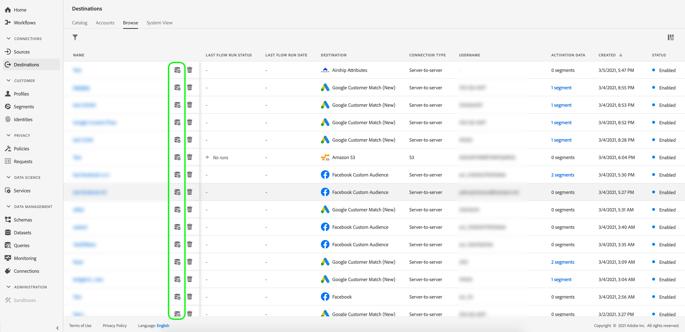

# Ativar perfis e segmentos para um destino

## Visão geral {#overview}

Ative os dados que você tem em [!DNL Adobe Experience Platform] mapeando segmentos para destinos. Para fazer isso, siga as etapas abaixo.

## Pré-requisitos {#prerequisites}

Para ativar dados em destinos, você deve ter [conectado com êxito um destino](./connect-destination.md). Se ainda não tiver feito isso, vá para o [catálogo de destinos](../catalog/overview.md), navegue pelos destinos compatíveis e configure um ou mais destinos.

## Ativar dados {#activate-data}

As etapas no fluxo de trabalho de ativação variam um pouco entre os tipos de destino. O fluxo de trabalho completo para todos os tipos de destino é descrito abaixo.

## Selecione para qual destino os dados serão ativados {#select-destination}

Aplica-se a: Todos os destinos

Na interface do usuário do Adobe Experience Platform, navegue até **[!UICONTROL Destinations]** > **[!UICONTROL Browse]** e clique no botão **[!UICONTROL Ativate]** correspondente ao destino onde deseja ativar seus segmentos, conforme mostrado na imagem abaixo.



Siga as etapas na próxima seção para selecionar os segmentos que deseja ativar.

## [!UICONTROL Etapa Selecionar ] segmentos {#select-segments}

Aplica-se a: Todos os destinos


No workflow **[!UICONTROL Ativate destination]**, na página **[!UICONTROL Select Segments]**, selecione um ou mais segmentos para ativar no destino. Selecione **[!UICONTROL Next]** para prosseguir para a próxima etapa.


## Etapa de mapeamento {#mapping}

>[!CONTEXTUALHELP]
>id="platform_destinations_activate_applytransformation"
>title="Aplicar transformação"
>abstract="Marque essa opção ao usar campos de origem sem hash para que o Adobe Experience Platform os faça automaticamente com hash na ativação."

Aplica-se a: destinos sociais e destino de publicidade da Correspondência de clientes do Google


Para destinos sociais, você deve selecionar atributos de origem ou namespaces de identidade para mapear como identidades de destino no destino.

## Exemplo: ativação de dados de público-alvo em [!DNL Facebook Custom Audience] {#example-facebook}

Abaixo está um exemplo do mapeamento de identidade correto ao ativar dados de público-alvo em [!DNL Facebook].

Seleção de campos de origem:

* Selecione o namespace `Email` como identidade de origem se os endereços de email que você está usando não estiverem com hash.
* Selecione o namespace `Email_LC_SHA256` como identidade de origem se tiver colocado hash em endereços de email de clientes na assimilação de dados em [!DNL Platform], de acordo com [!DNL Facebook] [requisitos de hash de email](../catalog/social/facebook.md#email-hashing-requirements).
* Selecione o namespace `PHONE_E.164` como identidade de origem se seus dados consistirem em números de telefone não com hash. [!DNL Platform] O hash os números de telefone estão em conformidade com  [!DNL Facebook] os requisitos.
* Selecione o namespace `Phone_SHA256` como identidade de origem se você tiver hash de números de telefone na assimilação de dados em [!DNL Platform], de acordo com [!DNL Facebook] [requisitos de hash de número de telefone](../catalog/social/facebook.md#phone-number-hashing-requirements).
* Selecione o namespace `IDFA` como identidade de origem se os dados consistem em [!DNL Apple] IDs de dispositivo.
* Selecione o namespace `GAID` como identidade de origem se os dados consistem em [!DNL Android] IDs de dispositivo.
* Selecione o namespace `Custom` como identidade de origem se os dados consistirem de outro tipo de identificadores.

Seleção de campos de destino:

* Selecione o namespace `Email_LC_SHA256` como identidade de destino quando os namespaces de origem forem `Email` ou `Email_LC_SHA256`.
* Selecione o namespace `Phone_SHA256` como identidade de destino quando os namespaces de origem forem `PHONE_E.164` ou `Phone_SHA256`.
* Selecione os namespaces `IDFA` ou `GAID` como identidade de destino quando os namespaces de origem forem `IDFA` ou `GAID`.
* Selecione o namespace `Extern_ID` como identidade de destino quando o namespace de origem for personalizado.


Os dados de namespaces sem hash são automaticamente atribuídos a hash por [!DNL Platform] após a ativação.

Os dados da fonte de atributo não são automaticamente transformados em hash. Quando o campo de origem contém atributos sem hash, marque a opção **[!UICONTROL Apply transformation]** para ter [!DNL Platform] hash automaticamente os dados na ativação.


 

## Exemplo: ativação de dados de público-alvo em [!DNL Google Customer Match] {#example-gcm}

Este é um exemplo do mapeamento de identidade correto ao ativar dados de público-alvo em [!DNL Google Customer Match].

Seleção de campos de origem:

* Selecione o namespace `Email` como identidade de origem se os endereços de email que você está usando não estiverem com hash.
* Selecione o namespace `Email_LC_SHA256` como identidade de origem se tiver colocado hash em endereços de email de clientes na assimilação de dados em [!DNL Platform], de acordo com [!DNL Google Customer Match] [requisitos de hash de email](../catalog/social/../advertising/google-customer-match.md).
* Selecione o namespace `PHONE_E.164` como identidade de origem se seus dados consistirem em números de telefone não com hash. [!DNL Platform] O hash os números de telefone estão em conformidade com  [!DNL Google Customer Match] os requisitos.
* Selecione o namespace `Phone_SHA256_E.164` como identidade de origem se você tiver hash de números de telefone na assimilação de dados em [!DNL Platform], de acordo com [!DNL Facebook] [requisitos de hash de número de telefone](../catalog/social/../advertising/google-customer-match.md).
* Selecione o namespace `IDFA` como identidade de origem se os dados consistem em [!DNL Apple] IDs de dispositivo.
* Selecione o namespace `GAID` como identidade de origem se os dados consistem em [!DNL Android] IDs de dispositivo.
* Selecione o namespace `Custom` como identidade de origem se os dados consistirem de outro tipo de identificadores.

Seleção de campos de destino:

* Selecione o namespace `Email_LC_SHA256` como identidade de destino quando os namespaces de origem forem `Email` ou `Email_LC_SHA256`.
* Selecione o namespace `Phone_SHA256_E.164` como identidade de destino quando os namespaces de origem forem `PHONE_E.164` ou `Phone_SHA256_E.164`.
* Selecione os namespaces `IDFA` ou `GAID` como identidade de destino quando os namespaces de origem forem `IDFA` ou `GAID`.
* Selecione o namespace `User_ID` como identidade de destino quando o namespace de origem for personalizado.


Os dados de namespaces sem hash são automaticamente atribuídos a hash por [!DNL Platform] após a ativação.

Os dados da fonte de atributo não são automaticamente transformados em hash. Quando o campo de origem contém atributos sem hash, marque a opção **[!UICONTROL Apply transformation]** para ter [!DNL Platform] hash automaticamente os dados na ativação.


## **** Etapa de agendamento {#scheduling}

Aplica-se a: Destinos de marketing por email e destinos de armazenamento em nuvem


[!DNL Adobe Experience Platform] exporta dados para marketing por email e destinos de armazenamento na nuvem na forma de  [!DNL CSV] arquivos. Na etapa **[!UICONTROL Scheduling]**, é possível configurar o agendamento e os nomes de arquivo para cada segmento que você está exportando. A configuração do agendamento é obrigatória, mas a configuração do nome do arquivo é opcional.

>[!IMPORTANT]
> 
>[!DNL Adobe Experience Platform] divide automaticamente os arquivos de exportação em 5 milhões de registros (linhas) por arquivo. Cada linha representa um perfil.
>
>Nomes de arquivos divididos são anexados com um número que indica que o arquivo faz parte de uma exportação maior, desta forma: `filename.csv`, `filename_2.csv`, `filename_3.csv`.

Selecione o botão **[!UICONTROL Create schedule]** correspondente ao segmento que você deseja enviar para o destino.


### Exportar arquivos completos {#export-full-files}

Selecione **[!UICONTROL Exportar arquivos completos]** para que seus arquivos exportados contenham um instantâneo completo de todos os perfis qualificados para esse segmento.


1. Use o seletor **[!UICONTROL Frequency]** para escolher entre exportações únicas (**[!UICONTROL Once]**) ou **[!UICONTROL Diariamente]**. Exportar um arquivo completo **[!UICONTROL Diariamente]** exporta o arquivo todos os dias da data inicial para a data final às 12:00 AM UTC (7:00 PM EST).

   >[!IMPORTANT]
   >
   >Ao definir a data de início e término, a **[!UICONTROL Data Inicial]** indica quando as exportações de arquivo estão programadas para iniciar e a **[!UICONTROL Data Final]** indica quando as exportações de arquivo estão programadas para parar. As exportações de arquivo iniciam na **[!UICONTROL Data inicial]**, mas não incluem a **[!UICONTROL Data final]**.
   >
   >Por exemplo, se você definir o seguinte agendamento:
   >
   >* Exportar: Incremental a cada 3 horas
   >* Data de início: 7/19
   >* Data final: 21/7

   >
   >Os arquivos começarão a exportar em 19/7 e pararão a exportação em 20/7 em 23:59:59 UTC. Não haverá arquivos entregues em 21/7.


2. Use o seletor **[!UICONTROL Time]** para escolher a hora do dia, no formato [!DNL UTC], em que a exportação deve ocorrer. Exportar um arquivo **[!UICONTROL Diariamente]** exporta o arquivo todos os dias da data de início para a data de término no momento selecionado.

   >[!IMPORTANT]
   >
   >Devido à forma como os processos internos do Experience Platform são configurados, a primeira exportação de arquivo incremental ou completo pode não conter todos os dados de preenchimento retroativo. <br> <br> Para garantir uma exportação de dados de preenchimento retroativo completa e mais atualizada para arquivos completos e incrementais, o Adobe recomenda definir o primeiro tempo de exportação de arquivo após as 12 PM GMT do dia seguinte. Essa é uma limitação que será abordada em versões futuras.

3. Use o seletor **[!UICONTROL Date]** para escolher o dia ou o intervalo em que a exportação deve ocorrer.
4. Selecione **[!UICONTROL Create]** para salvar o agendamento.

>[!IMPORTANT]
>
>No momento, não há suporte para a alteração do agendamento de exportação de arquivos para segmentos que já foram salvos. Para reexportar segmentos com uma programação diferente, você deve criar uma nova instância de destino. Esta é uma limitação que será abordada em versões futuras.

### Exportar arquivos incrementais {#export-incremental-files}

Selecione **[!UICONTROL Exportar arquivos incrementais]** para que seus arquivos exportados contenham apenas os perfis que se qualificaram para esse segmento desde a última exportação.

>[!IMPORTANT]
>
>O primeiro arquivo incremental exportado inclui todos os perfis qualificados para um segmento, que funcionam como um preenchimento retroativo.


1. Use o seletor **[!UICONTROL Frequency]** para escolher entre **[!UICONTROL Exportações Diárias]** ou **[!UICONTROL Por hora]**. Exportar um arquivo incremental **[!UICONTROL Diariamente]** exporta o arquivo todos os dias da data inicial para a data final às 12:00 PM UTC (7:00 AM EST).


   >[!IMPORTANT]
   >
   >Ao definir a data de início e término, a **[!UICONTROL Data Inicial]** indica quando as exportações de arquivo estão programadas para iniciar e a **[!UICONTROL Data Final]** indica quando as exportações de arquivo estão programadas para parar. As exportações de arquivo iniciam na **[!UICONTROL Data inicial]**, mas não incluem a **[!UICONTROL Data final]**.
   >
   >Por exemplo, se você definir o seguinte agendamento:
   >
   >* Exportar: Incremental a cada 3 horas
   >* Data de início: 7/19
   >* Data final: 21/7

   >
   >Os arquivos começarão a exportar em 19/7 e pararão a exportação em 20/7 em 23:59:59 UTC. Não haverá arquivos entregues em 21/7.

   * Ao selecionar **[!UICONTROL Por hora]**, use o seletor **[!UICONTROL Cada]** para escolher entre as opções **[!UICONTROL 3]**, **[!UICONTROL 6]**, **[!UICONTROL 8]** e **[!UICONTROL 12]** por hora.


1. Use o seletor **[!UICONTROL Time]** para escolher a hora do dia, no formato [!DNL UTC], em que a exportação deve ocorrer.

   >[!IMPORTANT]
   >
   >Devido à forma como os processos internos do Experience Platform são configurados, a primeira exportação de arquivo incremental ou completo pode não conter todos os dados de preenchimento retroativo. <br> <br> Para garantir uma exportação de dados de preenchimento retroativo completa e mais atualizada para arquivos completos e incrementais, o Adobe recomenda definir o primeiro tempo de exportação de arquivo após as 12 PM GMT do dia seguinte. Essa é uma limitação que será abordada em versões futuras.

1. Use o seletor **[!UICONTROL Date]** para escolher o dia ou o intervalo em que a exportação deve ocorrer.
1. Selecione **[!UICONTROL Create]** para salvar o agendamento.

>[!IMPORTANT]
>
>No momento, não há suporte para a alteração do agendamento de exportação de arquivos para segmentos que já foram salvos. Para reexportar segmentos com uma programação diferente, você deve criar uma nova instância de destino. Esta é uma limitação que será abordada em versões futuras.

### Configurar nomes de arquivo {#file-names}

Os nomes de arquivo padrão consistem em nome de destino, ID de segmento e um indicador de data e hora. Por exemplo, você pode editar os nomes de arquivo exportados para distinguir entre campanhas diferentes ou para ter o tempo de exportação de dados anexado aos arquivos.

Selecione o ícone de lápis para abrir uma janela modal e editar os nomes dos arquivos. Os nomes de arquivo são limitados a 255 caracteres.


No editor de nome de arquivo, é possível selecionar componentes diferentes para adicionar ao nome do arquivo.


O nome de destino e a ID de segmento não podem ser removidos dos nomes de arquivo. Além disso, você pode adicionar o seguinte:

* **[!UICONTROL Nome]** do segmento: Você pode anexar o nome do segmento ao nome do arquivo.
* **[!UICONTROL Data e hora]**: Selecione entre adicionar um  `MMDDYYYY_HHMMSS` formato ou um carimbo de data e hora de 10 dígitos do Unix da hora em que os arquivos são gerados. Escolha uma dessas opções se desejar que seus arquivos tenham um nome de arquivo dinâmico gerado com cada exportação incremental.
* **[!UICONTROL Texto]** personalizado: Adicione texto personalizado aos nomes dos arquivos.

Selecione **[!UICONTROL Aplicar alterações]** para confirmar a seleção.

>[!IMPORTANT]
> 
>Se você não selecionar o componente **[!UICONTROL Date and Time]**, os nomes de arquivo serão estáticos e o novo arquivo exportado substituirá o arquivo anterior no local de armazenamento com cada exportação. Ao executar um trabalho de importação recorrente de um local de armazenamento em uma plataforma de marketing por email, essa é a opção recomendada.

Após concluir a configuração de todos os segmentos, selecione **[!UICONTROL Next]** para continuar.

## **[!UICONTROL Etapa de]** agendamento do segmento {#segment-schedule}

Aplica-se a: destinos de publicidade, destinos sociais


Na página **[!UICONTROL Segment schedule]**, você pode definir a data de início do envio de dados para o destino e a frequência do envio de dados para o destino.

>[!IMPORTANT]
>
>Para destinos sociais, você deve selecionar a origem do público nesta etapa. Você pode prosseguir para a próxima etapa somente após selecionar uma das opções na imagem abaixo.


>[!IMPORTANT]
>
>Para Correspondência de clientes do Google, você deve fornecer a [!UICONTROL ID do aplicativo] nesta etapa, ao ativar os segmentos [!DNL IDFA] ou [!DNL GAID].


## **[!UICONTROL Selecionar etapa de]** atribuição {#select-attributes}

Aplica-se a: destinos de marketing por email e destinos de armazenamento em nuvem


Na página **[!UICONTROL Select attributes]**, selecione **[!UICONTROL Add new field]** e escolha os atributos que deseja enviar para o destino.

>[!NOTE]
>
> O Adobe Experience Platform preenche sua seleção com quatro atributos recomendados e comumente usados do esquema: `person.name.firstName`, `person.name.lastName`, `personalEmail.address`, `segmentMembership.status`.

As exportações de arquivo variam das seguintes maneiras, dependendo se `segmentMembership.status` estiver selecionado:
* Se o campo `segmentMembership.status` for selecionado, os arquivos exportados incluirão **[!UICONTROL membros Ativos]** no instantâneo completo inicial e **[!UICONTROL membros Ativos]** e **[!UICONTROL Expirados]** nas exportações incrementais subsequentes.
* Se o campo `segmentMembership.status` não estiver selecionado, os arquivos exportados incluirão apenas **[!UICONTROL membros Ativos]** no instantâneo completo inicial e nas exportações incrementais subsequentes.


### Atributos obrigatórios {#mandatory-attributes}

>[!CONTEXTUALHELP]
>id="platform_destinations_activate_mandatorykey"
>title="Sobre atributos obrigatórios"
>abstract="Selecione os atributos de esquema XDM que todos os perfis exportados devem incluir. Os perfis sem a chave obrigatória não são exportados para o destino. A não seleção de uma chave obrigatória exporta todos os perfis qualificados, independentemente de seus atributos."
>additional-url="http://www.adobe.com/go/destinations-mandatory-attributes-en" text="Saiba mais na documentação"

Você pode marcar atributos como obrigatórios para garantir que [!DNL Platform] exporte apenas os perfis que incluam o atributo específico. Como resultado, ele pode ser usado como uma forma adicional de filtragem. Marcar um atributo como obrigatório é **não** necessário.

A não seleção de um atributo obrigatório exporta todos os perfis qualificados, independentemente de seus atributos.

Recomenda-se que um dos atributos seja um [identificador exclusivo](../../destinations/catalog/email-marketing/overview.md#identity) do esquema. Para obter mais informações sobre atributos obrigatórios, consulte a seção de identidade na documentação [Destinos de marketing de email](../../destinations/catalog/email-marketing/overview.md#identity) .

### Chaves de desduplicação {#deduplication-keys}

>[!CONTEXTUALHELP]
>id="platform_destinations_activate_deduplicationkey"
>title="Sobre chaves de desduplicação"
>abstract="Elimine vários registros do mesmo perfil nos arquivos de exportação selecionando uma chave de desduplicação. Selecione um namespace único ou até dois atributos de esquema XDM como uma chave de desduplicação. Não selecionar uma chave de desduplicação pode levar a entradas de perfil duplicadas nos arquivos de exportação."
>additional-url="http://www.adobe.com/go/destinations-deduplication-keys-en" text="Saiba mais na documentação"

Chaves de desduplicação eliminam a possibilidade de ter vários registros do mesmo perfil em um arquivo de exportação.

Há três maneiras de usar as chaves de desduplicação em [!DNL Platform]:

* Uso de um único namespace de identidade como uma [!UICONTROL chave de desduplicação]
* Usar um único atributo de perfil de um perfil [!DNL XDM] como uma [!UICONTROL chave de desduplicação]
* Uso de uma combinação de dois atributos de perfil de um perfil [!DNL XDM] como uma chave composta

>[!IMPORTANT]
>
> Você pode exportar um único namespace de identidade para um destino, e o namespace é automaticamente definido como chave de desduplicação. Não há suporte para o envio de vários namespaces para um destino.
> 
> Não é possível usar uma combinação de namespaces de identidade e atributos de perfil como chaves de desduplicação.

### Exemplo de desduplicação {#deduplication-example}

Este exemplo ilustra como a desduplicação funciona, dependendo das chaves de desduplicação selecionadas.

Vamos considerar os dois perfis a seguir.

**Perfil A**

```json
{
  "identityMap": {
    "Email": [
      {
        "id": "johndoe_1@example.com"
      },
      {
        "id": "johndoe_2@example.com"
      }
    ]
  },
  "segmentMembership": {
    "ups": {
      "fa5c4622-6847-4199-8dd4-8b7c7c7ed1d6": {
        "status": "existing",
        "lastQualificationTime": "2021-03-10 10:03:08"
      }
    }
  },
  "person": {
    "name": {
      "lastName": "Doe",
      "firstName": "John"
    }
  },
  "personalEmail": {
    "address": "johndoe@example.com"
  }
}
```

**Perfil B**

```json
{
  "identityMap": {
    "Email": [
      {
        "id": "johndoe_1@example.com"
      },
      {
        "id": "johndoe_2@example.com"
      }
    ]
  },
  "segmentMembership": {
    "ups": {
      "fa5c4622-6847-4199-8dd4-8b7c7c7ed1d6": {
        "status": "existing",
        "lastQualificationTime": "2021-04-10 11:33:28"
      }
    }
  },
  "person": {
    "name": {
      "lastName": "D",
      "firstName": "John"
    }
  },
  "personalEmail": {
    "address": "johndoe@example.com"
  }
}
```

### Caso de uso de desduplicação 1: sem desduplicação

Sem desduplicação, o arquivo de exportação conteria as seguintes entradas.

| emailpessoal | firstName | lastName |
|---|---|---|
| johndoe@example.com | John | Doe |
| johndoe@example.com | John | D |


### Caso de uso de desduplicação 2: desduplicação com base no namespace de identidade

Considerando a desduplicação pelo namespace [!DNL Email], o arquivo de exportação conteria as seguintes entradas. O Perfil B é o mais recente que se qualificou para o segmento, por isso é o único que está sendo exportado.

| Email* | emailpessoal | firstName | lastName |
|---|---|---|---|
| johndoe_1@example.com | johndoe@example.com | John | D |
| johndoe_2@example.com | johndoe@example.com | John | D |

### Caso de uso de desduplicação 3: desduplicação com base em um único atributo de perfil

Considerando a desduplicação pelo atributo `personal Email`, o arquivo de exportação conteria a seguinte entrada. O Perfil B é o mais recente que se qualificou para o segmento, por isso é o único que está sendo exportado.

| emailpessoal* | firstName | lastName |
|---|---|---|
| johndoe@example.com | John | D |


### Caso de uso de desduplicação 4: desduplicação com base em dois atributos de perfil (chave de desduplicação composta)

Considerando a desduplicação pela chave composta `personalEmail + lastName`, o arquivo de exportação conteria as seguintes entradas.

| emailpessoal* | lastName* | firstName |
|---|---|---|
| johndoe@example.com | D | John |
| johndoe@example.com | Doe | John |


O Adobe recomenda selecionar um namespace de identidade, como [!DNL CRM ID] ou endereço de email como uma chave de desduplicação, para garantir que todos os registros de perfil sejam identificados exclusivamente.

>[!NOTE]
> 
>Se algum rótulo de uso de dados tiver sido aplicado a determinados campos em um conjunto de dados (em vez do conjunto de dados inteiro), a imposição desses rótulos em nível de campo na ativação ocorrerá sob as seguintes condições:
>
>* Os campos são usados na definição do segmento.
>* Os campos são configurados como atributos projetados para o destino.

>
> 
Por exemplo, se o campo `person.name.firstName` tiver determinados rótulos de uso de dados que entrem em conflito com a ação de marketing do destino, você verá uma violação da política de uso de dados na etapa de revisão. Para obter mais informações, consulte [Governança de dados no Adobe Experience Platform](../../rtcdp/privacy/data-governance-overview.md#destinations).

## **** Etapa de revisão {#review}

Aplica-se a: todos os destinos


Na página **[!UICONTROL Revisar]**, você pode ver um resumo da sua seleção. Selecione **[!UICONTROL Cancelar]** para quebrar o fluxo, **[!UICONTROL Voltar]** para modificar suas configurações ou **[!UICONTROL Concluir]** para confirmar sua seleção e começar a enviar dados para o destino.

>[!IMPORTANT]
>
>Nesta etapa, o Adobe Experience Platform verifica violações da política de uso de dados. Veja abaixo um exemplo de violação de uma política. Não é possível concluir o fluxo de trabalho de ativação de segmento até que você tenha resolvido a violação. Para obter informações sobre como resolver violações de política, consulte [Aplicação de política](../../rtcdp/privacy/data-governance-overview.md#enforcement) na seção Documentação de governança de dados.


Se nenhuma violação de política tiver sido detectada, selecione **[!UICONTROL Finish]** para confirmar a seleção e iniciar o envio de dados para o destino.


## Verificar se a ativação de segmentos foi bem-sucedida {#verify-activation}

### Destinos de marketing por email e destinos de armazenamento em nuvem {#esp-and-cloud-storage}

Para destinos de marketing por email e destinos de armazenamento na nuvem, o Adobe Experience Platform cria um arquivo `.csv` delimitado por tabulação no local de armazenamento fornecido. Espera que um novo arquivo seja criado no seu local de armazenamento todos os dias. O formato de arquivo padrão é:
`<destinationName>_segment<segmentID>_<timestamp-yyyymmddhhmmss>.csv`

Os arquivos que você receberia em três dias consecutivos podem ter a seguinte aparência:

```console
Salesforce_Marketing_Cloud_segment12341e18-abcd-49c2-836d-123c88e76c39_20200408061804.csv
Salesforce_Marketing_Cloud_segment12341e18-abcd-49c2-836d-123c88e76c39_20200409052200.csv
Salesforce_Marketing_Cloud_segment12341e18-abcd-49c2-836d-123c88e76c39_20200410061130.csv
```

A presença desses arquivos no local de armazenamento é a confirmação de uma ativação bem-sucedida. Para entender como os arquivos exportados são estruturados, você pode [baixar um arquivo .csv de amostra](../assets/common/sample_export_file_segment12341e18-abcd-49c2-836d-123c88e76c39_20200408061804.csv). Este arquivo de amostra inclui os atributos de perfil `person.firstname`, `person.lastname`, `person.gender`, `person.birthyear` e `personalEmail.address`.

## Destinos de publicidade

Verifique sua conta no respectivo destino de publicidade para o qual você está ativando seus dados. Se a ativação foi bem-sucedida, os públicos-alvo são preenchidos em sua plataforma de publicidade.

## Destinos sociais

Para [!DNL Facebook], uma ativação bem-sucedida significa que um público-alvo personalizado [!DNL Facebook] seria criado programaticamente no [[!UICONTROL Facebook Ads Manager]](https://www.facebook.com/adsmanager/manage/). A associação de segmento no público-alvo seria adicionada e removida, pois os usuários eram qualificados ou desqualificados para os segmentos ativados.

>[!TIP]
>
>A integração entre o Adobe Experience Platform e [!DNL Facebook] oferece suporte a preenchimentos retroativos de público-alvo históricos. Todas as qualificações de segmento histórico são enviadas para [!DNL Facebook] quando você ativa os segmentos para o destino.

## Desativar ativação {#disable-activation}

Para desativar um fluxo de ativação existente, siga as etapas abaixo:

1. Selecione **[!UICONTROL Destinations]** na barra de navegação esquerda, clique na guia **[!UICONTROL Browse]** e clique no nome do destino.
2. Clique no controle **[!UICONTROL Enabled]** no painel direito para alterar o estado do fluxo de ativação.
3. Na janela **Update data flow state**, selecione **Confirm** para desativar o fluxo de ativação.
