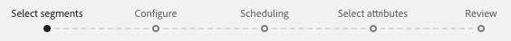
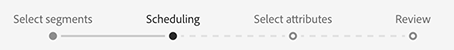
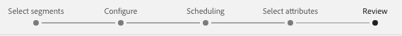

# Ativar perfis e segmentos em um destino

Ative os dados que você tem no Adobe Experience Platform mapeando segmentos para destinos. Para fazer isso, siga as etapas abaixo.

## Pré-requisitos {#prerequisites}

Para ativar os dados para destinos, você deve ter [conectado com êxito um destino](./connect-destination.md). Caso ainda não o tenha feito, vá para o catálogo [de destinos](../catalog/overview.md), navegue pelos destinos suportados e configure um ou mais destinos.

## Ativar dados {#activate-data}

As etapas no fluxo de trabalho da ativação variam ligeiramente entre os tipos de destino. O fluxo de trabalho completo para todos os tipos de destino está descrito abaixo.

### Selecione qual destino deseja ativar os dados para {#select-destination}

Aplica-se a: Todos os destinos

Na interface do usuário do Adobe Experience Platform, navegue até **[!UICONTROL Destinos]** > **[!UICONTROL Procurar]** e selecione o destino onde deseja ativar seus segmentos.


Selecione o nome do destino para navegar até o fluxo de trabalho da ativação.


Observe que se já existir um fluxo de trabalho de ativação para um destino, você poderá ver os segmentos que estão sendo ativados no momento para o destino. Selecione **[!UICONTROL Editar ativação]** no painel direito e siga as etapas abaixo para modificar os detalhes da ativação.

Depois de selecionar um destino, selecione **[!UICONTROL Ativar]**.

### [!UICONTROL Selecionar ] etapa de segmentos  {#select-segments}

Aplica-se a: Todos os destinos



No fluxo de trabalho **[!UICONTROL Ativar destino]**, na página **[!UICONTROL Selecionar segmentos]**, selecione um ou mais segmentos para ativar no destino. Selecione **[!UICONTROL Próximo]** para prosseguir para a próxima etapa.


### [!UICONTROL Identity ] mappingstep  {#identity-mapping}

Aplica-se a: destinos sociais e destino publicitário da Correspondência de clientes do Google


Para destinos sociais, você deve selecionar atributos de origem ou namespaces de identidade para mapear como identidades de público alvo no destino.

#### Exemplo: ativação de dados de audiência em [!DNL Facebook] {#example-facebook}

Este é um exemplo de mapeamento de identidade correto ao ativar dados de audiência em [!DNL Facebook].

Seleção de campos de origem:

* Selecione a namespace `Email` como identidade de origem se os endereços de email que você está usando não estiverem com hash.
* Selecione a namespace `Email_LC_SHA256` como identidade de origem se tiver efetuado hash dos endereços de correio eletrônico do cliente na ingestão de dados em [!DNL Platform], de acordo com [!DNL Facebook] [requisitos de hash de correio eletrônico](../catalog/social/facebook.md#email-hashing-requirements).
* Selecione a namespace `PHONE_E.164` como identidade de origem se seus dados consistem em números de telefone sem hash. [!DNL Platform] hash os números de telefone para atender aos  [!DNL Facebook] requisitos.
* Selecione a namespace `Phone_SHA256` como identidade de origem se você tiver hash de números de telefone na ingestão de dados em [!DNL Platform], de acordo com [!DNL Facebook] [requisitos de hash do número de telefone](../catalog/social/facebook.md#phone-number-hashing-requirements).
* Selecione a namespace `IDFA` como identidade de origem se seus dados consistem em [!DNL Apple] IDs de dispositivo.
* Selecione a namespace `GAID` como identidade de origem se seus dados consistem em [!DNL Android] IDs de dispositivo.
* Selecione a namespace `Custom` como identidade de origem se seus dados consistem em outro tipo de identificadores.

Seleção de campos de público alvo:

* Selecione a identidade `Email_LC_SHA256` namespace como público alvo quando suas namespaces de origem forem `Email` ou `Email_LC_SHA256`.
* Selecione a identidade `Phone_SHA256` da namespace como público alvo quando as namespaces de origem forem `PHONE_E.164` ou `Phone_SHA256`.
* Selecione as namespaces `IDFA` ou `GAID` como identidade de público alvo quando as namespaces de origem forem `IDFA` ou `GAID`.
* Selecione a identidade `Extern_ID` namespace como público alvo quando a namespace de origem for personalizada.


Os dados de namespaces sem hash são automaticamente hash por [!DNL Platform] na ativação.

Os dados da fonte do atributo não são automaticamente hash. Quando o campo de origem contiver atributos sem hash, marque a opção **[!UICONTROL Aplicar transformação]** para que [!DNL Platform] faça hash automático dos dados na ativação.


 

#### Exemplo: ativação de dados de audiência em [!DNL Google Customer Match] {#example-gcm}

Este é um exemplo de mapeamento de identidade correto ao ativar dados de audiência em [!DNL Google Customer Match].

Seleção de campos de origem:

* Selecione a namespace `Email` como identidade de origem se os endereços de email que você está usando não estiverem com hash.
* Selecione a namespace `Email_LC_SHA256` como identidade de origem se tiver efetuado hash dos endereços de correio eletrônico do cliente na ingestão de dados em [!DNL Platform], de acordo com [!DNL Google Customer Match] [requisitos de hash de correio eletrônico](../catalog/social/../advertising/google-customer-match.md).
* Selecione a namespace `PHONE_E.164` como identidade de origem se seus dados consistem em números de telefone sem hash. [!DNL Platform] hash os números de telefone para atender aos  [!DNL Google Customer Match] requisitos.
* Selecione a namespace `Phone_SHA256_E.164` como identidade de origem se você tiver hash de números de telefone na ingestão de dados em [!DNL Platform], de acordo com [!DNL Facebook] [requisitos de hash do número de telefone](../catalog/social/../advertising/google-customer-match.md).
* Selecione a namespace `IDFA` como identidade de origem se seus dados consistem em [!DNL Apple] IDs de dispositivo.
* Selecione a namespace `GAID` como identidade de origem se seus dados consistem em [!DNL Android] IDs de dispositivo.
* Selecione a namespace `Custom` como identidade de origem se seus dados consistem em outro tipo de identificadores.

Seleção de campos de público alvo:

* Selecione a identidade `Email_LC_SHA256` namespace como público alvo quando suas namespaces de origem forem `Email` ou `Email_LC_SHA256`.
* Selecione a identidade `Phone_SHA256_E.164` da namespace como público alvo quando as namespaces de origem forem `PHONE_E.164` ou `Phone_SHA256_E.164`.
* Selecione as namespaces `IDFA` ou `GAID` como identidade de público alvo quando as namespaces de origem forem `IDFA` ou `GAID`.
* Selecione a identidade `User_ID` namespace como público alvo quando a namespace de origem for personalizada.


Os dados de namespaces sem hash são automaticamente hash por [!DNL Platform] na ativação.

Os dados da fonte do atributo não são automaticamente hash. Quando o campo de origem contiver atributos sem hash, marque a opção **[!UICONTROL Aplicar transformação]** para que [!DNL Platform] faça hash automático dos dados na ativação.


<!-- 
`IDFA` IDs will be mapped to:

* [MADID](https://developers.facebook.com/docs/marketing-api/audiences/guides/custom-audiences#hash) if you are activating audiences in [[!DNL Facebook]](../../destinations/catalog/social/facebook.md).
* [mobileId](https://developers.google.com/adwords/api/docs/reference/v201809/AdwordsUserListService.Member#mobileid) if you are activating audiences in [[!DNL Google Customer Match]](../../destinations/catalog/advertising/google-customer-match.md).

Select `GAID` as target identity if your data consists of Android device IDs. `GAID` IDs will be mapped to:

* [MADID](https://developers.facebook.com/docs/marketing-api/audiences/guides/custom-audiences#hash) if you are activating audiences in [[!DNL Facebook]](../../destinations/catalog/social/facebook.md).
* [mobileId](https://developers.google.com/adwords/api/docs/reference/v201809/AdwordsUserListService.Member#mobileid) if you are activating audiences in [[!DNL Google Customer Match]](../../destinations/catalog/advertising/google-customer-match.md).

If you are using another ID, such as "Rewards ID" or "Loyalty ID", as primary identity in your schema, you need to map it to the following target identities:

* [EXTERN_ID](https://developers.facebook.com/docs/marketing-api/audiences/guides/custom-audiences#external_identifiers) if you are activating audiences in [[!DNL Facebook]](../../destinations/catalog/social/facebook.md).
* [USER_ID](https://developers.google.com/adwords/api/docs/reference/v201809/AdwordsUserListService.Member#userid) if you are activating audiences in [[!DNL Google Customer Match]](../../destinations/catalog/advertising/google-customer-match.md). -->

### **** Configurestep  {#configure}

Aplica-se a: Destinos de marketing por email e destinos de armazenamentos na nuvem


Na etapa **[!UICONTROL Configurar]**, é possível configurar o agendamento e os nomes de arquivo para cada segmento que você está exportando. A configuração do agendamento é obrigatória, mas a configuração do nome do arquivo é opcional.

Para adicionar um agendamento para o segmento, selecione **[!UICONTROL Criar agendamento]**.


Uma janela pop-up é exibida mostrando opções para criar a programação de segmentos.

* **Exportação** de arquivo: Você tem a opção de exportar arquivos completos ou incrementais. Exportar um arquivo completo publica um instantâneo completo de todos os perfis que se qualificam para esse segmento. Exportar um arquivo incremental publica o delta de perfis que se qualificam para esse segmento desde a última exportação.
* **Frequência**: Se a opção  **[!UICONTROL Exportar]** arquivo completo estiver selecionada, você terá a opção de exportar  **** uma vez ou  **[!UICONTROL diariamente]**. Se **[!UICONTROL Exportar arquivos incrementais]** estiver selecionado, você só terá a opção de exportar **[!UICONTROL Diariamente]**. Exportar um arquivo **[!UICONTROL Uma vez]** exporta o arquivo uma vez. Exportar um arquivo **[!UICONTROL Diariamente]** exporta o arquivo todos os dias da data do start para a data final às 12:00 AM UTC (7:00 PM EST) se arquivos completos estiverem selecionados e 12:00 PM UTC (7:00 AM EST) se os arquivos incrementais estiverem selecionados.
* **Data**: Se a opção  **** Ondas estiver selecionada, você poderá selecionar a data para a exportação única. Se **[!UICONTROL Diariamente]** estiver selecionado, você poderá selecionar as datas de start e término das exportações.


Os nomes de arquivo padrão consistem em nome de destino, ID de segmento e um indicador de data e hora. Por exemplo, é possível editar os nomes de arquivos exportados para distinguir entre campanhas diferentes ou para anexar o tempo de exportação de dados aos arquivos.

Selecione o ícone de lápis para abrir uma janela modal e editar os nomes dos arquivos. Observe que os nomes de arquivos são limitados a 255 caracteres.


No editor de nome de arquivo, você pode selecionar componentes diferentes para adicionar ao nome do arquivo. O nome de destino e a ID de segmento não podem ser removidos dos nomes de arquivo. Além disso, você pode adicionar o seguinte:

* **[!UICONTROL Nome]** do segmento: É possível anexar o nome do segmento ao nome do arquivo.
* **[!UICONTROL Data e hora]**: Selecione entre adicionar um  `MMDDYYYY_HHMMSS` formato ou um carimbo de data e hora Unix de 10 dígitos do horário em que os arquivos são gerados. Escolha uma dessas opções se desejar que seus arquivos tenham um nome de arquivo dinâmico gerado a cada exportação incremental.
* **[!UICONTROL Texto]** personalizado: Adicione texto personalizado aos nomes dos arquivos.

Selecione **[!UICONTROL Aplicar alterações]** para confirmar sua seleção.

>[!IMPORTANT]
> 
>Se você não selecionar o componente **[!UICONTROL Data e Hora]**, os nomes dos arquivos serão estáticos e o novo arquivo exportado substituirá o arquivo anterior no local do armazenamento a cada exportação. Ao executar um trabalho de importação recorrente de um local de armazenamento para uma plataforma de marketing por email, essa é a opção recomendada.


Após terminar de configurar todos os seus segmentos, selecione **[!UICONTROL Próximo]** para continuar.

### **[!UICONTROL Etapa]** do agendamento do segmento  {#segment-schedule}

Aplica-se a: destinos publicitários, destinos sociais


Na página **[!UICONTROL Agendamento do segmento]**, você pode definir a data do start para enviar dados para o destino, bem como a frequência do envio de dados para o destino.

>[!IMPORTANT]
>
>Para destinos sociais, você deve selecionar a origem de sua audiência nesta etapa. Você pode prosseguir para a próxima etapa somente depois de selecionar uma das opções na imagem abaixo.


>[!IMPORTANT]
>
>Para Correspondência de clientes do Google, você deve fornecer a [!UICONTROL ID do aplicativo] nesta etapa, ao ativar os segmentos [!DNL IDFA] ou [!DNL GAID].


### **[!UICONTROL Etapa]** de agendamento  {#scheduling}

Aplica-se a: destinos de marketing por email e destinos de armazenamentos na nuvem



Na página **[!UICONTROL Agendamento]**, você pode ver a data de start para enviar dados para o destino, bem como a frequência de envio de dados para o destino. Esses valores não podem ser editados.

### **[!UICONTROL Selecionar]** atribuição etapa  {#select-attributes}

Aplica-se a: destinos de marketing por email e destinos de armazenamentos na nuvem


Na página **[!UICONTROL Selecionar atributos]**, selecione **[!UICONTROL Adicionar novo campo]** e escolha os atributos que deseja enviar para o destino.

>[!NOTE]
>
> A Adobe Experience Platform preenche sua seleção antecipadamente com quatro atributos recomendados e comumente usados do seu schema: `person.name.firstName`, `person.name.lastName`, `personalEmail.address`, `segmentMembership.status`.

As exportações de arquivos variam das seguintes maneiras, dependendo se `segmentMembership.status` estiver selecionado:
* Se o campo `segmentMembership.status` for selecionado, os arquivos exportados incluirão **[!UICONTROL membros ativos]** no instantâneo completo inicial e **[!UICONTROL membros ativos]** e **[!UICONTROL expirados]** em exportações incrementais subsequentes.
* Se o campo `segmentMembership.status` não estiver selecionado, os arquivos exportados incluirão apenas **[!UICONTROL membros ativos]** no instantâneo completo inicial e em exportações incrementais subsequentes.


Além disso, é possível marcar atributos diferentes como obrigatórios. Marcar um atributo como obrigatório faz com que o segmento exportado contenha esse atributo. Como resultado, ele pode ser usado como uma forma adicional de filtragem. Marcar um atributo como obrigatório é **não** necessário.

É recomendável que um dos atributos seja [identificador exclusivo](../../destinations/catalog/email-marketing/overview.md#identity) do seu schema. Para obter mais informações sobre atributos obrigatórios, consulte a seção de identidade na documentação [Destinos de marketing de email](../../destinations/catalog/email-marketing/overview.md#identity).

>[!NOTE]
> 
>Se algum rótulo de uso de dados tiver sido aplicado a determinados campos em um conjunto de dados (em vez de todo o conjunto de dados), a imposição desses rótulos de nível de campo na ativação ocorrerá sob as seguintes condições:
>* Os campos são usados na definição do segmento.
>* Os campos são configurados como atributos projetados para o destino do público alvo.

>
> 
Por exemplo, se o campo `person.name.firstName` tiver determinados rótulos de uso de dados que entram em conflito com o caso de uso de marketing do destino, você verá uma violação da política de uso de dados na etapa de revisão. Para obter mais informações, consulte [Data Governance no Adobe Experience Platform](../../rtcdp/privacy/data-governance-overview.md#destinations).

### **** Reviewstep  {#review}

Aplica-se a: todos os destinos



Na página **[!UICONTROL Revisar]**, você pode ver um resumo de sua seleção. Selecione **[!UICONTROL Cancelar]** para interromper o fluxo, **[!UICONTROL Voltar]** para modificar as definições, ou **[!UICONTROL Concluir]** para confirmar a seleção e o start que envia dados para o destino.

>[!IMPORTANT]
>
>Nesta etapa, a Adobe Experience Platform verifica violações da política de uso de dados. Abaixo está um exemplo de violação de uma política. Não é possível concluir o fluxo de trabalho da ativação de segmentos até que você tenha resolvido a violação. Para obter informações sobre como resolver violações de política, consulte [Aplicação de política](../../rtcdp/privacy/data-governance-overview.md#enforcement) na seção de documentação de controle de dados.


Se nenhuma violação de política tiver sido detectada, selecione **[!UICONTROL Concluir]** para confirmar sua seleção e start enviando dados para o destino.


## Editar ativação {#edit-activation}

Siga as etapas abaixo para editar os fluxos de ativação existentes no Adobe Experience Platform:

1. Selecione **[!UICONTROL Destinos]** na barra de navegação esquerda, clique na guia **[!UICONTROL Procurar]** e clique no nome de destino.
2. Selecione **[!UICONTROL Editar ativação]** no painel direito para alterar quais segmentos enviar para o destino.

## Verifique se a ativação do segmento foi bem-sucedida {#verify-activation}

### Destinos de marketing de email e destinos de armazenamentos em nuvem {#esp-and-cloud-storage}

Para destinos de marketing por email e destinos de armazenamentos na nuvem, a Adobe Experience Platform cria um arquivo `.csv` ou `.txt` delimitado por tabulação no local do armazenamento fornecido. Espera que um novo arquivo seja criado no local do armazenamento todos os dias. O formato de arquivo padrão é:
`<destinationName>_segment<segmentID>_<timestamp-yyyymmddhhmmss>.csv|txt`

Observe que você pode editar o formato de arquivo. Para obter mais informações, vá para a etapa [Configurar](#configure) para destinos de armazenamentos em nuvem e destinos de marketing de email.

Com o formato de arquivo padrão, os arquivos que você receberia em três dias consecutivos podem ter a seguinte aparência:

```console
Salesforce_Marketing_Cloud_segment12341e18-abcd-49c2-836d-123c88e76c39_20200408061804.csv
Salesforce_Marketing_Cloud_segment12341e18-abcd-49c2-836d-123c88e76c39_20200409052200.csv
Salesforce_Marketing_Cloud_segment12341e18-abcd-49c2-836d-123c88e76c39_20200410061130.csv
```

A presença desses arquivos no local do seu armazenamento é a confirmação da ativação bem-sucedida. Para entender como os arquivos exportados são estruturados, você pode [baixar um arquivo .csv de amostra](../assets/common/sample_export_file_segment12341e18-abcd-49c2-836d-123c88e76c39_20200408061804.csv). Este arquivo de amostra inclui os atributos de perfil `person.firstname`, `person.lastname`, `person.gender`, `person.birthyear` e `personalEmail.address`.

### Destinos de publicidade

Verifique sua conta no respectivo destino de anúncio para o qual você está ativando seus dados. Se a ativação tiver sido bem-sucedida, as audiências serão preenchidas em sua plataforma de publicidade.

### Destinos da rede social

Para [!DNL Facebook], uma ativação bem-sucedida significa que uma [!DNL Facebook] audiência personalizada seria criada programaticamente em [[!UICONTROL Gerenciador de publicidade do Facebook]](https://www.facebook.com/adsmanager/manage/). A associação de segmento na audiência seria adicionada e removida, pois os usuários são qualificados ou desqualificados para os segmentos ativados.

>[!TIP]
>
>A integração entre o Adobe Experience Platform e [!DNL Facebook] oferece suporte a preenchimentos retroativos históricos de audiência. Todas as qualificações de segmento histórico são enviadas para [!DNL Facebook] quando você ativa os segmentos para o destino.

## Desativar ativação {#disable-activation}

Para desativar um fluxo de ativação existente, siga as etapas abaixo:

1. Selecione **[!UICONTROL Destinos]** na barra de navegação esquerda, clique na guia **[!UICONTROL Procurar]** e clique no nome de destino.
2. Clique no controle **[!UICONTROL Enabled]** no painel direito para alterar o estado do fluxo de ativação.
3. Na janela **Atualizar estado do fluxo de dados**, selecione **Confirmar** para desativar o fluxo de ativação.
