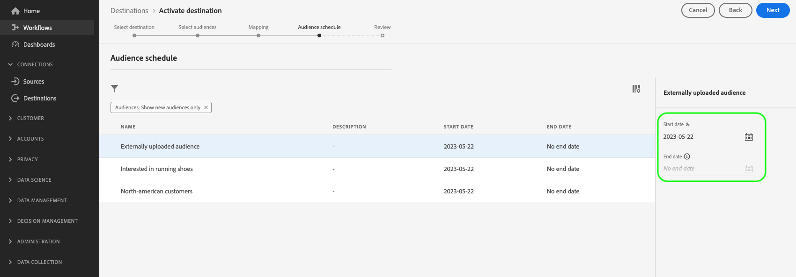

# Ativar públicos para destinos de personalização de borda

## Visão geral {#overview}

O Adobe Experience Platform usa a [segmentação de borda](../../segmentation/methods/edge-segmentation.md) juntamente com os [destinos de borda](/help/destinations/destination-types.md#edge-personalization-destinations) para permitir que os clientes criem e direcionem públicos-alvo em alta escala, em tempo real. Esse recurso ajuda a configurar casos de uso de personalização de mesma página e próxima página.

Exemplos de destinos de borda são as conexões [Adobe Target](../../destinations/catalog/personalization/adobe-target-connection.md) e [Personalização personalizada](../../destinations/catalog/personalization/custom-personalization.md).

>[!NOTE]
>
>Ao [configurar a conexão do Adobe Target](../catalog/personalization/adobe-target-connection.md) *sem* usando uma ID de sequência de dados, não há suporte para os casos de uso descritos neste artigo. Somente casos de uso de personalização da próxima sessão são compatíveis na ausência de um fluxo de dados.

>[!IMPORTANT]
> 
>* Para ativar os dados e habilitar a [etapa de mapeamento](#mapping) do fluxo de trabalho, você precisa das **[!UICONTROL View Destinations]**, **[!UICONTROL Activate Destinations]**, **[!UICONTROL View Profiles]** e **[!UICONTROL View Segments]** [permissões de controle de acesso](/help/access-control/home.md#permissions).
>* Para ativar dados sem passar pela [etapa de mapeamento](#mapping) do fluxo de trabalho, você precisa das **[!UICONTROL View Destinations]**, **[!UICONTROL Activate Segment without Mapping]**, **[!UICONTROL View Profiles]** e **[!UICONTROL View Segments]** [permissões de controle de acesso](/help/access-control/home.md#permissions).
>* Para exportar *identidades*, você precisa da **[!UICONTROL View Identity Graph]** [permissão de controle de acesso](/help/access-control/home.md#permissions).   {width="100" zoomable="yes"}
> 
> Leia a [visão geral do controle de acesso](/help/access-control/ui/overview.md) ou contate o administrador do produto para obter as permissões necessárias.

Este artigo explica o fluxo de trabalho necessário para ativar públicos para destinos de borda do Adobe Experience Platform. Quando usados junto com a [segmentação de borda](../../segmentation/methods/edge-segmentation.md) e o [mapeamento de atributos de perfil](#mapping) opcional, esses destinos habilitam casos de uso de personalização de mesma página e próxima página em suas propriedades da Web e móveis.

Para obter uma breve visão geral sobre como configurar a conexão do Adobe Target para personalização de borda, assista ao vídeo abaixo.

>[!NOTE]
>
>A interface do usuário do Experience Platform é atualizada com frequência e pode ter sido alterada desde a gravação deste vídeo. Para obter as informações mais atualizadas, consulte as etapas de configuração descritas nas seções abaixo.

>[!VIDEO](https://video.tv.adobe.com/v/3449798/?captions=por_br&quality=12&learn=on)

Para obter uma breve visão geral de como compartilhar públicos-alvo e atributos de perfil com a Adobe Target e destinos de personalização personalizados, assista ao vídeo abaixo.

>[!VIDEO](https://video.tv.adobe.com/v/3447360/?captions=por_br&quality=12&learn=on)

## Casos de uso {#use-cases}

Use as soluções de personalização da Adobe, como o Adobe Target, ou suas próprias plataformas de parceiros de personalização (por exemplo, [!DNL Optimizely], [!DNL Pega]), bem como sistemas proprietários (por exemplo, CMS interno) para potencializar uma experiência mais profunda de personalização do cliente por meio do destino [Personalization personalizada](../catalog/personalization/custom-personalization.md). Tudo isso enquanto também aproveita os recursos de coleta e segmentação de dados do Experience Platform Edge Network.

Os casos de uso descritos abaixo incluem personalização do site e publicidade direcionada no site.

Para habilitar esses casos de uso, os clientes precisam de uma forma rápida e simplificada de recuperar informações de atributos de perfil e público-alvo do Experience Platform e de enviar essas informações para as conexões do [Adobe Target](../catalog/personalization/adobe-target-connection.md) ou do [Personalization personalizado](../catalog/personalization/custom-personalization.md) na interface do usuário do Experience Platform.

### Personalização de mesma página {#same-page}

Um usuário visita uma página do site. Você pode usar as informações de visita da página atual (por exemplo, URL de referência, idioma do navegador, informações de produto inseridas) para selecionar a próxima ação ou decisão (por exemplo, personalização), usando a conexão [Personalização personalizada](../catalog/personalization/custom-personalization.md) para plataformas que não sejam da Adobe (por exemplo, [!DNL Pega], [!DNL Optimizely] ou outras.).

### Personalização da próxima página {#next-page}

Um usuário visita a Página A em seu site. Com base nessa interação, o usuário se qualificou para um conjunto de públicos-alvo. O usuário clica em um link que o leva da Página A para a Página B. Os públicos para os quais o usuário se qualificou durante a interação anterior na Página A, juntamente com as atualizações de perfil determinadas pela visita atual do site, serão usados para potencializar a próxima ação ou decisão (por exemplo, qual banner de publicidade exibir para o visitante ou, no caso de testes A/B, qual versão da página exibir).

### Personalização da próxima sessão {#next-session}

Um usuário visita várias páginas do site. Com base nessas interações, o usuário se qualificou para um conjunto de públicos-alvo. O usuário então encerra a sessão de navegação atual.

No dia seguinte, o usuário retorna ao mesmo site do cliente. Os públicos para os quais eles se qualificaram durante a interação anterior com todas as páginas do site visitadas, juntamente com as atualizações de perfil determinadas pela visita atual do site, serão usados para selecionar a próxima ação/decisão (por exemplo, qual banner de publicidade exibir para o visitante ou, no caso de testes A/B, qual versão da página exibir).

### Personalizar um banner de página inicial {#home-page-banner}

Uma empresa de vendas e aluguel de residências quer personalizar sua página inicial com um banner, com base nas qualificações de público-alvo no Adobe Experience Platform. A empresa pode selecionar quais públicos-alvo devem obter uma experiência personalizada e enviar esses públicos-alvo para o Adobe Target como critérios de direcionamento para sua oferta do Target.

## Pré-requisitos {#prerequisites}

### Configurar um fluxo de dados na interface da coleção de dados {#configure-datastream}

A primeira etapa na configuração do destino de personalização é configurar um fluxo de dados para o Experience Platform Web SDK. Isso é feito na interface da Coleção de dados.

Ao configurar a sequência de dados, em **[!UICONTROL Adobe Experience Platform]**, verifique se **[!UICONTROL Edge Segmentation]** e **[!UICONTROL Personalization Destinations]** estão selecionados.

>[!TIP]
>
>A partir da versão de abril de 2024, não é necessário marcar a caixa de seleção Segmentação do Edge ao [configurar a conexão com o Adobe Target](/help/destinations/catalog/personalization/adobe-target-connection.md). Nesse caso, a [personalização da próxima sessão](#next-session) é o único caso de uso de personalização disponível.

Para obter mais detalhes sobre como configurar uma sequência de dados, siga as instruções descritas na [documentação do Experience Platform Web SDK](../../datastreams/configure.md#aep).

### Criar uma política de mesclagem [!DNL Active-On-Edge] {#create-merge-policy}

Depois de criar a conexão de destino, você deve criar uma política de mesclagem do [!DNL Active-On-Edge]. A política de mesclagem do [!DNL Active-On-Edge] garante que os públicos-alvo sejam avaliados constantemente [na borda](../../segmentation/methods/edge-segmentation.md) e estejam disponíveis para o caso de uso de personalização em tempo real e na próxima página.

>[!IMPORTANT]
>
>Atualmente, os destinos de borda só oferecem suporte à ativação de públicos-alvo que usam a [Política de mesclagem ativa no Edge](../../segmentation/ui/segment-builder.md#merge-policies) definida como padrão. Se você mapear públicos-alvo que usam uma política de mesclagem diferente para destinos de borda, esses públicos-alvo não serão avaliados.

Siga as instruções em [criando uma política de mesclagem](../../profile/merge-policies/ui-guide.md#create-a-merge-policy) e habilite a opção **[!UICONTROL Active-On-Edge Merge Policy]**.

### Criar um novo público no Experience Platform {#create-audience}

Depois de criar a política de mesclagem [!DNL Active-On-Edge], você deve criar um novo público no Experience Platform.

Siga o guia do [construtor de público-alvo](../../segmentation/ui/segment-builder.md) para criar seu novo público-alvo e certifique-se de [atribuí-lo](../../segmentation/ui/segment-builder.md#merge-policies) à política de mesclagem do [!DNL Active-On-Edge] criada na etapa anterior.

### Criar uma conexão de destino {#connect-destination}

Após configurar o fluxo de dados, você pode começar a configurar o destino de personalização.

Siga o [tutorial de criação de conexão de destino](../ui/connect-destination.md) para obter instruções detalhadas sobre como criar uma nova conexão de destino.

Dependendo do destino que você estiver configurando, consulte os seguintes artigos para obter os pré-requisitos específicos do destino e informações relacionadas:

* [Conexão com o Adobe Target](../catalog/personalization/adobe-target-connection.md#parameters)
* [Conexão de personalização personalizada](../catalog/personalization/custom-personalization.md#parameters)

## Selecione seu destino {#select-destination}

Após concluir os pré-requisitos, agora é possível selecionar o destino de personalização de borda a ser usado para personalização de mesma página e próxima página.

1. Vá para **[!UICONTROL Connections > Destinations]** e selecione a guia **[!UICONTROL Catalog]**.

   

1. Selecione **[!UICONTROL Activate audiences]** no cartão correspondente ao destino de personalização no qual você deseja ativar seus públicos, conforme mostrado na imagem abaixo.

   

1. Selecione a conexão de destino que você deseja usar para ativar seus públicos e selecione **[!UICONTROL Next]**.

   

1. Mova para a próxima seção para [selecionar seus públicos-alvo](#select-audiences).

## Selecione seus públicos-alvo {#select-audiences}

Use as caixas de seleção à esquerda dos nomes de público-alvo para selecionar os públicos que você deseja ativar para o destino e selecione **[!UICONTROL Next]**.

Para selecionar os públicos que você deseja ativar para o destino, use as caixas de seleção à esquerda dos nomes de público e selecione **[!UICONTROL Next]**.

Você pode selecionar entre vários tipos de públicos-alvo, dependendo de sua origem:

* **[!UICONTROL Segmentation Service]**: Públicos-alvo gerados no Experience Platform pelo Serviço de segmentação. Consulte a [documentação de segmentação](../../segmentation/ui/overview.md) para obter mais detalhes.
* **[!UICONTROL Custom upload]**: públicos-alvo gerados fora do Experience Platform e carregados na Experience Platform como arquivos CSV. Para saber mais sobre públicos-alvo externos, consulte a documentação sobre [importação de um público-alvo](../../segmentation/ui/audience-portal.md#import-audience).
* Outros tipos de públicos-alvo, originados de outras soluções da Adobe, como o [!DNL Audience Manager].

## Mapear atributos {#mapping}

>[!IMPORTANT]
>
>Os atributos do perfil podem conter dados confidenciais. Para proteger esses dados, o destino **[!UICONTROL Custom Personalization]** exige que você use a [API do Edge Network](https://developer.adobe.com/data-collection-apis/docs/) ao configurar o destino para personalização baseada em atributos. Todas as chamadas de API do Edge Network devem ser feitas em um [contexto autenticado](https://developer.adobe.com/data-collection-apis/docs/getting-started/authentication/).
>
> Se já estiver usando o Web SDK ou o Mobile SDK para sua integração, você poderá recuperar atributos por meio da API do Edge Network adicionando uma integração do lado do servidor.
>
> Se você não seguir os requisitos acima, a personalização será baseada somente na associação ao público-alvo.

Selecione os atributos com base nos quais você deseja habilitar os casos de uso de personalização para seus usuários. Isso significa que se o valor de um atributo mudar ou se um atributo for adicionado a um perfil, esse perfil se tornará um membro do público-alvo e será ativado para o destino de personalização.

A adição de atributos é opcional, e você ainda pode prosseguir para a próxima etapa e ativar a personalização de mesma página e próxima página sem selecionar atributos. Se você não adicionar atributos nesta etapa, a personalização ainda ocorrerá com base na associação de público e nas qualificações do mapa de identidade para perfis.

### Selecionar atributos de origem {#select-source-attributes}

Para adicionar atributos de origem, selecione o controle **[!UICONTROL Add new field]** na coluna **[!UICONTROL Source field]** e pesquise ou navegue até o campo de atributo XDM desejado, conforme mostrado abaixo.

### Selecionar atributos de destino {#select-target-attributes}

Para adicionar atributos de destino, selecione o controle **[!UICONTROL Add new field]** na coluna **[!UICONTROL Target field]** e digite o nome do atributo personalizado para o qual você deseja mapear o atributo de origem.

>[!NOTE]
>
>A seleção de atributos de destino se aplica somente ao fluxo de trabalho de ativação do [Personalization Personalizado](../catalog/personalization/custom-personalization.md), para oferecer suporte ao mapeamento de campos de nome amigável na plataforma de destino.

## Programar exportação de público-alvo {#scheduling}

Por padrão, a página [!UICONTROL Audience schedule] mostra apenas os públicos recém-selecionados que você escolheu no fluxo de ativação atual.

Para ver todos os públicos-alvo sendo ativados para o seu destino, use a opção de filtragem e desabilite o filtro **[!UICONTROL Show new audiences only]**.

Na página **[!UICONTROL Audience schedule]**, selecione cada público e use os seletores **[!UICONTROL Start date]** e **[!UICONTROL End date]** para configurar o intervalo de tempo para enviar os dados ao seu destino.

Selecione **[!UICONTROL Next]** para ir para a página [!UICONTROL Review].

## Revisar {#review}

Na página **[!UICONTROL Review]**, você pode ver um resumo da sua seleção. Selecione **[!UICONTROL Cancel]** para interromper o fluxo, **[!UICONTROL Back]** para modificar suas configurações ou **[!UICONTROL Finish]** para confirmar sua seleção e começar a enviar dados para o destino.

### Avaliação da política de consentimento {#consent-policy-evaluation}

Se sua organização adquiriu o **Adobe Healthcare Shield** ou o **Adobe Privacy &amp; Security Shield**, selecione **[!UICONTROL View applicable consent policies]** para ver quais políticas de consentimento são aplicadas e quantos perfis são incluídos na ativação como resultado delas. Leia sobre [avaliação de política de consentimento](/help/data-governance/enforcement/auto-enforcement.md#consent-policy-evaluation) para obter mais informações.

### Verificações de política de uso de dados {#data-usage-policy-checks}

Na etapa **[!UICONTROL Review]**, a Experience Platform também verifica se há violações da política de uso de dados. Veja abaixo um exemplo de violação de uma política. Não é possível concluir o fluxo de trabalho de ativação de público-alvo até que a violação seja resolvida. Para obter informações sobre como resolver violações de política, leia sobre [violações de política de uso de dados](/help/data-governance/enforcement/auto-enforcement.md#data-usage-violation) na seção de documentação sobre governança de dados.

### Filtrar públicos {#filter-audiences}

Nesta etapa, é possível usar os filtros disponíveis na página para exibir somente os públicos-alvo cujo agendamento ou mapeamento foi atualizado como parte desse fluxo de trabalho. Você também pode alternar quais colunas da tabela deseja visualizar.

Se estiver satisfeito com a sua seleção e nenhuma violação de política tiver sido detectada, selecione **[!UICONTROL Finish]** para confirmar a seleção e começar a enviar dados para o destino.

<!--

Commenting out this part since destination monitoring is not available currently for the Adobe Target and Custom Personalization destinations.

## Verify audience activation {#verify}

Check the [destination monitoring documentation](../../dataflows/ui/monitor-destinations.md) for detailed information on how to monitor the flow of data to your destinations.

-->
