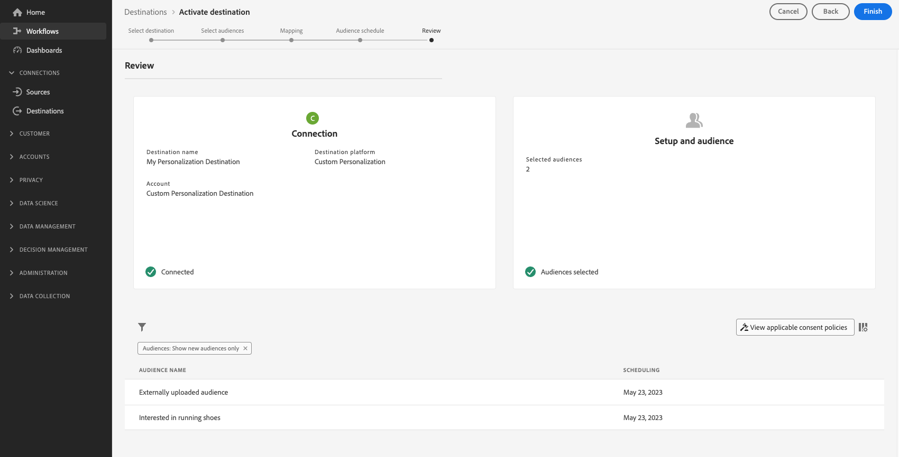

# Pesquisar atributos de perfil na borda em tempo real

A Adobe Experience Platform usa o [Perfil de cliente em tempo real](../../profile/home.md) como a única fonte da verdade para todos os dados de perfil. Para recuperação rápida de dados em tempo real, ele usa [perfis de borda](../../profile/edge-profiles.md), que são perfis leves distribuídos pela [Edge Network](../../collection/home.md#edge). Isso permite casos de uso de personalização rápidos e em tempo real.

## Casos de uso {#use-cases}

Abaixo estão dois casos de uso em que a pesquisa de perfil de borda pode ajudar.

* **Real-Time Personalization**: recupere rapidamente informações de perfil do perfil de borda para personalizar a experiência de um usuário em seu site.
* **Suporte ao Cliente**: recupere informações de perfil em tempo real quando um cliente ligar para um agente da central de suporte.

Esta página descreve as etapas que você deve seguir para pesquisar dados do perfil de borda em tempo real, fornecer experiências de personalização ou informar regras de decisão por meio de aplicativos downstream.

## Terminologia e pré-requisitos {#prerequisites}

Ao configurar o caso de uso descrito nesta página, você usará os seguintes componentes do Experience Platform:

* [Datastreams](../../datastreams/overview.md): uma sequência de dados recebe dados de evento do Web SDK e responde com dados de perfil de borda.
* [Políticas de mesclagem](../../segmentation/ui/segment-builder.md#merge-policies): você criará uma política de mesclagem [!UICONTROL Active-On-Edge] para garantir que os perfis de borda usem os dados de perfil corretos.
* [Conexão personalizada com o Personalization](../catalog/personalization/custom-personalization.md): você configurará uma nova conexão personalizada que enviará os atributos do perfil para o Edge Network.
* [API do Edge Network](https://developer.adobe.com/data-collection-apis/docs/): você usará a funcionalidade [coleção de dados interativa](https://developer.adobe.com/data-collection-apis/docs/endpoints/interact/) da API do Edge Network para recuperar rapidamente atributos de perfil dos perfis de borda.

## Medidas de proteção de desempenho {#guardrails}

Os casos de uso de pesquisa de perfil do Edge estão sujeitos às medidas de proteção de desempenho específicas descritas na tabela abaixo. Para obter mais detalhes sobre as medidas de proteção da API do Edge Network, consulte as medidas de proteção [página de documentação](https://developer.adobe.com/data-collection-apis/docs/getting-started/guardrails/).

| Serviço Edge Network | Segmentação do Edge | Solicitações por segundo |
|---------|----------|---------|
| [Destino de personalização personalizado](../catalog/personalization/custom-personalization.md) via [API do Edge Network](https://developer.adobe.com/data-collection-apis/docs/api/) | Sim | 1500 |
| [Destino de personalização personalizado](../catalog/personalization/custom-personalization.md) via [API do Edge Network](https://developer.adobe.com/data-collection-apis/docs/api/) | Não | 1500 |

## Etapa 1: Criar e configurar um fluxo de dados {#create-datastream}

Siga as etapas na documentação da [configuração da sequência de dados](../../datastreams/configure.md#create-a-datastream) para criar uma nova sequência de dados com as seguintes configurações **[!UICONTROL Service]**:

* **[!UICONTROL Service]**: [!UICONTROL Adobe Experience Platform]
* **[!UICONTROL Personalization Destinations]**: Habilitado
* **[!UICONTROL Edge Segmentation]**: Se você precisar de segmentação de borda, habilite essa opção. Se você estiver interessado apenas em pesquisar atributos de perfil na borda, mas não quiser executar nenhuma segmentação com base nos perfis de borda, deixe essa opção desativada.


<!-- >[!IMPORTANT]
>
>Enabling edge segmentation limits the maximum number of lookup requests to 1500 request per second. If you need a higher request throughput, disable edge segmentation for your datastream. See the [guardrails documentation](../guardrails.md#edge-destinations-activation) for detailed information. -->


## Etapa 2: configurar os públicos-alvo para avaliação de borda {#audience-edge-evaluation}

A pesquisa de atributos de perfil na borda exige que os públicos-alvo sejam configurados para avaliação de borda.

Verifique se os públicos que você planeja ativar têm a [Política de mesclagem ativa no Edge](../../segmentation/ui/segment-builder.md#merge-policies) definida como padrão. A política de mesclagem do [!DNL Active-On-Edge] garante que os públicos-alvo sejam avaliados constantemente [na borda](../../segmentation/methods/edge-segmentation.md) e estejam disponíveis para casos de uso de personalização em tempo real.

Siga as instruções em [criando uma política de mesclagem](../../profile/merge-policies/ui-guide.md#create-a-merge-policy) e habilite a opção **[!UICONTROL Active-On-Edge Merge Policy]**.

>[!IMPORTANT]
>
>Se os públicos-alvo usarem uma política de mesclagem diferente, você não poderá recuperar atributos de perfil da borda e não poderá executar a pesquisa de perfil da borda.

## Etapa 3: enviar dados do atributo de perfil para a Edge Network{#configure-custom-personalization-connection}

Para pesquisar perfis de borda, incluindo atributos e dados de associação de público-alvo, em tempo real, os dados precisam ser disponibilizados na Edge Network. Para isso, você deve criar uma conexão com um destino **[!UICONTROL Custom Personalization With Attributes]** e ativar os públicos, incluindo os atributos que você gostaria de pesquisar nos perfis de borda.

+++ Configurar uma conexão Personalization personalizada com atributos

Siga o [tutorial de criação de conexão de destino](../ui/connect-destination.md) para obter instruções detalhadas sobre como criar uma nova conexão de destino.

Ao configurar o novo destino, selecione a sequência de dados criada na [etapa 1](#create-datastream) no campo **[!UICONTROL Datastream ID]**. Para **[!UICONTROL Integration alias]** você pode usar qualquer valor que ajude a identificar essa conexão de destino no futuro, como o nome de destino.


+++

+++Ativar os públicos-alvo para a conexão Personalization personalizado com atributos

Depois de criar uma conexão **[!UICONTROL Custom Personalization With Attributes]**, você está pronto para enviar dados de perfil para a Edge Network.

>[!IMPORTANT]
> 
> * Para ativar os dados e habilitar a [etapa de mapeamento](#mapping) do fluxo de trabalho, você precisa das **[!UICONTROL View Destinations]**, **[!UICONTROL Activate Destinations]**, **[!UICONTROL View Profiles]** e **[!UICONTROL View Segments]** [permissões de controle de acesso](/help/access-control/home.md#permissions).
> 
> Leia a [visão geral do controle de acesso](/help/access-control/ui/overview.md) ou contate o administrador do produto para obter as permissões necessárias.

1. Vá para **[!UICONTROL Connections > Destinations]** e selecione a guia **[!UICONTROL Catalog]**.

   

1. Localize o cartão de destino **[!UICONTROL Custom Personalization With Attributes]** e selecione **[!UICONTROL Activate audiences]**, conforme mostrado na imagem abaixo.

   

1. Selecione a conexão de destino configurada anteriormente e selecione **[!UICONTROL Next]**.

   

1. Selecione seus públicos-alvo. Use as caixas de seleção à esquerda dos nomes de público-alvo para selecionar os públicos que você deseja ativar para o destino e selecione **[!UICONTROL Next]**.

   Você pode selecionar entre vários tipos de públicos-alvo, dependendo de sua origem:

   * **[!UICONTROL Segmentation Service]**: Públicos-alvo gerados no Experience Platform pelo Serviço de segmentação. Consulte a [documentação de segmentação](../../segmentation/ui/overview.md) para obter mais detalhes.
   * **[!UICONTROL Custom upload]**: públicos-alvo gerados fora do Experience Platform e carregados na Experience Platform como arquivos CSV. Para saber mais sobre públicos-alvo externos, consulte a documentação sobre [importação de um público-alvo](../../segmentation/ui/overview.md#import-audience).
   * Outros tipos de públicos-alvo, originados de outras soluções da Adobe, como o [!DNL Audience Manager].

     

1. Selecione os atributos de perfil que você deseja disponibilizar para os perfis de borda.

   * **Selecionar atributos de origem**. Para adicionar atributos de origem, selecione o controle **[!UICONTROL Add new field]** na coluna **[!UICONTROL Source field]** e pesquise ou navegue até o campo de atributo XDM desejado, conforme mostrado abaixo.

     

   * **Selecionar atributos de destino**. Para adicionar atributos de destino, selecione o controle **[!UICONTROL Add new field]** na coluna **[!UICONTROL Target field]** e digite o nome do atributo personalizado para o qual você deseja mapear o atributo de origem.

     

Quando terminar de mapear os atributos do perfil, selecione **[!UICONTROL Next]**.

Na página **[!UICONTROL Review]**, você pode ver um resumo da sua seleção. Selecione **[!UICONTROL Cancel]** para interromper o fluxo, **[!UICONTROL Back]** para modificar as configurações ou **[!UICONTROL Finish]** para confirmar a seleção e começar a enviar dados de perfil para a Edge Network.



+++

+++Avaliação da política de consentimento

Se sua organização adquiriu o **Adobe Healthcare Shield** ou o **Adobe Privacy &amp; Security Shield**, selecione **[!UICONTROL View applicable consent policies]** para ver quais políticas de consentimento são aplicadas e quantos perfis são incluídos na ativação como resultado delas. Leia sobre [avaliação de política de consentimento](/help/data-governance/enforcement/auto-enforcement.md#consent-policy-evaluation) para obter mais informações.

**Verificações de política de uso de dados**

Na etapa **[!UICONTROL Review]**, a Experience Platform também verifica se há violações da política de uso de dados. Veja abaixo um exemplo de violação de uma política. Não é possível concluir o fluxo de trabalho de ativação de público-alvo até que a violação seja resolvida. Para obter informações sobre como resolver violações de política, leia sobre [violações de política de uso de dados](/help/data-governance/enforcement/auto-enforcement.md#data-usage-violation) na seção de documentação sobre governança de dados.


+++

+++Filtrar públicos

Na etapa **[!UICONTROL Review]**, é possível usar os filtros disponíveis na página para exibir apenas os públicos-alvo cujo agendamento ou mapeamento foi atualizado como parte desse fluxo de trabalho. Você também pode alternar quais colunas da tabela deseja visualizar.


Se estiver satisfeito com a sua seleção e nenhuma violação de política tiver sido detectada, selecione **[!UICONTROL Finish]** para confirmar a seleção.

+++

## Etapa 4: pesquisar os atributos do perfil na borda {#configure-edge-profile-lookup}

Agora você já deve ter concluído a [configuração da sua sequência de dados](#create-datastream), você [criou uma nova conexão de destino Personalization Personalizada com Atributos](#configure-destination) e usou essa conexão para [enviar os atributos de perfil](#activate-audiences) que você poderá pesquisar na Edge Network.

A próxima etapa é configurar sua solução de personalização para recuperar atributos de perfil dos perfis de borda.

>[!IMPORTANT]
>
>Os atributos do perfil podem conter dados confidenciais. Para proteger esses dados, você deve recuperar os atributos do perfil por meio da [API do Edge Network](https://developer.adobe.com/data-collection-apis/docs/getting-started/). Além disso, você deve recuperar os atributos do perfil por meio da API do Edge Network [ponto de extremidade de coleta de dados interativa](https://developer.adobe.com/data-collection-apis/docs/endpoints/interact/), para que as chamadas de API sejam autenticadas.
>
>Se você não seguir os requisitos acima, a personalização será baseada somente na associação ao público-alvo e os atributos de perfil não estarão disponíveis para você.

A sequência de dados configurada na [etapa 1](#create-datastream) agora está pronta para aceitar dados de eventos de entrada e responder com informações de perfil de borda.

Configure sua integração para recuperar informações de perfil de borda conforme mostrado nos exemplos abaixo.

### Solicitação {#request}

Para recuperar dados do perfil de borda, envie uma chamada `POST` vazia para o ponto de extremidade `/interact`, com a identidade principal para a qual você está procurando os atributos de perfil incluídos no evento, conforme mostrado abaixo.

```shell
curl -X POST "https://server.adobedc.net/ee/v2/interact?dataStreamId={DATASTREAM_ID}" 
-H "Authorization: Bearer {TOKEN}" 
-H "x-gw-ims-org-id: {ORG_ID}" 
-H "x-api-key: {API_KEY}" 
-H "Content-Type: application/json" 
-d '{
    "event":
    {
        "xdm": {
            "identityMap": {
                "Email": [
                    {  
                        "id":"test123@adobetest.com",
                        "primary":true
                    }
                ]
            }
        }
    }
    
}'
```

| Parâmetro | Tipo | Obrigatório | Descrição |
| --- | --- | --- | --- |
| `dataStreamId` | `String` | Sim. | A ID da sequência de dados da sequência de dados criada em [etapa 1](#create-datastream). |

### Resposta {#response}

Uma resposta bem-sucedida retorna o status HTTP `200 OK`, com um objeto `Handle` que inclui informações semelhantes aos exemplos nas guias abaixo, dependendo se o perfil é encontrado na borda ou não.

>[!NOTE]
>
>As respostas da API são modulares e o objeto `handle` pode incluir vários objetos `payload` de vários tipos. As informações relacionadas à pesquisa de perfil de borda estão agrupadas sob o objeto `payload` com `"type": "activation:pull"`,

>[!BEGINTABS]

>[!TAB Perfil existente na borda]

Se o perfil existir na borda, dependendo dos atributos e públicos-alvo do perfil ativados para a borda, você pode esperar uma resposta com atributos e associações de público-alvo semelhantes à abaixo.

```json
{
  "requestId": "3c600138-d785-42ca-a025-bb725f4b5da9",
  "handle": [
    {
      "payload": [
        {
          "type": "profileLookup",
          "destinationId": "9218b727-ec59-4a46-b8b9-05503f138c5d",
          "alias": "rk-demo-custom-personalization-XXXX",
          "attributes": {
            "zip": {
              "value": "19000"
            },
            "firstName": {
              "value": "Test"
            },
            "lastName": {
              "value": "User123"
            },
            "gender": {
              "value": "male"
            },
            "city": {
              "value": "Philadelphia"
            },
            "state": {
              "value": "PA"
            },
            "email": {
              "value": "test123@adobetest.com"
            }
          },
          "segments": [
            {
              "id": "85018bd8-7ad1-4e17-ae30-8389c04bd3c0",
              "namespace": "ups"
            },
            {
              "id": "d09a8159-8b30-4178-b2f2-7a8c5e3168d9",
              "namespace": "ups"
            }
          ]
        }
      ],
      "type": "activation:pull",
      "eventIndex": 0
    }
  ]
}
```

O objeto `handle` fornece as informações descritas na tabela abaixo.

| Parâmetro | Descrição |
|---------|----------|
| `payload` | O objeto `payload` que inclui as informações de pesquisa de borda. A resposta pode conter vários objetos `payload` adicionais, não relacionados à pesquisa de borda. |
| `type` | As cargas são agrupadas na resposta por seu tipo. O tipo de carga para a pesquisa de perfil de borda é sempre definido como `profileLookup`. |
| `destinationId` | A ID da instância de conexão **[!UICONTROL Custom Personalization]** que você criou em [etapa 3](#configure-custom-personalization-connection). |
| `alias` | O alias da conexão de destino, configurado pelo usuário quando ele cria a conexão de destino do [Personalization Personalizado](../catalog/personalization/custom-personalization.md). |
| `attributes` | Esta matriz inclui os atributos do perfil de borda dos públicos ativados na [etapa 3](#configure-custom-personalization-connection). |
| `segments` | Esta matriz inclui os públicos ativados na [etapa 3](#configure-custom-personalization-connection). |
| `type` | `handle` objetos são agrupados por tipo. Para casos de uso de pesquisa de perfil de borda, o tipo do objeto `handle` é sempre `activation:pull`. |
| `eventIndex` | O Edge Network recebe eventos do cliente na forma de arrays. A ordem dos eventos na matriz é preservada durante o processamento e refletida por esse índice. A indexação do evento começa com `0`. |

>[!TAB O perfil não existe na borda]

Se o perfil não existir na borda, você pode esperar uma resposta semelhante à abaixo.

```json
{
  "requestId": "531b541a-4541-419e-ac99-fd7e452f0c0f",
  "handle": [
    {
      "payload": [],
      "type": "activation:pull",
      "eventIndex": 0
    }
  ]
}
```

O objeto `handle` fornece as informações descritas na tabela abaixo.

| Parâmetro | Descrição |
|---------|----------|
| `payload` | Quando o perfil não está presente na borda, o objeto `payload` fica vazio. |
| `type` | `payload` objetos são agrupados por tipo. Para casos de uso de pesquisa de perfil de borda, o tipo do objeto `payload` é sempre `activation:pull`. |
| `eventIndex` | O Edge Network recebe eventos do cliente na forma de arrays. A ordem dos eventos na matriz é preservada durante o processamento e refletida por esse índice. A indexação do evento começa com `0`. |

>[!ENDTABS]

>[!SUCCESS]
>
>Se você tiver configurado a integração corretamente, agora terá acesso aos dados do perfil de borda e poderá usar os atributos e a associação do público-alvo dos perfis de borda para acionar a personalização em tempo real no mecanismo de personalização downstream.

## Conclusão {#conclusion}

Seguindo as etapas acima, você pode pesquisar com eficiência atributos de perfil de borda em tempo real, permitindo experiências personalizadas e tomada de decisão informada por meio de aplicativos de downstream.
