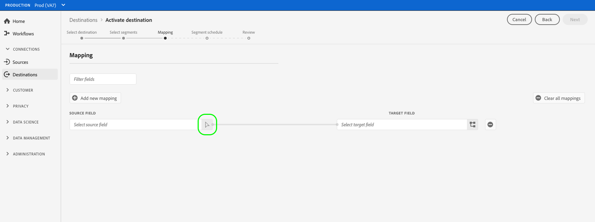

# Ativar os dados do público-alvo para os destinos de exportação do segmento de fluxo

## Visão geral {#overview}

Este artigo explica o fluxo de trabalho necessário para ativar os dados do público-alvo nos destinos de transmissão do segmento do Adobe Experience Platform.

## Pré-requisitos {#prerequisites}

Para ativar dados em destinos, você deve ter [conectado com êxito a um destino](./connect-destination.md). Se ainda não tiver feito isso, vá para o [catálogo de destinos](../catalog/overview.md), navegue pelos destinos compatíveis e configure o destino que deseja usar.

## Selecione o destino {#select-destination}

1. Vá para **[!UICONTROL Connections > Destinations]** e selecione a guia **[!UICONTROL Browse]**.

   

1. Selecione o botão **[!UICONTROL Add segments]** correspondente ao destino onde você deseja ativar seus segmentos, conforme mostrado na imagem abaixo.

   

1. Mova para a próxima seção para [selecionar seus segmentos](#select-segments).

## Selecione seus segmentos {#select-segments}

Use as caixas de seleção à esquerda dos nomes de segmentos para selecionar os segmentos que deseja ativar para o destino e selecione **[!UICONTROL Next]**.

## Mapear atributos e identidades {#mapping}

>[!CONTEXTUALHELP]
>id="platform_destinations_activate_applytransformation"
>title="Aplicar transformação"
>abstract="Marque essa opção ao usar campos de origem sem hash para que o Adobe Experience Platform os faça automaticamente com hash na ativação."

>[!IMPORTANT]
>
>Essa etapa se aplica somente a alguns destinos de transmissão de segmento. Se os destinos não tiverem uma etapa **[!UICONTROL Mapping]**, pule para [Schedule segment export](#scheduling).

Alguns destinos de transmissão de segmento exigem que você selecione atributos de origem ou namespaces de identidade para mapear como identidades de destino no destino.

1. Na página **[!UICONTROL Mapeamento]**, selecione **[!UICONTROL Adicionar novo mapeamento]**.

   

1. Selecione a seta à direita da entrada **[!UICONTROL Source field]**.

   

1. Na página **[!UICONTROL Selecionar campo de origem]**, use as opções **[!UICONTROL Selecionar atributos]** ou **[!UICONTROL Selecionar namespace de identidade]** para alternar entre as duas categorias de campos de origem disponíveis. Nos [!DNL XDM] atributos de perfil e namespaces de identidade disponíveis, selecione aqueles que deseja mapear para o destino e escolha **[!UICONTROL Selecionar]**.

   

1. Selecione o botão à direita da entrada **[!UICONTROL Target field]**.

   

1. Na página **[!UICONTROL Selecionar campo de destino]**, selecione o namespace de identidade de destino para o qual deseja mapear o campo de origem e escolha **[!UICONTROL Selecionar]**.

   

1. Para adicionar mais mapeamentos, repita as etapas de 1 a 5.

## Agendar exportação de segmentos {#scheduling}

1. Na página **[!UICONTROL Segment schedule]**, selecione cada segmento e use os seletores **[!UICONTROL Start date]** e **[!UICONTROL End date]** para configurar o intervalo de tempo para enviar dados ao seu destino.

   

   * Alguns destinos exigem que você selecione a **[!UICONTROL Origin of audience]** para cada segmento, usando o menu suspenso abaixo dos seletores de calendário. Se o destino não incluir esse seletor, pule esta etapa.

      

   * Alguns destinos exigem que você mapeie manualmente os segmentos [!DNL Platform] para sua contraparte no destino. Para fazer isso, selecione cada segmento e insira a ID de segmento correspondente na plataforma de destino no campo **[!UICONTROL Mapping ID]**. Se o destino não incluir este campo, pule esta etapa.

      

   * Alguns destinos exigem que você insira uma **[!UICONTROL ID do aplicativo]** ao ativar os segmentos [!DNL IDFA] ou [!DNL GAID]. Se o destino não incluir este campo, pule esta etapa.

      

1. Selecione **[!UICONTROL Next]** para ir para a página [!UICONTROL Review].

## Revisão {#review}

Na página **[!UICONTROL Revisar]**, você pode ver um resumo da sua seleção. Selecione **[!UICONTROL Cancelar]** para quebrar o fluxo, **[!UICONTROL Voltar]** para modificar suas configurações ou **[!UICONTROL Concluir]** para confirmar sua seleção e começar a enviar dados para o destino.

>[!IMPORTANT]
>
>Nesta etapa, o Adobe Experience Platform verifica violações da política de uso de dados. Veja abaixo um exemplo de violação de uma política. Não é possível concluir o fluxo de trabalho de ativação de segmento até que você tenha resolvido a violação. Para obter informações sobre como resolver violações de política, consulte [Aplicação de política](../../rtcdp/privacy/data-governance-overview.md#enforcement) na seção Documentação de governança de dados.

Se nenhuma violação de política tiver sido detectada, selecione **[!UICONTROL Finish]** para confirmar a seleção e iniciar o envio de dados para o destino.

## Verificar ativação de segmento {#verify}

Verifique a conta de destino. Se a ativação tiver sido bem-sucedida, os públicos-alvo serão preenchidos na plataforma de destino.

<!-- 
For [!DNL Facebook Custom Audience], a successful activation means that a [!DNL Facebook] custom audience would be created programmatically in [[!UICONTROL Facebook Ads Manager]](https://www.facebook.com/adsmanager/manage/). Segment membership in the audience would be added and removed as users are qualified or disqualified for the activated segments.

>[!TIP]
>
>The integration between Adobe Experience Platform and [!DNL Facebook] supports historical audience backfills. All historical segment qualifications are sent to [!DNL Facebook] when you activate the segments to the destination.
-->
