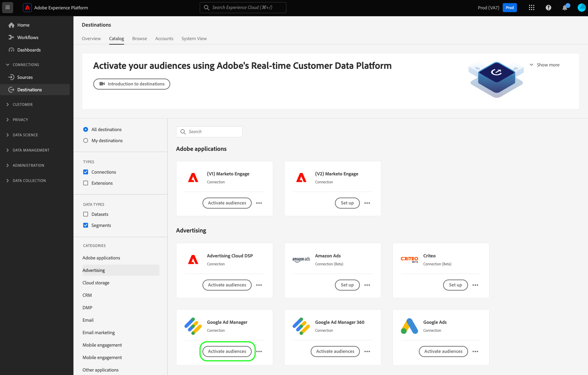
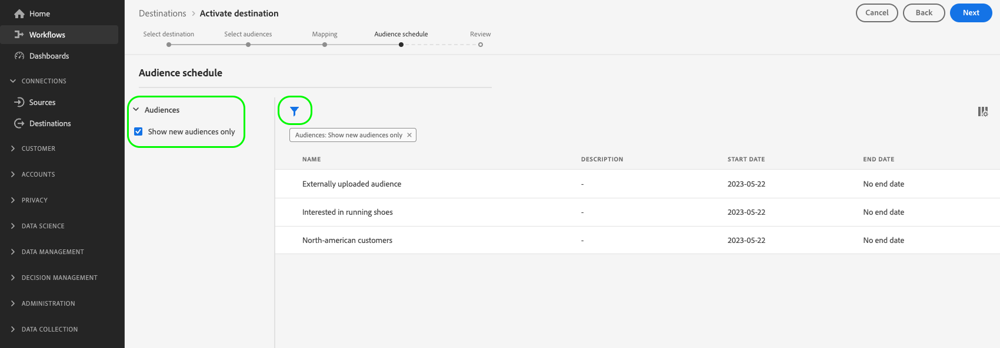
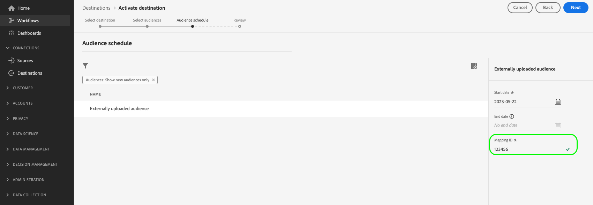

# Ativar públicos para destinos de transmissão

>[!IMPORTANT]
> 
> * Para ativar públicos e habilitar a [etapa de mapeamento](#mapping) do fluxo de trabalho, você precisa das **[!UICONTROL View Destinations]**, **[!UICONTROL Activate Destinations]**, **[!UICONTROL View Profiles]** e **[!UICONTROL View Segments]** [permissões de controle de acesso](/help/access-control/home.md#permissions).
> * Para ativar os públicos-alvo sem passar pela [etapa de mapeamento](#mapping) do fluxo de trabalho, você precisa das **[!UICONTROL View Destinations]**, **[!UICONTROL Activate Segment without Mapping]**, **[!UICONTROL View Profiles]** e **[!UICONTROL View Segments]** [permissões de controle de acesso](/help/access-control/home.md#permissions).
> * Para exportar *identidades*, você precisa da **[!UICONTROL View Identity Graph]** [permissão de controle de acesso](/help/access-control/home.md#permissions).   {width="100" zoomable="yes"}
> 
> Leia a [visão geral do controle de acesso](/help/access-control/ui/overview.md) ou contate o administrador do produto para obter as permissões necessárias.

## Visão geral {#overview}

Este artigo explica o fluxo de trabalho necessário para ativar públicos-alvo em destinos de transmissão do Adobe Experience Platform.

## Pré-requisitos {#prerequisites}

Para ativar públicos para destinos, você deve ter [se conectado com êxito a um destino](./connect-destination.md). Se ainda não tiver feito isso, vá para o [catálogo de destinos](../catalog/overview.md), navegue pelos destinos compatíveis e configure o destino que deseja usar.

## Selecione seu destino {#select-destination}

1. Vá para **[!UICONTROL Connections > Destinations]** e selecione a guia **[!UICONTROL Catalog]**.

   

1. Selecione **[!UICONTROL Activate audiences]** no cartão correspondente ao destino em que você deseja ativar os públicos-alvo, conforme mostrado na imagem abaixo.

   

1. Selecione a conexão de destino que você deseja usar para ativar seus públicos e selecione **[!UICONTROL Next]**.

   

1. Mova para a próxima seção para [selecionar seus públicos-alvo](#select-audiences).

## Selecione seus públicos-alvo {#select-audiences}

Para selecionar os públicos que você deseja ativar para o destino, use as caixas de seleção à esquerda dos nomes de público e selecione **[!UICONTROL Next]**.

Você pode selecionar entre vários tipos de públicos-alvo, dependendo de sua origem:

* **[!UICONTROL Segmentation Service]**: Públicos-alvo gerados no Experience Platform pelo Serviço de segmentação. Consulte a [documentação de segmentação](../../segmentation/ui/overview.md) para obter mais detalhes.
* **[!UICONTROL Custom upload]**: públicos-alvo gerados fora do Experience Platform e carregados na Experience Platform como arquivos CSV. Para saber mais sobre públicos-alvo externos, consulte a documentação sobre [importação de um público-alvo](../../segmentation/ui/audience-portal.md#import-audience).
* Outros tipos de públicos-alvo, originados de outras soluções da Adobe, como o [!DNL Audience Manager].

## Mapear atributos e identidades {#mapping}

>[!IMPORTANT]
>
>Esta etapa se aplica somente a alguns destinos de transmissão de público. Se o destino não tiver uma etapa **[!UICONTROL Mapping]**, pule para [agendamento de público-alvo](#scheduling).
>
>Ao ativar públicos para destinos de streaming, você também deve mapear *pelo menos um namespace de identidade de destino*, além dos atributos de perfil de destino. Caso contrário, os públicos-alvo não serão ativados para a plataforma de destino.
>  {zoomable="yes"}

Alguns destinos de transmissão de público exigem que você selecione atributos de origem ou namespaces de identidade para mapear como identidades de destino no destino.

1. Na página **[!UICONTROL Mapping]**, selecione **[!UICONTROL Add new mapping]**.

   

1. Selecione a seta à direita da entrada **[!UICONTROL Source field]**.

   

1. Na página **[!UICONTROL Select source field]**, use as opções **[!UICONTROL Select attributes]** ou **[!UICONTROL Select identity namespace]** para alternar entre as duas categorias de campos de origem disponíveis. Nos atributos de perfil e namespaces de identidade [!DNL XDM] disponíveis, selecione aqueles que você deseja mapear para o destino e escolha **[!UICONTROL Select]**.

   Use a opção **[!UICONTROL Show only fields with data]** para exibir apenas campos de esquema preenchidos com valores. Por padrão, somente os campos de esquema preenchidos são exibidos.

   

1. Selecione o botão à direita da entrada **[!UICONTROL Target field]**.

   

1. Na página **[!UICONTROL Select target field]**, selecione o namespace de identidade de destino para o qual você deseja mapear o campo de origem e escolha **[!UICONTROL Select]**.

   

1. Para adicionar mais mapeamentos, repita as etapas de 1 a 5.

### Aplicar transformação {#apply-transformation}

>[!CONTEXTUALHELP]
>id="platform_destinations_activate_applytransformation"
>title="Aplicar transformação"
>abstract="Marque essa opção ao usar campos de origem sem hash, para que a Adobe Experience Platform faça o hash automaticamente na ativação."

Ao mapear atributos de origem com hash não atribuídos para atributos de destino que o destino espera que tenham hash (por exemplo: `email_lc_sha256` ou `phone_sha256`), marque a opção **Aplicar transformação** para que o Adobe Experience Platform coloque os atributos de origem em hash automaticamente na ativação.

## Programar exportação de público-alvo {#scheduling}

>[!CONTEXTUALHELP]
>id="platform_destinations_activate_enddate"
>title="Data final"
>abstract="A adição de uma data final para a programação de público-alvo não está disponível."

Por padrão, a página **[!UICONTROL Audience schedule]** mostra apenas os públicos recém-selecionados que você escolheu no fluxo de ativação atual.

Para ver todos os públicos-alvo sendo ativados para o seu destino, use a opção de filtragem e desabilite o filtro **[!UICONTROL Show new audiences only]**.

1. Na página **[!UICONTROL Audience schedule]**, selecione cada público e use os seletores **[!UICONTROL Start date]** e **[!UICONTROL End date]** para configurar o intervalo de tempo para enviar os dados ao seu destino.

   

   * Alguns destinos exigem que você selecione o **[!UICONTROL Origin of audience]** para cada público-alvo, usando o menu suspenso abaixo dos seletores de calendário. Se o destino não incluir esse seletor, ignore esta etapa.

     

   * Alguns destinos exigem que você mapeie manualmente [!DNL Experience Platform] públicos-alvo para seus homólogos no destino-alvo. Para fazer isso, selecione cada público e insira a ID de público correspondente na plataforma de destino no campo **[!UICONTROL Mapping ID]**. Se o destino não incluir esse campo, ignore esta etapa.

     

   * Alguns destinos exigem que você insira um **[!UICONTROL App ID]** ao ativar [!DNL IDFA] ou [!DNL GAID] públicos-alvo. Se o destino não incluir esse campo, ignore esta etapa.

     

1. Selecione **[!UICONTROL Next]** para ir para a página [!UICONTROL Review].

## Revisar {#review}

Na página **[!UICONTROL Review]**, você pode ver um resumo da sua seleção. Selecione **[!UICONTROL Cancel]** para interromper o fluxo, **[!UICONTROL Back]** para modificar suas configurações ou **[!UICONTROL Finish]** para confirmar sua seleção e começar a enviar dados para o destino.

### Avaliação da política de consentimento {#consent-policy-evaluation}

Se sua organização adquiriu o **Adobe Healthcare Shield** ou o **Adobe Privacy &amp; Security Shield**, selecione **[!UICONTROL View applicable consent policies]** para ver quais políticas de consentimento são aplicadas e quantos perfis são incluídos na ativação como resultado delas. Leia sobre [avaliação de política de consentimento](/help/data-governance/enforcement/auto-enforcement.md#consent-policy-evaluation) para obter mais informações.

### Verificações de política de uso de dados {#data-usage-policy-checks}

Na etapa **[!UICONTROL Review]**, a Experience Platform também verifica se há violações da política de uso de dados. Veja abaixo um exemplo de violação de uma política. Não é possível concluir o fluxo de trabalho de ativação de público-alvo até que a violação seja resolvida. Para obter informações sobre como resolver violações de política, leia sobre [violações de política de uso de dados](/help/data-governance/enforcement/auto-enforcement.md#data-usage-violation) na seção de documentação sobre governança de dados.

### Filtrar públicos {#filter-audiences}

Também nesta etapa é possível usar os filtros disponíveis na página para exibir somente os públicos-alvo cujo agendamento ou mapeamento foi atualizado como parte desse fluxo de trabalho. Você também pode alternar quais colunas da tabela deseja visualizar.

Se estiver satisfeito com a sua seleção e nenhuma violação de política tiver sido detectada, selecione **[!UICONTROL Finish]** para confirmar a seleção e começar a enviar dados para o destino.

## Verificar ativação de público {#verify}

Consulte a [documentação de monitoramento de destino](../../dataflows/ui/monitor-destinations.md) para obter informações detalhadas sobre como monitorar o fluxo de dados para seus destinos.

<!-- 
For [!DNL Facebook Custom Audience], a successful activation means that a [!DNL Facebook] custom audience would be created programmatically in [[!UICONTROL Facebook Ads Manager]](https://www.facebook.com/adsmanager/manage/). Audience membership in the audience would be added and removed as users are qualified or disqualified for the activated audiences.

>[!TIP]
>
>The integration between Adobe Experience Platform and [!DNL Facebook] supports historical audience backfills. All historical audience qualifications are sent to [!DNL Facebook] when you activate the audiences to the destination.
-->
