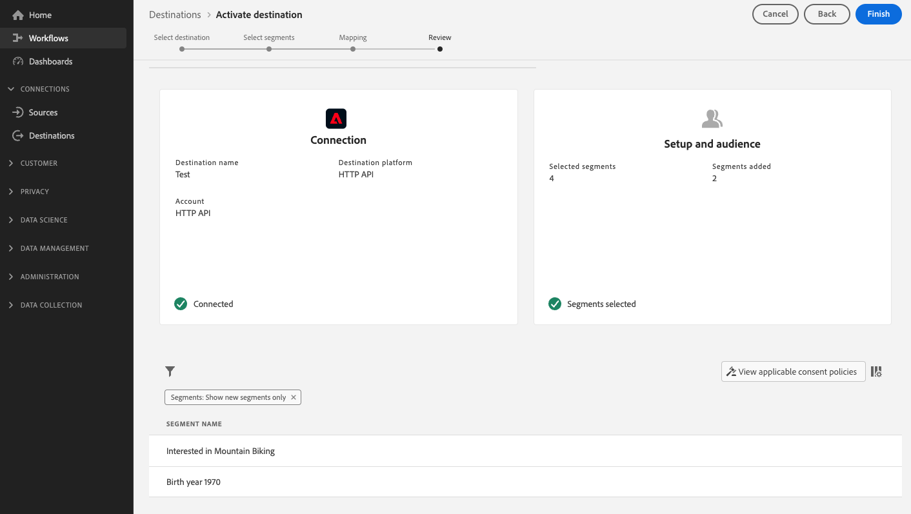

# Ativar dados do público-alvo para destinos de exportação de perfil de fluxo

>[!IMPORTANT]
> 
>Para ativar os dados, é necessário **[!UICONTROL Gerenciar destinos]**, **[!UICONTROL Ativar destinos]**, **[!UICONTROL Exibir perfis]** e **[!UICONTROL Exibir segmentos]** [permissões de controle de acesso](/help/access-control/home.md#permissions). Leia o [visão geral do controle de acesso](/help/access-control/ui/overview.md) ou entre em contato com o administrador do produto para obter as permissões necessárias.

## Visão geral {#overview}

Este artigo explica o fluxo de trabalho necessário para ativar dados do público-alvo em destinos baseados em perfil do Adobe Experience Platform streaming, como o Amazon Kinesis.

## Pré-requisitos {#prerequisites}

Para ativar dados em destinos, você deve ter [conectado a um destino](./connect-destination.md). Se ainda não o fez, acesse o [catálogo de destinos](../catalog/overview.md), navegue pelos destinos compatíveis e configure o destino que deseja usar.

## Selecione o destino {#select-destination}

1. Ir para **[!UICONTROL Conexões > Destinos]** e selecione o **[!UICONTROL Catálogo]** guia .

   

1. Selecionar **[!UICONTROL Ativar segmentos]** no cartão correspondente ao destino onde você deseja ativar seus segmentos, conforme mostrado na imagem abaixo.

   

1. Selecione a conexão de destino que deseja usar para ativar seus segmentos e selecione **[!UICONTROL Próximo]**.

   

1. Mova para a próxima seção para [selecione seus segmentos](#select-segments).

## Selecione seus segmentos {#select-segments}

Use as caixas de seleção à esquerda dos nomes de segmentos para selecionar os segmentos que deseja ativar para o destino e, em seguida, selecione **[!UICONTROL Próximo]**.


## Selecionar atributos de perfil {#select-attributes}

Selecione os atributos de perfil que deseja enviar para o destino.

>[!NOTE]
>
> O Adobe Experience Platform preenche sua seleção com quatro atributos recomendados e comumente usados do esquema: `person.name.firstName`, `person.name.lastName`, `personalEmail.address`, `segmentMembership.status`.

As exportações de arquivo variam das seguintes maneiras, dependendo se `segmentMembership.status` está selecionada:
* Se a variável `segmentMembership.status` for selecionado, os arquivos exportados incluirão **[!UICONTROL Ativo]** membros no instantâneo completo inicial e **[!UICONTROL Ativo]** e **[!UICONTROL Expirado]** membros em exportações incrementais subsequentes.
* Se a variável `segmentMembership.status` não estiver selecionado, os arquivos exportados incluem somente **[!UICONTROL Ativo]** membros no instantâneo completo inicial e nas exportações incrementais subsequentes.


1. No **[!UICONTROL Selecionar atributos]** página, selecione **[!UICONTROL Adicionar novo campo]**.

   

1. Selecione a seta à direita da **[!UICONTROL Campo Esquema]** entrada.

   

1. No **[!UICONTROL Selecionar campo]** selecione os atributos XDM que deseja enviar para o destino e escolha **[!UICONTROL Selecionar]**.

   


1. Para adicionar mais mapeamentos, repita as etapas 1 a 3 e selecione **[!UICONTROL Próximo]**.

## Revisão {#review}

No **[!UICONTROL Revisão]** você pode ver um resumo da sua seleção. Selecionar **[!UICONTROL Cancelar]** para quebrar o fluxo, **[!UICONTROL Voltar]** para modificar suas configurações, ou **[!UICONTROL Concluir]** para confirmar a seleção e começar a enviar dados para o destino.

>[!IMPORTANT]
>
>Nesta etapa, o Adobe Experience Platform verifica violações da política de uso de dados. Veja abaixo um exemplo de violação de uma política. Não é possível concluir o fluxo de trabalho de ativação de segmento até que você tenha resolvido a violação. Para obter informações sobre como resolver violações de política, consulte [Aplicação da política](../../rtcdp/privacy/data-governance-overview.md#enforcement) na seção de documentação de governança de dados .


Se nenhuma violação de política tiver sido detectada, selecione **[!UICONTROL Concluir]** para confirmar a seleção e começar a enviar dados para o destino.



## Verificar ativação de segmento {#verify}

Seu exportado [!DNL Experience Platform] Os dados chegam ao destino do target no formato JSON. Por exemplo, o evento abaixo contém o atributo de perfil de endereço de email de um público que se qualificou para um determinado segmento e saiu de outro. As identidades desse prospecto são ECID e email.

```json
{
  "person": {
    "email": "yourstruly@adobe.com"
  },
  "segmentMembership": {
    "ups": {
      "7841ba61-23c1-4bb3-a495-00d3g5fe1e93": {
        "lastQualificationTime": "2020-05-25T21:24:39Z",
        "status": "exited"
      },
      "59bd2fkd-3c48-4b18-bf56-4f5c5e6967ae": {
        "lastQualificationTime": "2020-05-25T23:37:33Z",
        "status": "existing"
      }
    }
  },
  "identityMap": {
    "ecid": [
      {
        "id": "14575006536349286404619648085736425115"
      },
      {
        "id": "66478888669296734530114754794777368480"
      }
    ],
    "email_lc_sha256": [
      {
        "id": "655332b5fa2aea4498bf7a290cff017cb4"
      },
      {
        "id": "66baf76ef9de8b42df8903f00e0e3dc0b7"
      }
    ]
  }
}
```
