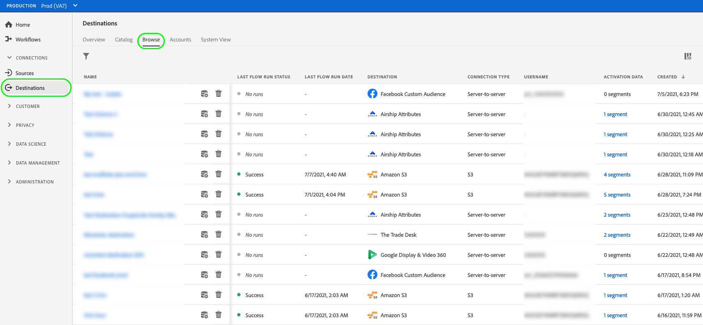

# Ativar dados do público-alvo para destinos de exportação de perfil de fluxo

## Visão geral {#overview}

Este artigo explica o fluxo de trabalho necessário para ativar dados do público-alvo em destinos baseados em perfil do Adobe Experience Platform streaming, como o Amazon Kinesis.

## Pré-requisitos {#prerequisites}

Para ativar dados em destinos, você deve ter [conectado com êxito a um destino](./connect-destination.md). Se ainda não tiver feito isso, vá para o [catálogo de destinos](../catalog/overview.md), navegue pelos destinos compatíveis e configure o destino que deseja usar.

## Selecione o destino {#select-destination}

1. Vá para **[!UICONTROL Connections > Destinations]** e selecione a guia **[!UICONTROL Browse]**.

   

1. Selecione o botão **[!UICONTROL Add segments]** correspondente ao destino onde você deseja ativar seus segmentos, conforme mostrado na imagem abaixo.

   

1. Mova para a próxima seção para [selecionar seus segmentos](#select-segments).

## Selecione seus segmentos {#select-segments}

Use as caixas de seleção à esquerda dos nomes de segmentos para selecionar os segmentos que deseja ativar para o destino e selecione **[!UICONTROL Next]**.


## Selecionar atributos de perfil {#select-attributes}

Selecione os atributos de perfil que deseja enviar para o destino.

>[!NOTE]
>
> O Adobe Experience Platform preenche sua seleção com quatro atributos recomendados e comumente usados do esquema: `person.name.firstName`, `person.name.lastName`, `personalEmail.address`, `segmentMembership.status`.

As exportações de arquivo variam das seguintes maneiras, dependendo se `segmentMembership.status` estiver selecionado:
* Se o campo `segmentMembership.status` for selecionado, os arquivos exportados incluirão **[!UICONTROL membros Ativos]** no instantâneo completo inicial e **[!UICONTROL membros Ativos]** e **[!UICONTROL Expirados]** nas exportações incrementais subsequentes.
* Se o campo `segmentMembership.status` não estiver selecionado, os arquivos exportados incluirão apenas **[!UICONTROL membros Ativos]** no instantâneo completo inicial e nas exportações incrementais subsequentes.


1. Na página **[!UICONTROL Selecionar atributos]**, selecione **[!UICONTROL Adicionar novo campo]**.

   

1. Selecione a seta à direita da entrada **[!UICONTROL Schema field]**.

   

1. Na página **[!UICONTROL Select field]**, selecione os atributos XDM que deseja enviar para o destino e escolha **[!UICONTROL Select]**.

   


1. Para adicionar mais mapeamentos, repita as etapas de 1 a 3 e selecione **[!UICONTROL Next]**.

## Revisão {#review}

Na página **[!UICONTROL Revisar]**, você pode ver um resumo da sua seleção. Selecione **[!UICONTROL Cancelar]** para quebrar o fluxo, **[!UICONTROL Voltar]** para modificar suas configurações ou **[!UICONTROL Concluir]** para confirmar sua seleção e começar a enviar dados para o destino.

>[!IMPORTANT]
>
>Nesta etapa, o Adobe Experience Platform verifica violações da política de uso de dados. Veja abaixo um exemplo de violação de uma política. Não é possível concluir o fluxo de trabalho de ativação de segmento até que você tenha resolvido a violação. Para obter informações sobre como resolver violações de política, consulte [Aplicação de política](../../rtcdp/privacy/data-governance-overview.md#enforcement) na seção Documentação de governança de dados.


Se nenhuma violação de política tiver sido detectada, selecione **[!UICONTROL Finish]** para confirmar a seleção e iniciar o envio de dados para o destino.


## Verificar ativação de segmento {#verify}


Para destinos de marketing por email e destinos de armazenamento na nuvem, o Adobe Experience Platform cria um arquivo `.csv` delimitado por tabulação no local de armazenamento fornecido. Espera que um novo arquivo seja criado no seu local de armazenamento todos os dias. O formato de arquivo padrão é:
`<destinationName>_segment<segmentID>_<timestamp-yyyymmddhhmmss>.csv`

Os arquivos que você receberia em três dias consecutivos podem ter a seguinte aparência:

```console
Salesforce_Marketing_Cloud_segment12341e18-abcd-49c2-836d-123c88e76c39_20200408061804.csv
Salesforce_Marketing_Cloud_segment12341e18-abcd-49c2-836d-123c88e76c39_20200409052200.csv
Salesforce_Marketing_Cloud_segment12341e18-abcd-49c2-836d-123c88e76c39_20200410061130.csv
```

A presença desses arquivos no local de armazenamento é a confirmação de uma ativação bem-sucedida. Para entender como os arquivos exportados são estruturados, você pode [baixar um arquivo .csv de amostra](../assets/common/sample_export_file_segment12341e18-abcd-49c2-836d-123c88e76c39_20200408061804.csv). Este arquivo de amostra inclui os atributos de perfil `person.firstname`, `person.lastname`, `person.gender`, `person.birthyear` e `personalEmail.address`.
