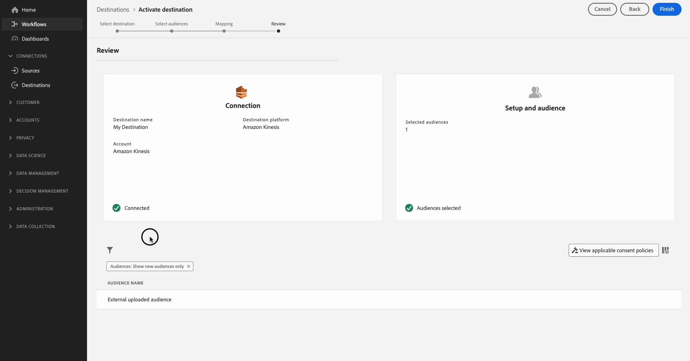

# Ativar públicos para destinos de exportação de perfil de transmissão

>[!IMPORTANT]
> 
> * Para ativar os dados e habilitar a [etapa de mapeamento](#mapping) do fluxo de trabalho, você precisa das **[!UICONTROL View Destinations]**, **[!UICONTROL Activate Destinations]**, **[!UICONTROL View Profiles]** e **[!UICONTROL View Segments]** [permissões de controle de acesso](/help/access-control/home.md#permissions).
> * Para ativar dados sem passar pela [etapa de mapeamento](#mapping) do fluxo de trabalho, você precisa das **[!UICONTROL View Destinations]**, **[!UICONTROL Activate Segment without Mapping]**, **[!UICONTROL View Profiles]** e **[!UICONTROL View Segments]** [permissões de controle de acesso](/help/access-control/home.md#permissions).
> 
> Leia a [visão geral do controle de acesso](/help/access-control/ui/overview.md) ou contate o administrador do produto para obter as permissões necessárias.

## Visão geral {#overview}

Este artigo explica o fluxo de trabalho necessário para ativar dados de público-alvo no Adobe Experience Platform para destinos baseados em perfil de transmissão (também conhecidos como [destinos corporativos](/help/destinations/destination-types.md#advanced-enterprise-destinations)).

Este artigo se aplica aos três destinos a seguir:

* [Amazon Kinesis](/help/destinations/catalog/cloud-storage/amazon-kinesis.md)
* [Hubs de eventos do Azure](/help/destinations/catalog/cloud-storage/azure-event-hubs.md)
* [Destino da API HTTP](/help/destinations/catalog/streaming/http-destination.md).

## Pré-requisitos {#prerequisites}

Para ativar dados para destinos, você deve [se conectar com êxito a um destino](./connect-destination.md). Se ainda não tiver feito isso, vá para o [catálogo de destinos](../catalog/overview.md), navegue pelos destinos compatíveis e configure o destino que deseja usar.

## Selecione seu destino {#select-destination}

1. Vá para **[!UICONTROL Connections > Destinations]** e selecione a guia **[!UICONTROL Catalog]**.

   

1. Selecione **[!UICONTROL Activate audiences]** no cartão correspondente ao destino em que você deseja ativar os públicos-alvo, conforme mostrado na imagem abaixo.

   

1. Selecione a conexão de destino que você deseja usar para ativar seus públicos e selecione **[!UICONTROL Next]**.

   

1. Mova para a próxima seção para [selecionar seus públicos-alvo](#select-audiences).

## Selecione seus públicos-alvo {#select-audiences}

Para selecionar os públicos que você deseja ativar para o destino, use as caixas de seleção à esquerda dos nomes de público e selecione **[!UICONTROL Next]**.

Você pode selecionar entre vários tipos de públicos-alvo, dependendo de sua origem:

* **[!UICONTROL Segmentation Service]**: Públicos-alvo gerados no Experience Platform pelo Serviço de segmentação. Consulte a [documentação do Portal de público-alvo](../../segmentation/ui/audience-portal.md) para obter mais detalhes.
* **[!UICONTROL Custom upload]**: públicos-alvo gerados fora do Experience Platform e carregados na Experience Platform como arquivos CSV. Para saber mais sobre públicos-alvo externos, consulte a documentação sobre [importação de um público-alvo](../../segmentation/ui/audience-portal.md#import-audience).
* Outros tipos de públicos-alvo, originados de outras soluções da Adobe, como o [!DNL Audience Manager].


## Selecionar atributos de perfil {#select-attributes}

Na etapa **[!UICONTROL Mapping]**, selecione os atributos de perfil que deseja enviar ao destino.

1. Na página **[!UICONTROL Select attributes]**, selecione **[!UICONTROL Add new field]**.

   

1. Selecione a seta à direita da entrada **[!UICONTROL Schema field]**.

   

1. Na página **[!UICONTROL Select source field]**, selecione os atributos XDM que deseja enviar ao destino e escolha **[!UICONTROL Save]**.

   

   Use a opção **[!UICONTROL Show only fields with data]** para exibir apenas campos de esquema preenchidos com valores. Por padrão, somente os campos de esquema preenchidos são exibidos.

   Use o botão **[!UICONTROL Show display names for fields]** para exibir os nomes amigáveis para campos, em vez dos nomes de campo de esquema.

   

1. Para adicionar mais campos, repita as etapas de 1 a 3 e selecione **[!UICONTROL Next]**.

## Revisar {#review}

Na página **[!UICONTROL Review]**, você pode ver um resumo da sua seleção. Selecione **[!UICONTROL Cancel]** para interromper o fluxo, **[!UICONTROL Back]** para modificar suas configurações ou **[!UICONTROL Finish]** para confirmar sua seleção e começar a enviar dados para o destino.


### Avaliação da política de consentimento {#consent-policy-evaluation}

[No momento, não há suporte para a avaliação da política de consentimento](/help/data-governance/enforcement/auto-enforcement.md#consent-policy-evaluation) em exportações para os três destinos da empresa - Amazon Kinesis, Hubs de Eventos do Azure e API HTTP.

Isso significa que os perfis que não consentiram em ser direcionados *são incluídos* nas exportações para esses três destinos.

<!--

If your organization purchased **Adobe Healthcare Shield** or **Adobe Privacy & Security Shield**, select **[!UICONTROL View applicable consent policies]** to see which consent policies are applied and how many profiles are included in the activation as a result of them. Read about [consent policy evaluation](/help/data-governance/enforcement/auto-enforcement.md#consent-policy-evaluation) for more information.

-->

### Verificações de política de uso de dados {#data-usage-policy-checks}

Na etapa **[!UICONTROL Review]**, a Experience Platform também verifica se há violações da política de uso de dados. Veja abaixo um exemplo de violação de uma política. Não é possível concluir o fluxo de trabalho de ativação de público-alvo até que a violação seja resolvida. Para obter informações sobre como resolver violações de política, leia sobre [violações de política de uso de dados](/help/data-governance/enforcement/auto-enforcement.md#data-usage-violation) na seção de documentação sobre governança de dados.


### Filtrar públicos {#filter-audiences}

Também nesta etapa é possível usar os filtros disponíveis na página para exibir somente os públicos-alvo cujo agendamento ou mapeamento foi atualizado como parte desse fluxo de trabalho.



Se estiver satisfeito com a sua seleção e nenhuma violação de política tiver sido detectada, selecione **[!UICONTROL Finish]** para confirmar a seleção e começar a enviar dados para o destino.

## Verificar ativação de público {#verify}

Os dados exportados do [!DNL Experience Platform] chegam ao destino no formato JSON. Por exemplo, o evento abaixo contém o atributo de endereço de email de um perfil que se qualificou para um determinado público-alvo e saiu de outro. As identidades deste cliente potencial são `ECID` e `email_lc_sha256`.

```json
{
  "person": {
    "email": "yourstruly@adobe.com"
  },
  "segmentMembership": {
    "ups": {
      "7841ba61-23c1-4bb3-a495-00d3g5fe1e93": {
        "lastQualificationTime": "2020-05-25T21:24:39Z",
        "status": "exited"
      },
      "59bd2fkd-3c48-4b18-bf56-4f5c5e6967ae": {
        "lastQualificationTime": "2020-05-25T23:37:33Z",
        "status": "realized"
      }
    }
  },
  "identityMap": {
    "ecid": [
      {
        "id": "14575006536349286404619648085736425115"
      },
      {
        "id": "66478888669296734530114754794777368480"
      }
    ],
    "email_lc_sha256": [
      {
        "id": "655332b5fa2aea4498bf7a290cff017cb4"
      },
      {
        "id": "66baf76ef9de8b42df8903f00e0e3dc0b7"
      }
    ]
  }
}
```
