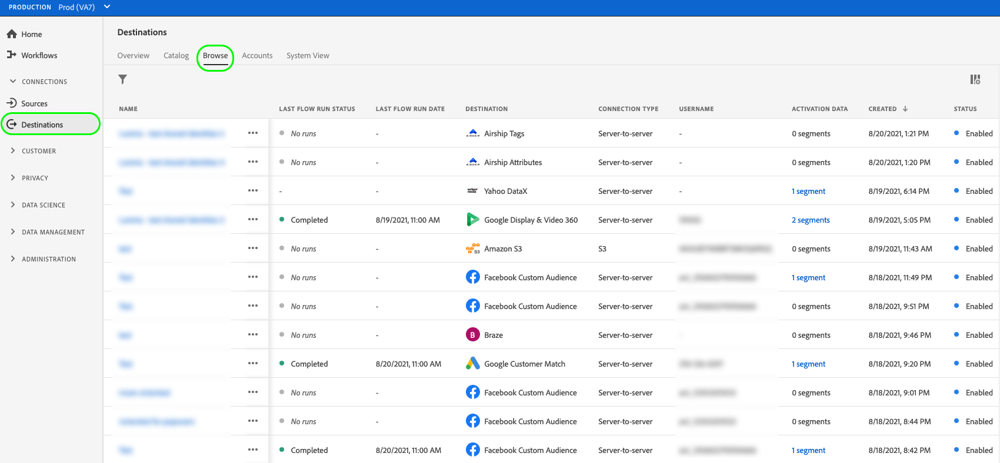
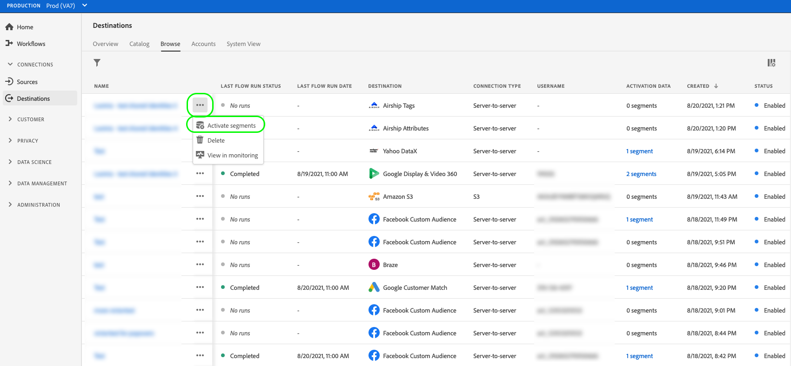

# Visão geral de Activation

O Adobe Experience Platform é compatível com uma grande variedade de destinos. O fluxo de trabalho de ativação do público-alvo varia entre os destinos, com base no tipo de dados de público-alvo suportados por eles e na frequência da exportação de dados.

## Métodos de ativação {#activation-methods}

Depois de [configurar seus destinos](connect-destination.md), você pode ativar segmentos de público-alvo de várias maneiras:

### Ativar públicos-alvo do catálogo de destinos

Consulte os guias a seguir para obter informações detalhadas sobre como ativar públicos-alvo para seu destino a partir do catálogo de destinos:

* [Ativar os dados do público-alvo para os destinos de exportação do segmento de fluxo](activate-segment-streaming-destinations.md)
* [Ativar dados do público-alvo para destinos de exportação de perfil de fluxo](activate-streaming-profile-destinations.md)
* [Ativar dados do público-alvo para destinos de exportação de perfil em lote](activate-batch-profile-destinations.md)

### Ativar públicos-alvo da página [!UICONTROL Procurar]

Siga as etapas abaixo para ativar os dados para seus destinos a partir da página **[!UICONTROL Procurar]**.

1. Vá para **[!UICONTROL Connections > Destinations]** e selecione a guia **[!UICONTROL Browse]**.

   

1. Localize a conexão de destino que deseja usar para ativar seus segmentos, selecione os três pontos na coluna [!UICONTROL Nome] e selecione **[!UICONTROL Ativar segmentos]**.

   

1. Dependendo do destino selecionado, siga as etapas descritas nos artigos abaixo, começando pela etapa **[!UICONTROL Selecionar segmentos]**, para concluir o fluxo de trabalho de ativação:

   * [Ativar os dados do público-alvo para os destinos de exportação do segmento de fluxo](activate-segment-streaming-destinations.md)
   * [Ativar dados do público-alvo para destinos de exportação de perfil de fluxo](activate-streaming-profile-destinations.md)
   * [Ativar dados do público-alvo para destinos de exportação de perfil em lote](activate-batch-profile-destinations.md)

### Ativar públicos-alvo da página de detalhes do segmento {#activate-segment-details}

Você pode ativar segmentos para destinos a partir da página de detalhes do segmento. Consulte [Detalhes do segmento](../../segmentation/ui/overview.md#segment-details) para obter mais informações.

Dependendo do destino selecionado, siga as etapas descritas nos artigos abaixo para concluir o fluxo de trabalho de ativação:

* [Ativar os dados do público-alvo para os destinos de exportação do segmento de fluxo](activate-segment-streaming-destinations.md)
* [Ativar dados do público-alvo para destinos de exportação de perfil de fluxo](activate-streaming-profile-destinations.md)
* [Ativar dados do público-alvo para destinos de exportação de perfil em lote](activate-batch-profile-destinations.md)