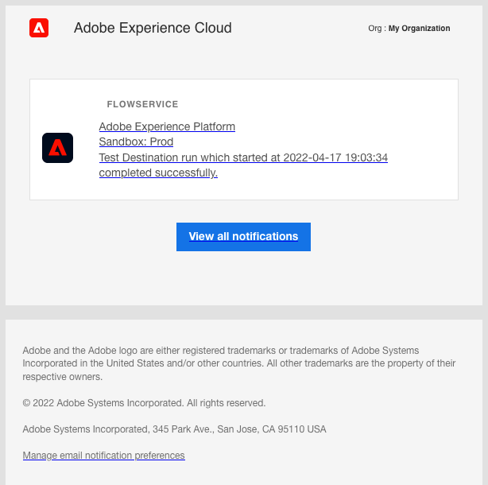

# Assinar alertas de destino no contexto

O Adobe Experience Platform permite assinar alertas baseados em eventos sobre atividades do Adobe Experience Platform. Os alertas reduzem ou eliminam a necessidade de pesquisar a variável [[!DNL Observability Insights] API](../../observability/api/overview.md) para verificar se uma tarefa foi concluída, se um determinado marco em um workflow foi atingido ou se ocorreram erros.

Você pode assinar alertas ao criar um fluxo de dados para receber mensagens de alerta sobre o status, o sucesso ou a falha da execução do fluxo.

Este documento fornece etapas sobre como assinar mensagens de alerta de recebimento para seus fluxos de dados de destino.

## Introdução

Este documento requer uma compreensão funcional dos seguintes componentes do Adobe Experience Platform:

* [Destinos](../home.md): Integrações pré-criadas com plataformas de destino que permitem a ativação contínua dos dados do Adobe Experience Platform. Você pode usar destinos para ativar seus dados conhecidos e desconhecidos para campanhas de marketing entre canais, campanhas por email, anúncios direcionados e muitos outros casos de uso.
* [Observabilidade](../../observability/home.md): [!DNL Observability Insights] O permite monitorar as atividades do Platform por meio do uso de métricas estatísticas e notificações de eventos.
   * [Alertas](../../observability/alerts/overview.md): Quando um determinado conjunto de condições em suas operações da plataforma é atingido (como um possível problema quando o sistema viola um limite), a Platform pode enviar mensagens de alerta para qualquer usuário em sua organização que tenha se inscrito nelas.

## Inscrever-se em alertas na interface do usuário {#subscribe-destination-alerts}

>[!CONTEXTUALHELP]
>id="platform_destination_alerts_subscribe"
>title="Assinar alertas de destino"
>abstract="Os alertas permitem receber notificações com base no status dos fluxos de dados de destino. É possível definir notificações de alerta para obter atualizações caso o fluxo de dados tenha sido iniciado, tenha sido bem-sucedido, tenha falhado ou não tenha enviado dados para o destino."
>text="Learn more in documentation"

>[!IMPORTANT]
>
>Você deve ativar notificações instantâneas de emails para sua conta da plataforma para receber notificações de alerta por email para seus fluxos de dados.

Você pode ativar alertas para seus fluxos de dados durante a [!UICONTROL Configurar novo destino] da [conexão de destino](connect-destination.md) fluxo de trabalho.

Selecione os alertas que deseja assinar e selecione **[!UICONTROL Próximo]** para revisar e finalizar o fluxo de dados.

Os alertas disponíveis para os fluxos de dados de destino estão descritos na tabela abaixo.

* Para destinos de transmissão, somente a variável [!DNL Activation Skipped Rate Exceeded] estiver disponível.
* Para destinos com base em arquivo, todos os alertas estão disponíveis.

| Alertas | Descrição |
| --- | --- |
| Atraso de execução do fluxo de destino | Esse alerta notifica quando uma execução de fluxo de destino demora mais de 150 minutos para ativar um segmento. |
| Falha na Execução do Fluxo de Destino | Este alerta notifica quando ocorre um erro ao ativar um segmento para um destino. |
| Êxito na Execução do Fluxo de Destino | Este alerta notifica quando um segmento é ativado com êxito para um destino. |
| Início da Execução do Fluxo de Destino | Este alerta notifica quando uma execução de fluxo de destino inicia a ativação de um segmento. |
| Taxa de Ativação Ignorada Excedida | Este alerta notifica quando a taxa de ignorar a ativação excedeu 1% do total de ativações. As identidades são ignoradas durante a ativação quando têm atributos ausentes ou violação de consentimento. |

## Receber alertas {#receiving-alerts}

Depois que o fluxo de dados de destino for executado, você poderá receber alertas por meio da interface do usuário ou por email.

### Receber alertas na interface do usuário {#receiving-alerts-in-ui}

Os alertas são representados na interface do usuário por um ícone de notificação no cabeçalho superior da interface do usuário da plataforma. Selecione o ícone de notificação para ver mensagens de alerta específicas relacionadas aos seus fluxos de dados.

O painel Notificações é exibido, exibindo uma lista de atualizações de status no fluxo de dados criado por você.

Você pode passar o mouse sobre uma mensagem de alerta para marcá-los como lidos ou selecionar o ícone do relógio para definir lembretes futuros sobre o status do seu fluxo de dados.

Selecione a mensagem de alerta para ver informações específicas no fluxo de dados.

O [!UICONTROL Detalhes da execução do fluxo de dados] será exibida. A metade superior da tela exibe uma visão geral do fluxo de dados, incluindo informações sobre seus atributos, ID de execução de fluxo de dados correspondente e resumo de erro de alto nível.

A metade inferior da página exibe qualquer [!UICONTROL Erros de execução do fluxo de dados] que ocorreu durante o estágio de execução do fluxo de dados. Aqui, você pode visualizar o diagnóstico de erros ou usar o [[!DNL Data Access] API](https://www.adobe.io/experience-platform-apis/references/data-access/) para baixar o diagnóstico de erro ou o manifesto do arquivo que corresponde ao seu fluxo de dados.

Para obter mais informações sobre como lidar com erros de fluxo de dados, consulte o guia em [monitoramento de fluxos de dados de destinos na interface do usuário](../../dataflows/ui/monitor-destinations.md).

### Receber alertas por email {#receiving-alerts-by-email}

Os alertas dos seus fluxos de dados também são enviados por email. Selecione o nome do fluxo de dados no corpo do email para ver mais informações sobre o fluxo de dados.

Semelhante ao alerta da interface do usuário, a variável [!UICONTROL Visão geral da execução do fluxo de dados] for exibida, fornecendo uma interface para investigar todos os erros associados ao fluxo de dados.

## Assinar e cancelar a assinatura de alertas {#subscribe-and-unsubscribe}

É possível assinar mais alertas ou cancelar a assinatura de alertas estabelecidos para um fluxo de dados de destino existente nos destinos [!UICONTROL Procurar] página.

Localize a conexão de destino para a qual você deseja receber alertas e selecione as reticências (`...`) para ver um menu suspenso de opções. Em seguida, selecione **[!UICONTROL Inscrever-se em alertas]** para modificar as configurações de alerta do seu fluxo de dados de destino.

Uma janela pop-up é exibida, fornecendo uma lista de alertas de destino. Selecione os alertas dos quais deseja assinar ou desmarcar os alertas dos quais deseja cancelar a assinatura. Quando terminar, selecione **[!UICONTROL Salvar]**.

## Próximas etapas {#next-steps}

Este documento forneceu um guia passo a passo sobre como se inscrever em alertas de contexto para seus fluxos de dados de destino. Para obter mais informações, consulte o [guia da interface de usuário de alertas](../../observability/alerts/ui.md).
