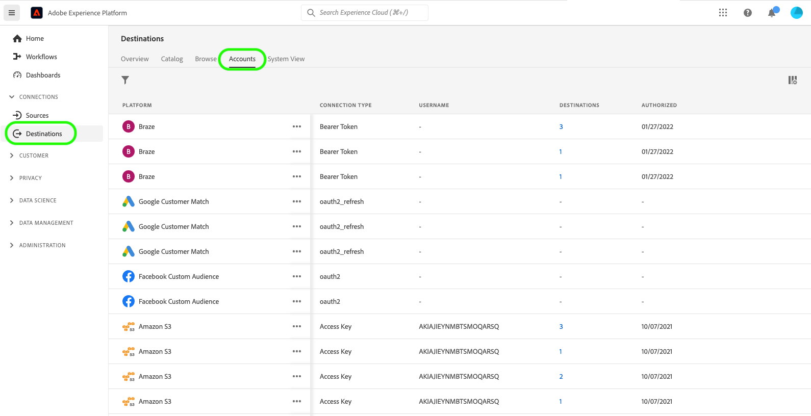

# Excluir contas de destino

## Visão geral {#overview}

A guia **[!UICONTROL Contas]** mostra detalhes sobre as conexões estabelecidas com vários destinos. Consulte a [Visão geral das contas](../ui/destinations-workspace.md#accounts) para obter todas as informações que você pode obter em cada conta de destino.

Este tutorial aborda as etapas para excluir contas de destino que não são mais necessárias usando a interface do usuário do Experience Platform.

## Excluir contas {#delete}

>[!TIP]
>
>Antes de excluir a conta de destino, primeiro você deve excluir todos os fluxos de dados existentes associados à conta de destino. Para excluir fluxos de dados de destino existentes, consulte o tutorial em [exclusão de fluxos de dados de destino na interface](./delete-destinations.md).

Siga as etapas abaixo para excluir contas de destino existentes.

1. Faça logon na [interface do usuário do Experience Platform](https://platform.adobe.com/) e selecione **[!UICONTROL Destinos]** na barra de navegação esquerda. Selecione **[!UICONTROL Contas]** no cabeçalho superior para exibir suas contas existentes.

   

2. Selecione o ícone de filtro  na parte superior esquerda para iniciar o painel de classificação. O painel de classificação fornece uma lista de todos os seus destinos. É possível selecionar mais de um destino na lista para ver uma seleção filtrada de contas associadas aos destinos selecionados.

   

3. Selecione as reticências (`...`) ao lado do nome da conta que você deseja excluir. Um painel pop-up é exibido, fornecendo opções para **[!UICONTROL Ativar públicos-alvo]**, **[!UICONTROL Editar detalhes]** e **[!UICONTROL Excluir]** a conta. Selecione o botão  **[!UICONTROL Excluir]** para excluir a conta desejada.

   

4. Uma caixa de diálogo de confirmação final é exibida, selecione **[!UICONTROL Excluir]** para concluir o processo.

## Próximas etapas

Ao seguir este tutorial, você usou com êxito o espaço de trabalho de destinos para excluir contas existentes.

Para obter etapas sobre como executar essas operações de forma programática usando a API [!DNL Flow Service], consulte o tutorial em [exclusão de conexões usando a API de Serviço de Fluxo](../api/delete-destination-account.md)
