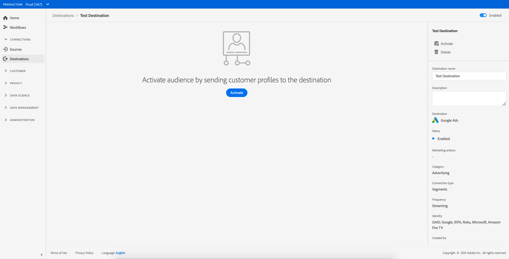

# Excluir destinos {#delete-destinations}

## Visão geral {#overview}

Na interface do usuário do Adobe Experience Platform, é possível excluir conexões existentes para destinos.

A exclusão de um destino remove todos os fluxos de dados existentes para esse destino. Todos os segmentos ativados para os destinos excluídos são não mapeados antes da exclusão do fluxo de dados.

Há duas maneiras de excluir destinos do [!DNL Platform] [!DNL UI]. É possível:

* [Excluir destinos na  [!UICONTROL Browse] guia](#delete-browse-tab)
* [Excluir destinos da página de detalhes do destino](#delete-destination-details-page)

## Excluir destinos da guia Procurar{#delete-browse-tab}

Siga as etapas abaixo para excluir um destino da guia [!UICONTROL Browse].

1. Faça logon na [interface do usuário do Experience Platform](https://platform.adobe.com/) e selecione **[!UICONTROL Destinations]** na barra de navegação esquerda. Para exibir seus destinos existentes, selecione **[!UICONTROL Browse]** no cabeçalho superior.

   

2. Selecione o ícone de filtro  na parte superior esquerda para iniciar o painel de classificação. O painel de classificação fornece uma lista de todos os destinos. Você pode selecionar mais de um destino na lista para ver uma seleção filtrada de fluxos de dados associada ao destino selecionado.

   

3. Selecione o botão  **[!UICONTROL Delete]** na coluna **[!UICONTROL Platform]** para remover um destino existente.
   

4. Selecione **[!UICONTROL Delete]** para confirmar a remoção do destino.

   

## Excluir destinos da página de detalhes do destino{#delete-destination-details-page}

Siga as etapas abaixo para excluir um destino da página de detalhes do destino.

1. Faça logon na [interface do usuário do Experience Platform](https://platform.adobe.com/) e selecione **[!UICONTROL Destinations]** na barra de navegação esquerda. Para exibir seus destinos existentes, selecione **[!UICONTROL Browse]** no cabeçalho superior.

   

2. Selecione o ícone de filtro  na parte superior esquerda para iniciar o painel de classificação. O painel de classificação fornece uma lista de todos os destinos. Você pode selecionar mais de um destino na lista para ver uma seleção filtrada de fluxos de dados associada ao destino selecionado.

   

3. Selecione o nome do destino que deseja excluir.

   

   * Se o destino tiver fluxos de dados existentes, você será direcionado para a guia [!UICONTROL Dataflow runs].

      

   * Se o destino não tiver fluxos de dados existentes, você será direcionado para uma página vazia, onde poderá começar a ativar públicos-alvo.

      

4. Selecione **[!UICONTROL Delete]** no painel direito.

   

5. Selecione **[!UICONTROL Delete]** na caixa de diálogo de confirmação para remover o destino.

   

   >[!NOTE]
   >
   >Dependendo da carga do servidor, pode levar alguns minutos para [!DNL Platform] excluir o destino.