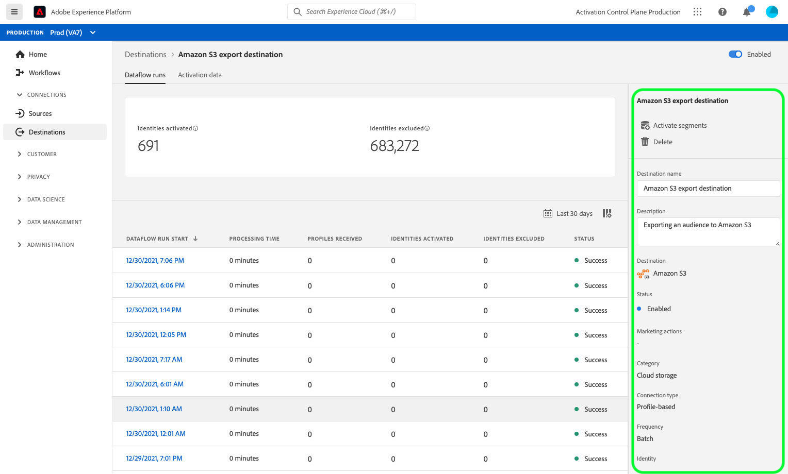

# Exibir detalhes do destino

## Visão geral {#overview}

Na interface do usuário do Adobe Experience Platform, é possível visualizar e monitorar os atributos e atividades dos destinos. Esses detalhes incluem o nome e a ID do destino, controles para ativar ou desativar os destinos e muito mais. Os detalhes para destinos em lote também incluem métricas para registros de perfil ativados e um histórico de execuções de fluxo de dados.

>[!NOTE]
>
>A página de detalhes de destinos faz parte do espaço de trabalho [!UICONTROL Destinations] no [!DNL Platform] [!DNL UI]. Consulte a [[!UICONTROL Destinations] visão geral do espaço de trabalho](./destinations-workspace.md) para obter mais informações.

## Exibir detalhes do destino {#view-details}

Siga as etapas abaixo para visualizar mais detalhes sobre um destino existente.

1. Faça logon na [interface do usuário do Experience Platform](https://platform.adobe.com/) e selecione **[!UICONTROL Destinations]** na barra de navegação esquerda. Selecione **[!UICONTROL Browse]** no cabeçalho superior para visualizar os destinos existentes.

   

1. Selecione o ícone de filtro  na parte superior esquerda para iniciar o painel de classificação. O painel de classificação fornece uma lista de todos os destinos. Você pode selecionar mais de um destino na lista para ver uma seleção filtrada de fluxos de dados associada ao destino selecionado.

   

1. Selecione o nome do destino que deseja visualizar.

   

1. A página de detalhes do destino é exibida, mostrando os controles disponíveis. Se você estiver visualizando os detalhes de um destino de lote, um painel de monitoramento também será exibido.

   

## Painel direito

O painel direito exibe as informações básicas sobre o destino selecionado.

O quadro seguinte cobre os controlos e os pormenores fornecidos pelo painel direito:

| Item do painel direito | Descrição |
| --- | --- |
| [!UICONTROL Activate] | Selecione esse controle para editar quais segmentos são mapeados para o destino. Consulte o guia em [ativar segmentos em um destino](./activate-destinations.md) para obter mais informações. |
| [!UICONTROL Delete] | Permite excluir esse fluxo de dados e desmapeia os segmentos que foram ativados anteriormente, caso existam. |
| [!UICONTROL Destination name] | Este campo pode ser editado para atualizar o nome do destino. |
| [!UICONTROL Description] | Este campo pode ser editado para atualizar ou adicionar uma descrição opcional ao destino. |
| [!UICONTROL Destination] | Representa a plataforma de destino para a qual os públicos-alvo são enviados. Consulte o [catálogo de destinos](../catalog/overview.md) para obter mais informações. |
| [!UICONTROL Status] | Indica se o destino está ativado ou desativado. |
| [!UICONTROL Marketing actions] | Indica as ações de marketing (casos de uso) que se aplicam a esse destino para fins de governança de dados. |
| [!UICONTROL Category] | Indica o tipo de destino. Consulte o [catálogo de destinos](../catalog/overview.md) para obter mais informações. |
| [!UICONTROL Connection type] | Indica o formulário pelo qual seus públicos-alvo estão sendo enviados para o destino. Os valores possíveis incluem [!UICONTROL Cookie] e [!UICONTROL Profile-based]. |
| [!UICONTROL Frequency] | Indica a frequência com que os públicos-alvo são enviados para o destino. Os valores possíveis incluem [!UICONTROL Streaming] e [!UICONTROL Batch]. |
| [!UICONTROL Identity] | Representa o namespace de identidade aceito pelo destino, como `GAID`, `IDFA` ou `email`. Para obter mais informações sobre namespaces de identidade aceitos, consulte a [visão geral do namespace de identidade](../../identity-service/namespaces.md). |
| [!UICONTROL Created by] | Indica o usuário que criou esse destino. |
| [!UICONTROL Created] | Indica a data e hora UTC em que esse destino foi criado. |

{style=&quot;table-layout:auto&quot;}

## [!UICONTROL Enabled]/[!UICONTROL Disabled] alternar

Você pode usar a opção **[!UICONTROL Enabled]/[!UICONTROL Disabled]** para iniciar e pausar todas as exportações de dados para o destino.

## [!UICONTROL Dataflow runs]

A guia [!UICONTROL Dataflow runs] fornece dados de métrica no fluxo de dados que são executados para destinos em lote. Consulte [Monitorar fluxos de dados](monitor-dataflows.md) para obter detalhes.

## [!UICONTROL Activation data] {#activation-data}

A guia [!UICONTROL Activation data] exibe uma lista de segmentos que foram mapeados para o destino, incluindo sua data inicial e data final (se aplicável). Para exibir os detalhes sobre um segmento específico, selecione o nome na lista.

>[!NOTE]
>
>Para obter detalhes sobre como explorar a página de detalhes de um segmento, consulte a [Visão geral da interface do usuário de segmentação](../../segmentation/ui/overview.md#segment-details).
