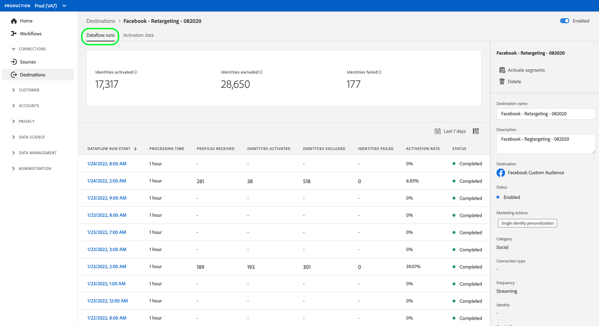

# Exibir detalhes do destino

## Visão geral {#overview}

Na interface do usuário do Adobe Experience Platform, é possível visualizar e monitorar os atributos e atividades dos destinos. Esses detalhes incluem o nome e a ID do destino, controles para ativar ou desativar os destinos e muito mais. Os detalhes para destinos em lote também incluem métricas para registros de perfil ativados e um histórico de execuções de fluxo de dados.

>[!NOTE]
>
>A página de detalhes de destinos faz parte do espaço de trabalho [!UICONTROL Destinations] na interface do usuário da plataforma. Consulte a [[!UICONTROL Destinations] visão geral do espaço de trabalho](./destinations-workspace.md) para obter mais informações.

No espaço de trabalho **[!UICONTROL Destinations]** na interface do usuário da plataforma, navegue até a guia **[!UICONTROL Browse]** e selecione o nome de um destino que deseja visualizar.

A página de detalhes do destino é exibida, mostrando os controles disponíveis. Se você estiver visualizando os detalhes de um destino de lote, um painel de monitoramento também será exibido.

Além disso, na guia Procurar, é possível optar por excluir o fluxo de dados selecionado selecionando o ícone . Quaisquer segmentos ativados para destinos serão desmapeados antes que o fluxo de dados seja excluído.

## Painel direito

O painel direito exibe as informações básicas sobre o destino.

O quadro seguinte cobre os controlos e os pormenores fornecidos pelo painel direito:

| Item do painel direito | Descrição |
| --- | --- |
| [!UICONTROL Activate] | Selecione esse controle para editar quais segmentos são mapeados para o destino. Consulte o guia em [ativar segmentos em um destino](./activate-destinations.md) para obter mais informações. |
| [!UICONTROL Delete] | Permite excluir esse fluxo de dados e desmapeia os segmentos que foram ativados anteriormente, caso existam. |
| [!UICONTROL Destination name] | Este campo pode ser editado para atualizar o nome do destino. |
| [!UICONTROL Description] | Este campo pode ser editado para atualizar ou adicionar uma descrição opcional ao destino. |
| [!UICONTROL Destination] | Representa a plataforma de destino para a qual os públicos-alvo são enviados. Consulte o [catálogo de destinos](../catalog/overview.md) para obter mais informações. |
| [!UICONTROL Status] | Indica se o destino está ativado ou desativado. |
| [!UICONTROL Marketing actions] | Indica as ações de marketing (casos de uso) que se aplicam a esse destino para fins de governança de dados. |
| [!UICONTROL Category] | Indica o tipo de destino. Consulte o [catálogo de destinos](../catalog/overview.md) para obter mais informações. |
| [!UICONTROL Connection type] | Indica o formulário pelo qual seus públicos-alvo estão sendo enviados para o destino. Os valores possíveis incluem &quot;[!UICONTROL Cookie]&quot; e &quot;[!UICONTROL Profile-based]&quot;. |
| [!UICONTROL Frequency] | Indica a frequência com que os públicos-alvo são enviados para o destino. Os valores possíveis incluem &quot;[!UICONTROL Streaming]&quot; e &quot;[!UICONTROL Batch]&quot;. |
| [!UICONTROL Identity] | Representa o namespace de identidade aceito pelo destino, como `GAID`, `IDFA` ou `email`. Para obter mais informações sobre namespaces de identidade aceitos, consulte a [visão geral do namespace de identidade](../../identity-service/namespaces.md). |
| [!UICONTROL Created by] | Indica o usuário que criou esse destino. |
| [!UICONTROL Created] | Indica a data e hora UTC em que esse destino foi criado. |

## [!UICONTROL Enabled]/[!UICONTROL Disabled] alternar

Você pode usar a opção **[!UICONTROL Enabled]/[!UICONTROL Disabled]** para iniciar e pausar todas as exportações de dados para o destino.

## [!UICONTROL Dataflow runs]

A guia [!UICONTROL Dataflow runs] fornece dados de métrica no fluxo de dados que são executados para destinos em lote. Uma lista de execuções individuais e suas métricas específicas é exibida, juntamente com os seguintes totais para registros de perfil:

* **[!UICONTROL Profile records activated]**: A contagem total de registros de perfil que foram criados ou atualizados para ativação.
* **[!UICONTROL Profile records skipped]**: A contagem total de registros de perfil que são ignorados para ativação com base em saídas de perfil ou atributos ausentes.

>[!NOTE]
>
>As execuções de fluxo de dados são geradas com base na frequência de agendamento do fluxo de dados de destino. Uma execução de fluxo de dados separada é feita para cada política de mesclagem aplicada a um segmento.

Para exibir os detalhes de uma execução específica do fluxo de dados, selecione a hora de início da execução na lista. A página de detalhes de uma execução do fluxo de dados contém informações adicionais, como o tamanho dos dados processados e uma lista de erros que ocorreram com detalhes para o diagnóstico de erros.

## [!UICONTROL Activation data] {#activation-data}

A guia [!UICONTROL Activation data] exibe uma lista de segmentos que foram mapeados para o destino, incluindo sua data inicial e data final (se aplicável). Para exibir os detalhes sobre um segmento específico, selecione o nome na lista.

>[!NOTE]
>
>Para obter detalhes sobre como explorar a página de detalhes de um segmento, consulte a [Visão geral da interface do usuário de segmentação](../../segmentation/ui/overview.md#segment-details).

## Próximas etapas

Este documento cobriu os recursos da página de detalhes do destino. Para obter mais informações sobre como gerenciar destinos na interface do usuário, consulte a visão geral no espaço de trabalho [[!UICONTROL Destinations]](./destinations-workspace.md).