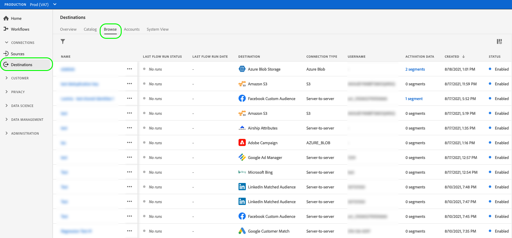

# Exibir detalhes do destino

## Visão geral {#overview}

Na interface do usuário do Adobe Experience Platform, é possível visualizar e monitorar os atributos e as atividades dos destinos. Esses detalhes incluem o nome e a ID do destino, controles para ativar ou desativar os destinos e muito mais. Os detalhes também incluem métricas para registros de perfis ativados, identidades ativadas, com falha e excluídas, e um histórico de execuções de fluxo de dados.

>[!NOTE]
>
>A página de detalhes dos destinos faz parte da [!UICONTROL Destinos] espaço de trabalho no [!DNL Platform] [!DNL UI]. Consulte a [[!UICONTROL Destinos] visão geral do espaço de trabalho](./destinations-workspace.md) para obter mais informações.

## Exibir detalhes do destino {#view-details}

Siga as etapas abaixo para exibir mais detalhes sobre um destino existente.

1. Faça logon no [IU DO EXPERIENCE PLATFORM](https://platform.adobe.com/) e selecione **[!UICONTROL Destinos]** na barra de navegação esquerda. Selecionar **[!UICONTROL Procurar]** no cabeçalho superior para exibir os destinos existentes.

   

1. Selecione o ícone de filtro  na parte superior esquerda para iniciar o painel classificar. O painel de classificação fornece uma lista de todos os seus destinos. Você pode selecionar mais de um destino na lista para ver uma seleção filtrada de fluxos de dados associados ao destino selecionado.

   

1. Selecione o nome do destino que deseja exibir.

   

1. A página de detalhes do destino é exibida, mostrando seus controles disponíveis.

   

## Painel direito {#right-rail}

O painel direito exibe as informações básicas sobre o destino selecionado.

A tabela a seguir abrange os controles e os detalhes fornecidos pelo painel direito:

| Item do painel direito | Descrição |
| --- | --- |
| [!UICONTROL Ativar públicos] | Selecione este controle para editar quais públicos-alvo estão mapeados para o destino, atualizar agendas de exportação ou adicionar e remover atributos e identidades mapeados. Consulte as guias sobre [ativação de dados do público-alvo para destinos de transmissão de público-alvo](./activate-segment-streaming-destinations.md), [ativação de dados de público-alvo para destinos baseados em perfil de lote](./activate-batch-profile-destinations.md), e [ativação de dados de público-alvo para destinos com base em perfil de transmissão](./activate-streaming-profile-destinations.md) para obter mais informações. |
| [!UICONTROL Excluir] | Permite excluir esse fluxo de dados e desmapeia os públicos-alvo que foram ativados anteriormente, se houver. |
| [!UICONTROL Nome do destino] | Este campo pode ser editado para atualizar o nome do destino. |
| [!UICONTROL Descrição] | Este campo pode ser editado para atualizar ou adicionar uma descrição opcional ao destino. |
| [!UICONTROL Destino] | Representa a plataforma de destino para a qual os públicos-alvo são enviados. Consulte a [catálogo de destinos](../catalog/overview.md) para obter mais informações. |
| [!UICONTROL Status] | Indica se o destino está ativado ou desativado. |
| [!UICONTROL Ações de marketing] | Indica as ações de marketing (casos de uso) que se aplicam a esse destino para fins de governança de dados. |
| [!UICONTROL Categoria] | Indica o tipo de destino. Consulte a [catálogo de destinos](../catalog/overview.md) para obter mais informações. |
| [!UICONTROL Tipo de conexão] | Indica o formulário pelo qual seus públicos-alvo estão sendo enviados para o destino. Os valores possíveis incluem [!UICONTROL Cookie] e [!UICONTROL Baseado em perfil]. |
| [!UICONTROL Frequência] | Indica a frequência com que os públicos-alvo são enviados para o destino. Os valores possíveis incluem [!UICONTROL Streaming] e [!UICONTROL Lote]. |
| [!UICONTROL Identidade] | Representa o namespace de identidade aceito pelo destino, como `GAID`, `IDFA`ou `email`. Para obter mais informações sobre namespaces de identidade aceitos, consulte a [visão geral do namespace de identidade](../../identity-service/features/namespaces.md). |
| [!UICONTROL Criado por] | Indica o usuário que criou esse destino. |
| [!UICONTROL Criado] | Indica a data e hora UTC em que esse destino foi criado. |

{style="table-layout:auto"}

## [!UICONTROL Ativado]/[!UICONTROL Desabilitado] alternar {#enabled-disabled-toggle}

Você pode usar o **[!UICONTROL Ativado]/[!UICONTROL Desabilitado]** alterne para iniciar e pausar todas as exportações de dados para o destino.

## [!UICONTROL O fluxo de dados é executado] {#dataflow-runs}

A variável [!UICONTROL O fluxo de dados é executado] A guia fornece dados de métrica sobre as execuções de fluxo de dados para destinos em lote e de fluxo. Consulte [Monitorar fluxos de dados](monitor-dataflows.md) para obter detalhes e definições de métricas.

>[!NOTE]
>
>* No momento, a funcionalidade de monitoramento de destinos é compatível com todos os destinos no Experience Platform *exceto* o [Adobe Target](/help/destinations/catalog/personalization/adobe-target-connection.md), [Personalização personalizada](/help/destinations/catalog/personalization/custom-personalization.md) e [Públicos do Experience Cloud](/help/destinations/catalog/adobe/experience-cloud-audiences.md) destinos.
>* Para o [Amazon Kinesis](/help/destinations/catalog/cloud-storage/amazon-kinesis.md), [Hubs de Eventos do Azure](/help/destinations/catalog/cloud-storage/azure-event-hubs.md), e [API HTTP](/help/destinations/catalog/streaming/http-destination.md) destinos, as métricas relacionadas às identidades excluídas, com falha e ativadas são estimadas. Volumes maiores de dados de ativação levam a uma maior precisão das métricas.

### Duração das execuções de fluxo de dados {#dataflow-runs-duration}

Há uma diferença na duração exibida das execuções de fluxo de dados entre destinos de transmissão e destinos baseados em arquivo.

### Destinos de transmissão {#streaming}

Embora a **[!UICONTROL Duração do processamento]** o indicado para a maioria das execuções de fluxo de dados de transmissão é cerca de quatro horas, como mostrado na imagem abaixo, o tempo de processamento real para qualquer execução de fluxo de dados é muito mais curto. As janelas de execução do fluxo de dados permanecem abertas por mais tempo caso o Experience Platform precise tentar fazer chamadas novamente para o destino e também garantir que ele não perca nenhum dado de chegada tardia na mesma janela de tempo.

Para obter mais informações, leia sobre [o fluxo de dados é executado para destinos de transmissão](/help/dataflows/ui/monitor-destinations.md#dataflow-runs-for-streaming-destinations) na documentação de monitoramento.

### Destinos baseados em arquivo {#file-based}

Para execuções de fluxo de dados para destinos baseados em arquivo, a variável **[!UICONTROL Duração do processamento]** depende do tamanho dos dados que estão sendo exportados e do carregamento do sistema. Observe também que o fluxo de dados executado para destinos baseados em arquivo é detalhado por público-alvo.

Para obter mais informações, leia sobre [o fluxo de dados é executado para destinos em lote (baseados em arquivo)](/help/dataflows/ui/monitor-destinations.md#dataflow-runs-for-batch-destinations) na documentação de monitoramento.

## [!UICONTROL Dados de ativação] {#activation-data}

A variável [!UICONTROL Dados de ativação] A guia exibe uma lista de públicos-alvo que foram mapeados para o destino, incluindo a data inicial e a data final (se aplicável) e outras informações relevantes para a exportação de dados, como tipo de exportação, programação e frequência. Para exibir os detalhes sobre um público-alvo específico, selecione o nome na lista.

>[!TIP]
>
>Para exibir e editar detalhes sobre os atributos e identidades mapeados para um destino, selecione **[!UICONTROL Ativar públicos]** no [painel direito](#right-rail).

### [!BADGE Beta]{type=Informative} Remover vários públicos dos fluxos de ativação {#bulk-remove}

>[!NOTE]
>
Esse recurso está na versão beta e só está disponível para clientes selecionados. Para solicitar acesso a esse recurso, entre em contato com o representante da Adobe.

Para remover vários públicos-alvo de fluxos de ativação existentes, selecione os públicos-alvo e, em seguida, **[!UICONTROL Remover públicos]**.

### Exportar vários arquivos sob demanda para destinos em lote {#bulk-export}

Você pode [exportar vários arquivos por demanda](../ui/export-file-now.md) do **[!UICONTROL Dados de ativação]** página. Para fazer isso, selecione os públicos para os quais deseja exportar arquivos por demanda e selecione o **[!UICONTROL Exportar arquivo agora]** controle para acionar uma exportação única que fornecerá um arquivo para cada público-alvo selecionado para o destino do lote.

### Editar agendamentos de ativação para vários públicos-alvo exportados para destinos em lote {#bulk-edit-schedule}

Para editar o agendamento de ativação existente de vários públicos-alvo ao mesmo tempo, selecione os públicos-alvo desejados e **[!UICONTROL Editar programação]**. Para obter informações detalhadas sobre como definir ou editar um agendamento de exportação, leia o [agendar exportação de público](../ui/activate-batch-profile-destinations.md#scheduling) seção.

>[!NOTE]
>
Para obter detalhes sobre como explorar a página de detalhes de um público-alvo, consulte a [Visão geral da interface de segmentação](../../segmentation/ui/overview.md#segment-details).
