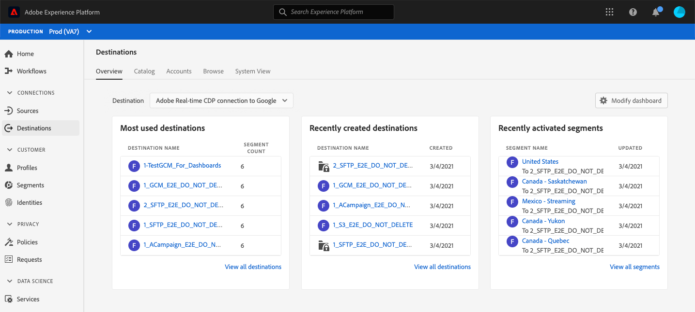
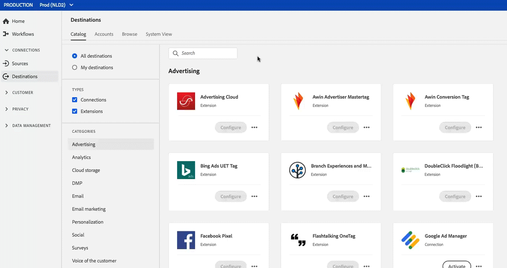

# Área de trabalho Destinos {#destinations-workspace}

No Adobe Experience Platform, selecione **[!UICONTROL Destinations]** na barra de navegação esquerda para acessar o espaço de trabalho [!UICONTROL Destinations].

O espaço de trabalho [!UICONTROL Destinos] consiste em cinco seções, [!UICONTROL Visão Geral], [!UICONTROL Catálogo], [!UICONTROL Procurar], [!UICONTROL Contas] e [!UICONTROL Vista do Sistema], descritas nas seções abaixo.

## [!UICONTROL Visão geral] {#overview}

A guia **[!UICONTROL Visão geral]** exibe o painel [!UICONTROL Destinos], fornecendo métricas principais relacionadas aos dados de destino de sua organização. Para saber mais, visite o [[!UICONTROL Destinations] guia do painel](../../dashboards/guides/destinations.md).

>[!NOTE]
>
>Se sua organização for nova no Experience Platform e ainda não tiver destinos ativos, o painel [!UICONTROL Destinos] e a guia [!UICONTROL Visão geral] não estarão visíveis. Em vez disso, selecionar [!UICONTROL Destinations] na navegação à esquerda exibe a guia [[!UICONTROL Catalog]](#catalog).

## [!UICONTROL Catálogo] {#catalog}

A guia **[!UICONTROL Catalog]** exibe uma lista de todos os destinos disponíveis em [!DNL Platform], para os quais você pode enviar dados.

A interface do usuário [!DNL Platform] fornece várias opções de pesquisa e filtro na página de catálogo de destinos:

* Use a funcionalidade de pesquisa na página para localizar um destino específico.
* Filtre destinos usando o controle [!UICONTROL Categorias].
* Alternar entre [!UICONTROL Todos os destinos] e [!UICONTROL Meus destinos]. Quando você seleciona **[!UICONTROL Todos os destinos]**, todos os destinos disponíveis [!DNL Platform] são exibidos. Ao selecionar **[!UICONTROL Meus destinos]**, você só poderá ver os destinos com os quais estabeleceu uma conexão.
* Selecione para exibir **[!UICONTROL Conexões]** e/ou **[!UICONTROL Extensões]**. Para entender a diferença entre as duas categorias, consulte [Tipos e categorias de destino](../destination-types.md).

Os cartões de destino contêm um controle **[!UICONTROL Configure]** ou **[!UICONTROL Ativate]** e um controle secundário que exibe mais opções. Esses controles estão descritos abaixo:

| Controle | Descrição |
|---------|----------|
| [!UICONTROL Configurar] | Permite criar uma conexão com o destino. |
| [!UICONTROL Ativar] | Depois de estabelecer uma conexão com o destino, é possível ativar segmentos. |
| [!UICONTROL Exibir conta] | Exiba as contas que você conectou para um destino. |
| [!UICONTROL Exibir fluxos de dados] | Visualize os fluxos de ativação de dados que existem para um destino. |
| [!UICONTROL Exibir documentação] | Abre um link para a página de documentação desse destino específico, para obter mais informações e para ajudar a configurá-lo. |

{style=&quot;table-layout:auto&quot;}

Selecione um cartão de destino no catálogo para abrir o painel direito. Aqui, você pode ver uma descrição do destino. O painel direito fornece os mesmos controles descritos no quadro acima, incluindo uma descrição do destino e uma indicação da categoria e do tipo de destino.

Para obter mais informações sobre categorias de destino e informações sobre cada destino, consulte o [Catálogo de destino](../catalog/overview.md) e [Tipos e categorias de destino](../destination-types.md).

## [!UICONTROL Contas] {#accounts}

A guia **[!UICONTROL Accounts]** mostra os detalhes das conexões estabelecidas com vários destinos e permite atualizar os detalhes da conexão existente. Consulte [Atualizar contas](update-accounts.md) para obter instruções detalhadas.

## [!UICONTROL Procurar] {#browse}

A guia **[!UICONTROL Browse]** exibe os destinos com os quais você estabeleceu uma conexão. Os destinos com a opção **[!UICONTROL Enabled/Disabled]** ativada definem o destino como ativo ou inativo, respectivamente. Também é possível visualizar os destinos nos quais você tem dados fluindo selecionando **[!UICONTROL Segments]** > **[!UICONTROL Browse]** e selecionando um segmento a ser inspecionado. Consulte a tabela abaixo para obter todas as informações fornecidas para cada destino na guia Procurar:

>[!TIP]
>
> * Use o botão  na coluna **[!UICONTROL Name]** para enviar segmentos para esse destino.
> * Use o botão  na coluna **[!UICONTROL Nome]** para [excluir](delete-destinations.md) uma conexão existente com um destino.

| Elemento | Descrição |
|---------|----------|
| Nome | O nome fornecido para o fluxo de ativação para este destino. A mesma coluna inclui dois controles: [!UICONTROL Ativar ] e [!UICONTROL Eliminar destino]. |
| [!UICONTROL Status da Execução do Último Fluxo] | O status da última execução do fluxo de dados. Consulte [Exibir detalhes do destino](destination-details-page.md) para obter mais informações sobre execuções de fluxo de dados. |
| [!UICONTROL Data de Execução do Último Fluxo] | Hora e data em que ocorreu a última execução do fluxo de dados. Consulte [Exibir detalhes do destino](destination-details-page.md) para obter mais informações sobre execuções de fluxo de dados. |
| [!UICONTROL Destino] | A plataforma de destino selecionada para o fluxo de ativação. |
| [!UICONTROL Tipo de conexão] | Representa o tipo de conexão com seu bucket ou destino de armazenamento. <ul><li>Para destinos de marketing por email: Pode ser S3, FTP ou [!DNL Azure Blob].</li><li>Para destinos de anúncios em tempo real: Servidor para servidor.</li><li>Para destinos de transmissão: Pode ser [!DNL Azure Event Hubs] ou [!DNL Amazon Kinesis].</li></ul> |
| [!UICONTROL Nome do usuário] | As credenciais de conta que você selecionou para o fluxo de destino. |
| [!UICONTROL Dados de ativação] | Indica o número de segmentos que estão sendo ativados para esse destino. Selecione este controle para saber mais sobre os segmentos ativados. Consulte [Dados de ativação](/help/destinations/ui/destination-details-page.md#activation-data) na página de detalhes do destino para obter mais informações sobre os segmentos ativados. |
| [!UICONTROL Criado] | A data e a hora UTC em que o fluxo de ativação para o destino foi criado. |
| [!UICONTROL Status] | `Active` ou `Inactive`. Indica se os dados estão sendo ativados para esse destino. |

Clique em uma linha de destino para exibir mais informações sobre o destino no painel direito.

Selecione o nome do destino para ver informações sobre os segmentos ativados para este destino. Clique em **[!UICONTROL Editar ativação]** para modificar ou adicionar aos segmentos que estão sendo enviados para esse destino.

## [!UICONTROL Exibição do sistema] {#system-view}

A guia **[!UICONTROL Exibição do sistema]** exibe uma representação gráfica dos fluxos de ativação que você configurou no Adobe Experience Platform.

Selecione qualquer um dos destinos exibidos na página e clique em **[!UICONTROL Exibir fluxos]** para ver informações sobre todas as conexões que você configurou para cada destino.

