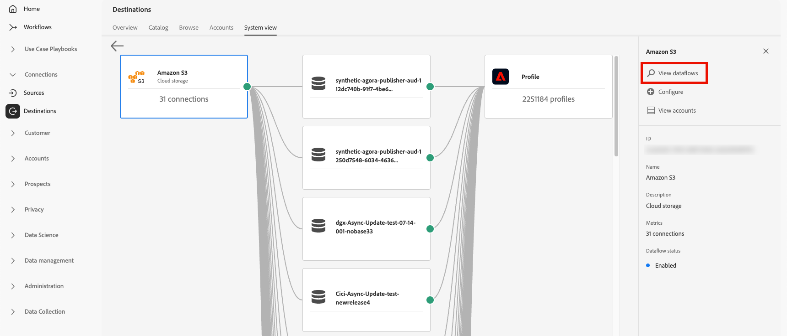

# Espaço de trabalho Destinos {#destinations-workspace}

No Adobe Experience Platform, selecione **[!UICONTROL Destinations]** na barra de navegação esquerda para acessar o espaço de trabalho [!UICONTROL Destinations].

O espaço de trabalho [!UICONTROL Destinations] consiste em cinco seções, [!UICONTROL Overview], [!UICONTROL Catalog], [!UICONTROL Browse], [!UICONTROL Accounts] e [!UICONTROL System View], descritas nas seções abaixo.

## [!UICONTROL Overview] {#overview}

A guia **[!UICONTROL Overview]** exibe o painel [!UICONTROL Destinations], fornecendo as métricas principais relacionadas aos dados de destino da sua organização. Para saber mais, visite o [[!UICONTROL Destinations] guia do painel](../../dashboards/guides/destinations.md).

>[!NOTE]
>
>Se sua organização for nova no Experience Platform e ainda não tiver destinos ativos, o painel [!UICONTROL Destinations] e a guia [!UICONTROL Overview] não estarão visíveis. Em vez disso, selecionar [!UICONTROL Destinations] na navegação à esquerda exibe a [[!UICONTROL Catalog] guia](#catalog).

## [!UICONTROL Catalog] {#catalog}

A guia **[!UICONTROL Catalog]** exibe uma lista de todos os destinos disponíveis em [!DNL Experience Platform], para os quais você pode enviar dados.

A interface de usuário do [!DNL Experience Platform] fornece várias opções de pesquisa e filtro na página de catálogo de destinos:

* Use a funcionalidade de pesquisa na página para localizar um destino específico.
* Filtrar destinos usando o controle **[!UICONTROL Categories]**.
* Alternar entre **[!UICONTROL All destinations]** e **[!UICONTROL My destinations]**. Quando você seleciona **[!UICONTROL All destinations]**, todos os destinos [!DNL Experience Platform] disponíveis são exibidos. Ao selecionar **[!UICONTROL My destinations]**, você só poderá ver os destinos com os quais estabeleceu uma conexão.
* Selecione para exibir os tipos **[!UICONTROL Connections]** e/ou **[!UICONTROL Extensions]**. Para entender a diferença entre as duas categorias, leia [Tipos de Destino e Categorias](../destination-types.md).
* Filtre os destinos disponíveis com base no [tipo de dados](/help/destinations/destination-sdk/functionality/destination-configuration/audience-data-type.md) com suporte. Escolha entre públicos-alvo de pessoas, públicos-alvo de contas, públicos-alvo de clientes potenciais ou exportações de conjunto de dados.

Os cartões de destino contêm opções de controle primário e secundário. Os controles primários incluem [!UICONTROL Set up], [!UICONTROL Activate], [!UICONTROL Activate audiences] ou [!UICONTROL Export datasets]. Os controles secundários permitem opções de exibição. Esses controles estão descritos abaixo:

| Controle | Descrição |
|---------|----------|
| [!UICONTROL Set up] | Permite criar uma conexão com o destino. |
| [!UICONTROL Activate] | Depois de estabelecer uma conexão com o destino, você pode ativar públicos ou exportar conjuntos de dados para esse destino. |
| [!UICONTROL Activate audiences] | Depois de estabelecer uma conexão com o destino, você poderá ativar os públicos para esse destino. |
| [!UICONTROL Export datasets] | Depois de estabelecer uma conexão com o destino, você poderá exportar conjuntos de dados para esse destino. |
| [!UICONTROL View account] | Exibir as contas conectadas a um destino. |
| [!UICONTROL View dataflows] | Exibir os fluxos de ativação de dados existentes para um destino. |
| [!UICONTROL View documentation] | Abre um link para a página de documentação do destino específico. Para obter mais informações e ajudar a configurar. |

{style="table-layout:auto"}

Selecione um cartão de destino no catálogo para abrir o painel direito. Aqui, você pode ver uma descrição do destino. O painel direito fornece os mesmos controles descritos na tabela acima, incluindo uma descrição do destino e uma indicação da categoria e do tipo de destino.

Para obter mais informações sobre categorias de destino e informações sobre cada destino, consulte o [Catálogo de destinos](../catalog/overview.md) e [Tipos e categorias de destino](../destination-types.md).

## [!UICONTROL Browse] {#browse}

>[!NOTE]
>
>Devido às configurações de rótulo de acesso, os fluxos de dados de destino aos quais um usuário não tem acesso podem aparecer na interface do usuário em um estado esmaecido. Leia a documentação sobre [uso dos rótulos de acesso para gerenciar o acesso do usuário aos fluxos de dados de destino](../../access-control/abac/apply-access-labels-destinations.md#important-callouts-and-items-to-know) para obter mais informações.

A guia **[!UICONTROL Browse]** exibe os destinos com os quais você estabeleceu uma conexão.

>[!TIP]
>
> Comece com a [barra de pesquisa](#search-browse) para encontrar fluxos de dados específicos e, em seguida, use os [filtros da barra lateral](#filter-options-browse) para restringir ainda mais seus resultados.

Destinos com a opção **[!UICONTROL Enabled/Disabled]** ativada definem o destino como **[!UICONTROL Enabled]** ou **[!UICONTROL Disabled]**, respectivamente. Você também pode exibir os destinos nos quais há dados fluindo selecionando **[!UICONTROL Audiences]** > **[!UICONTROL Browse]** e selecionando um público a ser inspecionado.

>[!TIP]
>
> 
> 
> * Selecione as reticências (`...`) na coluna [!UICONTROL Name] e use o controle  **[!UICONTROL Activate audiences]** para exportar públicos-alvo ou conjuntos de dados para esse destino.
> * Selecione as reticências (`...`) na coluna [!UICONTROL Name] e use o controle **[!UICONTROL Edit destination]**para editar conexões de destino existentes. Leia o tutorial sobre [edição de destinos](/help/destinations/ui/edit-destination.md) para obter mais informações.
> * Selecione as reticências (`...`) na coluna [!UICONTROL Name] e use o controle  **[!UICONTROL Edit marketing actions]** para [alterar as ações de marketing](/help/destinations/ui/edit-activation.md#edit-marketing-actions) do destino selecionado.
> * Selecione as reticências (`...`) na coluna [!UICONTROL Name] e use o controle Excluir **[!UICONTROL Delete]** para [remover](delete-destinations.md) uma conexão existente com um destino.
> * Selecione as reticências (`...`) na coluna [!UICONTROL Name] e use o controle  **[!UICONTROL View in monitoring]** para exibir informações de ativação para este destino no [painel de monitoramento](/help/dataflows/ui/monitor-destinations.md#monitoring-destinations-dashboard).
> * Selecione as reticências (`...`) na coluna [!UICONTROL Name] e use o controle  **[!UICONTROL Subscribe to alerts]** para assinar alertas de fluxo de dados de destino. Você pode assinar alertas para receber mensagens sobre o status, o sucesso ou a falha da execução do fluxo. Consulte [Assinar alertas de destino em contexto](alerts.md) para obter informações detalhadas sobre alertas de fluxo de dados de destino.
> * Selecione as reticências (`...`) na coluna [!UICONTROL Name] e use o controle  **[!UICONTROL Manage tags]** para adicionar ou remover marcas de um destino. Consulte a seção [Gerenciar tags de destino](#manage-tags) para obter informações detalhadas sobre o uso de tags.

Consulte a tabela abaixo para obter todas as informações fornecidas para cada destino na guia [!UICONTROL Browse].

| Elemento | Descrição |
|---------|----------|
| Nome | O nome fornecido para o fluxo de ativação para esse destino. |
| Tipo de dados | O tipo de dados aceito pela conexão de destino. Tipos de dados compatíveis: <ul><li>**[!UICONTROL Customers]**</li><li>**[!UICONTROL Prospects]**</li><li>**[!UICONTROL Accounts]**</li><li>**[!UICONTROL Datasets]**</li></ul> |
| [!UICONTROL Last Dataflow Run Status] | O status da última execução do fluxo de dados. Consulte [Exibir detalhes do destino](destination-details-page.md) para obter mais informações sobre execuções de fluxo de dados. |
| [!UICONTROL Last Dataflow Run Date] | Hora e data em que ocorreu a última execução do fluxo de dados. Selecione o cabeçalho da coluna para acessar as opções de classificação (**[!UICONTROL Sort Ascending]**, **[!UICONTROL Sort Descending]**). Consulte [Exibir detalhes do destino](destination-details-page.md) para obter mais informações sobre execuções de fluxo de dados. |
| [!UICONTROL Destination] | A plataforma de destino selecionada para o fluxo de ativação. |
| [!UICONTROL Account Expiration Date] | A data em que a autorização de conexão com este destino expirará.   Um ícone de aviso  é exibido antes da data de expiração para alertá-lo de que a conexão irá expirar e pode exigir renovação. Os fluxos de dados para conexões expiradas são interrompidos e você deve reautenticar para retomar os fluxos de trabalho de ativação.  **Importante**: esta coluna está disponível no momento apenas para as conexões [Pinterest](../catalog/advertising/pinterest.md), [LinkedIn](../catalog/social/linkedin.md) e [LinkedIn Matched Audiences](../catalog/social/linkedin-b2b.md).   {width="100" zoomable="yes" alt="Screenshot showing the account expiration warning icon and expiration date in the Browse tab."} |
| [!UICONTROL Username] | As credenciais de conta selecionadas para o fluxo de destino. |
| [!UICONTROL Activation Data] | Indica o número de públicos-alvo que estão sendo ativados para esse destino. Selecione este controle para saber mais sobre os públicos ativados. Consulte [Dados de ativação](/help/destinations/ui/destination-details-page.md#activation-data) na página de detalhes do destino para obter mais informações sobre os públicos ativados. |
| [!UICONTROL Created] | A data e a hora em que o fluxo de ativação para o destino foi criado. Selecione o símbolo de seta para cima/para baixo para classificar os fluxos de ativação pelo mais recente primeiro ou pelo mais antigo primeiro. |
| [!UICONTROL Modified] | A data e a hora em que o fluxo de ativação para o destino foi modificado pela última vez. |
| [!UICONTROL Status] | `Enabled` ou `Disabled`. Indica se os dados estão sendo ativados para este destino. |
| [!UICONTROL Access labels] | Exibe todos os rótulos de acesso que foram adicionados a esse fluxo de dados de destino. Leia mais sobre [aplicação de rótulos de acesso a fluxos de dados de destino](/help/access-control/abac/apply-access-labels-destinations.md). |
| [!UICONTROL Tags] | Exibe todas as tags adicionadas a esse fluxo de dados de destino. Use tags para organizar e categorizar seus fluxos de dados para facilitar o gerenciamento. |

Clique em uma linha de destino para exibir mais informações sobre o destino no painel direito, como ID de destino, descrição, o número de públicos ativados e muito mais.

Selecione o nome do destino para ver informações sobre os públicos ativados para esse destino. Clique em **[!UICONTROL Edit destination]** para [modificar as configurações de destino](/help/destinations/ui/edit-destination.md) ou **[!UICONTROL Activate audiences]** para adicionar novos públicos ao fluxo de dados.

### Filtrar fluxos de dados na guia Procurar {#filter-browse}

A guia **[!UICONTROL Browse]** inclui recursos aprimorados de filtragem e pesquisa para ajudar você a encontrar e gerenciar rapidamente seus fluxos de dados de destino. Use a barra lateral esquerda para aplicar filtros e a barra de pesquisa para localizar fluxos de dados específicos por nome.

### Funcionalidade de pesquisa {#search-browse}

Use a barra de pesquisa na parte superior da tabela para localizar rapidamente os fluxos de dados por nome. À medida que você digita, os resultados são filtrados automaticamente para mostrar apenas os fluxos de dados correspondentes.

### Opções de filtro {#filter-options-browse}

Use os filtros na barra lateral esquerda para restringir sua pesquisa.

* **[!UICONTROL Destination platform]**: filtrar fluxos de dados por plataformas de destino específicas (por exemplo, [!DNL Amazon S3], [!DNL Facebook Custom Audience], [!DNL LinkedIn Matched Audience] etc.). Você pode selecionar várias plataformas simultaneamente.
* **[!UICONTROL Has any tag]**: filtrar fluxos de dados que tenham marcas específicas atribuídas a eles. Isso ajuda a organizar e encontrar fluxos de dados com base em sua marcação personalizada.
* **[!UICONTROL Status]**: filtrar fluxos de dados por seu status operacional:
   * **[!UICONTROL Enabled]**: mostra somente fluxos de dados ativos
   * **[!UICONTROL Disabled]**: mostra somente fluxos de dados inativos
* **[!UICONTROL Account name]**: filtre fluxos de dados pelo nome de conta associado. Isso ajuda a encontrar todos os fluxos de dados conectados a uma conta de destino específica.
* **[!UICONTROL Created]**: filtre os fluxos de dados pelo usuário que os criou. Use esse filtro para localizar fluxos de dados criados por membros de equipe específicos.
* **[!UICONTROL Modified by]**: filtre os fluxos de dados pelo usuário que os modificou pela última vez. Use esse filtro para identificar alterações recentes feitas por usuários específicos.
* **[!UICONTROL Creation date]**: filtre os fluxos de dados pela data de criação usando um intervalo de datas:
   * **[!UICONTROL Start date]**: Definir o início do intervalo de datas
   * **[!UICONTROL End date]**: Definir o fim do intervalo de datas
* **[!UICONTROL Modified date]**: filtre fluxos de dados por data de modificação usando um intervalo de datas:
   * **[!UICONTROL Start date]**: Definir o início do intervalo de datas
   * **[!UICONTROL End date]**: Definir o fim do intervalo de datas

### Filtros ativos {#active-filters-browse}

Quando você aplica filtros, eles são exibidos como tags abaixo da barra de pesquisa.

Lá é possível:

* Exibir todos os filtros ativos no momento
* Remova filtros individuais clicando no ícone `X` em cada tag de filtro
* Limpar todos os filtros de uma só vez usando a opção **[!UICONTROL Clear all]**

### Gerenciar tags de destino {#manage-tags}

As tags ajudam a organizar e categorizar os fluxos de dados de destino para facilitar o gerenciamento. É possível adicionar e remover tags de fluxos de dados individuais para agrupá-las com base nas necessidades da empresa.

Para adicionar uma marca a um fluxo de dados, selecione as reticências (`...`) na coluna **[!UICONTROL Name]** e selecione **[!UICONTROL Manage tags]** no menu de contexto.
Digite o nome de uma nova marca no campo **[!UICONTROL Tags]** e selecione **[!UICONTROL Save]** para aplicar suas alterações.

Para remover uma marca de um fluxo de dados, selecione as reticências (`...`) na coluna **[!UICONTROL Name]** e selecione **[!UICONTROL Manage tags]** no menu de contexto, em seguida, selecione o ícone `X` na marca que deseja remover.

### Práticas recomendadas de marcação {#tag-best-practices}

Certifique-se de que os fluxos de dados de destino permaneçam organizados, fáceis de encontrar e gerenciáveis seguindo as diretrizes de marcação abaixo.

* **Usar nomes descritivos**: crie marcas que indiquem claramente a finalidade ou a categoria do fluxo de dados (por exemplo, &quot;Campanhas de marketing&quot;, &quot;Retenção de clientes&quot;, &quot;Promoções da estação&quot;)
* **Seja consistente**: use uma convenção de nomenclatura consistente em sua organização
* **Mantenha a simplicidade**: evite criar muitas marcas, pois isso pode tornar a filtragem menos eficaz
* **Usar marcas hierárquicas**: considere usar prefixos para agrupar marcas relacionadas (por exemplo, &quot;Campanha-Q4&quot;, &quot;Campanha-Q1&quot;)

## [!UICONTROL Accounts] {#accounts}

A guia **[!UICONTROL Accounts]** mostra detalhes sobre as conexões estabelecidas com vários destinos e permite atualizar ou excluir detalhes de contas existentes. Consulte a tabela abaixo para obter todas as informações que você pode obter em cada conta de destino.

>[!TIP]
>
> * Selecione as reticências (`...`) na coluna [!UICONTROL Platform] e use o controle **[!UICONTROL Activate]**/**[!UICONTROL Activate audiences]**/**[!UICONTROL Export datasets]**para exportar públicos ou conjuntos de dados para esse destino.
> * Selecione as reticências (`...`) na coluna [!UICONTROL Platform] e use o controle **[!UICONTROL Edit details]**para [atualizar](update-accounts.md) os detalhes de uma conta de destino existente.
> * Selecione as reticências (`...`) na coluna [!UICONTROL Platform] e use o controle **[!UICONTROL Delete]**para [excluir](delete-destination-account.md) uma conta de destino existente.

| Elemento | Descrição |
|---|---|
| [!UICONTROL Name] | O nome atribuído à conta de destino ao [configurar](connect-destination.md#authenticate) o destino. Selecione o cabeçalho da coluna para acessar as opções de classificação (**[!UICONTROL Sort Ascending]**, **[!UICONTROL Sort Descending]**). |
| [!UICONTROL Destination] | O conector de destino para o qual você configurou a conexão. |
| [!UICONTROL Connection Type] | Representa o tipo de conexão de conta para seu bucket de armazenamento ou destino. Dependendo do destino, as opções de autenticação são: <ul><li>Para destinos de marketing por email: pode ser S3, FTP ou Blob do Azure.</li><li>Para destinos de anúncios em tempo real: de servidor para servidor</li><li>Para destinos de armazenamento na nuvem do Amazon S3: Chave de acesso </li><li>Para destinos de armazenamento na nuvem SFTP: autenticação básica para SFTP</li><li>Autenticação OAuth 1 ou OAuth 2</li><li>Autenticação de token do portador</li></ul> |
| [!UICONTROL Username] | O nome de usuário selecionado no [fluxo de trabalho de destino de conexão](../catalog/email-marketing/overview.md#connect-destination). |
| [!UICONTROL Connections] | Representa o número de fluxos de dados de destino exclusivos bem-sucedidos conectados às informações básicas criadas para um destino. |
| [!UICONTROL Authorization date] | A data em que a conexão com esse destino foi autorizada. |
| [!UICONTROL Expiration date] | A data em que a autorização de conexão com este destino expirará.   Um ícone de aviso  é exibido antes da data de expiração para alertá-lo de que a conexão irá expirar e pode exigir renovação. Os fluxos de dados para conexões expiradas são interrompidos e você deve reautenticar para retomar os fluxos de trabalho de ativação.  **Importante**: esta coluna está disponível no momento apenas para as conexões do [Pinterest](../catalog/advertising/pinterest.md), [LinkedIn](../catalog/social/linkedin.md) e [LinkedIn Matched Audiences](../catalog/social/linkedin-b2b.md).   {width="100" zoomable="yes"} |

{style="table-layout:auto"}

### Filtrar contas {#filter-accounts}

A guia **[!UICONTROL Accounts]** inclui recursos aprimorados de filtragem e pesquisa para ajudá-lo a localizar e gerenciar rapidamente suas contas de destino. Use a barra lateral esquerda para aplicar filtros e a barra de pesquisa para localizar contas específicas por nome.

#### Pesquisar contas {#search-accounts}

Use a barra de pesquisa na parte superior da tabela para localizar rapidamente as contas por nome. À medida que você digita, os resultados são filtrados automaticamente para mostrar somente as contas correspondentes.

#### Opções de filtro {#filter-options-accounts}

Use os filtros na barra lateral esquerda para restringir sua pesquisa.

* **[!UICONTROL Destination platform]**: Filtre contas por plataformas de destino específicas (por exemplo: [!DNL Microsoft Bing], [!DNL Amazon S3], [!DNL Facebook Custom Audiences], [!DNL LinkedIn Matched Audiences] e assim por diante). Você pode selecionar várias plataformas simultaneamente.
* **[!UICONTROL Created by]**: filtre contas pelo usuário que as criou. Use esse filtro para localizar contas criadas por membros de equipe específicos.

#### Filtros ativos {#active-filters-accounts}

Quando você aplica filtros, eles são exibidos como tags abaixo da barra de pesquisa.

Lá é possível:

* Exibir todos os filtros ativos no momento
* Remova filtros individuais clicando no ícone `X` em cada tag de filtro
* Limpar todos os filtros de uma só vez usando a opção **[!UICONTROL Clear all]**

## [!UICONTROL System View] {#system-view}

A guia **[!UICONTROL System View]** exibe uma representação gráfica dos fluxos de ativação configurados no Adobe Experience Platform.

Selecione qualquer um dos destinos exibidos na página e clique em **[!UICONTROL View dataflows]** para ver informações sobre todas as conexões configuradas para cada destino.

