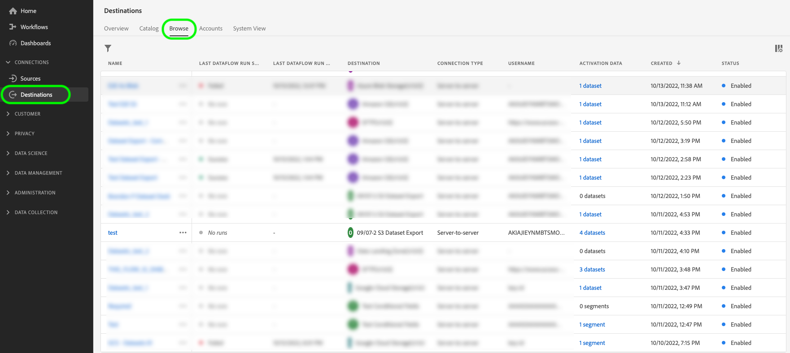

# Exportar conjuntos de dados para destinos de armazenamento na nuvem

>[!AVAILABILITY]
>
>Essa funcionalidade está disponível para clientes que compraram o pacote Real-Time CDP Prime ou Ultimate, Adobe Journey Optimizer ou Customer Journey Analytics. Entre em contato com o representante da Adobe para obter mais informações.

>[!IMPORTANT]
>
>**Item de ação**: a versão de [setembro de 2024 do Experience Platform](/help/release-notes/latest/latest.md#destinations) introduziu a opção para definir uma data `endTime` para fluxos de dados do conjunto de dados de exportação. A Adobe também introduziu uma data de término padrão de 1º de setembro de 2025 para todos os fluxos de dados de exportação do conjunto de dados criados *antes de 1º de novembro de 2024*.
>
>Para qualquer um desses fluxos de dados, é necessário atualizar manualmente a data final no fluxo de dados antes da data final, caso contrário, suas exportações serão interrompidas nessa data. Use a interface do usuário do Experience Platform para visualizar quais fluxos de dados serão definidos para serem interrompidos em 1º de setembro de 2025.
>
>Consulte a [seção de agendamento](#scheduling) para obter informações sobre como editar a data final de um fluxo de dados de exportação do conjunto de dados.

Este artigo explica o fluxo de trabalho necessário para exportar [conjuntos de dados](/help/catalog/datasets/overview.md) da Adobe Experience Platform para o local de armazenamento na nuvem preferido, como [!DNL Amazon S3], locais SFTP ou [!DNL Google Cloud Storage], usando a interface do usuário do Experience Platform.

Você também pode usar as APIs do Experience Platform para exportar conjuntos de dados. Leia o [tutorial da API de conjuntos de dados de exportação](/help/destinations/api/export-datasets.md) para obter mais informações.

## Conjuntos de dados disponíveis para exportação {#datasets-to-export}

Os conjuntos de dados que você pode exportar variam com base no aplicativo do Experience Platform (Real-Time CDP, Adobe Journey Optimizer), no nível (Prime ou Ultimate) e em qualquer complemento que você tenha adquirido (por exemplo: Data Distiller).

Use a tabela abaixo para entender quais tipos de conjunto de dados você pode exportar, dependendo do aplicativo, da camada do produto e de qualquer complemento adquirido:

<table>
<thead>
  <tr>
    <th>Aplicativo/Complemento</th>
    <th>Nível</th>
    <th>Conjuntos de dados disponíveis para exportação</th>
  </tr>
</thead>
<tbody>
  <tr>
    <td rowspan="2">Real-Time CDP</td>
    <td>Prime</td>
    <td>Conjuntos de dados de Perfil e Evento de experiência criados na interface do Experience Platform após assimilar ou coletar dados por meio de Fontes, Web SDK, Mobile SDK, Conector de dados do Analytics e Audience Manager.</td>
  </tr>
  <tr>
    <td>Ultimate</td>
    <td><ul><li>Conjuntos de dados de Perfil e Evento de experiência criados na interface do Experience Platform após assimilar ou coletar dados por meio de Fontes, Web SDK, Mobile SDK, Conector de dados do Analytics e Audience Manager.</li><li> <a href="https://experienceleague.adobe.com/docs/experience-platform/dashboards/query.html#profile-attribute-datasets">Conjunto de dados de Instantâneo de Perfil gerado pelo sistema</a>.</li></td>
  </tr>
  <tr>
    <td rowspan="2">Adobe Journey Optimizer</td>
    <td>Prime</td>
    <td>Consulte a documentação do <a href="https://experienceleague.adobe.com/docs/journey-optimizer/using/data-management/datasets/export-datasets.html#datasets"> Adobe Journey Optimizer</a>.</td>
  </tr>
  <tr>
    <td>Ultimate</td>
    <td>Consulte a documentação do <a href="https://experienceleague.adobe.com/docs/journey-optimizer/using/data-management/datasets/export-datasets.html#datasets"> Adobe Journey Optimizer</a>.</td>
  </tr>
  <tr>
    <td>Customer Journey Analytics</td>
    <td>Todas</td>
    <td> Conjuntos de dados de Perfil e Evento de experiência criados na interface do Experience Platform após assimilar ou coletar dados por meio de Fontes, Web SDK, Mobile SDK, Conector de dados do Analytics e Audience Manager.</td>
  </tr>
  <tr>
    <td>Destilador de dados</td>
    <td>Data Distiller (Complemento)</td>
    <td>Conjuntos de dados derivados criados por meio do Serviço de consulta.</td>
  </tr>
</tbody>
</table>

## Tutorial em vídeo {#video-tutorial}

Assista ao vídeo abaixo para obter uma explicação completa do fluxo de trabalho descrito nesta página, os benefícios de usar a funcionalidade de conjunto de dados de exportação e alguns casos de uso sugeridos.

>[!VIDEO](https://video.tv.adobe.com/v/3424392/)

## Destinos compatíveis {#supported-destinations}

Atualmente, você pode exportar conjuntos de dados para os destinos de armazenamento na nuvem destacados na captura de tela e listados abaixo.

* [[!DNL Azure Data Lake Storage Gen2]](../../destinations/catalog/cloud-storage/adls-gen2.md)
* [[!DNL Data Landing Zone]](../../destinations/catalog/cloud-storage/data-landing-zone.md)
* [[!DNL Google Cloud Storage]](../../destinations/catalog/cloud-storage/google-cloud-storage.md)
* [[!DNL Amazon S3]](../../destinations/catalog/cloud-storage/amazon-s3.md#changelog)
* [[!DNL Azure Blob]](../../destinations/catalog/cloud-storage/azure-blob.md#changelog)
* [[!DNL SFTP]](../../destinations/catalog/cloud-storage/sftp.md#changelog)

## Quando ativar públicos ou exportar conjuntos de dados {#when-to-activate-audiences-or-activate-datasets}

Alguns destinos baseados em arquivos no catálogo do Experience Platform são compatíveis com a ativação de público-alvo e a exportação de conjunto de dados.

* Considere ativar públicos-alvo quando quiser que seus dados sejam estruturados em perfis agrupados por interesses ou qualificações de público-alvo.
* Como alternativa, considere as exportações de conjunto de dados ao procurar exportar conjuntos de dados brutos, que não são agrupados ou estruturados por interesses ou qualificações de público-alvo. Você pode usar esses dados para relatórios, fluxos de trabalho de ciência de dados e muitos outros casos de uso. Por exemplo, como administrador, engenheiro de dados ou analista, você pode exportar dados do Experience Platform para sincronizar com seu data warehouse, usar em ferramentas de análise de BI, ferramentas de aprendizado de máquina na nuvem externas ou armazenar em seu sistema para necessidades de armazenamento de longo prazo.

Este documento contém todas as informações necessárias para exportar conjuntos de dados. Se você quiser ativar *públicos-alvo* para destinos de marketing por email ou armazenamento na nuvem, leia [Ativar dados de público-alvo para destinos de exportação de perfil em lote](/help/destinations/ui/activate-batch-profile-destinations.md).

## Pré-requisitos {#prerequisites}

Observe os seguintes pré-requisitos para exportar conjuntos de dados:

* Para exportar conjuntos de dados para destinos de armazenamento na nuvem, você deve ter [se conectado com êxito a um destino](./connect-destination.md). Se ainda não tiver feito isso, vá para o [catálogo de destinos](../catalog/overview.md), navegue pelos destinos compatíveis e configure o destino que deseja usar.
* Os conjuntos de dados do perfil precisam ser ativados para uso no Perfil do cliente em tempo real. [Leia mais](/help/ingestion/tutorials/ingest-batch-data.md#enable-for-profile) sobre como habilitar esta opção.

### Permissões necessárias {#permissions}

Para exportar conjuntos de dados, você precisa das **[!UICONTROL View Destinations]**, **[!UICONTROL View Datasets]** e **[!UICONTROL Manage and Activate Dataset Destinations]** [permissões de controle de acesso](/help/access-control/home.md#permissions). Leia a [visão geral do controle de acesso](/help/access-control/ui/overview.md) ou contate o administrador do produto para obter as permissões necessárias.

Para garantir que você tenha as permissões necessárias para exportar conjuntos de dados e que o destino seja compatível com a exportação de conjuntos de dados, navegue pelo catálogo de destinos. Se um destino tiver um controle **[!UICONTROL Activate]** ou **[!UICONTROL Export datasets]**, você terá as permissões apropriadas.

## Selecione seu destino {#select-destination}

Siga as instruções para selecionar um destino em que você possa exportar seus conjuntos de dados:

1. Vá para **[!UICONTROL Connections > Destinations]** e selecione a guia **[!UICONTROL Catalog]**.

   

1. Selecione **[!UICONTROL Activate]** ou **[!UICONTROL Export datasets]** no cartão correspondente ao destino para o qual você deseja exportar conjuntos de dados.

   

1. Selecione **[!UICONTROL Data type Datasets]**, selecione a conexão de destino para a qual você deseja exportar conjuntos de dados e selecione **[!UICONTROL Next]**.

>[!TIP]
> 
>Se quiser configurar um novo destino para exportar conjuntos de dados, selecione **[!UICONTROL Configure new destination]** para acionar o fluxo de trabalho [Conectar ao destino](/help/destinations/ui/connect-destination.md).

1. A exibição **[!UICONTROL Select datasets]** aparece. Prossiga para a próxima seção para [selecionar seus conjuntos de dados](#select-datasets) para exportação.

## Selecione seus conjuntos de dados {#select-datasets}

Use as caixas de seleção à esquerda dos nomes dos conjuntos de dados para selecionar os conjuntos de dados que você deseja exportar para o destino e selecione **[!UICONTROL Next]**.

>[!NOTE]
>
>Todos os conjuntos de dados selecionados aqui compartilharão a mesma programação de exportação. Se você precisar de programações de exportação diferentes (por exemplo, exportações incrementais para alguns conjuntos de dados e exportações completas únicas para outros), crie fluxos de dados separados para cada tipo de programação.

## Programar exportação do conjunto de dados {#scheduling}

>[!CONTEXTUALHELP]
>id="platform_destinations_activate_datasets_exportoptions"
>title="Opções de exportação de arquivo para conjuntos de dados"
>abstract="Selecione **Exportar arquivos incrementais** para exportar apenas os dados que foram adicionados ao conjunto de dados desde a última exportação.   A primeira exportação de arquivo incremental inclui todos os dados no conjunto de dados, atuando como um preenchimento retroativo. Os arquivos incrementais futuros incluem apenas os dados que foram adicionados ao conjunto de dados desde a primeira exportação.   Selecione **Exportar arquivos completos** para exportar a assinatura completa de cada conjunto de dados em cada exportação. "

>[!CONTEXTUALHELP]
>id="dataset_dataflow_needs_schedule_end_date_header"
>title="Atualizar a data final deste fluxo de dados"
>abstract="Atualizar a data final deste fluxo de dados"

>[!CONTEXTUALHELP]
>id="dataset_dataflow_needs_schedule_end_date_body"
>title="Atualizar a data final deste corpo de fluxo de dados"
>abstract="Devido a atualizações recentes nesse destino, o fluxo de dados agora requer uma data final. A Adobe definiu uma data final padrão para 1º de setembro de 2025. Atualize para a data final desejada, caso contrário, as exportações de dados serão interrompidas na data padrão."

>[!IMPORTANT]
>
>**O agendamento se aplica a todos os conjuntos de dados no fluxo de dados**
>
>Ao configurar ou modificar o agendamento de exportação, ele se aplica a **todos os conjuntos de dados** que estão sendo exportados no momento por meio do fluxo de dados que você está configurando. Não é possível definir programações diferentes para conjuntos de dados individuais no mesmo fluxo de dados.
>
>Se você precisar de programações de exportação diferentes para conjuntos de dados diferentes, deverá criar fluxos de dados separados (conexões de destino separadas) para cada tipo de programação.
>
>**Exemplo:** se você tiver o Conjunto de dados A exportando incrementalmente e adicionar o Conjunto de dados B com um agendamento de exportação completo único, o Conjunto de dados A também será atualizado para o agendamento de exportação completo único.

Use a etapa **[!UICONTROL Scheduling]** para:

* Defina uma data de início e uma data de término, bem como uma cadência de exportação para suas exportações do conjunto de dados.
* Configure se os arquivos do conjunto de dados exportados devem exportar a associação completa do conjunto de dados ou apenas alterações incrementais na associação em cada ocorrência de exportação.
* Personalize o caminho da pasta no local de armazenamento para onde os conjuntos de dados devem ser exportados. Leia mais sobre como [editar o caminho da pasta de exportação](#edit-folder-path).

Use o controle **[!UICONTROL Edit schedule]** na página para editar a cadência de exportação das exportações, bem como para selecionar se deseja exportar arquivos completos ou incrementais.

>[!WARNING]
>
>Modificar o agendamento aqui atualizará o comportamento de exportação para todos os conjuntos de dados neste fluxo de dados. Se esse fluxo de dados contiver vários conjuntos de dados, todos eles serão afetados por essa alteração.

A opção **[!UICONTROL Export incremental files]** é selecionada por padrão. Isso aciona uma exportação de um ou vários arquivos que representam um instantâneo completo do conjunto de dados. Os arquivos subsequentes são adições incrementais ao conjunto de dados desde a exportação anterior. Você também pode selecionar **[!UICONTROL Export full files]**. Nesse caso, selecione a frequência **[!UICONTROL Once]** para uma exportação completa única do conjunto de dados.

>[!IMPORTANT]
>
>A primeira exportação de arquivo incremental inclui todos os dados existentes no conjunto de dados, funcionando como um preenchimento retroativo. A exportação pode conter um ou vários arquivos.

1. Use o seletor **[!UICONTROL Frequency]** para selecionar a frequência de exportação:

   * **[!UICONTROL Daily]**: agende exportações de arquivos incrementais uma vez por dia, todos os dias, no horário especificado.
   * **[!UICONTROL Hourly]**: agendar exportações de arquivo incrementais a cada 3, 6, 8 ou 12 horas.

2. Use o seletor **[!UICONTROL Time]** para escolher a hora do dia, no formato [!DNL UTC], em que a exportação deve ocorrer.

3. Use o seletor **[!UICONTROL Date]** para escolher o intervalo em que a exportação deve ocorrer.

4. Selecione **[!UICONTROL Save]** para salvar o cronograma e prosseguir para a etapa **[!UICONTROL Review]**.

>[!NOTE]
> 
>Para exportações de conjunto de dados, os nomes de arquivo têm um formato padrão predefinido que não pode ser modificado. Consulte a seção [Verificar exportação do conjunto de dados bem-sucedida](#verify) para obter mais informações e exemplos de arquivos exportados.

## Editar caminho da pasta {#edit-folder-path}

>[!CONTEXTUALHELP]
>id="destinations_folder_name_template"
>title="Editar caminho da pasta"
>abstract="Use as diversas macros fornecidas para personalizar o caminho da pasta onde os conjuntos de dados são exportados."

>[!CONTEXTUALHELP]
>id="destinations_folder_name_template_preview"
>title="Visualização do caminho da pasta do conjunto de dados"
>abstract="Obtenha uma visualização da estrutura de pastas criada no local de armazenamento com base nas macros adicionadas nesta janela."

Selecione **[!UICONTROL Edit folder path]** para personalizar a estrutura de pastas no local de armazenamento onde os conjuntos de dados exportados estão depositados.

Você pode usar várias macros disponíveis para personalizar um nome de pasta desejado. Clique duas vezes em uma macro para adicioná-la ao caminho da pasta e use `/` entre as macros para separar as pastas.

Depois de selecionar as macros desejadas, você pode visualizar a estrutura de pastas que será criada no local de armazenamento. O primeiro nível na estrutura de pastas representa o **[!UICONTROL Folder path]** indicado quando você [se conectou ao destino](/help/destinations/ui/connect-destination.md#set-up-connection-parameters) para exportar conjuntos de dados.

### Práticas recomendadas para gerenciar vários conjuntos de dados {#best-practices-multiple-datasets}

Ao exportar vários conjuntos de dados, considere as seguintes práticas recomendadas:

* **Mesmos requisitos de agendamento**: agrupe conjuntos de dados que precisam do mesmo agendamento de exportação (frequência, tipo) em um único fluxo de dados para facilitar o gerenciamento.
* **Diferentes requisitos de agendamento**: crie fluxos de dados separados para conjuntos de dados que exigem diferentes agendamentos de exportação ou tipos de exportação (incremental vs. completo). Isso garante que cada conjunto de dados seja exportado de acordo com suas necessidades específicas.
* **Revisar antes de modificar**: antes de alterar o agendamento em um fluxo de dados existente, revise quais conjuntos de dados já estão sendo exportados por meio desse fluxo de dados para evitar alterações não intencionais em seu comportamento de exportação.
* **Documentar sua configuração**: acompanhe quais conjuntos de dados estão em quais fluxos de dados, especialmente ao gerenciar vários agendamentos de exportação em diferentes destinos.

## Revisar {#review}

Na página **[!UICONTROL Review]**, você pode ver um resumo da sua seleção. Selecione **[!UICONTROL Cancel]** para interromper o fluxo, **[!UICONTROL Back]** para modificar suas configurações ou **[!UICONTROL Finish]** para confirmar sua seleção e começar a exportar conjuntos de dados para o destino.

## Verificar se o conjunto de dados foi exportado com êxito {#verify}

Ao exportar conjuntos de dados, o Experience Platform cria um ou vários arquivos do `.json` ou do `.parquet` no local de armazenamento fornecido. Espere que os novos arquivos sejam depositados no local de armazenamento de acordo com o agendamento de exportação fornecido.

O Experience Platform cria uma estrutura de pastas no local de armazenamento especificado, onde ele deposita os arquivos exportados do conjunto de dados. O padrão de exportação de pasta padrão é mostrado abaixo, mas você pode [personalizar a estrutura de pastas com suas macros preferidas](#edit-folder-path).

>[!TIP]
> 
>O primeiro nível nesta estrutura de pasta - `folder-name-you-provided` - representa o **[!UICONTROL Folder path]** que você indicou quando [conectou-se ao destino](/help/destinations/ui/connect-destination.md##set-up-connection-parameters) para exportar conjuntos de dados.

`folder-name-you-provided/datasetID/exportTime=YYYYMMDDHHMM`

O nome de arquivo padrão é gerado aleatoriamente e garante que os nomes de arquivo exportados sejam exclusivos.

### Arquivos de conjunto de dados de exemplo {#sample-files}

A presença desses arquivos no local de armazenamento é a confirmação de uma exportação bem-sucedida. Para entender como os arquivos exportados são estruturados, você pode baixar um [.arquivo parquet](../assets/common/part-00000-tid-253136349007858095-a93bcf2e-d8c5-4dd6-8619-5c662e261097-672704-1-c000.parquet) ou [.arquivo json](../assets/common/part-00000-tid-4172098795867639101-0b8c5520-9999-4cff-bdf5-1f32c8c47cb9-451986-1-c000.json) de amostra.

#### Arquivos de conjunto de dados compactados {#compressed-dataset-files}

Em [conectar ao fluxo de trabalho de destino](/help/destinations/ui/connect-destination.md#file-formatting-and-compression-options), você pode selecionar os arquivos do conjunto de dados exportados a serem compactados, conforme mostrado abaixo:

Observe a diferença no formato de arquivo entre os dois tipos de arquivo, quando compactados:

* Ao exportar arquivos JSON compactados, o formato de arquivo exportado é `json.gz`. O formato do JSON exportado é o NDJSON, que é o formato de intercâmbio padrão no ecossistema de big data. A Adobe recomenda usar um cliente compatível com NDJSON para ler os arquivos exportados.
* Ao exportar arquivos parquet compactados, o formato de arquivo exportado é `gz.parquet`

Há suporte para exportações para arquivos JSON *somente no modo compactado*. As exportações para arquivos Parquet são suportadas em um modo compactado e descompactado.

## Remover conjuntos de dados dos destinos {#remove-dataset}

Para remover conjuntos de dados de um fluxo de dados existente, siga as etapas abaixo:

1. Faça logon na [Interface do usuário do Experience Platform](https://experience.adobe.com/platform/) e selecione **[!UICONTROL Destinations]** na barra de navegação esquerda. Selecione **[!UICONTROL Browse]** no cabeçalho superior para exibir seus fluxos de dados de destino existentes.

   

   >[!TIP]
   > 
   >Selecione o ícone de filtro  na parte superior esquerda para iniciar o painel de classificação. O painel de classificação fornece uma lista de todos os seus destinos. Você pode selecionar mais de um destino na lista para ver uma seleção filtrada de fluxos de dados associados ao destino selecionado.

2. Na coluna **[!UICONTROL Activation data]**, selecione o controle de conjuntos de dados para exibir todos os conjuntos de dados mapeados para esse fluxo de dados de exportação.

   

3. A página **[!UICONTROL Activation data]** do destino é exibida. Use as caixas de seleção no lado esquerdo da lista de conjuntos de dados para selecionar os conjuntos de dados que você deseja remover e selecione **[!UICONTROL Remove datasets]** no painel direito para acionar a caixa de diálogo de confirmação de remoção do conjunto de dados.

   

4. Na caixa de diálogo de confirmação, selecione **[!UICONTROL Remove]** para remover imediatamente o conjunto de dados das exportações para o destino.

   

## Direitos de exportação do conjunto de dados {#licensing-entitlement}

Consulte os documentos de descrição do produto para entender quantos dados você está autorizado a exportar para cada aplicativo do Experience Platform, por ano. Por exemplo, você pode exibir a Descrição do Produto Real-Time CDP [aqui](https://helpx.adobe.com/legal/product-descriptions/real-time-customer-data-platform-b2c-edition-prime-and-ultimate-packages.html).

Observe que os direitos de exportação de dados para diferentes aplicativos não são aditivos. Por exemplo, isso significa que, se você comprar o Real-Time CDP Ultimate e o Adobe Journey Optimizer Ultimate, o direito de exportação de perfil será o maior dos dois direitos, de acordo com as descrições do produto. Os direitos de volume são calculados calculando o número total de perfis licenciados e multiplicando por 500 KB para o Real-Time CDP Prime ou 700 KB para o Real-Time CDP Ultimate para determinar o volume de dados ao qual você tem direito.

Por outro lado, se você adquiriu complementos, como o Data Distiller, o limite de exportação de dados ao qual você tem direito representa a soma da camada do produto e do complemento.

Você pode exibir e acompanhar suas exportações de perfil em relação aos limites contratuais no [painel de uso de licença](/help/landing/license-usage-and-guardrails/license-usage-dashboard.md).

## Limitações conhecidas {#known-limitations}

Lembre-se das seguintes limitações da versão de disponibilidade geral das exportações do conjunto de dados:

* O Experience Platform pode exportar vários arquivos mesmo para conjuntos de dados pequenos. A exportação de conjuntos de dados foi projetada para integração de sistema para sistema e otimizada para desempenho, portanto, o número de arquivos exportados não é personalizável.
* Nomes de arquivos exportados não podem ser personalizados no momento.
* No momento, a interface não impede que você exclua um conjunto de dados que está sendo exportado para um destino. Não exclua conjuntos de dados que estejam sendo exportados para destinos. [Remova o conjunto de dados](#remove-dataset) de um fluxo de dados de destino antes de excluí-lo.
* Atualmente, as métricas de monitoramento para exportações de conjunto de dados estão misturadas com números para exportações de perfil, de modo que não refletem os números reais exportados.
* Os dados com um carimbo de data e hora com mais de 365 dias são excluídos das exportações do conjunto de dados. Para obter mais informações, exiba as [medidas de proteção para exportações agendadas do conjunto de dados](/help/destinations/guardrails.md#guardrails-for-scheduled-dataset-exports)

## Perguntas frequentes {#faq}

**É possível gerar um arquivo sem uma pasta se apenas salvarmos em `/` como o caminho da pasta? Além disso, se não exigirmos um caminho de pasta, como os arquivos com nomes duplicados serão gerados em uma pasta ou local?**

+++Resposta
A partir da versão de setembro de 2024, é possível personalizar o nome da pasta e até mesmo usar `/` para exportar arquivos para todos os conjuntos de dados na mesma pasta. A Adobe não recomenda isso para destinos que exportam vários conjuntos de dados, pois os nomes de arquivo gerados pelo sistema pertencentes a conjuntos de dados diferentes serão misturados na mesma pasta.
+++

**Você pode rotear o arquivo de manifesto para uma pasta e os arquivos de dados para outra pasta?**

+++Resposta
Não, não há nenhum recurso para copiar o arquivo de manifesto para um local diferente.
+++

**Podemos controlar o sequenciamento ou o tempo de entrega do arquivo?**

+++Resposta
Há opções para agendar a exportação. Não há opções para atrasar ou sequenciar a cópia dos arquivos. Eles são copiados para o local de armazenamento assim que são gerados.
+++

**Que formatos estão disponíveis para o arquivo de manifesto?**

+++Resposta
O arquivo de manifesto está no formato .json.
+++

**A API está disponível para o arquivo de manifesto?**

+++Resposta
Nenhuma API está disponível para o arquivo de manifesto, mas inclui uma lista de arquivos que compreende a exportação.
+++

**É possível adicionar mais detalhes ao arquivo de manifesto (ou seja, contagem de registros)? Em caso afirmativo, como?**

+++Resposta
Não há possibilidade de adicionar mais informações ao arquivo de manifesto. A contagem de registros está disponível através da entidade `flowRun` (consultável via API). Leia mais em Monitoramento de destinos.
+++

**Como os arquivos de dados são divididos? Quantos registros por arquivo?**

+++Resposta
Os arquivos de dados são divididos pelo particionamento padrão no data lake da Experience Platform. Conjuntos de dados maiores têm um número maior de partições. O particionamento padrão não pode ser configurado pelo usuário, pois está otimizado para leitura.
+++

**É possível definir um limite (número de registros por arquivo)?**

+++Resposta
Não, não é possível.
+++

**Como reenviar um conjunto de dados caso o envio inicial esteja incorreto?**

+++Resposta
As tentativas são implementadas automaticamente para a maioria dos tipos de erros do sistema.
+++

**Posso definir diferentes agendamentos de exportação para diferentes conjuntos de dados no mesmo fluxo de dados?**

+++Resposta
Não, todos os conjuntos de dados em um único fluxo de dados compartilham a mesma programação de exportação. Se você precisar de programações de exportação diferentes para conjuntos de dados diferentes, deverá criar fluxos de dados separados (conexões de destino) para cada tipo de programação. Por exemplo, se você quiser que o Conjunto de dados A seja exportado de forma incremental todos os dias e o Conjunto de dados B seja exportado como uma exportação completa única, será necessário criar dois fluxos de dados separados.
+++
