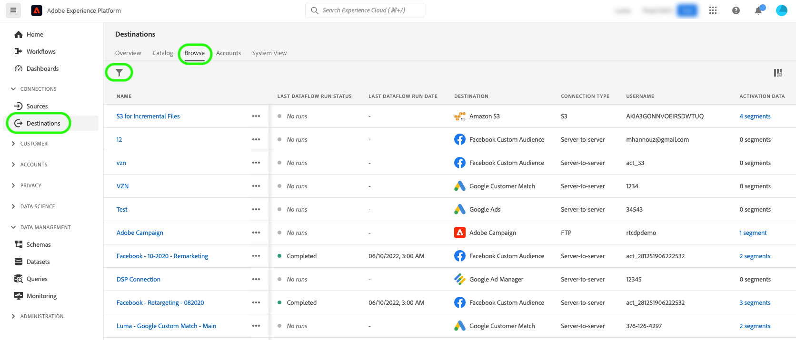
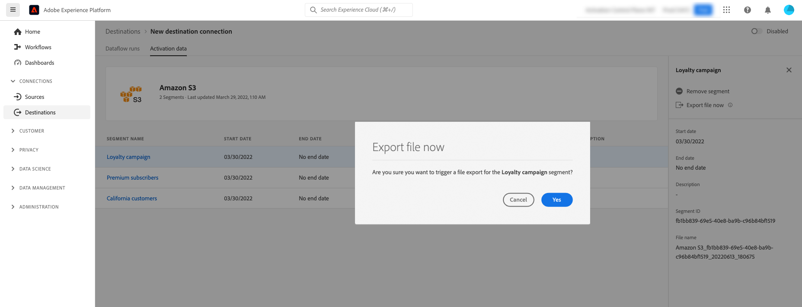

# (Beta) Exportar arquivos sob demanda para destinos em lote usando a interface do usuário do Experience Platform

>[!IMPORTANT]
>
>O **[!UICONTROL Exportar arquivo agora]** no Adobe Experience Platform Destination SDK está atualmente na versão beta. A documentação e a funcionalidade estão sujeitas a alterações.

>[!IMPORTANT]
> 
>Para ativar os dados, é necessário **[!UICONTROL Gerenciar destinos]**, **[!UICONTROL Ativar destinos]**, **[!UICONTROL Exibir perfis]** e **[!UICONTROL Exibir segmentos]** [permissões de controle de acesso](/help/access-control/home.md#permissions). Leia o [visão geral do controle de acesso](/help/access-control/ui/overview.md) ou entre em contato com o administrador do produto para obter as permissões necessárias.

## **[!UICONTROL Exportar arquivo agora]** visão geral {#overview}

>[!CONTEXTUALHELP]
>id="platform_destinations_activationchaining_activatenow"
>title="Exportar arquivo agora"
>abstract="Selecione esse controle para fornecer uma exportação de arquivo completa, além de qualquer exportação agendada anteriormente. A exportação de arquivos é acionada imediatamente e obtém os resultados mais recentes das execuções de segmentação de Experience Platform."

Este artigo explica como usar a interface do usuário do Experience Platform para exportar arquivos sob demanda para destinos em lote, como [armazenamento na nuvem](/help/destinations/catalog/cloud-storage/overview.md) e [marketing por email](/help/destinations/catalog/email-marketing/overview.md) destinos.

O **[!UICONTROL Exportar arquivo agora]** O controle permite exportar um arquivo completo sem interromper o agendamento de exportação atual de um segmento agendado anteriormente. Essa exportação acontece além das exportações previamente agendadas e não altera a frequência de exportação do segmento. A exportação de arquivos é acionada imediatamente e obtém os resultados mais recentes das execuções de segmentação de Experience Platform.

Também é possível usar as APIs do Experience Platform para essa finalidade. Leia como [ativar segmentos de público-alvo sob demanda para destinos em lote por meio da API de ativação ad-hoc](/help/destinations/api/ad-hoc-activation-api.md).

## Pré-requisitos {#prerequisites}

Para exportar arquivos sob demanda para destinos em lote, você deve ter [conectado a um destino](./connect-destination.md). Se ainda não o fez, acesse o [catálogo de destinos](../catalog/overview.md), navegue pelos destinos compatíveis e configure o destino que deseja usar.

## Como exportar arquivos sob demanda {#how-to-export-files-on-demand}

1. Ir para **[!UICONTROL Conexões > Destinos]**, selecione o **[!UICONTROL Procurar]** e o símbolo de filtro para mostrar as conexões existentes com os destinos em lote desejados.

   

2. Selecione a conexão de destino desejada para inspecionar o fluxo de dados existente para o destino.

   

3. Selecione o **[!UICONTROL Dados de ativação]** e selecione o segmento para o qual deseja exportar um arquivo sob demanda e selecione o **[!UICONTROL Exportar arquivo agora]** para acionar uma exportação única que entregará um arquivo ao destino do lote.

   >[!IMPORTANT]
   >
   >No momento, a seleção de vários segmentos para exportar arquivos sob demanda em massa não é compatível com a interface do usuário. Use o [API de ativação ad-hoc](/help/destinations/api/ad-hoc-activation-api.md) para esse efeito.

   

4. Selecionar **[!UICONTROL Sim]** para confirmar e acionar a exportação de arquivo.

   

5. Será exibida uma mensagem de confirmação informando que a exportação de arquivo foi iniciada.

   

6. Você também pode alternar para a função **[!UICONTROL Execuções do fluxo de dados]** para confirmar que a exportação de arquivo foi iniciada.

## Considerações {#considerations}

Lembre-se das seguintes considerações ao usar a variável **[!UICONTROL Exportar arquivo agora]** Controlo:

* **[!UICONTROL Exportar arquivo agora]** O funciona somente para segmentos cujo agendamento no fluxo de dados de ativação em lote se sobrepõe à data atual. Isso inclui segmentos com programações que não têm data final (frequência de exportação de **[!UICONTROL Uma vez]**) ou quando a data final ainda não tiver expirado.
* Ao adicionar um segmento a um fluxo de dados existente, aguarde pelo menos 15 minutos até usar a variável **[!UICONTROL Exportar arquivo agora]** controlo.
* Se você alterar a política de mesclagem de um segmento ou se criar um segmento que usa uma nova política de mesclagem, espere 24 horas até usar a variável **[!UICONTROL Exportar arquivo agora]** controlo.

## Mensagens de erro da interface do usuário {#ui-error-messages}

Ao usar a variável **[!UICONTROL Exportar arquivo agora]** , você pode encontrar qualquer uma das mensagens de erro listadas abaixo. Revise a tabela para entender como resolvê-las quando elas forem exibidas.

| Mensagem de erro | Resolução |
|---------|----------|
| Executar já em andamento para o segmento `segment ID` para pedido `dataflow ID` com id de execução `flow run ID` | Essa mensagem de erro indica que um fluxo de ativação ad-hoc está em andamento para um segmento. Aguarde a conclusão do trabalho antes de acionar o trabalho de ativação novamente. |
| Segmentos `<segment name>` não fazem parte desse fluxo de dados ou estão fora do intervalo de agendamento! | Esta mensagem de erro indica que os segmentos selecionados para ativar não estão mapeados para o fluxo de dados ou que o agendamento de ativação definido para os segmentos expirou ou ainda não foi iniciado. Verifique se o segmento está realmente mapeado para o fluxo de dados e verifique se o agendamento de ativação do segmento se sobrepõe à data atual. |

## Informações relacionadas {#related-information}

* [Ativar segmentos de público-alvo para destinos em lote sob demanda usando as APIs do Experience Platform](/help/destinations/api/ad-hoc-activation-api.md)
* [Ativar dados do público-alvo para destinos de exportação de perfil em lote](/help/destinations/ui/activate-batch-profile-destinations.md)