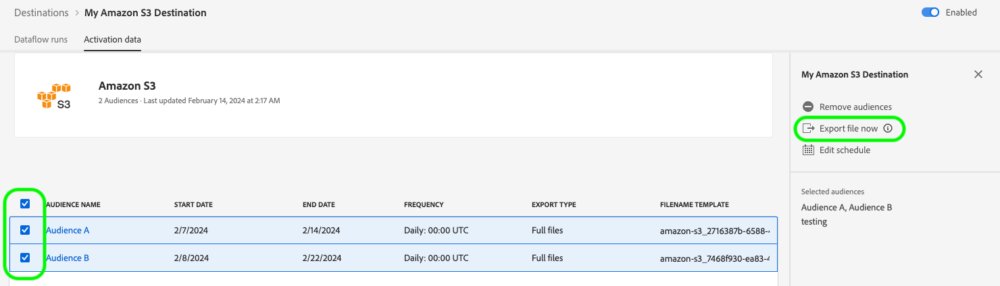

# Exportar arquivos sob demanda para destinos em lote usando a interface do Experience Platform

>[!IMPORTANT]
>
>A opção **[!UICONTROL Exportar arquivo agora]** no Adobe Experience Platform está atualmente no Beta. A documentação e a funcionalidade estão sujeitas a alterações.
>Entre em contato com o representante da Adobe para obter acesso a essa funcionalidade.

>[!IMPORTANT]
> 
>Para ativar dados, você precisa de **[!UICONTROL Exibir Destinos]**, **[!UICONTROL Ativar Destinos]**, **[!UICONTROL Exibir Perfis]** e **[!UICONTROL Exibir Segmentos]** [permissões de controle de acesso](/help/access-control/home.md#permissions). Leia a [visão geral do controle de acesso](/help/access-control/ui/overview.md) ou contate o administrador do produto para obter as permissões necessárias.

## Visão geral do recurso **[!UICONTROL Exportar arquivo agora]**  {#overview}

>[!CONTEXTUALHELP]
>id="platform_destinations_activationchaining_activatenow"
>title="Exportar arquivo agora"
>abstract="Selecione esse controle para fornecer uma exportação de arquivo completa, além de qualquer exportação agendada anteriormente. A exportação de arquivos é acionada imediatamente e obtém os resultados mais recentes das execuções de segmentação da Experience Platform."

Este artigo explica como usar a interface do usuário do Experience Platform para exportar arquivos sob demanda para destinos em lote, como destinos de [armazenamento na nuvem](/help/destinations/catalog/cloud-storage/overview.md) e [marketing por email](/help/destinations/catalog/email-marketing/overview.md).

O controle **[!UICONTROL Exportar arquivo agora]** permite exportar um arquivo completo sem interromper o agendamento de exportação atual de um público agendado anteriormente. Essa exportação ocorre além das exportações previamente agendadas e não altera a frequência de exportação do público-alvo. A exportação de arquivos é acionada imediatamente e obtém os resultados mais recentes das execuções de segmentação da Experience Platform.

Também é possível usar as APIs de Experience Platform para essa finalidade. Leia como [ativar públicos-alvo sob demanda para destinos em lote por meio da API de ativação ad-hoc](/help/destinations/api/ad-hoc-activation-api.md).

## Pré-requisitos {#prerequisites}

Para exportar arquivos por demanda para destinos em lote, você deve ter [se conectado com êxito a um destino](./connect-destination.md). Se ainda não tiver feito isso, vá para o [catálogo de destinos](../catalog/overview.md), navegue pelos destinos compatíveis e configure o destino que deseja usar.

## Como exportar arquivos por demanda {#how-to-export-files-on-demand}

1. Vá para **[!UICONTROL Conexões > Destinos]**, selecione a guia **[!UICONTROL Procurar]** e o símbolo de filtro para mostrar as conexões existentes aos destinos em lote desejados.

   

2. Selecione a conexão de destino desejada para inspecionar o fluxo de dados existente para o destino.

   

3. Selecione a guia **[!UICONTROL Dados de ativação]**, selecione os públicos para os quais deseja exportar arquivos por demanda e selecione o controle **[!UICONTROL Exportar arquivo agora]** para acionar uma exportação única que fornecerá um arquivo para cada público selecionado para o destino do seu lote.

   

4. Selecione **[!UICONTROL Sim]** para confirmar e acionar a exportação de arquivos.

   

5. Uma mensagem de confirmação é exibida, informando que a exportação de arquivo foi iniciada.

   

6. Você também pode alternar para a guia **[!UICONTROL Execuções do fluxo de dados]** para confirmar se a exportação de arquivos foi iniciada.

## Considerações {#considerations}

Lembre-se das seguintes considerações ao usar o controle **[!UICONTROL Exportar arquivo agora]**:

* **[!UICONTROL Exportar arquivo agora]** funciona somente para públicos cujo agendamento no fluxo de dados de ativação em lote se sobrepõe à data atual. Isso inclui públicos com agendamentos sem data de término (frequência de exportação de **[!UICONTROL Uma vez]**) ou em que a data de término ainda não tenha passado.
* Ao adicionar um público a um fluxo de dados existente, aguarde pelo menos 15 minutos até usar o controle **[!UICONTROL Exportar arquivo agora]**.
* Se você alterar a política de mesclagem de um público ou se criar um público que use uma nova política de mesclagem, aguarde 24 horas até usar o controle **[!UICONTROL Exportar arquivo agora]**.

## Mensagens de erro da interface do usuário {#ui-error-messages}

Ao usar o controle **[!UICONTROL Exportar arquivo agora]**, você poderá encontrar qualquer uma das mensagens de erro listadas abaixo. Revise a tabela para entender como abordá-los quando eles forem exibidos.

| Mensagem de erro | Resolução |
|---------|----------|
| Execução já em andamento para a audiência `segment ID` para a ordem `dataflow ID` com a ID de execução `flow run ID` | Essa mensagem de erro indica que um fluxo de ativação ad-hoc está em andamento para um público-alvo. Aguarde a conclusão do trabalho antes de acionar o trabalho de ativação novamente. |
| Os públicos-alvo `<segment name>` não fazem parte desse fluxo de dados ou estão fora do intervalo programado! | Essa mensagem de erro indica que os públicos selecionados para ativação não estão mapeados para o fluxo de dados ou que o agendamento de ativação configurado para os públicos expirou ou ainda não foi iniciado. Verifique se o público-alvo está realmente mapeado para o fluxo de dados e se o agendamento de ativação de público-alvo se sobrepõe à data atual. |

## Informações relacionadas {#related-information}

* [Ative públicos para destinos em lote sob demanda usando as APIs do Experience Platform](/help/destinations/api/ad-hoc-activation-api.md)
* [Ativar dados do público-alvo para destinos de exportação de perfil em lote](/help/destinations/ui/activate-batch-profile-destinations.md)
