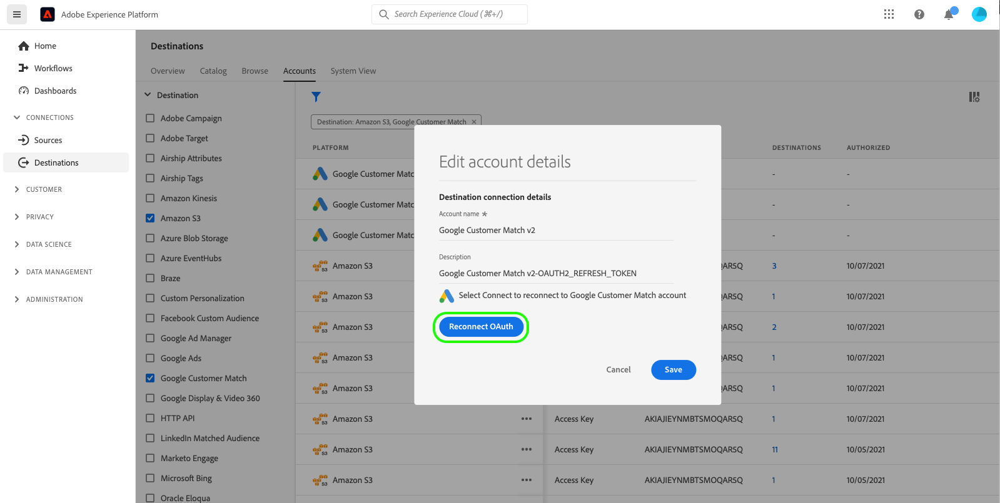

# Atualizar contas de destino

## Visão geral {#overview}

A guia **[!UICONTROL Accounts]** mostra detalhes sobre as conexões estabelecidas com vários destinos. Consulte a tabela abaixo para obter todas as informações que você pode obter em cada destino:

| Elemento | Descrição |
|---|---|
| [!UICONTROL Platform] | O destino para o qual você configurou a conexão. |
| [!UICONTROL Connection Type] | Representa o tipo de conexão com seu bucket ou destino de armazenamento. <ul><li>Para destinos de marketing por email: Pode ser S3 ou FTP.</li><li>Para destinos de anúncios em tempo real: Servidor para servidor</li><li>Para destinos de armazenamento em nuvem Amazon S3: Chave de acesso </li><li>Para destinos de armazenamento em nuvem SFTP: Autenticação básica para SFTP</li></ul> |
| [!UICONTROL Username] | O nome de usuário selecionado no [assistente de destino de conexão](../catalog/email-marketing/overview.md#connect-destination). |
| [!UICONTROL Destinations] | Representa o número de fluxos de destino únicos bem-sucedidos conectados às informações básicas criadas para um destino. |
| [!UICONTROL Authorized] | A data em que a conexão com esse destino foi autorizada. |

## Atualizar contas {#update}

Siga as etapas abaixo para atualizar os detalhes da conexão com destinos existentes.

1. Faça logon na [interface do usuário do Experience Platform](https://platform.adobe.com/) e selecione **[!UICONTROL Destinations]** na barra de navegação esquerda. Selecione **[!UICONTROL Accounts]** no cabeçalho superior para exibir suas contas existentes.

   

2. Selecione o ícone de filtro  na parte superior esquerda para iniciar o painel de classificação. O painel de classificação fornece uma lista de todos os destinos. Você pode selecionar mais de um destino na lista para ver uma seleção filtrada de contas associadas aos destinos selecionados.

   

3. Selecione o botão  **[!UICONTROL Edit]** na coluna **[!UICONTROL Platform]** para editar as informações da conta.

   

4. Insira suas credenciais de conta atualizadas.

   * Para contas que usam um tipo de conexão `OAuth2`, selecione **[!UICONTROL Reconnect OAuth]** para renovar suas credenciais de conta.

      

   * Para contas que usam um tipo de conexão `Access Key` ou `ConnectionString`, é possível editar as informações de autenticação da conta, incluindo informações como ID de acesso, chaves secretas ou cadeias de conexão.

      

5. Selecione **[!UICONTROL Save]** para concluir a atualização de credenciais.
