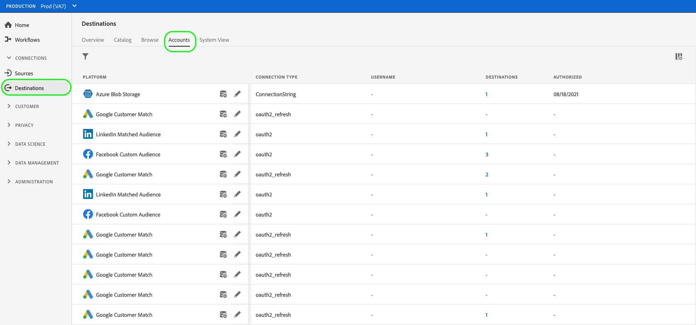

# Atualizar contas de destino

## Visão geral {#overview}

O **[!UICONTROL Contas]** mostra detalhes sobre as conexões estabelecidas com vários destinos. Consulte a [Visão geral das contas](../ui/destinations-workspace.md#accounts) para obter todas as informações que você pode obter em cada conta de destino.

Este tutorial aborda as etapas para atualizar os detalhes da conta de destino usando a interface do usuário do Experience Platform.

Você pode atualizar os detalhes da conta de destino para atualizar e autenticar novamente as credenciais para suas contas atuais ou expiradas para destinos que você estiver usando no momento. Normalmente, o OAuth e os tokens do portador têm uma duração limitada, dependendo da plataforma de destino. Quando esses tokens expirarem, você poderá atualizá-los no fluxo de trabalho descrito abaixo. Esse workflow direciona você para passar pelo workflow do OAuth ou inserir novamente um token. Da mesma forma, se uma senha ou acesso de usuário tiver sido alterado na plataforma downstream, você poderá atualizar as credenciais.

Para destinos em lote, é possível atualizar o acesso ou a chave secreta, se alguma delas tiver sido alterada. Além disso, caso queira criptografar seus arquivos a partir de agora, você pode inserir uma chave pública RSA e seus arquivos exportados serão criptografados a partir de agora.

## Atualizar contas {#update}

Siga as etapas abaixo para atualizar os detalhes da conexão com destinos existentes.

1. Faça logon no [Interface do usuário do Experience Platform](https://platform.adobe.com/) e selecione **[!UICONTROL Destinos]** na barra de navegação esquerda. Selecionar **[!UICONTROL Contas]** no cabeçalho superior para exibir suas contas existentes.

   

2. Selecione o ícone de filtro  na parte superior esquerda para iniciar o painel de classificação. O painel de classificação fornece uma lista de todos os destinos. Você pode selecionar mais de um destino na lista para ver uma seleção filtrada de contas associadas aos destinos selecionados.

   

3. Selecione as reticências (`...`) ao lado do nome da conta que você pretende atualizar. Um painel pop-up é exibido, fornecendo opções para **[!UICONTROL Ativar segmentos]**, **[!UICONTROL Editar detalhes]** e **[!UICONTROL Excluir]** a conta. Selecione o  **[!UICONTROL Editar detalhes]** para editar as informações da conta.

   

4. Insira suas credenciais de conta atualizadas.

   * Para contas que usam um `OAuth1` ou `OAuth2` tipo de conexão, selecione **[!UICONTROL Reconectar OAuth]** para renovar suas credenciais de conta. Você também pode atualizar o nome e a descrição da sua conta.

   

   * Para contas que usam um `Access Key` ou `ConnectionString` do tipo conexão, você pode editar as informações de autenticação da conta, incluindo informações como ID de acesso, chaves secretas ou cadeias de conexão. Você também pode atualizar o nome e a descrição da sua conta.

   

   * Para contas que usam um `Bearer token` tipo de conexão, você pode inserir um novo token portador, se necessário. Você também pode atualizar o nome e a descrição da sua conta.

   

   * Para contas que usam um `Server to server` tipo de conexão, você pode atualizar o nome e a descrição da sua conta.

   

5. Selecionar **[!UICONTROL Salvar]** para concluir a atualização dos detalhes da conta.

## Próximas etapas

Ao seguir este tutorial, você usou com sucesso a variável **[!UICONTROL destinos]** espaço de trabalho para atualizar contas existentes.

Para obter mais informações sobre destinos, consulte [visão geral dos destinos](../catalog/overview.md).