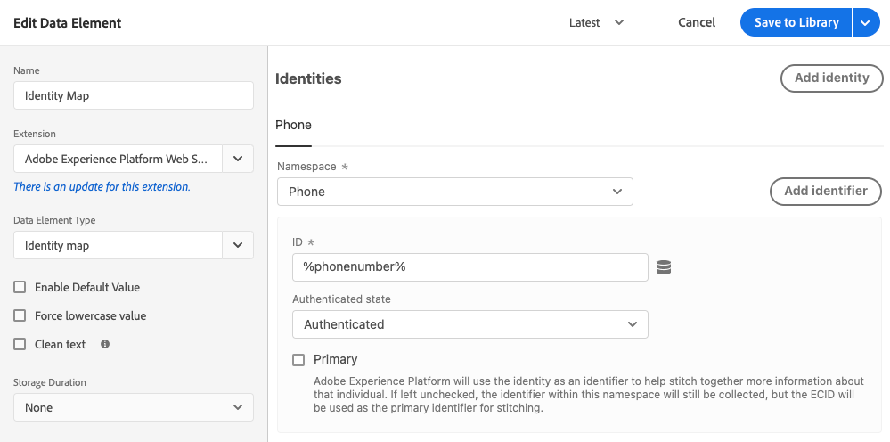

# Tipos de elementos de dados

Depois de definir seus [tipos de ação](action-types.md) no [extensão de tag do Adobe Experience Platform Web SDK](web-sdk-extension-configuration.md), configure os tipos de elemento de dados.

Esta página descreve os tipos de elementos de dados disponíveis.

## ID de mesclagem de eventos

Quando usado, esse elemento de dados fornece uma ID de mesclagem de eventos. Nenhuma configuração é necessária para esse elemento de dados. O elemento de dados fornecido permanece o mesmo até que o visitante saia da página ou até que o tipo de ação &quot;Redefinir ID de mesclagem de eventos&quot; seja usado.

## Mapa de identidade

Um mapa de identidade permite estabelecer identidades para o visitante da sua página da Web. Um mapa de identidade consiste em namespaces, como _phone_ ou _email_, com cada namespace contendo um ou mais identificadores. Por exemplo, se o indivíduo em seu site tiver fornecido dois números de telefone, seu namespace de telefone deverá conter dois identificadores.

No elemento de dados [!UICONTROL Identity map], você fornecerá as seguintes informações para cada identificador:

* **[!UICONTROL ID]**: O valor que identifica o visitante. Por exemplo, se o identificador pertence ao namespace _phone_, o [!UICONTROL ID] pode ser _555-555-555_. Normalmente, esse valor é derivado de uma variável JavaScript ou de algum outro dado na página, portanto, é melhor criar um elemento de dados que faça referência aos dados da página e, em seguida, faça referência ao elemento de dados no campo [!UICONTROL ID] dentro do elemento de dados [!UICONTROL Mapa de identidade]. Se, ao executar em sua página, o valor da ID for qualquer coisa além de uma string preenchida, o identificador será removido automaticamente do mapa de identidade.
* **[!UICONTROL Estado]** autenticado: Uma seleção que indica se o visitante está autenticado.
* **[!UICONTROL Primário]**: Uma seleção que indica se o identificador deve ser usado como o identificador principal do indivíduo. Se nenhum identificador estiver marcado como primário, a ECID será usada como o identificador principal.

Você não deve fornecer uma ECID ao criar um mapa de identidade. Ao usar o SDK, um ECID é gerado automaticamente no servidor e incluído no mapa de identidade.

O elemento de dados do mapa de identidade geralmente é usado em conjunto com o [[!UICONTROL objeto XDM] tipo de elemento de dados](#xdm-object) e o [[!UICONTROL Definir consentimento] tipo de ação](action-types.md#set-consent).

Leia mais sobre [Adobe Experience Platform Identity Service](https://experienceleague.adobe.com/docs/experience-platform/identity/home.html?lang=pt-BR).

## Objeto XDM {#xdm-object}

Use o formato XDM para enviar dados para o SDK da Web da Adobe Experience Platform. A formatação dos dados é mais fácil com o elemento de dados do objeto XDM. Ao abrir esse elemento de dados pela primeira vez, selecione a sandbox e o esquema corretos da Adobe Experience Platform. Após selecionar o esquema, é possível ver a estrutura do esquema, que pode ser facilmente preenchida.

Observe que, quando você abre determinados campos do esquema, como `web.webPageDetails.URL`, alguns itens são coletados automaticamente. Mesmo que vários itens sejam coletados automaticamente, você pode substituir qualquer item, se necessário. Todos os valores podem ser preenchidos manualmente ou usando outros elementos de dados.

>[!NOTE]
>
>Preencha apenas as informações que você está interessado em coletar. Qualquer coisa que não for preenchida é omitida quando os dados forem enviados para as soluções.
